# 标准系统方案之瑞芯微RK3568移植案例

​本文章是基于瑞芯微RK3568芯片的DAYU200开发板，进行标准系统相关功能的移植，主要包括产品配置添加，内核启动、升级，音频ADM化，Camera，TP，LCD，WIFI，BT，vibrator、sensor、图形显示模块的适配案例总结，以及相关功能的适配。

## 产品配置和目录规划

### 产品配置

在产品`//productdefine/common/device`目录下创建以rk3568名字命名的json文件，并指定CPU的架构。`//productdefine/common/device/rk3568.json`配置如下：

```
{
    "device_name": "rk3568",
    "device_company": "rockchip",
    "target_os": "ohos",
    "target_cpu": "arm",
    "kernel_version": "",
    "device_build_path": "device/board/hihope/rk3568",
    "enable_ramdisk": true,   //是否支持ramdisk二级启动。
    "build_selinux": true    // 是否支持selinux权限管理。
}
```

在`//productdefine/common/products`目录下创建以产品名命名的rk3568.json文件。该文件用于描述产品所使用的SOC 以及所需的子系统。配置如下：

```
{
  "product_name": "rk3568",
  "product_company" : "hihope",
  "product_device": "rk3568",
  "version": "2.0",
  "type": "standard",
  "parts":{
    "ace:ace_engine_standard":{},
    "ace:napi":{},
    ...
    "xts:phone_tests":{}
  }
}
```

主要的配置内容包括：

1. product_device：配置所使用的SOC。
2. type：配置系统的级别，这里直接standard即可。
3. parts：系统需要启用的子系统。子系统可以简单理解为一块独立构建的功能块。

已定义的子系统可以在`//build/subsystem_config.json`中找到。当然你也可以定制子系统。

这里建议先拷贝Hi3516DV300开发板的配置文件，删除掉hisilicon_products这个子系统。这个子系统为Hi3516DV300 SOC编译内核，不适合rk3568。

### 目录规划

参考[Board和SoC解耦的设计思路](https://gitee.com/openharmony-sig/sig-content/blob/master/devboard/docs/board-soc-arch-design.md)，并把芯片适配目录规划为：

```
device
├── board                                --- 单板厂商目录。
│   └── hihope                           --- 单板厂商名字。
│       └── rk3568                       --- 单板名：rk3568,主要放置开发板相关的驱动业务代码。
└── soc									 --- SoC厂商目录。
    └── rockchip                       --- SoC厂商名字：rockchip。
        └── rk3568						 --- SoC Series名：rk3568,主要为芯片原厂提供的一些方案，以及闭源库等。
        
        
```

```
vendor
└── hihope					
    └── rk3568         			 --- 产品名字：产品、hcs以及demo相关。
```

## **内核启动**

### 二级启动

二级启动简单来说就是将之前直接挂载sytem,从system下的init启动，改成先挂载ramdsik,从ramdsik中的init 启动，做些必要的初始化动作，如挂载system,vendor等分区，然后切到system下的init。

Rk3568适配主要是将主线编译出来的ramdisk 打包到boot_linux.img中，主要有以下工作：

1.使能二级启动。

  在productdefine/common/device/rk3568.json 中使能enable_ramdisk。

  ```
  {
      "device_name": "rk3568",
      "device_company": "hihope",
      "target_os": "ohos",
      "target_cpu": "arm",
      "kernel_version": "",
      "device_build_path": "device/hihope/build",
      "enable_ramdisk": true,
      "build_selinux": true
  }
  ```

2.把主线编译出来的ramdsik.img 打包到boot_linux.img。

配置：

由于rk 启动uboot 支持从ramdisk 启动，只需要在打包boot_linux.img 的配置文件中增加ramdisk.img ,因此没有使用主线的its格式，具体配置就是在内核编译脚本make-ohos.sh 中增加:

```
function make_extlinux_conf()
{
	dtb_path=$1
	uart=$2
	image=$3
	
	echo "label rockchip-kernel-5.10" > ${EXTLINUX_CONF}
	echo "	kernel /extlinux/${image}" >> ${EXTLINUX_CONF}
	echo "	fdt /extlinux/${TOYBRICK_DTB}" >> ${EXTLINUX_CONF}
	if [ "enable_ramdisk" == "${ramdisk_flag}" ]; then
		echo "	initrd /extlinux/ramdisk.img" >> ${EXTLINUX_CONF}
	fi
	cmdline="append earlycon=uart8250,mmio32,${uart} root=PARTUUID=614e0000-0000-4b53-8000-1d28000054a9 rw rootwait rootfstype=ext4"
	echo "  ${cmdline}" >> ${EXTLINUX_CONF}
}
```

### 打包 

增加了打包boot镜像的脚本make-boot.sh，供编译完ramdisk,打包boot 镜像时调用, 主要内容:

```
genext2fs -B ${blocks} -b ${block_size} -d boot_linux -i 8192 -U boot_linux.img
```

调用make-boot.sh 的修改可以参考如下pr:

https://gitee.com/openharmony/build/pulls/569/files

### INIT配置

init相关配置请参考[启动子系统的规范要求](https://gitee.com/openharmony/docs/blob/master/zh-cn/readme/%E5%90%AF%E5%8A%A8%E6%81%A2%E5%A4%8D%E5%AD%90%E7%B3%BB%E7%BB%9F.md)即可

## **音频**

### RK3568 Audio总体结构图


### ADM适配方案介绍

#### RK3568平台适配ADM框架图

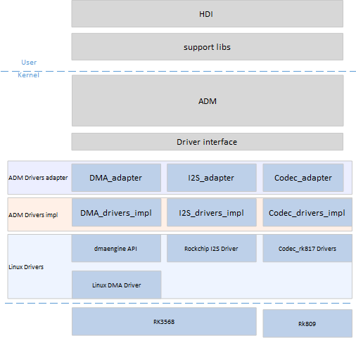

1. ADM Drivers adapter.

   主要完成Codec/DMA/I2S驱动注册，使得ADM可以加载驱动节点；并注册ADM与Drivers交互的接口函数。

2. ADM Drivers impl.

   主要完成ADM Drivers adapter接口函数的实现，以及Codec_config.hcs/dai_config.hcs等配置信息的获取，并注册到对应的设备。

3. Linux Drivers.

   ADM Drivers impl可以直接阅读硬件手册，完成驱动端到端的配置；也可以借用Linux原生驱动实现与接口，减少开发者工作量。

#### 目录结构

```
./device/board/hihope/rk3568/audio_drivers
├── codec
│   └── rk809_codec
│       ├── include
│       │   ├── rk809_codec_impl.h
│       │   └── rk817_codec.h
│       └── src
│           ├── rk809_codec_adapter.c
│           ├── rk809_codec_linux_driver.c
│           └── rk809_codec_ops.c
├── dai
│   ├── include
│   │   ├── rk3568_dai_linux.h
│   │   └── rk3568_dai_ops.h
│   └── src
│       ├── rk3568_dai_adapter.c
│       ├── rk3568_dai_linux_driver.c
│       └── rk3568_dai_ops.c
├── dsp
│   ├── include
│   │   └── rk3568_dsp_ops.h
│   └── src
│       ├── rk3568_dsp_adapter.c
│       └── rk3568_dsp_ops.c
├── include
│   ├── audio_device_log.h
│   └── rk3568_audio_common.h
└── soc
    ├── include
    │   └── rk3568_dma_ops.h
    └── src
        ├── rk3568_dma_adapter.c
        └── rk3568_dma_ops.c
```

### RK3568适配ADM详细过程

#### 梳理平台Audio框架

梳理目标平台的Audio结构，明确数据流与控制流通路。

1. 针对RK3568平台，Audio的结构相对简单见RK3568 Audio总体结构图，Codec作为一个独立设备。I2C完成对设备的控制，I2S完成Codec设备与CPU之间的交互。
2. 结合原理图整理I2S通道号，对应的引脚编号；I2C的通道号，地址等硬件信息。
3. 获取Codec对应的datasheet，以及RK3568平台的Datasheet(包含I2S/DMA通道等寄存器的介绍)。

#### 熟悉并了解ADM结构

ADM结构框图如下，Audio Peripheral Drivers和Platform Drivers为平台适配需要完成的工作。


结合第1步梳理出来的Audio结构分析，Audio Peripheral Drivers包含Rk809的驱动，Platform Drivers包含DMA驱动和I2S驱动。

| 需要适配的驱动 | ADM对应模块 | 接口文件路径                                         |
| -------------- | ----------- | ---------------------------------------------------- |
| RK809驱动      | Accessory   | drivers/framework/include/audio/audio_accessory_if.h |
| DMA驱动        | platform    | drivers/framework/include/audio/audio_platform_if.h  |
| I2S驱动        | DAI         | drivers/framework/include/audio/audio_dai_if.h.h     |

#### 搭建驱动代码框架

##### 配置HCS文件

在device_info.hcs文件中Audio下注册驱动节点。

```c
        audio :: host {
            hostName = "audio_host";
            priority = 60;
            device_dai0 :: device {
                device0 :: deviceNode {
                    policy = 1;
                    priority = 50;
                    preload = 0;
                    permission = 0666;
                    moduleName = "DAI_RK3568";
                    serviceName = "dai_service";
                    deviceMatchAttr = "hdf_dai_driver";
                }
            }
            device_codec :: device {
                device0 :: deviceNode {
                    policy = 1;
                    priority = 50;
                    preload = 0;
                    permission = 0666;
                    moduleName = "CODEC_RK809";
                    serviceName = "codec_service_0";
                    deviceMatchAttr = "hdf_codec_driver";
                }
            }
            device_codec_ex :: device {
                device0 :: deviceNode {
                    policy = 1;
                    priority = 50;
                    preload = 0;
                    permission = 0666;
                    moduleName = "CODEC_RK817";
                    serviceName = "codec_service_1";
                    deviceMatchAttr = "hdf_codec_driver_ex";
                }
            }
            device_dsp :: device {
                device0 :: deviceNode {
                    policy = 1;
                    priority = 50;
                    preload = 0;
                    permission = 0666;
                    moduleName = "DSP_RK3568";
                    serviceName = "dsp_service_0";
                    deviceMatchAttr = "hdf_dsp_driver";
                }
            }
            device_dma :: device {
                device0 :: deviceNode {
                    policy = 1;
                    priority = 50;
                    preload = 0;
                    permission = 0666;
                    moduleName = "DMA_RK3568";
                    serviceName = "dma_service_0";
                    deviceMatchAttr = "hdf_dma_driver";
                }
            }
            ......
        }

```

根据接入的设备，选择Codec节点还是Accessory节点，配置硬件设备对应的私有属性（包含寄存器首地址，相关control寄存器地址）涉及Codec_config.hcs和DAI_config.hcs。

配置相关介绍见[Audio](https://gitee.com/openharmony/docs/blob/master/zh-cn/device-dev/driver/driver-peripherals-audio-des.md) hcs配置章节以及ADM框架的audio_parse模块代码。

##### codec/accessory模块

1. 将驱动注册到HDF框架中，代码片段如下，启动moduleName与HCS文件的中moduleName一致。

   ```
   struct HdfDriverEntry g_codecDriverEntry = {
      .moduleVersion = 1,
      .moduleName = "CODEC_HI3516",
      .Bind = CodecDriverBind,
      .Init = CodecDriverInit,
      .Release = CodecDriverRelease,
   };
   HDF_INIT(g_codecDriverEntry);
   ```

2. Codec模块需要填充：

   g_codecData：codec设备的操作函数集和私有数据集。

   g_codecDaiDeviceOps：codecDai的操作函数集，包括启动传输和参数配置等函数接口。

   g_codecDaiData：codec的数字音频接口的操作函数集和私有数据集。

3. 完成 bind、init和release函数的实现。

4.  验证。

   在bind和init函数加调试日志，编译版本并获取系统系统日志:

   ```
   [    1.548624] [E/"rk809_codec_adapter"]  [Rk809DriverBind][line:258]: enter
   [    1.548635] [E/"rk809_codec_adapter"]  [Rk809DriverBind][line:260]: success
   [    1.548655] [E/"rk809_codec_adapter"]  [Rk809DriverInit][line:270]: enter
   [    1.549050] [E/"rk809_codec_adapter"]  [GetServiceName][line:226]: enter
   [    1.549061] [E/"rk809_codec_adapter"]  [GetServiceName][line:250]: success
   [    1.549072] [E/"rk809_codec_adapter"]  [Rk809DriverInit][line:316]: g_chip->accessory.drvAccessoryName = codec_service_1
   [    1.549085] [E/audio_core]  [AudioSocRegisterDai][line:86]: Register [accessory_dai] success.
   [    1.549096] [E/audio_core]  [AudioRegisterAccessory][line:120]: Register [codec_service_1] success.
   [    1.549107] [E/"rk809_codec_adapter"]  [Rk809DriverInit][line:323]: success!
   ```


##### DAI模块

1. 将I2S驱动注册到HDF框架中，代码片段如下，启动moduleName与HCS文件的中moduleName一致。

   ```c
   struct HdfDriverEntry g_daiDriverEntry = {
       .moduleVersion = 1,
       .moduleName = "DAI_RK3568",
       .Bind = DaiDriverBind,
       .Init = DaiDriverInit,
       .Release = DaiDriverRelease,
   };
   HDF_INIT(g_daiDriverEntry);
   ```

2. DAI模块填充：

   ```c
   struct AudioDaiOps g_daiDeviceOps = {
       .Startup = Rk3568DaiStartup,
       .HwParams = Rk3568DaiHwParams,
       .Trigger = Rk3568NormalTrigger,
   };
   
   struct DaiData g_daiData = {
       .Read = Rk3568DeviceReadReg,
       .Write = Rk3568DeviceWriteReg,
       .DaiInit = Rk3568DaiDeviceInit,
       .ops = &g_daiDeviceOps,
   };
   ```

3. 完成 bind、init和release函数的实现。

4. 验证。 

   在bind/init函数加调试日志，编译版本并获取系统系统日志。

   ```
   [    1.549193] [I/device_node] launch devnode dai_service
   [    1.549204] [E/HDF_LOG_TAG]  [DaiDriverBind][line:38]: entry!
   [    1.549216] [E/HDF_LOG_TAG]  [DaiDriverBind][line:55]: success!
   [    1.549504] [E/audio_core]  [AudioSocRegisterDai][line:86]: Register [dai_service] success.
   [    1.549515] [E/HDF_LOG_TAG]  [DaiDriverInit][line:116]: success.
   ```

##### Platform模块

1. 将DMA驱动注册到HDF框架中，代码片段如下，启动moduleName与HCS文件的中moduleName一致。

   ```
   struct HdfDriverEntry g_platformDriverEntry = {
       .moduleVersion = 1,
       .moduleName = "DMA_RK3568",
       .Bind = PlatformDriverBind,
       .Init = PlatformDriverInit,
       .Release = PlatformDriverRelease,
   };
   HDF_INIT(g_platformDriverEntry);
   ```

2. DMA模块需要填充：

   ```c
   struct AudioDmaOps g_dmaDeviceOps = {
       .DmaBufAlloc = Rk3568DmaBufAlloc,
       .DmaBufFree = Rk3568DmaBufFree,
       .DmaRequestChannel = Rk3568DmaRequestChannel,
       .DmaConfigChannel = Rk3568DmaConfigChannel,
       .DmaPrep = Rk3568DmaPrep,
       .DmaSubmit = Rk3568DmaSubmit,
       .DmaPending = Rk3568DmaPending,
       .DmaPause = Rk3568DmaPause,
       .DmaResume = Rk3568DmaResume,
       .DmaPointer = Rk3568PcmPointer,
   };
   
   struct PlatformData g_platformData = {
       .PlatformInit = AudioDmaDeviceInit,
       .ops = &g_dmaDeviceOps,
   };
   ```

3. 完成 bind、init和release函数的实现。

4. 验证。

   在bind和init函数加调试日志,编译版本并获取系统系统日志。

   ```
   [    1.548469] [E/rk3568_platform_adapter]  [PlatformDriverBind][line:42]: entry!
   [    1.548481] [E/rk3568_platform_adapter]  [PlatformDriverBind][line:58]: success!
   [    1.548492] [E/rk3568_platform_adapter]  [PlatformDriverInit][line:100]: entry. 
   [    1.548504] [E/rk3568_platform_adapter]  [PlatformGetServiceName][line:67]: entry!
   [    1.548515] [E/rk3568_platform_adapter]  [PlatformGetServiceName][line:91]: success!
   [    1.548528] [E/audio_core]  [AudioSocRegisterPlatform][line:63]: Register [dma_service_0] success.
   [    1.548536] [E/rk3568_platform_adapter]  [PlatformDriverInit][line:119]: success.
   ```

#### 驱动适配

##### code/accessory模块

1. 读取DTS文件，获取到对应设备节点，使用Linux原生的驱动注册函数，获取到对应device。

   ```
   static int rk817_platform_probe(struct platform_device *pdev) {
       rk817_pdev = pdev;
       dev_info(&pdev->dev, "got rk817-codec platform_device");
       return 0;
   }
   
   static struct platform_driver rk817_codec_driver = {
   	.driver = {
   		   .name = "rk817-codec",                     // codec node in dts file.
   		   .of_match_table = rk817_codec_dt_ids,
   		   },
   	.probe = rk817_platform_probe,
   	.remove = rk817_platform_remove,
   };
   ```

2. 读写寄存器函数封装。
   根据上述获取到的device, 使用Linux的regmap函数，开发者不需要获取模块的基地址，
   获取rk817的regmap代码段。
   
   ```
   g_chip = devm_kzalloc(&rk817_pdev->dev, sizeof(struct Rk809ChipData), GFP_KERNEL);
       if (!g_chip) {
           AUDIO_DEVICE_LOG_ERR("no memory");
           return HDF_ERR_MALLOC_FAIL;
       }
       g_chip->pdev = rk817_pdev;
   
       struct rk808 *rk808 = dev_get_drvdata(g_chip->pdev->dev.parent);
       if (!rk808) {
           AUDIO_DEVICE_LOG_ERR("%s: rk808 is NULL\n", __func__);
           ret = HDF_FAILURE;
           RK809ChipRelease();
   		return ret;
       }
       g_chip->regmap = devm_regmap_init_i2c(rk808->i2c,
   		&rk817_codec_regmap_config);
       if (IS_ERR(g_chip->regmap)) {
           AUDIO_DEVICE_LOG_ERR("failed to allocate regmap: %ld\n", PTR_ERR(g_chip->regmap));
           RK809ChipRelease();
   		return ret;
       }
   ```
   
   寄存器读写函数代码段。
   
   ```
   int32_t Rk809DeviceRegRead(uint32_t reg, uint32_t *val) 
     {
         if (regmap_read(g_chip->regmap, reg, val)) {
             AUDIO_DRIVER_LOG_ERR("read register fail: [%04x]", reg);
             return HDF_FAILURE;
         }
   
         return HDF_SUCCESS;
     }
   
     int32_t Rk809DeviceRegWrite(uint32_t reg, uint32_t value) {
         if (regmap_write(g_chip->regmap, reg, value)) {
             AUDIO_DRIVER_LOG_ERR("write register fail: [%04x] = %04x", reg, value);
             return HDF_FAILURE;
         }
   
         return HDF_SUCCESS;
     }
   
     int32_t Rk809DeviceRegUpdatebits(uint32_t reg, uint32_t mask, uint32_t value) {
         if (regmap_update_bits(g_chip->regmap, reg, mask, value)) {
             AUDIO_DRIVER_LOG_ERR("update register bits fail: [%04x] = %04x", reg, value);
             return HDF_FAILURE;
         }
   
         return HDF_SUCCESS;
     }
   ```

3. 寄存器初始化函数。

   因为使用Linux的regmap函数，所以需要自行定义RegDefaultInit函数，读取hcs中initSeqConfig的寄存器以及数值来进行配置。

   RK809RegDefaultInit代码段。

   ```c
   int32_t RK809RegDefaultInit(struct AudioRegCfgGroupNode **regCfgGroup)
   {
     int32_t i;
     struct AudioAddrConfig *regAttr = NULL;
   
     if (regCfgGroup == NULL || regCfgGroup[AUDIO_INIT_GROUP] == NULL ||
        regCfgGroup[AUDIO_INIT_GROUP]->addrCfgItem == NULL || regCfgGroup[AUDIO_INIT_GROUP]->itemNum <= 0) {
        AUDIO_DEVICE_LOG_ERR("input invalid parameter.");
   
        return HDF_ERR_INVALID_PARAM;
     }
   
     regAttr = regCfgGroup[AUDIO_INIT_GROUP]->addrCfgItem;
   
     for (i = 0; i < regCfgGroup[AUDIO_INIT_GROUP]->itemNum; i++) {
        Rk809DeviceRegWrite(regAttr[i].addr, regAttr[i].value);
     }
   
     return HDF_SUCCESS;
   }
   ```

4. 封装控制接口的读写函数。

   设置控制读写函数为RK809CodecReadReg和RK809CodecWriteReg。

   ```c
   struct CodecData g_rk809Data = {
       .Init = Rk809DeviceInit,
       .Read = RK809CodecReadReg,
       .Write = RK809CodecWriteReg,
   };
   
   struct AudioDaiOps g_rk809DaiDeviceOps = {
       .Startup = Rk809DaiStartup,
       .HwParams = Rk809DaiHwParams,
   	.Trigger = RK809NormalTrigger,
   };
   
   struct DaiData g_rk809DaiData = {
       .DaiInit = Rk809DaiDeviceInit,
       .ops = &g_rk809DaiDeviceOps,
   };
   ```

   封装控制接口的读写函数。

   因为原来的读写原型，涉及三个参数(unsigned long virtualAddress,uint32_t reg, uint32_t *val)，其中virtualAddress我们并不需要用到，所以封装个接口即可，封装如下：

   ```c
   int32_t RK809CodecReadReg(unsigned long virtualAddress,uint32_t reg, uint32_t *val)
   {
       if (val == NULL) {
           AUDIO_DRIVER_LOG_ERR("param val is null.");
           return HDF_FAILURE;
       }
       if (Rk809DeviceRegRead(reg, val)) {
           AUDIO_DRIVER_LOG_ERR("read register fail: [%04x]", reg);
           return HDF_FAILURE;
       }
       ADM_LOG_ERR("read reg 0x[%02x] = 0x[%02x]",reg,*val);
       return HDF_SUCCESS;
   }
   
   int32_t RK809CodecWriteReg(unsigned long virtualAddress,uint32_t reg, uint32_t value)
   {
       if (Rk809DeviceRegWrite(reg, value)) {
           AUDIO_DRIVER_LOG_ERR("write register fail: [%04x] = %04x", reg, value);
           return HDF_FAILURE;
       }    
       ADM_LOG_ERR("write reg 0x[%02x] = 0x[%02x]",reg,value);
       return HDF_SUCCESS;
   }
   ```

5. 其他ops函数。

  - Rk809DeviceInit，读取hcs文件，初始化Codec寄存器，同时将对应的control配置（/* reg, rreg, shift, rshift, min, max, mask, invert, value */添加到kcontrol，便于dispatch contro进行控制。
  - Rk809DaiStartup, 读取hcs文件，配置可选设备（codec/accessory）的控制寄存器。
  - Rk809DaiHwParams, 根据hal下发的audio attrs（采样率、format、channel等）,配置对应的寄存器。
  - RK809NormalTrigger，根据hal下发的操作命令码，操作对应的寄存器，实现Codec的启动停止、录音和放音的切换等。

##### DAI(i2s)模块

1. 读写寄存器函数。
   思路与Codec模块的一致,读取Linux DTS文件，使用Linux的regmap函数完成寄存器的读写操作。

   ```c
   int32_t Rk3568DeviceReadReg(unsigned long regBase, uint32_t reg, uint32_t *val)
    {
        AUDIO_DEVICE_LOG_ERR("entry");
        (void)regBase;
        struct device_node *dmaOfNode = of_find_node_by_path("/i2s@fe410000");
        if(dmaOfNode == NULL) {
            AUDIO_DEVICE_LOG_ERR("of_node is NULL.");
        }
        struct platform_device *platformdev = of_find_device_by_node(dmaOfNode);
        struct rk3568_i2s_tdm_dev *i2s_tdm = dev_get_drvdata(&platformdev->dev);
        
        (void)regBase;
        if (regmap_read(i2s_tdm->regmap, reg, val)) {
            AUDIO_DEVICE_LOG_ERR("read register fail: [%04x]", reg);
            return HDF_FAILURE;
        }
        return HDF_SUCCESS;
    }
   
    int32_t Rk3568DeviceWriteReg(unsigned long regBase, uint32_t reg, uint32_t value)
    {    
        AUDIO_DEVICE_LOG_ERR("entry");
        (void)regBase;
        struct device_node *dmaOfNode = of_find_node_by_path("/i2s@fe410000");
        if(dmaOfNode == NULL) {
            AUDIO_DEVICE_LOG_ERR("of_node is NULL.");
        }
        struct platform_device *platformdev = of_find_device_by_node(dmaOfNode);
        struct rk3568_i2s_tdm_dev *i2s_tdm = dev_get_drvdata(&platformdev->dev);
        if (regmap_write(i2s_tdm->regmap, reg, value)) {
            AUDIO_DEVICE_LOG_ERR("write register fail: [%04x] = %04x", reg, value);
            return HDF_FAILURE;
        }
        return HDF_SUCCESS;
    }
   ```

2. 其他ops函数。

  - Rk3568DaiDeviceInit
    原始框架，主要完成DAI_config.hcs参数列表的读取，与HwParams结合，完成参数的设置。

  - Rk3568DaiHwParams
    主要完成I2S MCLK/BCLK/LRCLK时钟配置。

    1. 根据不同采样率计算MCLK。

    ```c
        int32_t RK3568I2sTdmSetSysClk(struct rk3568_i2s_tdm_dev *i2s_tdm, const struct AudioPcmHwParams *param)
        {
            /* Put set mclk rate into rockchip_i2s_tdm_set_mclk() */
            uint32_t sampleRate = param->rate;
            uint32_t mclk_parent_freq = 0;
            switch (sampleRate) {
                case AUDIO_DEVICE_SAMPLE_RATE_8000:
                case AUDIO_DEVICE_SAMPLE_RATE_16000:
                case AUDIO_DEVICE_SAMPLE_RATE_24000:
                case AUDIO_DEVICE_SAMPLE_RATE_32000:
                case AUDIO_DEVICE_SAMPLE_RATE_48000:
                case AUDIO_DEVICE_SAMPLE_RATE_64000:
                case AUDIO_DEVICE_SAMPLE_RATE_96000:
                mclk_parent_freq = i2s_tdm->bclk_fs * AUDIO_DEVICE_SAMPLE_RATE_192000;
                break;
                case AUDIO_DEVICE_SAMPLE_RATE_11025:
                case AUDIO_DEVICE_SAMPLE_RATE_22050:
                case AUDIO_DEVICE_SAMPLE_RATE_44100:
    
                mclk_parent_freq = i2s_tdm->bclk_fs * AUDIO_DEVICE_SAMPLE_RATE_176400;
                break;
                default:
                AUDIO_DEVICE_LOG_ERR("Invalid LRCK freq: %u Hz\n", sampleRate);
                    return HDF_FAILURE;
            }
            i2s_tdm->mclk_tx_freq = mclk_parent_freq;
            i2s_tdm->mclk_rx_freq = mclk_parent_freq;
    
            return HDF_SUCCESS;
        }
    ```

    2. 根据获取的mclk,计算BCLK/LRclk分频系数。

  - Rk3568NormalTrigger
    根据输入输出类型，以及cmd(启动/停止/暂停/恢复)，完成一系列配置：

    1. mclk的启停。
    2. DMA搬运的启停。
    3. 传输的启停。
       详细实现见代码，参考Linux原生I2s驱动对应接口函数。

    ```c
        // 启动/恢复流程。
        if (streamType == AUDIO_RENDER_STREAM) {
            clk_prepare_enable(i2s_tdm->mclk_tx);
            regmap_update_bits(i2s_tdm->regmap, I2S_DMACR,
                       I2S_DMACR_TDE_ENABLE,
                       I2S_DMACR_TDE_ENABLE);
        } else {
            clk_prepare_enable(i2s_tdm->mclk_rx);
            regmap_update_bits(i2s_tdm->regmap, I2S_DMACR,
                       I2S_DMACR_RDE_ENABLE,
                       I2S_DMACR_RDE_ENABLE);
            if (regmap_read(i2s_tdm->regmap, I2S_DMACR, &val)) {
                AUDIO_DEVICE_LOG_ERR("read register fail: [%04x]", I2S_DMACR);
                return ;
                }
            AUDIO_DEVICE_LOG_ERR("i2s reg: 0x%x = 0x%x ", I2S_DMACR, val);
        }
    
        if (atomic_inc_return(&i2s_tdm->refcount) == 1) {
            regmap_update_bits(i2s_tdm->regmap, I2S_XFER,
                       I2S_XFER_TXS_START |
                       I2S_XFER_RXS_START,
                       I2S_XFER_TXS_START |
                       I2S_XFER_RXS_START);
            if (regmap_read(i2s_tdm->regmap, I2S_XFER, &val)) {
                AUDIO_DEVICE_LOG_ERR("read register fail: [%04x]", I2S_XFER);
                return ;
                }
            AUDIO_DEVICE_LOG_ERR("i2s reg: 0x%x = 0x%x ", I2S_XFER, val);
        }
    ```

   ##### Platform(DMA)模块 

ops函数相关函数。

1. Rk3568DmaBufAlloc/Rk3568DmaBufFree.

    获取DMA设备节点，参考I2s设备获取方式，使用系统函数dma_alloc_wc/dma_free_wc，完成DMA虚拟内存与物理内存的申请/释放。

2.  Rk3568DmaRequestChannel.

    使用Linux DMA原生接口函数获取DMA传输通道，dma_request_slave_channel。

   ```
   dmaRtd->dmaChn[streamType] = dma_request_slave_channel(dmaDevice, dmaChannelNames[streamType]);
   ```

3.  Rk3568DmaConfigChannel.

   ```
      //设置通道配置参数。
      // 放音通道参数配置。
      slave_config.direction = DMA_MEM_TO_DEV;
      slave_config.dst_addr_width = DMA_SLAVE_BUSWIDTH_4_BYTES;
      slave_config.dst_addr = I2S1_ADDR + I2S_TXDR;
      slave_config.dst_maxburst = 8;
      // 录音通道参数配置。
      slave_config.direction = DMA_DEV_TO_MEM;
      slave_config.src_addr_width = DMA_SLAVE_BUSWIDTH_4_BYTES;
      slave_config.src_addr = I2S1_ADDR + I2S_RXDR;
      slave_config.src_maxburst = 8;
   
      //使用Linux DMA原生接口函数完成DMA通道配置。
      ret = dmaengine_slave_config(dmaChan, &slave_config);
      if (ret != 0) {
          AUDIO_DEVICE_LOG_ERR("dmaengine_slave_config failed");
          return HDF_FAILURE;
      }
   ```

4. Rk3568DmaSubmit/Rk3568DmaPending.

      使用Linux DMA原生接口函数dmaengine_prep_dma_cyclic，初始化一个具体的周期性的DMA传输描述符dmaengine_submit接口将该描述符放到传输队列上，然后调用dma_async_issue_pending接口，启动传输。

5. Rk3568PcmPointer.

第4步完成之后，ADM框架调用Rk3568PcmPointer，循环写cirBuf，计算pointer。

   ```
     
      dma_chn = dmaRtd->dmaChn[DMA_TX_CHANNEL];
      buf_size = data->renderBufInfo.cirBufSize;
      dmaengine_tx_status(dma_chn, dmaRtd->cookie[DMA_TX_CHANNEL], &dma_state);
      if (dma_state.residue) {
          currentPointer = buf_size - dma_state.residue;
          *pointer = BytesToFrames(data->pcmInfo.frameSize, currentPointer);
      } else {
          *pointer = 0;
      }
   ```

6. Rk3568DmaPause.

      使用Linux DMA原生接口函数dmaengine_terminate_async，停止DMA传输。

   ```
    dmaengine_terminate_async(dmaChan);
   ```

7. Rk3568DmaResume.

   暂停使用的DMA停止函数，对应恢复，相当于重启DMA传输，执行Rk3568DmaSubmit/Rk3568DmaPending相关操作即可完成。

##### 适配中遇到问题与解决方案

1. 播放一段时间后，停止播放，持续有尖锐的很小的声音。
        问题原因：播放停止后，Codec相关器件没有下电。
        解决方案：注册Codec的trigger函数，当接收到Cmd为Stop时，对Codec进行下电。

2. 播放一段时间后，停止播放，然后重新播放没有声音。
         问题原因：DMA驱动的PAUSE接口函数,并未停止DMA传输。
         解决方案：暂停状态不再使用DMA的PAUSE函数，而是使用DAM传输停止接口; 相对应的，恢复函数的业务逻辑相当于重启DMA传输，执行             Rk3568DmaSubmit/Rk3568DmaPending相关操作即可完成。

3. 播放存在杂音。
          问题原因：DMA数据搬运pointer位置不正确。
          解决方案：Rk3568PcmPointer函数返回值为DMA搬运的内存位置，用缓存区buf与dma_state.residue的差值计算。

4. 可以放音，但Mclk引脚没有时钟信号。
           问题原因：DTS文件pin-ctrl没有配置mclk的引脚。
           解决方案：修改DTS文件。

### Camera

**基本概念**

OpenHarmony相机驱动框架模型对上实现相机HDI接口，对下实现相机Pipeline模型，管理相机各个硬件设备。各层的基本概念如下。

1. HDI实现层：对上实现OHOS相机标准南向接口。

2. 框架层：对接HDI实现层的控制、流的转发，实现数据通路的搭建、管理相机各个硬件设备等功能。

3. 适配层：屏蔽底层芯片和OS差异，支持多平台适配。

### Camera驱动框架介绍

#### 源码框架介绍

Camera 驱动框架所在的仓为：drivers_peripheral，源码目录为：“drivers/peripheral/camera”。

```
|-- README_zh.md
|-- figures
|  -- logic-view-of-modules-related-to-this-repository_zh.png
|-- hal
|  |-- BUILD.gn               #Camera驱动框架构建入口。
|  |-- adapter                 #平台适配层，适配平台。
|  |-- buffer_manager
|  |-- camera.gni               #定义组件所使用的全局变量。
|  |-- device_manager
|  |-- hdi_impl
|  |-- include
|  |-- init                   #demo sample.
|  |-- pipeline_core
|  |-- test                   #测试代码。
|  |-- utils
|-- hal_c                    #为海思平台提供专用C接口。
|  |-- BUILD.gn
|  |-- camera.gni
|  |-- hdi_cif
|  |-- include
|-- interfaces                  #HDI接口。
  |-- hdi_ipc
|-- hdi_passthrough
   |-- include
```

Camera hcs文件是每个chipset可配置的。所以放在chipset相关的仓下。以rk3568为例。仓名为： vendor_hihope，源码目录为：“vendor/hihope/rk3568/hdf_config/uhdf/camera”。

    ├── hdi_impl
    │   └── camera_host_config.hcs
    └── pipeline_core
        ├── config.hcs
        ├── ipp_algo_config.hcs
        └── params.hcs
Camera chipset 相关代码路径以3568为例仓名为：device_hihope。路径为：device/board/hihope/rk3568/camera/
```
├── BUILD.gn
├── demo
│   └── include
│       └── project_camera_demo.h
├── device_manager
│   ├── BUILD.gn
│   ├── include
│   │   ├── imx600.h
│   │   ├── project_hardware.h
│   │   └── rkispv5.h
│   └── src
│       ├── imx600.cpp
│       └── rkispv5.cpp
├── driver_adapter
│   └── test
│       ├── BUILD.gn
│       ├── unittest
│       │   ├── include
│       │   │   └── utest_v4l2_dev.h
│       │   └── src
│       │       └── utest_v4l2_dev.cpp
│       └── v4l2_test
│           └── include
│               └── project_v4l2_main.h
└── pipeline_core
    ├── BUILD.gn
    └── src
        ├── ipp_algo_example
        │   └── ipp_algo_example.c
        └── node
            ├── rk_codec_node.cpp
            └── rk_codec_node.h     
```
  ####  Camera 驱动框架配置

  RK3568 配置文件路径：

  “vendor/hihope/rk3568/hdf_config/uhdf/device_info.hcs”。说明：其他平台可参考RK3568适配。

```
        hdi_server :: host {
            hostName = "camera_host";
            priority = 50;
            caps = ["DAC_OVERRIDE", "DAC_READ_SEARCH"];
            camera_device :: device {
                 device0 :: deviceNode {
                     policy = 2;
                     priority = 100;
                     moduleName = "libcamera_hdi_impl.z.so";
                     serviceName = "camera_service";
                 }
             }
            ...
        }
```

参数说明：
       Host：一个host节点即为一个独立进程，如果需要独立进程，新增属于自己的host节点。
       Policy： 服务发布策略，HDI服务请设置为“**2**”
       moduleName： 驱动实现库名。
       serviceName：服务名称，请保持全局唯一性。   

Camera_host驱动实现入口。 

文件路径：drivers/peripheral/camera/interfaces/hdi_ipc/server/src/camera_host_driver.cpp

分发设备服务消息。
      cmd Id：请求消息命令字。
      Data：其他服务或者IO请求数据。
      Reply：存储返回消息内容数据。

```
static int32_t CameraServiceDispatch(struct HdfDeviceIoClient *client, int cmdId,
    struct HdfSBuf *data, struct HdfSBuf *reply)
{
    HdfCameraService *hdfCameraService = CONTAINER_OF(client->device->service, HdfCameraService, ioservice);
      return CameraHostServiceOnRemoteRequest(hdfCameraService->instance, cmdId, data, reply);
 }
```

 绑定设备服务：初始化设备服务对象和资源对象。 

```
int HdfCameraHostDriverBind(HdfDeviceObject *deviceObject)
{
    HDF_LOGI("HdfCameraHostDriverBind enter!");
    if (deviceObject == nullptr) {
        HDF_LOGE("HdfCameraHostDriverBind: HdfDeviceObject is NULL !");
        return HDF_FAILURE;
}
```

驱动初始化函数： 探测并初始化驱动程序。

```
int HdfCameraHostDriverInit(struct HdfDeviceObject *deviceObject)
{
      return HDF_SUCCESS;
}
```

驱动资源释放函数 ： 如已经绑定的设备服务对象。

```
  void HdfCameraHostDriverRelease(HdfDeviceObject *deviceObject)
  {
          if (deviceObject == nullptr || deviceObject->service == nullptr) {
          HDF_LOGE("%{public}s deviceObject or deviceObject->service  is NULL!", __FUNCTION__);
                return;
      }
          HdfCameraService *hdfCameraService = CONTAINER_OF(deviceObject->service, HdfCameraService, ioservice);
      if (hdfCameraService == nullptr) {
           HDF_LOGE("%{public}s hdfCameraService is NULL!", __FUNCTION__);
           return;
       }
```

定义驱动描述符：将驱动代码注册给驱动框架。


     struct HdfDriverEntry g_cameraHostDriverEntry = {
          .moduleVersion = 1,
          .moduleName = "camera_service",
          .Bind = HdfCameraHostDriverBind,
          .Init = HdfCameraHostDriverInit,
          .Release = HdfCameraHostDriverRelease,
      };   


####   Camera配置信息介绍

Camera模块内部，所有配置文件使用系统支持的HCS类型的配置文件，HCS类型的配置文件，在编译时，会转成HCB文件，最终烧录到开发板里的配置文件即为HCB格式，代码中通过HCS解析接口解析HCB文件，获取配置文件中的信息。


     hc_gen("build_camera_host_config") {
        sources = [ rebase_path(
                      "$camera_product_name_path/hdf_config/uhdf/camera/hdi_impl/camera_host_config.hcs") ]
      }
            
      ohos_prebuilt_etc("camera_host_config.hcb") {
              deps = [ ":build_camera_host_config" ]
        hcs_outputs = get_target_outputs(":build_camera_host_config")
              source = hcs_outputs[0]
        relative_install_dir = "hdfconfig"
              install_images = [ chipset_base_dir ]
        subsystem_name = "hdf"
              part_name = "camera_device_driver"
      }

### Camera适配介绍

####   新产品平台适配简介


drivers/peripheral/camera/hal/camera.gni 文件中可根据编译时传入的product_company product_name和device_name调用不同chipset的product.gni     

      if (defined(ohos_lite)) {
              import("//build/lite/config/component/lite_component.gni")
        import(
                  "//device/soc/hisilicon/common/hal/media/camera/hi3516dv300/linux_standard/camera/product.gni")
      } else {
              import("//build/ohos.gni")
        if ("${product_name}" == "ohos-arm64") {
                import(
              "//drivers/peripheral/camera/hal/adapter/chipset/rpi/rpi3/device/camera/product.gni")
              } else if ("${product_name}" == "Hi3516DV300") {
          import(
                    "//device/soc/hisilicon/common/hal/media/camera/hi3516dv300/linux_standard/camera/product.gni")
        } else if ("${product_name}" == "watchos") {
                import(
              "//device/soc/hisilicon/common/hal/media/camera/hi3516dv300/linux_standard/camera/product.gni")
              } else {
          import(
                    "//device/board/${product_company}/${device_name}/camera/product.gni")
        }
            }

在如下路径的product.gni指定了编译不同chipset相关的代码的路径：

```
 device/${product_company}/${device_name}/camera/
```

如下是rk3568的product.gni：

      camera_device_name_path = "//device/board/${product_company}/${device_name}"
            is_support_v4l2 = true
      if (is_support_v4l2) {
              is_support_mpi = false
        defines += [ "SUPPORT_V4L2" ]
              chipset_build_deps = "$camera_device_name_path/camera/:chipset_build"
        camera_device_manager_deps =
                  "$camera_device_name_path/camera/src/device_manager:camera_device_manager"
        camera_pipeline_core_deps =
                  "$camera_device_name_path/camera/src/pipeline_core:camera_pipeline_core"
      }

product.gni中指定了chipset_build_deps camera_device_manager_deps 和 camera_pipeline_core_deps 三个代码编译路径。该路径在drivers/peripheral/camera/hal/BUILD.gn中会被使用。

####  框架适配介绍


​      

以V4l2为例，pipeline的连接方式是在HCS配置文件中配置连接，数据源我们称之为SourceNode，主要包括硬件设备的控制、数据流的轮转等。
 ISPNode可根据需要确定是否添加此Node，因为在很多操作上其都可以和SensorNode统一为SourceNode。SinkNode为pipeline中数据传输的重点，到此处会将数据传输回buffer queue中。

​    pipeline中的Node是硬件/软件模块的抽象，所以对于其中硬件模块Node，其是需要向下控制硬件模块的，在控制硬件模块前，需要先获取其对应硬件模块的deviceManager，通过deviceManager向下传输控制命令/数据buffer，所以deviceManager中有一个v4l2 device manager抽象模块，用来创建各个硬件设备的manager、controller.如上sensorManager、IspManager，sensorController等，所以v4l2 device manager其实是各个硬件设备总的一个管理者。

deviceManager中的controller和驱动适配层直接交互。

基于以上所描述，如需适配一款以linux v4l2框架的芯片平台，只需要修改适配如上图中颜色标记模块及HCS配置文件（如为标准v4l2框架，基本可以延用当前已适配代码），接下来单独介绍修改模块。

主要适配添加如下目录：

​     “vendor/hihope/rk3568/hdf_config/uhdf/camera/”：当前芯片产品的HCS配置文件目录。

​     “device/hihope/rk3568/camera/”：当前芯片产品的代码适配目录。

​     “drivers/peripheral/camera/hal/adapter/platform/v4l2”：平台通用公共代码。

####  HCS配置文件适配介绍   

```
  ├── hdi_impl
  │   └── camera_host_config.hcs
  └── pipeline_core
      ├── config.hcs
      ├── ipp_algo_config.hcs
      └── params.hcs
```

以RK3568开发板为例，其hcs文件应该放在对应的路径中。

```
 vendor/${product_company}/${product_name}/ hdf_config/uhdf/camera/  
```

  ```
  template ability {
    logicCameraId = "lcam001";
    physicsCameraIds = [
    "CAMERA_FIRST",
    "CAMERA_SECOND"
    ];
  metadata {
     aeAvailableAntiBandingModes = [
         "OHOS_CONTROL_AE_ANTIBANDING_MODE_OFF",
         "OHOS_CONTROL_AE_ANTIBANDING_MODE_50HZ",
         "OHOS_CONTROL_AE_ANTIBANDING_MODE_60HZ",
         "OHOS_CONTROL_AE_ANTIBANDING_MODE_AUTO"
          ];
          
  ```

 hdi_impl下的“camera_host_config.hcs”为物理/逻辑Camera配置、能力配置，此处的物理/逻辑Camera配置，需要在hal内部使用，逻辑Camera及能力配置需要上报给上层，请按照所适配的芯片产品添加其能力配置。其中所用的能力值为键值对，定义在//drivers/peripheral/camera/hal/hdi_impl/include/camera_host/metadata_enum_map.h中。

```
      normal_preview :: pipeline_spec {
      name = "normal_preview";
            v4l2_source :: node_spec {
          name = "v4l2_source#0";
                status = "new";
          out_port_0 :: port_spec {
                    name = "out0";
              peer_port_name = "in0";
                    peer_port_node_name = "sink#0";
              direction = 1;
                    width = 0;
              height = 0;
                    format = 0;
          }
            }
      sink :: node_spec {
                name = "sink#0";
          status = "new";
                stream_type = "preview";
          in_port_0 :: port_spec {
                    name = "in0";
              peer_port_name = "out0";
                    peer_port_node_name = "v4l2_source#0";
              direction = 0;
                }
      }
    }
```

 pipeline_core下的“config.hcs”为pipeline的连接方式，按场景划分每一路流由哪些Node组成，其连接方式是怎样的。

上面为preview场景的示例，normal_preview为该场景的名称，source和sink为Node，source为数据数据源端，sink为末端，source为第一个node，node的名称是source#0，status、in/out_port分别为Node状态及输入/输出口的配置。

 以in_port_0为例，name = “in0”代表它的输入为“port0”，它的对端为source node的port口out0口，direction为它的源Node和对端Node是否为直连方式。如新添加芯片产品，必须按实际连接方式配置此文件。

新增功能node时需继承NodeBase类，且在cpp文件中注册该node。具体可参考//drivers/peripheral/camera/hal/pipeline_core/nodes/src下已经实现的node。


     root {
      module = "";
            template stream_info {
          id = 0;
                name = "";
      }
            template scene_info {
          id = 0;
                name = "";
      }
            preview :: stream_info {
          id = 0;
                name = "preview";
      }
            video :: stream_info {
          id = 1;
                name = "video";
      }


param.hcs为场景、流类型名及其id定义，pipeline内部是以流id区分流类型的，所以此处需要添加定义。

####  Chipset 和Platform适配介绍

platform为平台性公共代码，如linux标准v4l2适配接口定义，为v4l2框架适配的通用node.以及为v4l2框架适配的通用device_manager等。目录结构如下：

      drivers/peripheral/camera/hal/adapter/platform
      ├── mpp
      │   └── src
      │       ├── device_manager
      │       └── pipeline_core
      └── v4l2
          └── src
              ├── device_manager
              ├── driver_adapter
              └── pipeline_core

“platform”目录下的“v4l2”包含了“src”，“src”中“driver_adapter”为linux v4l2标准适配接口，如有定制化功能需求，可继承driver_adapter，将定制化的具体功能接口放在chipset中实现。如无芯片定制化功能，可直接使用已有的driver_adapter。

platform目录下的Nodes为依据linux v4l2标准实现的硬件模块v4l2_source_node和uvc_node（usb热插拔设备，此模块也为linux标准接口，可直接使用)，如下图为v4l2_source_node的接口声明头文件。


     namespace OHOS::Camera {
      class V4L2SourceNode : public SourceNode {
            public:
          V4L2SourceNode(const std::string& name, const std::string& type);
                ~V4L2SourceNode() override;
          RetCode Init(const int32_t streamId) override;
                RetCode Start(const int32_t streamId) override;
          RetCode Flush(const int32_t streamId) override;
                RetCode Stop(const int32_t streamId) override;
          RetCode GetDeviceController();
                void SetBufferCallback() override;
          RetCode ProvideBuffers(std::shared_ptr\<FrameSpec\> frameSpec) override;
            
      private:
                std::mutex                              requestLock_;
          std::map<int32_t, std::list<int32_t>>   captureRequests_ = {};
                std::shared_ptr\<SensorController\>       sensorController_ = nullptr;
          std::shared_ptr\<IDeviceManager\>     deviceManager_ = nullptr;
            };
      } // namespace OHOS::Camera

 Init接口为模块初始化接口。

Start为使能接口，比如start stream功能等。

 Stop为停止接口。

 GetDeviceController为获取deviceManager对应的controller接口。

chipset为具体某芯片平台相关代码，例如，如和“rk3568”开发板 为例。device_manager目录下可存放该开发板适配过的sensor的相关配置文件。pipeline_core路径下可以存放由chipset开发者为满足特点需求增加的pipeline node等。

```
 device/board/hihope/rk3568/camera
  ├── BUILD.gn
  ├── camera_demo
  │   └── project_camera_demo.h
  ├── include
  │   └── device_manager
  ├── product.gni
  └── src
      ├── device_manager
      ├── driver_adapter
      └── pipeline_core
```

device/board/hihope/rk3568/camera/目录包含了“include”和“src”，“camera_demo”“src”中“device­­_manager”中包含了chipset 适配的sensor的文件,配合platform下device_manager的设备管理目录，主要对接pipeline，实现平台特有的硬件处理接口及数据buffer的下发和上报、metadata的交互。

下图为device_manager的实现框图，pipeline控制管理各个硬件模块，首先要获取对应设备的manager，通过manager获取其对应的controller，controller和对应的驱动进行交互。

 

deviceManager中需要实现关键接口介绍。

```
      class SensorController : public IController {
      public:
          SensorController();
          explicit SensorController(std::string hardwareName);
          virtual ~SensorController();
          RetCode Init();
          RetCode PowerUp();
          RetCode PowerDown();
          RetCode Configure(std::shared_ptr<CameraStandard::CameraMetadata> meta);
          RetCode Start(int buffCont, DeviceFormat& format);
          RetCode Stop();
          RetCode SendFrameBuffer(std::shared_ptr\<FrameSpec\> buffer);
          void SetNodeCallBack(const NodeBufferCb cb);
          void SetMetaDataCallBack(const MetaDataCb cb);
          void BufferCallback(std::shared_ptr\<FrameSpec\> buffer);
          void SetAbilityMetaDataTag(std::vector<int32_t> abilityMetaDataTag);
    } 
```

   PowerUp为上电接口，OpenCamera时调用此接口进行设备上电操作。
   PowerDown为下电接口，CloseCamera时调用此接口进行设备下电操作。
   Configures为Metadata下发接口，如需设置metadata参数到硬件设备，可实现此接口进行解析及下发。
   Start为硬件模块使能接口，pipeline中的各个node进行使能的时候，会去调用，可根据需要定义实现，比如sensor的起流操作就可放在此处进行实现。
   Stop和Start为相反操作，可实现停流操作。
   SendFrameBuffer为每一帧buffer下发接口，所有和驱动进行buffer交互的操作，都是通过此接口进行的。
   SetNodeCallBack为pipeline，通过此接口将buffer回调函数设置到devicemanager。
   SetMetaDataCallBack为metadata回调接口，通过此接口将从底层获取的metadata数据上报给上层。
   BufferCallback上传每一帧已填充数据buffer的接口，通过此接口将buffer上报给pipeline。
   SetAbilityMetaDataTag设置需要从底层获取哪些类型的metadata数据，因为框架支持单独获取某一类型或多类型的硬件设备信息，所以可以通过此接口，获取想要的metadata数据。

  其余接口可参考“drivers/peripheral/camera/hal/adapter/platform/v4l2/src/device_manager/”

#### IPP适配介绍   

IPP是pipeline 中的一个算法插件模块，由ippnode加载，对流数据进行算法处理，ippnode支持同时多路数据输入，只支持一路数据输出。ippnode加载算法插件通过如下hcs文件指定:
vendor/${product_company}/${product_name}/hdf_config/uhdf/camera/pipeline_core/ipp_algo_config.hcs 其中:

```
  root {
     module="sample";
     ipp_algo_config {
     algo1 {
          name = "example";
          description = "example algorithm";
          path = "libcamera_ipp_algo_example.z.so";
          mode = "IPP_ALGO_MODE_NORMAL";
     }
     }
  }

```

  name:算法插件名称。
  description:描述算法插件的功能。
  path:算法插件所在路径。
  mode:算法插件所运行的模式。  

算法插件可运行的模式由 drivers/peripheral/camera/hal/pipeline_core/ipp/include/ipp_algo.h中的IppAlgoMode提供，可以根据需要进行扩展。

```
  enum IppAlgoMode {
      IPP_ALGO_MODE_BEGIN,
      IPP_ALGO_MODE_NORMAL = IPP_ALGO_MODE_BEGIN,
      IPP_ALGO_MODE_BEAUTY,
      IPP_ALGO_MODE_HDR,
      IPP_ALGO_MODE_END
  };
```

算法插件由gn文件 device/${product_company}/${device_name}/camera/BUILD.gn进行编译，算法插件需实现如下接口（接口由ipp_algo.h指定）供ippnode调用：

      typedef struct IppAlgoFunc {
          int (*Init)(IppAlgoMeta* meta);
          int (*Start)();
          int (*Flush)();
          int (*Process)(IppAlgoBuffer* inBuffer[], int inBufferCount, IppAlgoBuffer* outBuffer, IppAlgoMeta* meta);
          int (*Stop)();
      } IppAlgoFunc;

  1） Init : 算法插件初始化接口，在起流前被ippnode 调用，其中IppAlgoMeta 定义在ipp_algo.h 中，为ippnode和算法插件提供非图像数据的传递通道，如当前运行的场景，算法处理后输出的人脸坐标等等，可根据实际需求进行扩展。
  2） Start：开始接口，起流时被ippnode 调用。
  3） Flush：刷新数据的接口，停流之前被ippnode 调用。此接口被调用时，算法插件需尽可能快地停止处理。
  4） Process: 数据处理接口，每帧数据都通过此接口输入至算法插件进行处理。inBuffer是一组输入buffer，inBufferCount是输入buffer 的个数，outBuffer是输出buffer，meta是算法处理时产生的非图像数据，IppAlgoBuffer在ipp_algo.h中定义。
  5） Stop：停止处理接口，停流时被ippnode调用。


```
typedef struct IppAlgoBuffer {
      void* addr;
      unsigned int width;
      unsigned int height;
      unsigned int stride;
      unsigned int size;
      int id;
  } IppAlgoBuffer;
```

其中上边代码中的id指的是和ippnode对应的port口id，比如inBuffer[0]的id为0，则对应的是ippnode 的第0个输入port口。需要注意的是outBuffer可以为空，此时其中一个输入buffer 被ippnode作为输出buffer传递到下个node，inBuffer至少有一个buffer不为空。输入输出buffer 由pipeline配置决定。
比如在普通预览场景无算法处理且只有一路拍照数据传递到ippnode的情况下，输入buffer只有一个，输出buffer为空，即对于算法插件输入buffer 进行了透传；
比如算法插件进行两路预览图像数据进行合并的场景，第一路buffer需要预览送显示。把第二路图像拷贝到第一路的buffer即可，此时输入buffer有两个，输出buffer为空；
比如在算法插件中进行预览数据格式转换的场景，yuv转换为RGBA，那么只有一个yuv格式的输入buffer的情况下无法完成RGBA格式buffer的输出，此时需要一个新的buffer，那么ippnode的输出port口buffer作为outBuffer传递到算法插件。也即输入buffer只有一个，输出buffer也有一个。

ippnode的port口配置请查看3.3小节的config.hcs的说明。

#### 适配V4L2驱动实例      

本章节目的是在v4l2框架下适配RK3568开发板。

 区分V4L2 platform相关代码并将其放置“drivers/peripheral/camera/hal/adapter/platform/v4l2”目录下，该目录中包含了“device_manager”“driver_adapter”和“pipeline_core”三个目录。其中“driver_adapter”目录中存放着v4l2协议相关代码。可通过它们实现与v4l2底层驱动交互。该目录下“Pipeline_core”目录与“drivers/peripheral/camera/hal/pipeline_core”中代码组合为pipeline框架。v4l2_source_node 和 uvc_node为v4l2专用Node。device_manager目录存放着向北与pipeline向南与v4l2 adapter交互的代码。

```
  drivers/peripheral/camera/hal/adapter/platform/v4l2/src/
  ├── device_manager
  │   ├── enumerator_manager.cpp
  │   ├── flash_controller.cpp
  │   ├── flash_manager.cpp
  │   ├── idevice_manager.cpp
  │   ├── include
  │   ├── isp_controller.cpp
  │   ├── isp_manager.cpp
  │   ├── sensor_controller.cpp
  │   ├── sensor_manager.cpp
  │   └── v4l2_device_manager.cpp
  ├── driver_adapter
  │   ├── BUILD.gn
  │   ├── include
  │   ├── main_test
  │   └── src
  └── pipeline_core
      └── nodes
```

 区分V4L2 chipset相关代码并将其放置在“device/ ${product_company}/${device_name} /camera”目录下。  

```
  ├── BUILD.gn
  ├── camera_demo
  │   └── project_camera_demo.h
  ├── include
  │   └── device_manager
  ├── product.gni
  └── src
      ├── device_manager
      ├── driver_adapter
      └── pipeline_core
```

其中“driver_adapter”目录中包含了关于RK3568 driver adapter的测试用例头文件。Camera_demo目录存放了camera hal 中demo测试用例的chipset相关的头文件。device_manager存放了RK3568适配的camera sensor 读取设备能力的代码 其中，project_hardware.h 比较关键，存放了device_manager支持当前chipset的设备列表。如下：

```
 namespace OHOS::Camera {
    std::vector<HardwareConfiguration> hardware = {
        {CAMERA_FIRST, DM_M_SENSOR, DM_C_SENSOR, (std::string) "rkisp_v5"},
        {CAMERA_FIRST, DM_M_ISP, DM_C_ISP, (std::string) "isp"},
        {CAMERA_FIRST, DM_M_FLASH, DM_C_FLASH, (std::string) "flash"},
        {CAMERA_SECOND, DM_M_SENSOR, DM_C_SENSOR, (std::string) "Imx600"},
        {CAMERA_SECOND, DM_M_ISP, DM_C_ISP, (std::string) "isp"},
        {CAMERA_SECOND, DM_M_FLASH, DM_C_FLASH, (std::string) "flash"}
   };
  } // namespace OHOS::Camera
```

修改编译选项来达到根据不同的编译chipset来区分v4l2和其他框架代码编译。增加device/${product_company}/${device_name}/camera/product.gni。

```
  camera_product_name_path = "//vendor/${product_company}/${product_name}"
  camera_device_name_path = "//device/board/${product_company}/${device_name}"
  is_support_v4l2 = true
  if (is_support_v4l2) {
      is_support_mpi = false
      defines += [ "SUPPORT_V4L2" ]
      chipset_build_deps = "$camera_device_name_path/camera/:chipset_build"
      camera_device_manager_deps =
          "$camera_device_name_path/camera/src/device_manager:camera_device_manager"
      camera_pipeline_core_deps =
          "$camera_device_name_path/camera/src/pipeline_core:camera_pipeline_core"
  }
```

当“product.gni”被// drivers/peripheral/camera/hal/camera.gni加载，就说明要编译v4l2相关代码。在//drivers/peripheral/camera/hal/camera.gni中根据编译时传入的product_name和device_name名来加载相应的gni文件。

  ```
    import("//build/ohos.gni")
    if ("${product_name}" == "ohos-arm64") {
      import(
          "//drivers/peripheral/camera/hal/adapter/chipset/rpi/rpi3/device/camera/product.gni")
    } else if ("${product_name}" == "Hi3516DV300") {
      import(
          "//device/soc/hisilicon/common/hal/media/camera/hi3516dv300/linux_standard/camera/product.gni")
  ```

 “drivers/peripheral/camera/hal/BUILD.gn”中会根据 chipset_build_deps camera_device_manager_deps 和 camera_pipeline_core_deps来编译不同的chipset。

         print("product_name : , ${product_name}")
          group("camera_hal") {
            if (is_standard_system) {
              deps = [
                "$camera_path/../interfaces/hdi_ipc/client:libcamera_client",
                "buffer_manager:camera_buffer_manager",
                "device_manager:camera_device_manager",
                "hdi_impl:camera_hdi_impl",
                "init:ohos_camera_demo",
                "pipeline_core:camera_pipeline_core",
                "utils:camera_utils",
              ]
              deps += [ "${chipset_build_deps}" ]
            }


Camera hal层向下屏蔽了平台及芯片差异，对外（Camera service或者测试程序）提供统一接口，其接口定义在“drivers/peripheral/camera/interfaces/include”目录下：

            ├── icamera_device_callback.h
            ├── icamera_device.h
            ├── icamera_host_callback.h
            ├── icamera_host.h
            ├── ioffline_stream_operator.h
            ├── istream_operator_callback.h
            ├── istream_operator.h

测试时，只需要针对所提供的对外接口进行测试，即可完整测试Camera hal层代码，具体接口说明，可参考“drivers/peripheral/camera/interfaces”目录下的“README_zh.md”和头文件接口定义。具体的调用流程，可参考测试demo：drivers/peripheral/camera/hal/init。

###  camera适配过程中问题以及解决方案

#### 修改SUBWINDOW_TYPE和送显format

修改RGBA888送显，模式由video 改为 SUBWINDOW_TYPE为normal模式：

由于openharmony 较早实现的是3516平台camera, 该平台采用PIXEL_FMT_YCRCB_420_SP格式送显，而RK3568需将预览流由yuv420转换为PIXEL_FMT_RGBA_8888送上屏幕才可被正确的显示。具体需修改foundation/ace/ace_engine/frameworks/core/components/camera/standard_system/camera.cpp 文件中如下内容，该文件被编译在libace.z.so中。


      #ifdef PRODUCT_RK
          previewSurface_->SetUserData(SURFACE_FORMAT, std::to_string(PIXEL_FMT_RGBA_8888));
          previewSurface_->SetUserData(CameraStandard::CameraManager::surfaceFormat,
                                       std::to_string(OHOS_CAMERA_FORMAT_RGBA_8888));
      #else
          previewSurface_->SetUserData(SURFACE_FORMAT, std::to_string(PIXEL_FMT_YCRCB_420_SP));
          previewSurface_->SetUserData(CameraStandard::CameraManager::surfaceFormat,
                                       std::to_string(OHOS_CAMERA_FORMAT_YCRCB_420_SP));
      #endif

foundation/multimedia/camera_standard/services/camera_service/src/hstream_repeat.cpp 文件中如下内容，该文件被编译在libcamera_service.z.so中。  

```
void HStreamRepeat::SetStreamInfo(std::shared_ptr<Camera::StreamInfo> streamInfo)
    {
        int32_t pixelFormat;
        auto it = g_cameraToPixelFormat.find(format_);
        if (it != g_cameraToPixelFormat.end()) {
            pixelFormat = it->second;
        } else {
    #ifdef RK_CAMERA
            pixelFormat = PIXEL_FMT_RGBA_8888;
    #else
            pixelFormat = PIXEL_FMT_YCRCB_420_SP;
    #endif
```

如上3516平台是使用VO通过VO模块驱动直接送显，所以在ace中配置的subwindows模式为SUBWINDOW_TYPE_VIDEO. 需在foundation/ace/ace_engine/frameworks/core/components/camera/standard_system/camera.cpp文件中做如下修改，该文件被编译在libace.z.so中。

      #ifdef PRODUCT_RK
          option->SetWindowType(SUBWINDOW_TYPE_NORMAL);
      #else
          option->SetWindowType(SUBWINDOW_TYPE_VIDEO);
      #endif

#### 增加rk_codec_node

在该node中完成rgb转换，jpeg和h264压缩编解码前文讲过camera hal的pipeline模型的每一个node都是camera数据轮转过程中的一个节点，由于当前camera hal v4l2 adapter只支持一路流进行数据轮转，那么拍照和录像流就必须从单一的预览流中拷贝。现阶段openharmony也没有专门的服务端去做codec和rgb转换jpeg压缩的工作。那么只能在camera hal中开辟一个专有node去做这些事情，也就是rk_codec_node。
Hcs中增加rk_codec_node连接模型：
修改vendor/hihope/rk3568/hdf_config/uhdf/camera/pipeline_core/config.hcs文件。


              normal_preview_snapshot :: pipeline_spec {
                    name = "normal_preview_snapshot";
                    v4l2_source :: node_spec {
                        name = "v4l2_source#0";
                        status = "new";
                        out_port_0 :: port_spec {
                            name = "out0";
                            peer_port_name = "in0";
                            peer_port_node_name = "fork#0";
                            direction = 1;
                        }
                    }
                    fork :: node_spec {
                        name = "fork#0";
                        status = "new";
                        in_port_0 :: port_spec {
                            name = "in0";
                            peer_port_name = "out0";
                            peer_port_node_name = "v4l2_source#0";
                            direction = 0;
                        }
                        out_port_0 :: port_spec {
                            name = "out0";
                            peer_port_name = "in0";
                            peer_port_node_name = "RKCodec#0";
                            direction = 1;
                        }
                        out_port_1 :: port_spec {
                            name = "out1";
                            peer_port_name = "in0";
                            peer_port_node_name = "RKCodec#1";
                            direction = 1;
                        }
                    }
                    RKCodec_1 :: node_spec {
                        name = "RKCodec#0";
                        status = "new";
                        in_port_0 :: port_spec {
                            name = "in0";
                            peer_port_name = "out0";
                            peer_port_node_name = "fork#0";
                            direction = 0;
                        }
                        out_port_0 :: port_spec {
                            name = "out0";
                            peer_port_name = "in0";
                            peer_port_node_name = "sink#0";
                            direction = 1;
                        }
                    }
                    RKCodec_2 :: node_spec {
                        name = "RKCodec#1";


以预览加拍照双路流为列，v4l2_source_node为数据源，流向了fork_node，rork_node将预览数据直接送给RKCodec node, 将拍照数据流拷贝一份也送给RKCodec node进行转换。转换完成的数据将送给sink node后交至buffer的消费端。

device/board/hihope/rk3568/camera/src/pipeline_core/BUILD.gn中添加rk_codec_node.cpp和相关依赖库的编译。其中librga为yuv到rgb格式转换库，libmpp为yuv到H264编解码库，libjpeg为yuv到jpeg照片的压缩库。


        ohos_shared_library("camera_pipeline_core") {
            sources = [
              "$camera_device_name_path/camera/src/pipeline_core/node/rk_codec_node.cpp",
              "$camera_path/adapter/platform/v4l2/src/pipeline_core/nodes/uvc_node/uvc_node.cpp",
                      "$camera_path/adapter/platform/v4l2/src/pipeline_core/nodes/v4l2_source_node/v4l2_source_node.cpp",
               deps = [
                "$camera_path/buffer_manager:camera_buffer_manager",
                "$camera_path/device_manager:camera_device_manager",
                "//device/soc/rockchip/hardware/mpp:libmpp",
                "//device/soc/rockchip/hardware/rga:librga",
                "//foundation/multimedia/camera_standard/frameworks/native/metadata:metadata",
                "//third_party/libjpeg:libjpeg_static",


 openharmony/device/board/hihope/rk3568/camera/src/pipeline_core/node/rk_codec_node.cpp主要接口：


       void RKCodecNode::DeliverBuffer(std::shared_ptr\<IBuffer\>& buffer)
        {
            if (buffer == nullptr) {
                CAMERA_LOGE("RKCodecNode::DeliverBuffer frameSpec is null");
                return;
            }
        
            int32_t id = buffer->GetStreamId();
            CAMERA_LOGE("RKCodecNode::DeliverBuffer StreamId %{public}d", id);
            if (buffer->GetEncodeType() == ENCODE_TYPE_JPEG) {
                Yuv420ToJpeg(buffer);
            } else if (buffer->GetEncodeType() == ENCODE_TYPE_H264) {
                Yuv420ToH264(buffer);
            } else {
                Yuv420ToRGBA8888(buffer);
            }

由fork_node出来的数据流将会被deliver到rk_codec_node的DeliverBuffer接口中，该接口会根据不同的EncodeType去做不同的转换处理。经过转换过的buffers再deliver到下一级node中处理。直到deliver到buffer消费者手中。

####  H264帧时间戳和音频时间戳不同步问题。

问题点：Ace在CreateRecorder时会同时获取音频和视频数据并将他们合成为.mp4文件。但在实际合成过程当中需要检查音视频信息中的时间戳是否一致，如不一致将会Recorder失败。表现出的现象是camera app点击录像按钮后无法正常停止，强行停止后发现mp4文件为空。

解决方法：首先需找到audio模块对于音频时间戳的获取方式。 

```
   int32_t AudioCaptureAsImpl::GetSegmentInfo(uint64_t &start)
    {
        CHECK_AND_RETURN_RET(audioCapturer_ != nullptr, MSERR_INVALID_OPERATION);
        AudioStandard::Timestamp timeStamp;
        auto timestampBase = AudioStandard::Timestamp::Timestampbase::MONOTONIC;
        CHECK_AND_RETURN_RET(audioCapturer_->GetAudioTime(timeStamp, timestampBase), MSERR_UNKNOWN);
        CHECK_AND_RETURN_RET(timeStamp.time.tv_nsec >= 0 && timeStamp.time.tv_sec >= 0, MSERR_UNKNOWN);
        if (((UINT64_MAX - timeStamp.time.tv_nsec) / SEC_TO_NANOSECOND) <= static_cast<uint64_t>(timeStamp.time.tv_sec)) {
            MEDIA_LOGW("audio frame pts too long, this shouldn't happen");
        }
        start = timeStamp.time.tv_nsec + timeStamp.time.tv_sec * SEC_TO_NANOSECOND;
        MEDIA_LOGI("timestamp from audioCapturer: %{public}" PRIu64 "", start);
        return MSERR_OK;
    }
```

可以看到，audio_capture_as_impl.cpp 文件中。audio模块用的是CLOCK_MONOTONIC，即系统启动时开始计时的相对时间。而camera 模块使用的是CLOCK_REALTIME，即系统实时时间。


                mppStatus_ = 1;
                buf_size = ((MpiEncTestData *)halCtx_)->frame_size;
        
                ret = hal_mpp_encode(halCtx_, dma_fd, (unsigned char *)buffer->GetVirAddress(), &buf_size);
                SearchIFps((unsigned char *)buffer->GetVirAddress(), buf_size, buffer);
        
                buffer->SetEsFrameSize(buf_size);
                clock_gettime(CLOCK_MONOTONIC, &ts);
                timestamp = ts.tv_nsec + ts.tv_sec * TIME_CONVERSION_NS_S;
                buffer->SetEsTimestamp(timestamp);
                CAMERA_LOGI("RKCodecNode::Yuv420ToH264 video capture on\n");

 解决方法：修改camera hal中rk_codec_node.cpp中的获取时间类型为CLOCK_MONOTONIC即可解决问题。

####  time_t改为64位以后匹配4.19 kernel问题。

背景介绍：RK3568在遇到这个问题时的环境是上层运行的32位系统，底层是linux4.19  64位kernel。在32位系统环境下time_t这个typedef是long类型的，也就是32位。但在下面这个提交中将time_t 改成_Int64位。这样就会导致camera v4l2在ioctl时发生错误。

      TYPEDEF _Int64 time_t;
      TYPEDEF _Int64 suseconds_t;    

  具体错误以及临时修改方案： 

  1，发生错误时在hilog中搜索camera_host 会发现在V4L2AllocBuffer接口中下发VIDIOC_QUERYBUF的CMD时上报了一个Not a tty的错误。如下：

```
V4L2AllocBuffer error:ioctl VIDIOC_QUERYBUF failed: Not a tty

```

    RetCode HosV4L2Buffers::V4L2AllocBuffer(int fd, const std::shared_ptr\<FrameSpec\>& frameSpec)
    {
        struct v4l2_buffer buf = {};
        struct v4l2_plane planes[1] = {};
        CAMERA_LOGD("V4L2AllocBuffer\n");
    
        if (frameSpec == nullptr) {
            CAMERA_LOGE("V4L2AllocBuffer frameSpec is NULL\n");
            return RC_ERROR;
        }
    
        switch (memoryType_) {
            case V4L2_MEMORY_MMAP:
                // to do something
                break;
            case V4L2_MEMORY_USERPTR:
                buf.type = bufferType_;
                buf.memory = memoryType_;
                buf.index = (uint32_t)frameSpec->buffer_->GetIndex();
    
                if (bufferType_ == V4L2_BUF_TYPE_VIDEO_CAPTURE_MPLANE) {
                    buf.m.planes = planes;
                    buf.length = 1;
                }
                CAMERA_LOGD("V4L2_MEMORY_USERPTR Print the cnt: %{public}d\n", buf.index);
    
                if (ioctl(fd, VIDIOC_QUERYBUF, &buf) < 0) {
                    CAMERA_LOGE("error: ioctl VIDIOC_QUERYBUF failed: %{public}s\n", strerror(errno));
                    return RC_ERROR;
 2，我们知道，一般ioctl系统调用的CMD都是以第三个参数的sizeof为CMD值主要组成传递进内核去寻找内核中相对应的switch case. 如下图，v4l2_buffer为VIDIOC_QUERYBUF宏的值得主要组成部分，那么v4l2_buffer的size发生变化，VIDIOC_QUERYBUF的值也会发生变化。

```
  #define VIDIOC_S_FMT        _IOWR('V',  5, struct v4l2_format)
  #define VIDIOC_REQBUFS      _IOWR('V',  8, struct v4l2_requestbuffers)
  #define VIDIOC_QUERYBUF     _IOWR('V',  9, struct v4l2_buffer)
  #define VIDIOC_G_FBUF        _IOR('V', 10, struct v4l2_framebuffer)
```

  3，当kernel 打开CONFIG_COMPAT这个宏时，可以实现32位系统到64位kernel的兼容，对于32位系统下发的ioctl会先进入下面截图中的接口里去做cmd值由32到64位的转换。

      long v4l2_compat_ioctl32(struct file *file, unsigned int cmd, unsigned long arg)
      {
          struct video_device *vdev = video_devdata(file);
          long ret = -ENOIOCTLCMD;
      
          if (!file->f_op->unlocked_ioctl)
              return ret;
      
          if (_IOC_TYPE(cmd) == 'V' && _IOC_NR(cmd) < BASE_VIDIOC_PRIVATE)
              ret = do_video_ioctl(file, cmd, arg);
          else if (vdev->fops->compat_ioctl32)
              ret = vdev->fops->compat_ioctl32(file, cmd, arg);

 4，那么在kernel中会定义一个kernel认为的VIDIOC_QUERYBUF的值。

        #define VIDIOC_S_FMT32      _IOWR('V',  5, struct v4l2_format32)
        #define VIDIOC_QUERYBUF32   _IOWR('V',  9, struct v4l2_buffer32)
        #define VIDIOC_QUERYBUF32_TIME32 _IOWR('V',  9, struct v4l2_buffer32_time32)
5，前文提到过，上层musl中time_t已经由32位被改为64位，v4l2_buffer结构体中的struct timeval中就用到了time_t。那么应用层的v4l2_buffer的大小就会跟kernel层的不一致，因为kernel的struct timeval 中编译时使用的是kernel自己在time.h中定义的 kernel_time_t。这就导致应用和驱动层对于v4l2_buffer的sizeof计算不一致从而调用到内核态后找不到cmd的错误。

```
   struct v4l2_buffer {
            __u32           index;
             __u32           type;
            __u32           bytesused;
            __u32           flags;
            __u32           field;
            struct timeval      timestamp;
            struct v4l2_timecode    timecode;
            __u32           sequence;
```
6，临时解决方案是修改videodev2.h中的struct timeval为自己临时定义的结构体，保证上下层size一致。如下：

```
            struct timeval1 {
                long tv_sec;
                long tv_usec;
            }
            struct v4l2_buffer {
                __u32           index;
                __u32           type;
                __u32           bytesused;
                __u32           flags;
                __u32           field;
                struct timeval1      timestamp;
                struct v4l2_timecode    timecode;
```

 根本解决方案：

 如需要根本解决这个问题，只有两种方法。第一将系统升级为64位系统，保证用户态和内核态对于time_t变量的size保持一致。第二，升级5.10之后版本的kernel
 因为5.10版本的kernel在videodev2.h文件中解决了这个情况。目前我们已在5.10的kernel上验证成功，如下图，可以看到在编译kernel时考虑到了64位time_t的问题。    

```
struct v4l2_buffer {
            __u32           index;
            __u32           type;
            __u32           bytesused;
            __u32           flags;
            __u32           field;
        #ifdef __KERNEL__
            struct __kernel_v4l2_timeval timestamp;
        #else
            struct timeval      timestamp;
        #endif
            struct v4l2_timecode    timecode;
 }

 struct __kernel_v4l2_timeval {
      long long   ._sec;
  #if defined(__sparc__) && defined(__arch64__)
      int     tv_usec;
      int     __pad;
  #else
      long long   tv_usec;
  #endif
  };
```
####  H264 关键帧获取上报

 H264除了需要上报经过编解码的数据外，还需上报关键帧信息。即这一帧是否为关键帧？mp4编码时需要用到这些信息，那么怎么分析那一帧是关键帧那？主要是分析NALU头信息。Nalu type & 0x1f就代表该帧的类型。Nalu头是以0x00000001或0x000001为起始标志的。  该图为nal_unit_type为不同数值时的帧类型。我们主要关心type为5也就是IDR帧信息。
         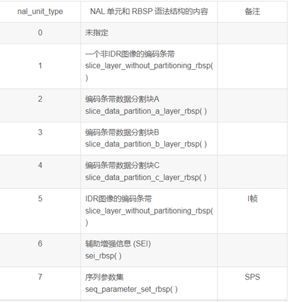


  rk_cedec_node.cpp文件里对IDR帧分析进行了代码化：

        static constexpr uint32_t nalBit = 0x1F;
        #define NAL_TYPE(value)             ((value) & nalBit)
        void RKCodecNode::SearchIFps(unsigned char* buf, size_t bufSize, std::shared_ptr\<IBuffer\>& buffer)
        {
            size_t nalType = 0;
            size_t idx = 0;
            size_t size = bufSize;
            constexpr uint32_t nalTypeValue = 0x05;
        
            if (buffer == nullptr || buf == nullptr) {
                CAMERA_LOGI("RKCodecNode::SearchIFps parameter == nullptr");
                return;
            }
        
            for (int i = 0; i < bufSize; i++) {
                int ret = findStartCode(buf + idx, size);
                if (ret == -1) {
                    idx += 1;
                    size -= 1;
                } else {
                    nalType = NAL_TYPE(buf[idx + ret]);
                    CAMERA_LOGI("ForkNode::ForkBuffers nalu == 0x%{public}x buf == 0x%{public}x \n", nalType, buf[idx + ret]);

每经过一个h264转换过的buffer都会被传入SearchIFps接口中寻找IDR帧。其中findStartCode()接口会对buffer中的内容逐个字节扫描，知道寻找出NALU头来。

  ```
     int RKCodecNode::findStartCode(unsigned char *data, size_t dataSz)
        {
            constexpr uint32_t dataSize = 4;
            constexpr uint32_t dataBit2 = 2;
            constexpr uint32_t dataBit3 = 3;
        
            if (data == nullptr) {
                CAMERA_LOGI("RKCodecNode::findStartCode parameter == nullptr");
                return -1;
            }
        
            if ((dataSz > dataSize) && (data[0] == 0) && (data[1] == 0) && \
                (data[dataBit2] == 0) && (data[dataBit3] == 1)) {
                return 4; // 4:start node
            }
        
            return -1;
        }
  ```
当找到NALU头后就会对&0x1F 找出nal_unit_type，如果type为5标记关键帧信息并通过buffer->SetEsKeyFrame(1);接口上报。

##     TP 

### TP驱动模型

主要包含Input模块HDI（Hardware Driver Interface）接口定义及其实现，对上层输入服务提供操作input设备的驱动能力接口，HDI接口主要包括如下三大类：

- InputManager：管理输入设备，包括输入设备的打开、关闭、设备列表信息获取等；
- InputReporter：负责输入事件的上报，包括注册、注销数据上报回调函数等；
- InputController：提供input设备的业务控制接口，包括获取器件信息及设备类型、设置电源状态等。

**图 1** INPUT模块HDI接口层框架图


相关目录下源代码目录结构如下所示：

```
/drivers/peripheral/input
├── hal                # input模块的hal层代码。
│   └── include       # input模块hal层内部的头文件。
│   └── src           # input模块hal层代码的具体实现。
├── interfaces         # input模块对上层服务提供的驱动能力接口。
│   └── include       # input模块对外提供的接口定义。
├── test               # input模块的测试代码。
│   └── unittest      # input模块的单元测试代码。
```

详细请参考input子系统[README](https://gitee.com/openharmony/drivers_peripheral/blob/master/input/README_zh.md)

### TP HDF驱动适配

#### TP驱动涉及的文件及目录

dayu200平台默认支持GT5688这颗TP IC。

开发板移植touch驱动涉及的文件及目录：

1、 Makefile文件： drivers\adapter\khdf\linux\model\input\Makefile

2、 vendor\hihope\rk3568\hdf_config\khdf\device_info\device_info.hcs

3、 vendor\hihope\rk3568\hdf_config\khdf\input\input_config.hcs

4、 drivers\framework\model\input\driver\touchscreen

TP驱动的适配涉及TP驱动和hcs配置。

tp驱动的适配依赖hdf的input模型，hdf的input模型提供了TP，KEY，HID等场景的设备注册，管理，数据转发层，hcs解析等场景的支持能力。hdf的input模型可大致抽象为驱动管理层、公共驱动层以及器件驱动三层。 

从功能的角度看hdf input模块的框架如下：  

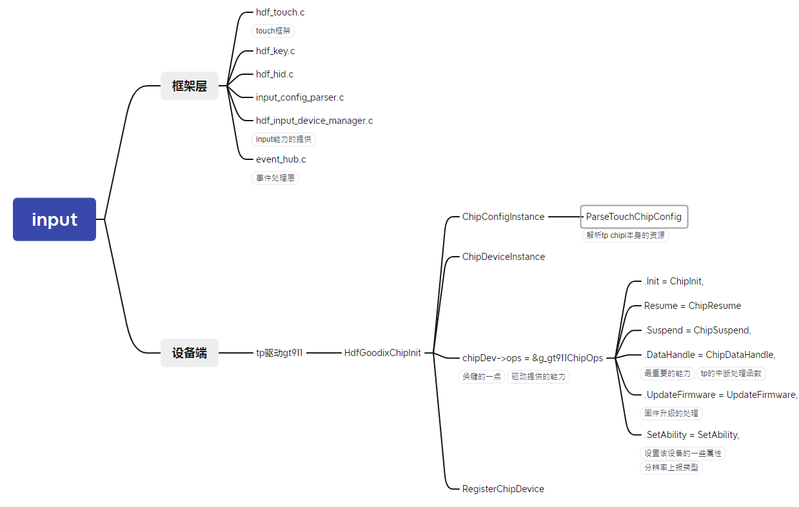

因为hdf input模型的高度抽象集成，TP驱动的适配驱动主要涉及器件驱动层的适配。

在适配前，需要先明确tp所需要的的资源。

对于硬件资源，tp模组需要主机上的如下资源：

1.中断引脚。

2.Reset引脚。

3.使用的哪一组i2c，从设备的地址是什么。

4.TP的初始化固件（这个通常由IC厂商提供）。

5.触摸屏的分辨率。

对于软件资源，在hdf上适配tp，需要依赖如下几个hdf基础模组：

1.Hdf gpio子系统 用于设置gpio pin脚以及一些中断资源。

2.Hdf i2c 子系统 用于进行i2c通信。

3.Input模型。

器件驱动主要围绕如下结构体展开。

```
static struct TouchChipOps g_gt911ChipOps = {
    .Init = ChipInit,
    .Detect = ChipDetect,
    .Resume = ChipResume,
    .Suspend = ChipSuspend,
    .DataHandle = ChipDataHandle,
    .UpdateFirmware = UpdateFirmware,
    .SetAbility = SetAbility,
};
```

ChipInit负责器件驱动的初始化动作。

ChipDetect负责初始化后的器件有效性检测。

SetAbility设置按键属性。

ChipDataHandle负责解析键值。

UpdateFirmware负责升级固件。

ChipSuspend负责器件的休眠。

ChipResume负责器件的唤醒。

按照器件的特性实现如上接口回调，并将该结构体注册进input模型即可。

#### HCS 配置

device_info.hcs中加入新的器件节点。

```
device_touch_chip :: device {
                device0 :: deviceNode {
                    policy = 0;
                    priority = 180;
                    preload = 0;//0表示默认加载。
                    permission = 0660;
                    moduleName = "HDF_TOUCH_GT911";//需要和器件driver中保持一致。
                    serviceName = "hdf_touch_gt911_service";
                    deviceMatchAttr = "zsj_gt911_5p5";
                }
            }
```

input_config.hcs中加入器件的特性。

```
chipConfig {
                    template touchChip {
                        match_attr = "";
                        chipName = "gt911";
                        vendorName = "zsj";
                        chipInfo = "AAAA11222";  // 4-ProjectName, 2-TP IC, 3-TP Module
                        /* 0:i2c 1:spi*/
                        busType = 0;
                        deviceAddr = 0x5D;
                        /* 0:None 1:Rising 2:Failing 4:High-level 8:Low-level */
                        irqFlag = 2;
                        maxSpeed = 400;
                        chipVersion = 0; //parse Coord TypeA.
                        powerSequence {
                            /* [type, status, dir , delay]
                                <type> 0:none 1:vcc-1.8v 2:vci-3.3v 3:reset 4:int
                                <status> 0:off or low  1:on or high  2:no ops
                                <dir> 0:input  1:output  2:no ops
                                <delay> meanings delay xms, 20: delay 20ms
                             */
                            powerOnSeq = [4, 0, 1, 5,
                                         3, 0, 1, 10,
                                         3, 1, 1, 60,
                                         4, 2, 0, 50];
                            suspendSeq = [3, 0, 2, 10];
                            resumeSeq = [3, 1, 2, 10];
                            powerOffSeq = [3, 0, 2, 10,
                                           1, 0, 2, 20];
                        }
                    }
```

## 显示适配

显示适配需要完成的工作：图形服务HDI接口适配、GPU适配、LCD驱动适配。

### 显示HDI

[显示HDI](https://gitee.com/openharmony/drivers_peripheral/blob/master/display/README_zh.md)对图形服务提供显示驱动能力，包括显示图层的管理、显示内存的管理及硬件加速等。 显示HDI需要适配两部分：gralloc 和 display_device。

#### gralloc适配

gralloc模块提供显示内存管理功能，OpenHarmony提供了使用与Hi3516DV300参考实现，厂商可根据实际情况参考适配，该实现基于drm开发，[源码链接](https://gitee.com/openharmony/drivers_peripheral/tree/master/display/hal/default_standard)。

drm设备节点定义在//drivers_peripheral/display/hal/default_standard/srd/display_gralloc/display_gralloc_gbm.c文件中，可根据实际情况修改。

```
const char *g_drmFileNode = "/dev/dri/card0";
```

该实现中存在一个海思的私有ioctl命令码 DRM_IOCTL_HISILICON_GEM_FD_TO_PHYADDR 定义在//drivers_peripheral/display/hal/default_standard/src/display_gralloc/hisilicon_drm.h 文件中，在//drivers_peripheral/display/hal/default_standard/src/display_gralloc/display_gralloc_gbm.c文件中调用，属于海思的私有功能，适配时根据实际情况修改。

```
...
    InitBufferHandle(bo, fd, info, priBuffer);
    priBuffer->hdl.phyAddr = GetPhysicalAddr(grallocManager->drmFd, fd);
    *buffer = &priBuffer->hdl;
...
```

####  display device适配

display device模块提供显示设备管理、layer管理、硬件加速等功能。

OpenHarmony提供了[基于drm的Hi3516DV300芯片的参考实现](https://gitee.com/openharmony/drivers_peripheral/tree/master/display/hal/default_standard/src/display_device),该实现默认支持硬件合成；

如开发板不支持硬件合成，需要在drm_display.cpp文件中跳过gfx的初始化，

```
drivers_peripheral/blob/master/display/hal/default_standard/src/display_device/drm/drm_display.cpp
int32_t DrmDisplay::Init()
{
    ...
    ...
    ret = HdiDisplay::Init();
    DISPLAY_CHK_RETURN((ret != DISPLAY_SUCCESS), DISPLAY_FAILURE, DISPLAY_LOGE("init failed"));
    auto preComp = std::make_unique<HdiGfxComposition>();
    DISPLAY_CHK_RETURN((preComp == nullptr), DISPLAY_FAILURE,
        DISPLAY_LOGE("can not new HdiGfxComposition errno %{public}d", errno));
    ret = preComp->Init();                                                                                          // gfx初始化，这里需要跳过。
    DISPLAY_CHK_RETURN((ret != DISPLAY_SUCCESS), DISPLAY_FAILURE, DISPLAY_LOGE("can not init HdiGfxComposition"));  // 或者不判断返回值。

    ...
}
```

同时在//drivers_peripheral/display/hal/default_standard/src/display_device/hdi_gfx_composition.cpp文件中修改set_layers方法，全部使用CPU合成显示。

```
int32_t HdiGfxComposition::SetLayers(std::vector<HdiLayer *> &layers, HdiLayer &clientLayer)
{
    DISPLAY_LOGD("layers size %{public}zd", layers.size());
    mClientLayer = &clientLayer;
    mCompLayers.clear();
    for (auto &layer : layers) {
        if (CanHandle(*layer)) {
#if 0                                      // CPU合成。
            layer->SetDeviceSelect(COMPOSITION_CLIENT);
#else
            if ((layer->GetCompositionType() != COMPOSITION_VIDEO) &&
                (layer->GetCompositionType() != COMPOSITION_CURSOR)) {
                layer->SetDeviceSelect(COMPOSITION_DEVICE);
            } else {
                layer->SetDeviceSelect(layer->GetCompositionType());
            }
#endif
            mCompLayers.push_back(layer);
        }
    }
    DISPLAY_LOGD("composer layers size %{public}zd", mCompLayers.size());
    return DISPLAY_SUCCESS;
}
```

#### 测试验证

hello_composer测试模块：Rosen图形框架提供的测试程序，主要显示流程，HDI接口等功能是否正常。默认随系统编译。

代码路径：

```
foundation/graphic/graphic/rosen/samples/composer/
├── BUILD.gn
├── hello_composer.cpp
├── hello_composer.h
├── layer_context.cpp
├── layer_context.h
└── main.cpp
```

具体验证如下：

1. 关闭render service。

  ```
  service_control stop render_service
  ```

2. 关闭 foundation进程。

  ```
  service_control stop foundation
  ```

3. 运行hello_composer 测试相关接口。

   ```
   ./hello_composer
   ```

devicetest测试：HDI显示模块提供的测试模块，主要测试HDI接口、显示buffer、驱动等能力，测试时也需要关闭render service和 foundation进程。

代码路径：/drivers/peripheral/display/test/unittest/standard

```
├── BUILD.gn
├── common
│   ├── display_test.h
│   ├── display_test_utils.cpp
│   └── display_test_utils.h
├── display_device
│   ├── hdi_composition_check.cpp
│   ├── hdi_composition_check.h
│   ├── hdi_device_test.cpp
│   ├── hdi_device_test.h
│   ├── hdi_test_device_common.h
│   ├── hdi_test_device.cpp
│   ├── hdi_test_device.h
│   ├── hdi_test_display.cpp
│   ├── hdi_test_display.h
│   ├── hdi_test_layer.cpp
│   ├── hdi_test_layer.h
│   ├── hdi_test_render_utils.cpp
│   └── hdi_test_render_utils.h
└── display_gralloc
    ├── display_gralloc_test.cpp
    └── display_gralloc_test.h
```

### GPU

编译器clang。

```
prebuilts/clang/ohos/linux-x86_64/llvm
```

musl库。

```
./build.sh --product-name rk3568 --build-target musl_all 
```

编译完成后，会在 out/{product_name}/obj/third_party/musl/usr/lib目录下生成对应的头文件和库：

```
32位对应arm-linux-ohos

64位对应aarch64-linux-ohos
```

源码目录：

```
third_party/musl
```

GPU 编译参数参考。

```
TARGET_CFLAGS=" -march=armv7-a -mfloat-abi=softfp -mtune=generic-armv7-a -mfpu=neon -mthumb --target=arm-linux-ohosmusl -fPIC -ftls-model=global-dynamic -mtls-direct-seg-refs -DUSE_MUSL"
```

## LCD

dayu200平台默认支持一个mipi接口的lcd屏幕。

LCD的适配主要依赖于HDF显示模型，显示驱动模型基于 HDF 驱动框架、Platform 接口及 OSAL 接口开发，可以屏蔽不同内核形态(LiteOS、Linux)差异，适用于不同芯片平台，为显示屏器件提供统一的驱动平台。

如图为 HDF Display驱动模型层次关系。


当前驱动模型主要部署在内核态中，向上对接到 Display 公共 hal 层，辅助 HDI 的实现。显示驱动通过 Display-HDI 层对图形服务暴露显示屏驱动能力；向下对接显示屏 panel 器件，驱动屏幕正常工作，自上而下打通显示全流程通路。

所以LCD的适配主要在于LCD panel器件驱动的适配。

器件驱动的适配分为2部分：panel驱动和hcs配置。

涉及的文件有：

```
drivers/framework/model/display/driver/panel

vendor/hihope/rk3568/hdf_config/khdf/device_info

vendor/hihope/rk3568/hdf_config/khdf/input
```

### panel驱动

器件驱动主要围绕如下接口展开：

```
struct PanelData {
    struct HdfDeviceObject *object;
    int32_t (*init)(struct PanelData *panel);
    int32_t (*on)(struct PanelData *panel);
    int32_t (*off)(struct PanelData *panel);
    int32_t (*prepare)(struct PanelData *panel);
    int32_t (*unprepare)(struct PanelData *panel);
    struct PanelInfo *info;
    enum PowerStatus powerStatus;
    struct PanelEsd *esd;
    struct BacklightDev *blDev;
    void *priv;
};
```

驱动中在初始化接口中实例化该结构体：

    panelSimpleDev->panel.init = PanelSimpleInit;
    panelSimpleDev->panel.on = PanelSimpleOn;
    panelSimpleDev->panel.off = PanelSimpleOff;
    panelSimpleDev->panel.prepare = PanelSimplePrepare;
    panelSimpleDev->panel.unprepare = PanelSimpleUnprepare;
PanelSimpleInit负责panel的软件初始化。

PanelSimpleOn负责亮屏。

PanelSimpleOff负责灭屏。

PanelSimplePrepare负责亮屏的硬件时序初始化。

PanelSimpleUnprepare负责灭屏的硬件时序初始化。

实例化后使用RegisterPanel接口向display模型注册该panel驱动即可。

需要说明的是，dayu200上的这款lcd 使用的是DRM显示框架。

### hcs配置

```
device4 :: deviceNode {
                    policy = 0;
                    priority = 100;
                    preload = 0;
                    moduleName = "LCD_PANEL_SIMPLE";
                }
```

## 背光

基于HDF框架开发的 背光驱动模型。

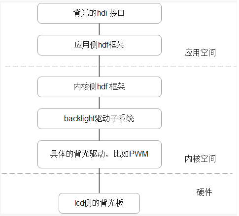

rk3568背光是通过pwm控制占空比实现的，具体使用的是pwm4。

原生背光驱动代码路径。

```c
linux-5.10/drivers/video/backlight/pwm_bl.c
linux-5.10/drivers/video/backlight/backlight.c
linux-5.10/drivers/pwm/pwm-rockchip.c
```

使用HDF框架下的背光驱动，需要关闭原生驱动。

```c
# CONFIG_BACKLIGHT_PWM is not set
```

### HDF实现

代码路径。

```c
drivers/framework/model/display/driver/backlight/hdf_bl.c
```

HDF BL 入口函数。

```c
static int32_t BacklightInit(struct HdfDeviceObject *object)
{
    if (object == NULL) {
        HDF_LOGE("%s: object is null!", __func__);
        return HDF_FAILURE;
    }
    HDF_LOGI("%s success", __func__);
    return HDF_SUCCESS;
}

struct HdfDriverEntry g_blDevEntry = {
    .moduleVersion = 1,
    .moduleName = "HDF_BL",
    .Init = BacklightInit,
    .Bind = BacklightBind,
};

HDF_INIT(g_blDevEntry);
```

代码路径：

```c
drivers/framework/model/display/driver/backlight/pwm_bl.c
```

HDF PWM 入口函数。

```c
struct HdfDriverEntry g_pwmBlDevEntry = {
    .moduleVersion = 1,
    .moduleName = "PWM_BL",
    .Init = BlPwmEntryInit,
};

HDF_INIT(g_pwmBlDevEntry);
```

具体控制背光的接口：

```c
static int32_t BlPwmUpdateBrightness(struct BacklightDev *blDev, uint32_t brightness)
{
    int32_t ret;
    uint32_t duty;
    struct BlPwmDev *blPwmDev = NULL;

    blPwmDev = ToBlDevPriv(blDev);
    if (blPwmDev == NULL) {
        HDF_LOGE("%s blPwmDev is null", __func__);
        return HDF_FAILURE;
    }
    if (blPwmDev->props.maxBrightness == 0) {
        HDF_LOGE("%s maxBrightness is 0", __func__);
        return HDF_FAILURE;
    }
    if (brightness == 0) {
        return PwmDisable(blPwmDev->pwmHandle);
    }
    duty = (brightness * blPwmDev->config.period) / blPwmDev->props.maxBrightness;
    ret = PwmSetDuty(blPwmDev->pwmHandle, duty);
    if (ret != HDF_SUCCESS) {
        HDF_LOGE("%s: PwmSetDuty failed, ret %d", __func__, ret);
        return HDF_FAILURE;
    }
    return PwmEnable(blPwmDev->pwmHandle);
}

static struct BacklightOps g_blDevOps = {
    .updateBrightness = BlPwmUpdateBrightness,
};
```

其实使用的就是HDF PWM 实现的对接内核pwm的接口。

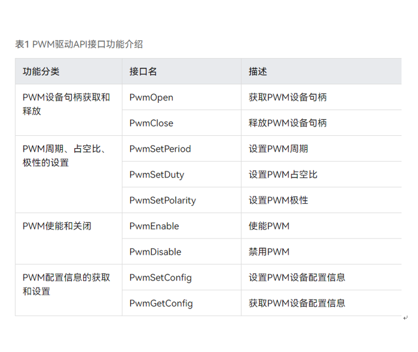

在LCD HDF器件驱动注册背光。

代码路径。

```c
drivers/framework/model/display/driver/panel/ili9881c_boe.c
```

```c
ili9881cBoeDev->panel.blDev = GetBacklightDev("hdf_pwm");
if (ili9881cBoeDev->panel.blDev == NULL) {
    HDF_LOGE("%s GetBacklightDev fail", __func__);
    goto FAIL;
}
```

### HCS配置

驱动hcs配置。

```c
device_pwm_bl :: device {
    device0 :: deviceNode {
        policy = 0;
        priority = 95;
        preload = 0;
        moduleName = "PWM_BL";
        deviceMatchAttr = "pwm_bl_dev";
    }
}
device_backlight :: device {
    device0 :: deviceNode {
        policy = 2;
        priority = 90;
        preload = 0;
        permission = 0660;
        moduleName = "HDF_BL";
        serviceName = "hdf_bl";
    }
}
```

pwm背光的hcs配置。

```c
root {
    backlightConfig {
        pwmBacklightConfig {
            match_attr = "pwm_bl_dev";
            pwmDevNum = 1;
            pwmMaxPeriod = 25000;
            backlightDevName = "hdf_pwm";
            minBrightness = 0;
            defBrightness = 127;
            maxBrightness = 255;
        }
    }
}
```

### 测试

cat /sys/kernel/debug/pwm 来查看hdf pwm 是否申请到pwm4。

申请成功有如下结果：

requested 代表申请成功。

enabled 代表pwm4使能成功。

```c
# cat /sys/kernel/debug/pwm

platform/fe6e0000.pwm, 1 PWM device
 pwm-0   ((null)              ): requested enabled period: 25000 ns duty: 9705 ns polarity: normal
```

## **WIFI**

### WIFI HDF化思路

主要参考[《OpenHarmony HDF WLAN驱动分析》](https://mp.weixin.qq.com/s/iiE97pqPtzWIZadcjrQtsw)与使用 这篇文章，熟悉HDF WLAN的框架以及需要实现的主要接口，包括HDF驱动初始化接口、WLAN控制侧接口集、AP模式接口集、STA模式接口集、网络侧接口集、事件上报接口的实现。

接下来熟悉HCS文件的格式以及"HDF WIFI”核心驱动框架的代码启动初始化过程，参考hi3881的代码进行改造。

HDF WiFi框架总体框架图。

​                       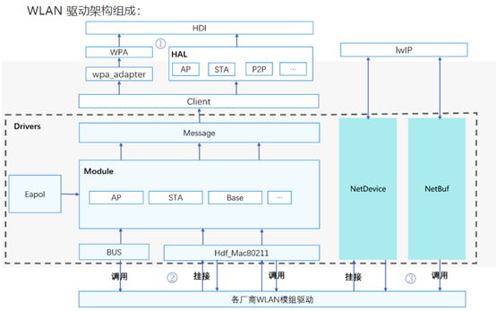        

### ap6275s驱动代码流程分析

####  驱动模块初始化流程分析


Ap6275s 是一款SDIO设备WiFi模组驱动，使用标准Linux的SDIO设备驱动。内核模块初始化入口module_init()调用dhd_wifi_platform_load_sdio()函数进行初始化工作，这里调用wifi_platform_set_power()进行GPIO上电，调用dhd_wlan_set_carddetect()进行探测SDIO设备卡，最后调用sdio_register_driver(&bcmsdh_sdmmc_driver);进行SDIO设备驱动的注册，SDIO总线已经检测到WiFi模块设备 根据设备号和厂商号与该设备驱动匹配, 所以立即回调该驱动的bcmsdh_sdmmc_probe()函数，这里进行WiFi模组芯片的初始化工作，最后创建net_device网络接口wlan0，然后注册到Linux内核协议栈中。

l 创建net_device网络接口wlan0对象。

dhd_allocate_if()会调用alloc_etherdev()创建net_device对象，即wlan0网络接口。

l 将wlan0注册到内核协议栈。

调用dhd_register_if()函数，这里调用register_netdev(net);将wlan0网络接口注册到协议栈。

### 整改代码适配HDF WiFi框架

对于系统WiFi功能的使用，需要实现AP模式、STA模式、P2P三种主流模式，这里使用wpa_supplicant应用程序通过HDF WiFi框架与WiFi驱动进行交互，实现STA模式和P2P模式的功能，使用hostapd应用程序通过HDF WiFi框架与WiFi驱动进行交互，实现AP模式和P2P模式的功能。

Ap6275s WiFi6内核驱动依赖platform能力，主要包括SDIO总线的通讯能力；与用户态通信依赖HDF WiFi框架的能力，在确保上述能力功能正常后，即可开始本次WiFi驱动的HDF适配移植工作。本文档基于已经开源的rk3568开源版代码为基础版本，来进行此次移植。

适配移植ap6275s WiFi6驱动涉及到的文件和目录如下：

1). 编译配置文件。

drivers/adapter/khdf/linux/model/network/wifi/Kconfig

drivers/adapter/khdf/linux/model/network/wifi/vendor/Makefile

2). WiFi驱动源码目录。

原生驱动代码存放于：

linux-5.10/drivers/net/wireless/rockchip_wlan/rkwifi/bcmdhd_wifi6/

在原生驱动上增加以及修改的代码文件位于：

device/hihope/rk3568/wifi/bcmdhd_wifi6/

目录结构：

```
./device/hihope/rk3568/wifi/bcmdhd_wifi6/hdf
├── hdf_bdh_mac80211.c
├── hdf_driver_bdh_register.c
├── hdfinit_bdh.c    
├── hdf_mac80211_ap.c    
├── hdf_mac80211_sta.c          
├── hdf_mac80211_sta.h     
├── hdf_mac80211_sta_event.c     
├── hdf_mac80211_sta_event.h
├── hdf_mac80211_p2p.c
├── hdf_public_ap6275s.h
├── net_bdh_adpater.c  
├── net_bdh_adpater.h 
```

其中hdf_bdh_mac80211.c主要对g_bdh6_baseOps所需函数的填充，hdf_mac80211_ap.c主要对g_bdh6_staOps所需函数进行填充，hdf_mac80211_sta.c主要对g_bdh6_staOps所需函数进行填充，hdf_mac80211_p2p.c主要对g_bdh6_p2pOps所需函数进行填充，在openharmony/drivers/framework/include/wifi/wifi_mac80211_ops.h里有对wifi基本功能所需api的说明。

####  驱动文件编写

HDF WLAN驱动框架由Module、NetDevice、NetBuf、BUS、HAL、Client 和 Message 这七个部分组成。开发者在WiFi驱动HDF适配过程中主要实现以下几部分功能：

1)  适配HDF WLAN框架的驱动模块初始化。

代码流程框图如下：

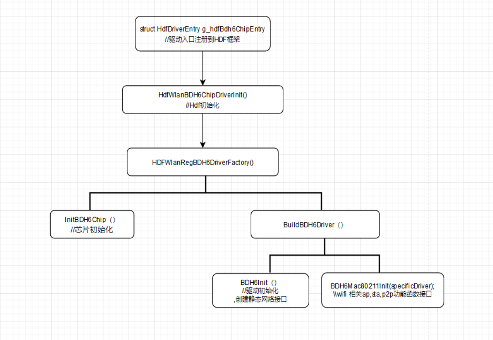

代码位于device/hihope/rk3568/wifi/bcmdhd_wifi6/hdf_driver_bdh_register.c

```
struct HdfDriverEntry g_hdfBdh6ChipEntry = {
  .moduleVersion = 1,
  .Bind = HdfWlanBDH6DriverBind,
  .Init = HdfWlanBDH6ChipDriverInit,
  .Release = HdfWlanBDH6ChipRelease,
  .moduleName = "HDF_WLAN_CHIPS"
};
HDF_INIT(g_hdfBdh6ChipEntry);
```

在驱动初始化时会实现SDIO主控扫描探卡、WiFi芯片初始化、主接口的创建和初始化等工作。

2)  HDF WLAN Base控制侧接口的实现。

代码位于hdf_bdh_mac80211.c

```
static struct HdfMac80211BaseOps g_bdh6_baseOps = {
  .SetMode = BDH6WalSetMode,
  .AddKey = BDH6WalAddKey,
  .DelKey = BDH6WalDelKey,
  .SetDefaultKey = BDH6WalSetDefaultKey,
  .GetDeviceMacAddr = BDH6WalGetDeviceMacAddr,
  .SetMacAddr = BDH6WalSetMacAddr,
  .SetTxPower = BDH6WalSetTxPower,
  .GetValidFreqsWithBand = BDH6WalGetValidFreqsWithBand,
  .GetHwCapability = BDH6WalGetHwCapability,
  .SendAction = BDH6WalSendAction,
  .GetIftype = BDH6WalGetIftype,
};
```

上述实现的接口供STA、AP、P2P三种模式中所调用。

3)  HDF WLAN STA模式接口的实现。

STA模式调用流程图如下：

​                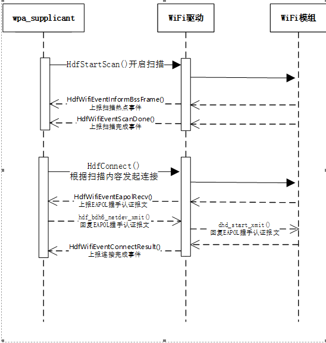         

代码位于hdf_mac80211_sta.c

```
struct HdfMac80211STAOps g_bdh6_staOps = {
  .Connect = HdfConnect,
  .Disconnect = HdfDisconnect,
  .StartScan = HdfStartScan,
  .AbortScan = HdfAbortScan,
  .SetScanningMacAddress = HdfSetScanningMacAddress,
};
```

4)  HDF WLAN AP模式接口的实现。

AP模式调用流程图如下：

 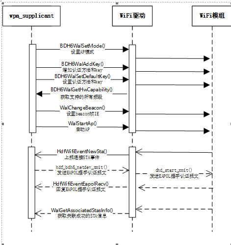

代码位于hdf_mac80211_ap.c

```
struct HdfMac80211APOps g_bdh6_apOps = {
  .ConfigAp = WalConfigAp,
  .StartAp = WalStartAp,
  .StopAp = WalStopAp,
  .ConfigBeacon = WalChangeBeacon,
  .DelStation = WalDelStation,
  .SetCountryCode = WalSetCountryCode,
  .GetAssociatedStasCount = WalGetAssociatedStasCount,
  .GetAssociatedStasInfo = WalGetAssociatedStasInfo
};
```

5） HDF WLAN P2P模式接口的实现。

P2P模式调用流程图如下：

 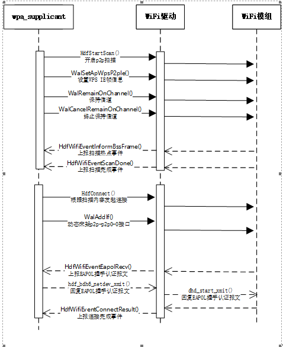

```
struct HdfMac80211P2POps g_bdh6_p2pOps = {
  .RemainOnChannel = WalRemainOnChannel,
  .CancelRemainOnChannel = WalCancelRemainOnChannel,
  .ProbeReqReport = WalProbeReqReport,
  .AddIf = WalAddIf,
  .RemoveIf = WalRemoveIf,
  .SetApWpsP2pIe = WalSetApWpsP2pIe,
  .GetDriverFlag = WalGetDriverFlag,
}; 
```

6） HDF WLAN框架事件上报接口的实现。

WiFi驱动需要通过上报事件给wpa_supplicant和hostapd应用程序，比如扫描热点结果上报，新STA终端关联完成事件上报等等，HDF WLAN事件上报的所有接口请参考drivers/framework/include/wifi/hdf_wifi_event.h：

事件上报HDF WLAN接口主要有：

| 头文件  hdf_wifi_event.h接口名称    | 功能描述                 |
| ----------------------------------- | ------------------------ |
| HdfWifiEventNewSta()                | 上报一个新的sta事件。      |
| HdfWifiEventDelSta（）              | 上报一个删除sta事件。      |
| HdfWifiEventInformBssFrame（）      | 上报扫描Bss事件。          |
| HdfWifiEventScanDone（）            | 上报扫描完成事件。         |
| HdfWifiEventConnectResult（）       | 上报连接结果事件。         |
| HdfWifiEventDisconnected（）        | 上报断开连接事件。         |
| HdfWifiEventMgmtTxStatus（）        | 上报发送状态事件。        |
| HdfWifiEventRxMgmt（）              | 上报接受状态事件。         |
| HdfWifiEventCsaChannelSwitch（）    | 上报Csa频段切换事件。     |
| HdfWifiEventTimeoutDisconnected（） | 上报连接超时事件。         |
| HdfWifiEventEapolRecv（）           | 上报Eapol接收事件。        |
| HdfWifiEventResetResult（）         | 上报wlan驱动复位结果事件。 |
| HdfWifiEventRemainOnChannel（）     | 上报保持信道事件。         |
| HdfWifiEventCancelRemainOnChannel   | 上报取消保持信道事件。     |

### 所有关键问题总结

#### 调试AP模块时，启动AP模式的方法

调试AP模块时，无法正常开启AP功能的解决方法。

需要使用到busybox和hostapd配置ap功能，操作步骤如下：

```
ifconfig wlan0 up
ifconfig wlan0 192.168.12.1 netmask 255.255.255.0
busybox udhcpd /data/udhcpd.conf
./hostapd -d /data/hostapd.conf
```

#### 调试STA模块时，启动STA模式的方法 

```
wpa_supplicant -iwlan0 -c /data/l2tool/wpa_supplicant.conf -d &
./busybox udhcpc -i wlan0 -s /data/l2tool/dhcpc.sh
```

#### 扫描热点事件无法上报到wap_supplicant的解决办法

wpa_supplicant 这个应用程序启动时不能加 -B参数后台启动，-B后台启动的话，调用poll()等待接收事件的线程会退出，所以无法接收上报事件，

wpa_supplicant -iwlan0 -c /data/wpa_supplicant.conf & 这样后台启动就可以了。

#### wpa2psk方式无法认证超时问题解决方法

分析流程发现 hostapd没有接收到WIFI_WPA_EVENT_EAPOL_RECV = 13这个事件，原来是驱动没有将接收到的EAPOL报文通过HDF WiFi框架发送给hostapd进程，在驱动接收报文后，调用netif_rx()触发软中断前将EAPOL报文发送给HDF WiFi框架，认证通过了。

#### P2P模式连接不成功问题定位分析

在调试P2P连接接口时，发现手机P2P直连界面总是处于已邀请提示，无法连接成功，通过抓取手机和WiFi模组正常连接成功报文和HDF适配后连接失败的报文进行比对，在失败的报文组中，发现手机侧多回复了一帧ACTION报文，提示无效参数，然后终止了P2P连接。

 

最后比对WiFi模组向手机发送的ACTION报文内容，发现填充的P2P Device Info的MAC地址值不对，如下：

正确帧内容：

 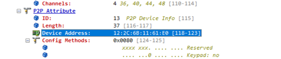

错误帧内容：

 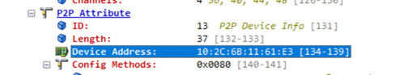

最后经过分析MAC地址的填充部分代码，这个MAC地址是wpa_supplicant 根据p2p0的MAC地址填充的，所以将wdev对象（即p2p-dev-wlan0）的MAC地址更新给p2p0接口，二者保持一致即可，见代码wl_get_vif_macaddr(cfg, 7, p2p_hnetdev->macAddr);的调用。

### 连接成功日志

#### STA模式连接成功日志

```
WPA: Key negotiation completed with 50:eb:f6:02:8e6:d4 [PTK=CCMP GTK=CCMP]
 06 wlan0: State: GROUP_HANDSHAKEc -> COMPLETED
wlan0: CTRL-E4VENT-CONNECTED - Connection to 50:eb:f6:02:8e:d4 completed 3[id=0 id_str=]
WifiWpaReceived eEapol done 
```

#### AP模式连接成功日志

```
wlan0: STA 96:27:b3:95:b7:6e IEEE 802.1X: au:thorizing port
wlan0: STA 96:27:b3:95:b7:6e WPA: pairwise key handshake completed (RSN)
WifiWpaReceiveEapol done 
```

#### P2P模式连接成功日志

```
P2P: cli_channels:
EAPOL: External notificationtion - portValid=1
EAPOL: External notification:tion - EAP success=1
EAPOL: SUPP_PAE entering state AUTHENTIwCATING
EAPOL: SUPP_BE enterilng state SUCCESS
EAP: EAP ent_ering state DISABLED
EAPOL: SUPP_PAE entering state AUTHENTICATED
EAPOL:n Supplicant port status: Authoorized
EAPOL: SUPP_BE entertaining IDLE
WifiWpaReceiveEapol donepleted - result=SUCCESS

\# ifconfig                                  

lo    Link encap:Local Loopback 
     inet addr:127.0.0.1 Mask:255.0.0.0 
     inet6 addr: ::1/128 Scope: Host
     UP LOOPBACK RUNNING MTU:65536 Metric:1
     RX packets:12 errors:0 dropped:0 overruns:0 frame:0 
     TX packets:12 errors:0 dropped:0 overruns:0 carrier:0 
     collisions:0 txqueuelen:1000 
     RX bytes:565 TX bytes:565  

wlan0   Link encap:Ethernet HWaddr 10:2c:6b:11:61:e0 Driver bcmsdh_sdmmc
     inet6 addr: fe80::122c:6bff:fe11:61e0/64 Scope: Link
     UP BROADCAST RUNNING MULTICAST MTU:1500 Metric:1
     RX packets:0 errors:0 dropped:0 overruns:0 frame:0 
     TX packets:0 errors:0 dropped:0 overruns:0 carrier:0 
     collisions:0 txqueuelen:1000 
     RX bytes:0 TX bytes:0 

p2p0   Link encap:Ethernet HWaddr 12:2c:6b:11:61:e0
     inet6 addr: fe80::102c:6bff:fe11:61e0/64 Scope: Link
     UP BROADCAST RUNNING MULTICAST MTU:1500 Metric:1
     RX packets:0 errors:0 dropped:0 overruns:0 frame:0 
     TX packets:0 errors:0 dropped:0 overruns:0 carrier:0 
     collisions:0 txqueuelen:1000 
     RX bytes:0 TX bytes:0 

p2p-p2p0-0 Link encap:Ethernet HWaddr 12:2c:6b:11:21:e0 Driver bcmsdh_sdmmc
     inet6 addr: fe80::102c:6bff:fe11:21e0/64 Scope: Link
     UP BROADCAST RUNNING MULTICAST MTU:1500 Metric:1
     RX packets:0 errors:0 dropped:9 overruns:0 frame:0 
     TX packets:0 errors:0 dropped:0 overruns:0 carrier:0 
     collisions:0 txqueuelen:1000 
     RX bytes:0 TX bytes:0 
```

## **BT**      

### HCI接口

蓝牙整体硬件架构上分为主机（计算机或MCU）和主机控制器（实际蓝牙芯片组）两部分；主机和控制器之间的通信遵循主机控制器接口（HCI），如下所示：


HCI定义了如何交换命令，事件，异步和同步数据包。异步数据包（ACL）用于数据传输，而同步数据包（SCO）用于带有耳机和免提配置文件的语音。

### 硬件连接

从RK3568芯片描述中看，该芯片并不没有集成WIFI/蓝牙功能，都需要外接蓝牙芯片才能支持蓝牙功能，这也符合上述逻辑架构。那主机和控制器之间物理具体怎么连接呢？查看开发板规格书可以看的更清楚：


其中，28-36号管脚就是UART（串口）；同时还可以看到有几个管脚分别做电源和休眠控制。

### 蓝牙VENDORLIB适配

#### vendorlib是什么

vendorlib部署在主机侧，可以认为是主机侧对蓝牙芯片驱动层，屏蔽不同蓝牙芯片的技术细节。从代码层面解读，其主要功能有两个：

1、为协议栈提供蓝牙芯片之间的通道（串口的文件描述符）。

2、提供特定芯片的具体控制方法。

#### 代码层面解读vendorlib

bt_vendor_lib.h 路径：

```
foundation/communication/bluetooth/services/bluetooth_standard/hardware/include
```

该文件定义了协议栈和vendor_lib交互接口，分为两组：

1、 vendorlib实现，协议栈调用。

```c
typedef struct {
    /**
     * Set to sizeof(bt_vendor_interface_t)
     */
    size_t size;
    /**
     * Caller will open the interface and pass in the callback routines
     * to the implementation of this interface.
     */
    int (*init)(const bt_vendor_callbacks_t* p_cb, unsigned char* local_bdaddr);

    /**
     * Vendor specific operations
     */
    int (*op)(bt_opcode_t opcode, void* param);

    /**
     * Closes the interface
     */
    void (*close)(void);
} bt_vendor_interface_t;
```

协议栈启动时的基本流程如下：

1.1、协议栈动态打开libbt_vendor.z.so，并调用init函数，初始化vendorlib。

1.2、协议栈调用op函数，分别调用BT_OP_POWER_ON、BT_OP_HCI_CHANNEL_OPEN、BT_OP_INIT三个opcode；原则上BT_OP_INIT成功后说明芯片初始化完成。

2、协议栈实现，vendorlib调用（回调函数）。

```c
typedef struct {
    /**
   * set to sizeof(bt_vendor_callbacks_t)
    */
    size_t size;
         
    /* notifies caller result of init request */
    init_callback init_cb;

    /* buffer allocation request */
    malloc_callback alloc;

    /* buffer free request */
    free_callback dealloc;

    /* hci command packet transmit request */
    cmd_xmit_callback xmit_cb;
} bt_vendor_callbacks_t;
```

init_cb在BT_OP_INIT完成后调用。

alloc/dealloc用于发送HCI消息时申请/释放消息控件。

xmit_cb发送HCI Commands。

vendor_lib实现的几个重要函数。

1、 init函数。

```c
static int init(const bt_vendor_callbacks_t *p_cb, unsigned char *local_bdaddr)
{
     /* * ... */
    userial_vendor_init();
    upio_init();

	vnd_load_conf(VENDOR_LIB_CONF_FILE);

    /* store reference to user callbacks */
    bt_vendor_cbacks = (bt_vendor_callbacks_t *)p_cb;
        /* This is handed over from the stack */
    return memcpy_s(vnd_local_bd_addr, BD_ADDR_LEN, local_bdaddr, BD_ADDR_LEN);
}
```

vendorlib被调用的第一个函数，vendorlib保存好协议栈的callback和mac地址即可。

2、 BT_OP_POWER_ON对应处理。

观名知意，这个操作理论上需要拉高电源管脚电平；该函数中使用rfill设备来处理，并没有直接调用驱动拉高电平。

```c
int upio_set_bluetooth_power(int on)
{
    int sz;
    int fd = -1;
    int ret = -1;
    char buffer = '0';
    
    switch (on) {
        case UPIO_BT_POWER_OFF:
            buffer = '0';
            break;

        case UPIO_BT_POWER_ON:
            buffer = '1';
            break;
        default:
            return 0;
    }

    /* check if we have rfkill interface */
    if (is_rfkill_disabled()) {
        return 0;
    }

    if (rfkill_id == -1) {
        if (init_rfkill()) {
            return ret;
        }
    }

    fd = open(rfkill_state_path, O_WRONLY);
    if (fd < 0) {
        return ret;
    }

    sz = write(fd, &buffer, 1);
    /* ... */
    return ret;
}
```

3、BT_OP_HCI_CHANNEL_OPEN对应处理。

```c
case BT_OP_HCI_CHANNEL_OPEN: { // BT_VND_OP_USERIAL_OPEN.
            int(*fd_array)[] = (int(*)[])param;
            int fd, idx;
            fd = userial_vendor_open((tUSERIAL_CFG *)&userial_init_cfg);
            if (fd != -1) {
                for (idx = 0; idx < HCI_MAX_CHANNEL; idx++)
                    (*fd_array)[idx] = fd;
                retval = 1;
        }
        /* retval contains numbers of open fd of HCI channels */
        break;
```

userial_vendor_open函数打开串口设备（UART）得到文件描述符(fd)，通过op的参数param返回该fd。

该串口设备在系统中的名字应该在开发板中预定义了，本次开发板上设备为/dev/ttyS8。

4、BT_OP_INIT对应处理。

该操作码要求对蓝牙芯片进行初始化，具体要进行的处理和蓝牙芯片强相关。以本次调测的AP6257S芯片为例，初始化过程中主要是下发蓝牙固件。

初始化结束后，必须调用init_cb回调函数（参见bt_vendor_callbacks_t）通知协议栈初始化结果，否则会阻塞协议栈线程导致蓝牙相关功能无法正常使用。协议栈的具体处理如下：

协议栈调用BT_OP_INIT后会等待信号量，该信号量由init_cb函数置位。

```c
static int HciInitHal()
{
    int result = BT_NO_ERROR;
    
    g_waitHdiInit = SemaphoreCreate(0);
    int ret = g_hdiLib->hdiInit(&g_hdiCallbacks);
    if (ret == SUCCESS) {
        SemaphoreWait(g_waitHdiInit);
    }
}
```

### vendorlib移植问题

1、 vendorlib的so命名。

vendorlib必须是libbt_vendor.z.so；因为协议栈打开动态链接库就是这个名字

2、 固件问题。

开发时一定要关注芯片固件，有些蓝牙芯片可能无需升级固件，有些则必须升级固件；本次AP6257S适配过程中最开始没有下发固件，导致蓝牙接收信号很差。固件下发时需要注意如下两点：

2.1、对于AP6257S芯片，因为蓝牙芯片内并没有类似flash存储，要求芯片上下电后必须重新下发。

2.2、按照芯片本身的要求处理，最好能找到厂商的参考代码；以Broadcom系列芯片为例，其固件下发过程比较复杂，通过一个状态机驱动；共如下9个状态。

```c
/ Hardware Configuration State */
enum {
  HW_CFG_START = 1,
  HW_CFG_SET_UART_CLOCK,
  HW_CFG_SET_UART_BAUD_1,
  HW_CFG_READ_LOCAL_NAME,
  HW_CFG_DL_MINIDRIVER,
  HW_CFG_DL_FW_PATCH,
  HW_CFG_SET_UART_BAUD_2,
  HW_CFG_SET_BD_ADDR,
  HW_CFG_READ_BD_ADDR
};
```

在收到BT_OP_INIT后初始化状态机，然后发送HCI_REST命令，切换状态为HW_CFG_START；

```c
void hw_config_start(void)
{
    HC_BT_HDR *p_buf = NULL;
    uint8_t *p;
    hw_cfg_cb.state = 0;
    hw_cfg_cb.fw_fd = -1;
    hw_cfg_cb.f_set_baud_2 = FALSE;

    if (bt_vendor_cbacks) {
        p_buf = (HC_BT_HDR *)bt_vendor_cbacks->alloc(BT_HC_HDR_SIZE +
                                                     HCI_CMD_PREAMBLE_SIZE);
    }

    if (p_buf) {
        p_buf->event = MSG_STACK_TO_HC_HCI_CMD;
        p_buf->offset = 0;
        p_buf->layer_specific = 0;
        p_buf->len = HCI_CMD_PREAMBLE_SIZE;

        p = (uint8_t *)(p_buf + 1);
        UINT16_TO_STREAM(p, HCI_RESET);
        *p = 0;

        hw_cfg_cb.state = HW_CFG_START;
        bt_vendor_cbacks->xmit_cb(HCI_RESET, p_buf);
    } else {
        if (bt_vendor_cbacks) {
            HILOGE("vendor lib fw conf aborted [no buffer]");
            bt_vendor_cbacks->init_cb(BTC_OP_RESULT_FAIL);
        }
    }
}
```

收到芯片返回的HCI_RESET完成事件后，继续切换到下一个状态机并发送下一个COMMAND，一直到状态机完成固件下发。

详细实现请参见hw_config_cback函数。

3、 关注系统间接口差异。

不同系统的接口可能有一些细微差异，需要重点关注；对比其他系统和OHOS的接口，vendorlib调用xmit_cb发送HCI命令的函数定义略有差异。

其他系统：

```c
/* define callback of the cmd_xmit_cb
 *

The callback function which HCI lib will call with the return of command

complete packet. Vendor lib is responsible for releasing the buffer passed

in at the p_mem parameter by calling dealloc callout function.
*/
typedef void (*tINT_CMD_CBACK)(void* p_mem);
typedef uint8_t (*cmd_xmit_cb)(uint16_t opcode, void* p_buf, tINT_CMD_CBACK p_cback);
```

OHOS：

```c
/**

hci command packet transmit callback

Vendor lib calls cmd_xmit_cb function in order to send a HCI Command

packet to BT Controller. 
*

The opcode parameter gives the HCI OpCode (combination of OGF and OCF) of

HCI Command packet. For example, opcode = 0x0c03 for the HCI_RESET command

packet. */

typedef uint8_t (*cmd_xmit_callback)(uint16_t opcode, void* p_buf);
```

也就是说vendorlib中发送命令后，其他系统会直接调用callback通知芯片返回的消息，OHOS则是通过BT_OP_EVENT_CALLBACK操作码（参见bt_opcode_t定义）通知芯片返回的消息；vendorlib需要解析报文中的消息码确认芯片是处理的哪个消息，然后调用对应的处理函数。

```c
void hw_process_event(HC_BT_HDR *p_buf)
{
    uint16_t opcode;
    uint8_t *p = (uint8_t *)(p_buf + 1) + HCI_EVT_CMD_CMPL_OPCODE;
    STREAM_TO_UINT16(opcode, p);
    switch (opcode) {
    case HCI_VSC_WRITE_BD_ADDR:
    #if (USE_CONTROLLER_BDADDR == TRUE)
        case HCI_READ_LOCAL_BDADDR:
    #endif
        case HCI_READ_LOCAL_NAME:
        case HCI_VSC_DOWNLOAD_MINIDRV:
        case HCI_VSC_WRITE_FIRMWARE:
        case HCI_VSC_LAUNCH_RAM:
        case HCI_RESET:
        case HCI_VSC_WRITE_UART_CLOCK_SETTING:
        case HCI_VSC_UPDATE_BAUDRATE:
            hw_config_cback(p_buf);
            break;
```

另外，OHOS返回的是发送消息的字节数，<=0为发送失败，和其他系统接口的返回值也不同。

4、 snoop日志。

其他系统中记录了HCI交互消息，OHOS同样有记录；OHOS系统生成文件为/data/log/bluetooth/snoop.log，通过wireshark或其它报文分析工具可以看到Host和Controller之间的交互流程，有助于问题分析。

##    Sensor

  基于HDF（Hardware Driver Foundation）驱动框架开发的Sensor驱动模型。

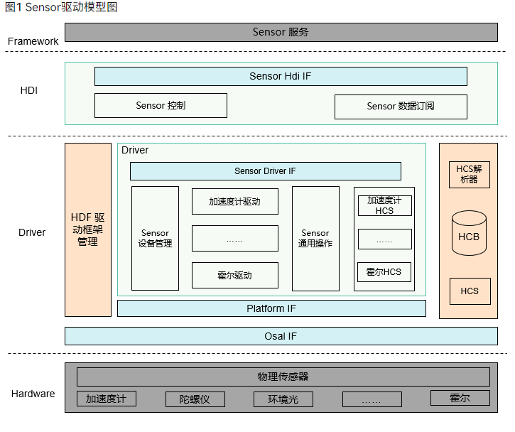

rk3568 支持accel sensor，整体的驱动框架openharmony 主线已经具备，只需要实现具体的器件驱动即可。

### mcx5566xa HDF驱动实现

RK3568平台支持加速度传感器，型号是MXC6655XA,具体配置可以查看该器件的datasheet。 移植HDF前，需要确认内核该sensor的编译使能是关闭的。

配置文件路径kernel/linux/config/linux-5.10/arch/arm64/configs/rk3568_standard_defconfig。

```c
# CONFIG_GS_MXC6655XA is not set
```

代码路径：

```c
drivers/framework/model/sensor/driver/chipset/accel/accel_mxc6655xa.c
drivers/framework/model/sensor/driver/chipset/accel/accel_mxc6655xa.h
```

编译宏

```c
CONFIG_DRIVERS_HDF_SENSOR_ACCEL_MXC6655XA=y
```

Mxc6655xa 加速度计驱动入口函数实现

```c
struct HdfDriverEntry g_accelMxc6655xaDevEntry = {
    .moduleVersion = 1,
    .moduleName = "HDF_SENSOR_ACCEL_MXC6655XA",
    .Bind = Mxc6655xaBindDriver,
    .Init = Mxc6655xaInitDriver,
    .Release = Mxc6655xaReleaseDriver,
};

HDF_INIT(g_accelMxc6655xaDevEntry);
```

接下来就是差异化适配函数。

```c
struct AccelOpsCall {
int32_t (*Init)(struct SensorCfgData *data);
int32_t (*ReadData)(struct SensorCfgData *data);
};
```

获取x, y, z三轴数据接口。

```c
int32_t ReadMxc6655xaData(struct SensorCfgData *cfg, struct SensorReportEvent *event)
{
    int32_t ret;
    struct AccelData rawData = { 0, 0, 0 };
    static int32_t tmp[ACCEL_AXIS_NUM];

    CHECK_NULL_PTR_RETURN_VALUE(cfg, HDF_ERR_INVALID_PARAM);
    CHECK_NULL_PTR_RETURN_VALUE(event, HDF_ERR_INVALID_PARAM);

    ret = ReadMxc6655xaRawData(cfg, &rawData, &event->timestamp);
    if (ret != HDF_SUCCESS) {
        HDF_LOGE("%s: MXC6655XA read raw data failed", __func__);
        return HDF_FAILURE;
    }

    event->sensorId = SENSOR_TAG_ACCELEROMETER;
    event->option = 0;
    event->mode = SENSOR_WORK_MODE_REALTIME;

    rawData.x = rawData.x * MXC6655XA_ACC_SENSITIVITY_2G;
    rawData.y = rawData.y * MXC6655XA_ACC_SENSITIVITY_2G;
    rawData.z = rawData.z * MXC6655XA_ACC_SENSITIVITY_2G;

    tmp[ACCEL_X_AXIS] = (rawData.x * SENSOR_CONVERT_UNIT) / SENSOR_CONVERT_UNIT;
    tmp[ACCEL_Y_AXIS] = (rawData.y * SENSOR_CONVERT_UNIT) / SENSOR_CONVERT_UNIT;
    tmp[ACCEL_Z_AXIS] = (rawData.z * SENSOR_CONVERT_UNIT) / SENSOR_CONVERT_UNIT;

    ret = SensorRawDataToRemapData(cfg->direction, tmp, sizeof(tmp) / sizeof(tmp[0]));
    if (ret != HDF_SUCCESS) {
        HDF_LOGE("%s: MXC6655XA convert raw data failed", __func__);
        return HDF_FAILURE;
    }

    event->dataLen = sizeof(tmp);
    event->data = (uint8_t *)&tmp;

    return ret;
}
```

初始化。

```c
static int32_t InitMxc6655xa(struct SensorCfgData *data)
{
    int32_t ret;

    CHECK_NULL_PTR_RETURN_VALUE(data, HDF_ERR_INVALID_PARAM);
    ret = SetSensorRegCfgArray(&data->busCfg, data->regCfgGroup[SENSOR_INIT_GROUP]);
    if (ret != HDF_SUCCESS) {
        HDF_LOGE("%s: MXC6655XA sensor init config failed", __func__);
        return HDF_FAILURE;
    }
    return HDF_SUCCESS;
}
```

### hcs配置

Mxc6655xa accel sensor 驱动HCS配置。

```c
device_sensor_mxc6655xa :: device {
    device0 :: deviceNode {
        policy = 1;
        priority = 120;
        preload = 0;
        permission = 0664;
        moduleName = "HDF_SENSOR_ACCEL_MXC6655XA";
        serviceName = "hdf_accel_mxc6655xa";
        deviceMatchAttr = "hdf_sensor_accel_mxc6655xa_driver";
    }
}
```

Mxc6655xa accel sensor 寄存器组配置信息。

```c
#include "../sensor_common.hcs"
root {
    accel_mxc6655xa_chip_config : sensorConfig {
        match_attr = "hdf_sensor_accel_mxc6655xa_driver";
        sensorInfo :: sensorDeviceInfo {
            sensorName = "accelerometer";
            vendorName = "memsi_mxc6655xa"; // max string length is 16 bytes.
            sensorTypeId = 1; // enum SensorTypeTag.
            sensorId = 1; // user define sensor id.
            power = 230;
        }
        sensorBusConfig :: sensorBusInfo {
            busType = 0; // 0:i2c 1:spi.
            busNum = 5;
            busAddr = 0x15;
            regWidth = 1; // 1byte.
        }
        sensorIdAttr :: sensorIdInfo {
            chipName = "mxc6655xa";
            chipIdRegister = 0x0f;
            chipIdValue = 0x05;
        }
        sensorDirection {
            direction = 5; // chip direction range of value:0-7.
            /* <sign> 1:negative  0:positive
               <map> 0:AXIS_X  1:AXIS_Y  2:AXIS_Z
            */
            /* sign[AXIS_X], sign[AXIS_Y], sign[AXIS_Z], map[AXIS_X], map[AXIS_Y], map[AXIS_Z] */
            convert = [
                0, 0, 0, 0, 1, 2,
                1, 0, 0, 1, 0, 2,
                0, 0, 1, 0, 1, 2,
                0, 1, 0, 1, 0, 2,
                1, 0, 1, 0, 1, 2,
                0, 0, 1, 1, 0, 2,
                0, 1, 1, 0, 1, 2,
                1, 1, 1, 1, 0, 2
            ];
        }
        sensorRegConfig {
            /*  regAddr: register address
                value: config register value
                len: size of value
                mask: mask of value
                delay: config register delay time (ms)
                opsType: enum SensorOpsType 0-none 1-read 2-write 3-read_check 4-update_bit
                calType: enum SensorBitCalType 0-none 1-set 2-revert 3-xor 4-left shift 5-right shift
                shiftNum: shift bits
                debug: 0-no debug 1-debug
                save: 0-no save 1-save
            */
            /* regAddr, value, mask, len, delay, opsType, calType, shiftNum, debug, save */
            initSeqConfig = [
                0x7e,    0xb6, 0xff,   1,     5,       2,       0,        0,     0,    0,
                0x7e,    0x10, 0xff,   1,     5,       2,       0,        0,     0,    0
            ];
            enableSeqConfig = [
                0x7e,    0x11, 0xff,   1,     5,       2,       0,        0,     0,    0,
                0x41,    0x03, 0xff,   1,     0,       2,       0,        0,     0,    0,
                0x40,    0x08, 0xff,   1,     0,       2,       0,        0,     0,    0
            ];
            disableSeqConfig = [
                0x7e,    0x10, 0xff,   1,     5,       2,       0,        0,     0,    0
            ];
        }
    }
}
```

### 测试

UT测试可以获取到sensor的三轴数据。

测试代码路径。

```c
drivers/peripheral/sensor/test/unittest/common/hdf_sensor_test.cpp
```

编译UT代码命令：

```c
./build.sh --product-name rk3568 --build-target hdf_test_sensor
```

将hdf_test_sensor.bin  push到system/bin目录，添加执行权限，执行

有如下结果代表sensor 测试成功。

```c
SensorTestDataCallback enter
sensor id :[1], data[1]: 0.001877
sensor id :[1], data[2]: 0.160823
sensor id :[1], data[3]: 0.046122
```

##    Vibrator

### vibrator 模型

Vibrator驱动模型主要包含Vibrator（传感器）相关的HDI接口与实现，提供Vibrator HDI（Hardware Driver Interface）能力接口，支持静态HCS配置的时间序列和动态配置持续时间两种振动效果。调用StartOnce接口动态配置持续振动时间；调用StartEffect接口启动静态配置的振动效果。

**图 1** Vibrator驱动模型图

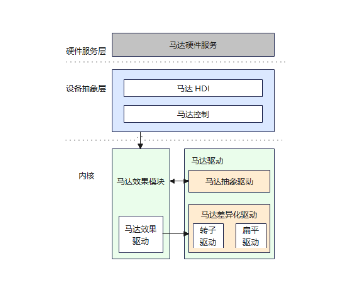

rk3568 支持线性马达，整体的驱动框架openharmony 主线已经具备，只需要实现具体的器件驱动即可。

### HDF驱动实现

代码路径：

```c
drivers/framework/model/misc/vibrator/driver/chipset/vibrator_linear_driver.c
```

linear Vibrator加速度计驱动入口函数实现

```c
struct HdfDriverEntry g_linearVibratorDriverEntry = {
    .moduleVersion = 1,
    .moduleName = "HDF_LINEAR_VIBRATOR",
    .Bind = BindLinearVibratorDriver,
    .Init = InitLinearVibratorDriver,
    .Release = ReleaseLinearVibratorDriver,
};

HDF_INIT(g_linearVibratorDriverEntry);
```

### hcs配置

驱动hcs配置。

```c
        vibrator :: host {
            hostName = "vibrator_host";
            device_vibrator :: device {
                device0 :: deviceNode {
                    policy = 2;
                    priority = 100;
                    preload = 0;
                    permission = 0664;
                    moduleName = "HDF_VIBRATOR";
                    serviceName = "hdf_misc_vibrator";
                    deviceMatchAttr = "hdf_vibrator_driver";
                }
            }
            device_linear_vibrator :: device {
                device0 :: deviceNode {
                    policy = 1;
                    priority = 105;
                    preload = 0;
                    permission = 0664;
                    moduleName = "HDF_LINEAR_VIBRATOR";
                    serviceName = "hdf_misc_linear_vibrator";
                    deviceMatchAttr = "hdf_linear_vibrator_driver";
                }
            }
        }
```

线性马达器件hcs配置。

```c
root {
    linearVibratorConfig {
        boardConfig {
            match_attr = "hdf_linear_vibrator_driver";
            vibratorChipConfig {
                busType = 1; // 0:i2c 1:gpio.
                gpioNum = 154;
                startReg = 0;
                stopReg = 0;
                startMask = 0;
            }
        }
    }
}
```

### UT测试

测试代码路径。

```c
drivers/peripheral/misc/vibrator/test/unittest/common/hdf_vibrator_test.cpp
```

编译UT代码命令。

```c
./build.sh --product-name rk3568 --build-target hdf_test_vibrator
```

将hdf_test_vibrator.bin  push到system/bin目录，添加执行权限，执行

```
[ RUN ] HdfVibratorTest.CheckVibratorInstanceIsEmpty
[ OK ] HdfVibratorTest.CheckVibratorInstanceIsEmpty (0 ms)
[ RUN ] HdfVibratorTest.PerformOneShotVibratorDuration001
[ OK ] HdfVibratorTest.PerformOneShotVibratorDuration001 (2001 ms)
[ RUN ] HdfVibratorTest.ExecuteVibratorEffect001
[ OK ] HdfVibratorTest.ExecuteVibratorEffect001 (5001 ms)
```

