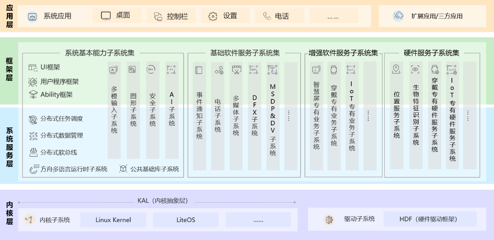
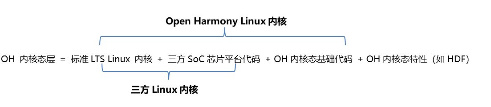

# 一种快速移植OpenHarmony Linux内核的方法


## 移植概述


本文面向希望将OpenHarmony移植到三方芯片平台硬件的开发者，介绍一种借助三方芯片平台自带Linux内核的现有能力，快速移植OpenHarmony到三方芯片平台的方法。


## 移植到三方芯片平台的整体思路


### 内核态层和用户态层

为了更好的解释整个内核移植，首先需要介绍一些概念：

我们可以把OpenHarmony简单的分为

OpenHarmony = OpenHarmony内核态层 + OpenHarmony用户态层。



其中OpenHarmony内核层就是上图的紫色部分，可以看到，它主要由内核本身（如Linux Kernel，LiteOS），和一些运行在内核态的一些特性组成，比如HDF等。

而OpenHarmony用户态层，在上图，就是紫色之外的部分。可以看到，由下往上看，它主要由系统服务层，框架层，应用层组成。在这儿我们将这三层整体称为“OpenHarmony用户态层”。

为什么这么区分呢？因为我们这篇文章主要是要讨论如何快速的把OpenHarmony移植到三方芯片平台上。而OpenHarmony的用户态层，整体来说和三方芯片平台的耦合度不高，移植较为方便。而内核态层中的内核本身以及HDF驱动框架等，和三方芯片平台的耦合度较高，是移植的重难点。我们先做这个区分，就是为了先把聚光灯打到我们最需要关注的OpenHarmony内核态层上，开始分析和解题。另外说明，本文只包含Linux内核的快速移植，不包含LiteOS的移植。


### 获得内核态层的两种方法

为了表述方便，我们在下文部分地方用“OH”代替“OpenHarmony”。

将OH内核态层继续分解。

OH内核态层 = OH Linux内核 + OH内核态特性（可选特性或者必选特性，如必选特性HDF，今后的可选特性HMDFS等）。

而OH Linux内核 = 标准LTS Linux 内核 + 三方SoC芯片平台代码 + OH内核态基础代码（支撑OH用户态层运行的最基础代码）。

因此OH内核态层 = 标准LTS Linux 内核 + 三方SoC芯片平台代码 + OH内核态基础代码 + OH内核态特性（如HDF）。



而将前两项组合，标准LTS Linux 内核 + 三方SoC芯片平台代码，其实就是一个三方Linux内核的基础组成。从上面的推导可以看出，OpenHarmony 内核态层其实能够由两种方法得到：

方法一：OH 内核态层 = 三方Linux内核 + OH内核态基础代码 + OH内核态特性（如HDF，今后的HMDFS等）。

也就是直接借助三方Linux内核，再加上基础OH内核态基础代码、以及HDF等OH内核态特性。

方法二：OH 内核态层 = OH Linux内核 + OH内核态特性（如HDF，今后的HMDFS等）。

也就是直接采用OHLinux内核，然后再加入OH的其他内核态特性。

当前方法二中OHLinux内核支持的三方芯片平台还不够丰富。为了能够响应三方开发者快速移植OpenHarmony的要求，下文会着重介绍方法一，即借助三方已有的Linux内核，来快速移植OpenHarmony。


### **借助已有Linux内核来移植OpenHarmony的流程**


整个移植流程可以分为三步：


1. 准备整体构建环境，包括将三方芯片平台的现有内核代码拷贝到OpenHarmony的整体编译环境下。

2. OpenHarmony内核态基础代码的移植。

3. OpenHarmony内核态必选特性（如HDF等）的移植。


详细步骤在接下来的章节中介绍。


## 移植到三方芯片平台的步骤

下面以树莓派3b (BCM2837) 为例，演示将OpenHarmony移植到树莓派的过程。


### 准备整体构建环境

1. 将三方内核纳入OpenHarmony编译环境。
   完整编译过一遍标准Hi3516DV300的内核之后，clone树莓派内核源码并复制到manifest输出目录下：

     
   ```
   export PROJ_ROOT=[OpenHarmony manifest]
   git clone https://gitee.com/xfan1024/oh-rpi3b-kernel.git
   cp -r oh-rpi3b-kernel $PROJ_ROOT/out/KERNEL_OBJ/kernel/src_tmp/linux-rpi3b
   ```

2. 配置树莓派内核编译环境。
     
   ```
   # 进入树莓派kernel目录
   cd out/KERNEL_OBJ/kernel/src_tmp/linux-rpi3b
   
   # 配置编译环境,使用工程项目自带的clang
   export PATH=$PROJ_ROOT/prebuilts/clang/ohos/linux-x86_64/llvm/bin:$PROJ_ROOT/prebuilts/gcc/linux-x86/arm/gcc-linaro-7.5.0-arm-linux-gnueabi/bin/:$PATH
   export MAKE_OPTIONS="ARCH=arm CROSS_COMPILE=arm-linux-gnueabi- CC=clang HOSTCC=clang"
   export PRODUCT_PATH=vendor/hisilicon/hispark_taurus_linux
   ```

3. 注释掉clang不识别的flag。
   PROJ_ROOT/out/KERNEL_OBJ/kernel/src_tmp/linux-rpi3b/arch/arm/Makefile注释掉以下这一行：

     
   ```
   KBUILD_CFLAGS  +=-fno-omit-frame-pointer -mapcs -mno-sched-prolog
   ```


### 移植内核态基础代码

目前OpenHarmony内核态的基础代码，主要是日志服务相关。轻量化内核日志服务代码包含：

  
```
drivers/staging/hilog
drivers/staging/hievent
```

将以上代码，从OpenHarmony内核代码目录kernel/linux/linux-4.19/drivers/staging中，拷贝到out/KERNEL_OBJ/kernel/src_tmp/linux-rpi3b/drivers/staging下。

在三方内核的drivers/staging/Kconfig文件内增加如下代码：

  
```
source "drivers/staging/hilog/Kconfig"
source "drivers/staging/hievent/Kconfig"
```

在三方内核的drivers/staging/Makefile文件内增加如下代码：
```
obj-$(CONFIG_HILOG)             += hilog/
obj-$(CONFIG_HIEVENT)           += hievent/
```

在内核config项中打开对应的CONFIG控制宏：CONFIG_HILOG和CONFIG_HIEVENT。

具体日志使用说明请参见：[Hilog_lite组件介绍](https://gitee.com/openharmony/hiviewdfx_hilog_lite/blob/master/README_zh.md)。


### 移植内核态必选特性HDF

1. 打HDF补丁。
   在Linux内核打HDF补丁时，执行补丁shell脚本合入HDF补丁。

   1. 配置HDF补丁脚本的四个变量参数。
   2. 获取patch_hdf.sh脚本。
   3. 执行patch_hdf.sh脚本依次传入四个变量参数。

   patch_hdf.sh脚本四个参数含义为：第一个入参为工程根目录路径，第二入参为内核目录路径，第三个入参为内核版本路径，第四个参数是当前设备名。

     
   ```
   ./patch_hdf.sh [工程根目录路径] [内核目录路径] [内核补丁路径] [设备名]
   ```

   以树莓派3b为示例介绍：

     
   ```
   # 进入树莓派kernel目录。
   PROJ_ROOT/drivers/hdf_core/adapter/khdf/linux/patch_hdf.sh \
   PROJ_ROOT  # 指定工程根目录路径 \
   PROJ_ROOT/out/KERNEL_OBJ/kernel/src_tmp/linux-rpi3b  # 打补丁的内核目录路径 \
   PROJ_ROOT/kernel/linux/patches/linux-4.19 # 内核补丁路径.\
   hi3516dv300 # 设备名.
   ```

2. 配置config。
   提供HDF基本配置，如果需要其他功能，通过menuconfig打开对应驱动开关即可。

   HDF补丁执行成功后，默认HDF开关是关闭的，打开HDF基本配置选项如下：

     
   ```
   CONFIG_DRIVERS_HDF=y
   CONFIG_HDF_SUPPORT_LEVEL=2
   CONFIG_DRIVERS_HDF_PLATFORM=y
   CONFIG_DRIVERS_HDF_PLATFORM_MIPI_DSI=y
   CONFIG_DRIVERS_HDF_PLATFORM_GPIO=y
   CONFIG_DRIVERS_HDF_PLATFORM_I2C=y
   CONFIG_DRIVERS_HDF_PLATFORM_UART=y
   CONFIG_DRIVERS_HDF_TEST=y
   ```

   或者通过menuconfig界面打开HDF相关配置，命令如下：

     
   ```
   # 生成 .config 配置文件。
   make ${MAKE_OPTIONS} rpi3b_oh_defconfig
   
   # 更改HDF内核配置。
   make ${MAKE_OPTIONS} menuconfig
   # [*] Device Drivers
   # [*]   HDF driver framework support --->
   ```

   配置如下（在Device Drivers -&gt; HDF driver framework support 目录下）：

   


### 编译Image

  
```
# 执行编译命令
make ${MAKE_OPTIONS} -j33 zImage
```


### 编译和运行HDF测试用例（可选）

**简介**

HDF（Hardware Driver Foundation)自测试用例，用于测试HDF框架和外设的基本功能，本文主要介绍HDF内核态用例测试方法。

**预置条件**

测试前需要在menuconfig里检查HDF测试开关CONFIG_DRIVERS_HDF_TEST=y，代码全量编译通过。

**用例编译和测试方法**

  通过[hdc_std工具](../subsystems/subsys-toolchain-hdc-guide.md)把用例执行文件推送到设备中，然后执行用例即可，操作步骤如下：
1. 编译hdf测试用例。

2. 用hdc_std工具推送测试文件到设备中。

3. 进入设备data/test目录，执行测试文件即可。

用例编译和测试详细步骤如下：

1. 编译hdf测试用例。
   编译hdf测试用例命令和文件路径如下：

     
   ```
   ./build.sh --product-name hispark_taurus_standard --build-target hdf_test
   ```

   等待编译完成。

2. 将测试文件移动到目标移植设备上（以树莓派为例）。
  
   方法一：使用[hdc_std工具](../subsystems/subsys-toolchain-hdc-guide.md)。

   1. 先在树莓派里新建data/test目录。
         
       ```
       mkdir -p data/test
       ```
   2. 推送依赖库和测试用例到树莓派。
         
       ```
       hdc file send XXX\out\{device_name}\hdf\hdf\libhdf_test_common.z.so  /system/lib
       hdc file send XXX\out\{device_name}\tests\unittest\hdf\config\hdf_adapter_uhdf_test_config  /data/test
       hdc file send XXX\out\{device_name}\tests\unittest\hdf\devmgr\DevMgrTest  /data/test
       hdc file send XXX\out\{device_name}\tests\unittest\hdf\osal\OsalTest  /data/test
       hdc file send XXX\out\{device_name}\tests\unittest\hdf\sbuf\SbufTest  /data/test
       ```

   方法二：移动到储存卡内，启动树莓派之后装载。

   1. 拔掉树莓派连接电脑的串口、USB线，然后拔下数据卡。
   2. 将数据卡插入到电脑的读取口，将编译好的zImage和测试文件夹test/下载到电脑，然后移动到数据卡的根目录下。zImage文件会被替换，请提前做好备份。
   3. 最后将数据卡插回树莓派。
         
       ```
       # 让树莓派文件系统读取储存卡根目录。
       mount -t vfat /dev/block/mmcblk0p1 /boot
       cd /boot/[测试文件目录]
       # 允许修改系统文件。
       mount -o remount,rw /
       # 安装测试用库。
       mv libhdf_test_common.z.so /system/lib
       mkdir /data/test
       mv * /data/test
       ```

3. 执行测试。
   1. 进入目录执行测试文件目录data/test。
         
       ```
       cd /data/test
       ```
   2. 修改文件执行权限。
         
       ```
       chmod 777 hdf_adapter_uhdf_test_config DevMgrTest OsalTest SbufTest
       ```
   3. 开始测试。
         
       ```
       ./hdf_adapter_uhdf_test_config
       ./DevMgrTest
       ./OsalTest
       ./SbufTest
       ```
   4. 如果所有测试文件输出均显示 PASSED，那么HDF功能即安装成功。
         示例：DevMgrTest用例成功结果显示：
         
       ```
       ./DevMgrTest
       Running main() from gmock_main.cc
       [==========] Running 1 test from 1 test case.
       [----------] Global test environment set-up.
       [----------] 1 test from DevMgrTest
       [ RUN      ] DevMgrTest.DriverLoaderTest_001
       [       OK ] DevMgrTest.DriverLoaderTest_001 (0 ms)
       [----------] 1 test from DevMgrTest (0 ms total)
       [----------] Global test environment tear-down
       Gtest xml output finished
       [==========] 1 test from 1 test case ran. (0 ms total)
       [  PASSED  ] 1 test.
       ```
