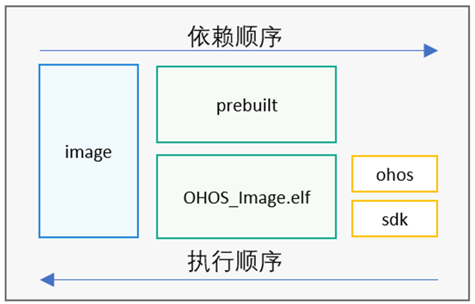

# 移植内核


## 移植芯片架构

芯片架构的移植是内核移植的基础，在OpenHarmony中芯片架构移植是可选过程，如果当前OpenHarmony已经支持对应芯片架构则不需要移植操作，在“liteos_m/arch”目录下可看到当前已经支持的架构，如表1：

  **表1** OpenHarmony已支持的架构

| **系列** | **型号** | 
| -------- | -------- |
| arm | arm9<br/>cortex-m3<br/>cortex-m4<br/>cortex-m7<br/>cortex-m33 | 
| csky | v2 | 
| risc-v | nuclei<br/>riscv32 | 
| xtensa | lx6 | 


如果当前OpenHarmony尚未支持对应芯片架构，则需要芯片厂商自行适配，arch/include目录包含了通用的芯片架构适配所需要实现的函数。部分芯片架构代码由汇编实现，而汇编代码会因编译器的不同而不同，因此在具体的芯片架构下，还包含使用不同编译器（iar、keil、gcc等）编译的架构代码。


  
```
kernel/liteos_m/arch          # 不同版本路径有差异。
├── arm                       # arm系列。
│   ├── arm9
│   ├── cortex-m3
│   ├── cortex-m33
│   │   ├── gcc               # 使用gcc编译器编译的架构代码。
│   │   └── iar               # 使用iar编译器编译的架构代码。
│   ├── cortex-m4
│   ├── cortex-m7
├── csky                      # csky系列。
├── include                   # 包含通用的芯片架构所需要实现的函数。
│   ├── los_arch.h            # 定义芯片架构初始化所需要的函数。
│   ├── los_atomic.h          # 定义芯片架构所需要实现的原子操作函数。
│   ├── los_context.h         # 定义芯片架构所需要实现的任务上下文相关函数。
│   ├── los_interrupt.h       # 定义芯片架构所需要实现的中断和异常相关的函数。
│   └── los_timer.h           # 定义芯片架构所需要实现的系统时钟相关的函数。
├── risc-v                    # risc-v系列。
│   ├── nuclei
│   └── riscv32
└── xtensa                    # xtensa系列。
     └── lx6
```


## 移植芯片厂商SDK

编译框架搭建完成后，需要将芯片厂商的SDK加入OpenHarmony编译框架，从而可以编译出带SDK的烧录文件（此时编译出的是不带系统的裸机工程），以便OpenHarmony可以调用SDK中的接口。通过以下步骤将厂商SDK加入OpenHarmony编译框架中：

1. 将芯片厂商sdk置于device目录下合适的位置，SDK的编译脚本/镜像打包脚本整合进编译框架中。
   参考编译脚本：“device/MyDeviceCompany/MyBoard/BUILD.gn”

     
   ```
   import("//build/lite/config/component/lite_component.gni")
    
   executable("OHOS_Image.elf") {    # 生成可执行程序。
     libs = [
       "xxx/xxx/libxxx.a",           # 链接厂商闭源静态库方法一。
     ]
     asmflags = [                    # 汇编编译参数。
       "",
     ]
     ldflags = [
       "-T./xxx/xxx/xxx.ld",         # 链接脚本文件。
       "-Lxxx/xxx/",                 # 指定厂商静态库路径。
       "-lxxx",                      # 链接厂商闭源静态库方法二。
       "-Wl,--whole-archive",
       "-lmodule_xxx",
       "-Wl,--no-whole-archive",
     ]
     deps = [
       "//build/lite:ohos",          # 依赖OpenHarmony静态库编译完成，链接OpenHarmony编译出来的静态库。
       ":sdk",                       # 依赖厂商源码静态库编译完成，链接厂商源码生成的静态库。
     ]
   }
    
   copy("prebuilt") {                # 准备镜像生成工具等，一般把镜像生成工具拷贝到out目录。
     sources = [ ]                   # 复制的源文件。
     outputs = [ ]                   # 复制的目标文件。
   }
   static_library("sdk") {
     sources = [ ]                   # 添加厂商源码编译成静态库。
     include_dirs = [ ]              # 厂商源码包含头文件路径。
   }
   build_ext_component("image") {    # 调用shell命令，生成可烧写镜像文件 。                            
     exec_path = rebase_path(root_out_dir)   #指定shell命令执行目录。
     objcopy = "arm-none-eabi-objcopy"
     objdump = "arm-none-eabi-objdump"
     command = "$objcopy -O binary OHOS_Image.elf OHOS_Image.bin" 
     command += " && sh -c '$objdump -t OHOS_Image.elf | sort > OHOS_Image.sym.sorted'" 
     command += " && sh -c '$objdump -d OHOS_Image.elf > OHOS_Image.asm'"                  
     deps = [
       ":prebuilt",                  # 无需准备镜像生成工具等可以删除此依赖。
       ":OHOS_Image.elf",            # 依赖elf文件的生成。
     ]
   }
   group("MyBoard") {                # MyBoard与当前路径名称一致。
   }
   ```

     **图1** 目标的依赖执行顺序  
   

1. 自定义芯片厂“target_config.h”文件。
   厂商应在“device/MyDeviceCompany/MyBoard”下合适位置创建内核配置文件“target_config.h”，并根据芯片的硬件资源修改参数（具体参数介绍详见表2target_config.h文件主要配置项）。

   参考文件路径：“device/hisilicon/hispark_pegasus/sdk_liteos/platform/os/Huawei_LiteOS/targets/hi3861v100/include/target_config.h”

   >  **说明：**
   > 1. 若已有的配置项不能满足需求，可查看“kernel/liteos_m/kernel/include/los_config.h”，其为liteos_m内核的全量配置文件。
   > 
   > 2. “target_config.h”文件中出现的配置将会覆盖“los_config.h”中的配置。

     **表2** target_config.h文件主要配置项
   
   | 配置项 | 说明 | 参考值 | 
   | -------- | -------- | -------- |
   | OS_SYS_CLOCK | 系统时钟。 | 40000000UL | 
   | LOSCFG_BASE_CORE_TICK_PER_SECOND | 操作系统节拍的时钟周期。 | 100UL | 
   | LOSCFG_BASE_CORE_TICK_HW_TIME | 定时器裁剪的外部配置项。 | YES | 
   | LOSCFG_PLATFORM_HWI | 是否采用接管中断的方式。 | YES | 
   | LOSCFG_BASE_CORE_TSK_LIMIT | 支持的最大任务个数（除去空闲任务）。 | 32 | 
   | LOSCFG_BASE_CORE_TSK_IDLE_STACK_SIZE | 空闲任务的堆栈大小。 | 0x180UL | 
   | LOSCFG_BASE_CORE_TSK_DEFAULT_STACK_SIZE | 指定默认的任务栈大小，任务栈的大小按&nbsp;8&nbsp;字节大小对齐。 | 0x1000UL | 
   | LOSCFG_BASE_CORE_TSK_MIN_STACK_SIZE | 表示任务最小需要的堆栈大小。 | ALIGN(0x180,&nbsp;4) | 
   | LOSCFG_BASE_CORE_TIMESLICE_TIMEOUT | 具有相同优先级任务的最长执行时间。 | 2 | 
   | LOSCFG_BASE_IPC_SEM_LIMIT | 最大支持信号量的个数。 | 100 | 
   | LOSCFG_BASE_IPC_MUX_LIMIT | 最大支持互斥量的个数。 | 64 | 
   | LOSCFG_BASE_IPC_QUEUE_LIMIT | 最大支持消息队列量的个数。 | 64 | 
   | LOSCFG_BASE_CORE_SWTMR_LIMIT | 支持的最大软件定时器数量，而不是可用的软件定时器数量。 | 80 | 
   | LOSCFG_BASE_MEM_NODE_SIZE_CHECK | 配置内存节点大小检查。 | NO | 
   | LOSCFG_PLATFORM_EXC | 异常模块配置项。 | YES | 
   | LOSCFG_USE_SYSTEM_DEFINED_INTERRUPT | 是否使用OS默认的中断。 | NO | 

1. 修改内核中断。
   内核提供了两种中断修改方式：

   1. 使用厂商默认中断。

   将“target_config.h”中的宏"LOSCFG_USE_SYSTEM_DEFINED_INTERRUPT"置为NO (0)，但需要在xxx.s启动文件中作以下修改:

   - PendSV_Handler：厂商sdk自带中断入口函数，需要替换为OpenHarmony的接口HalPendSV;
   - SysTick_Handler：厂商sdk自带时钟中断入口函数，需要替换为OpenHarmony的接口OsTickHandler。

   1. 系统初始化时重定向中断。

   将“target_config.h”中的宏"LOSCFG_USE_SYSTEM_DEFINED_INTERRUPT"和"LOSCFG_PLATFORM_HWI"置为YES (1)。

   >  **说明：**
   > 重定向后的中断向量表g_hwiForm需要根据arch手册要求进行字节对齐，通常0x200字节对齐。


## 添加内核子系统

添加完内核子系统后，可以编译出带有系统的工程。通过以下步骤添加内核子系统：

1. 在“config.json”中添加内核子系统。
   路径：“vendor/MyVendorCompany/MyProduct/config.json”

     修改如下：
     
   ```
   {
     "subsystem": "kernel",          # 添加内核子系统
     "components": [
       { 
         "component": "liteos_m", "features":[""] 
       }
     ]
   },
   ```

2. 开启/关闭内核特性。
   轻量级系统的内核提供了一些特性，此步骤将指导如何查看、开启/关闭这些特性。

   内核特性：liteos_m提供了包括文件系统、backtrace在内的一系列内核特性开关。

   路径：“kernel/liteos_m/BUILD.gn”

     
   ```
   declare_args() {
     enable_ohos_kernel_liteos_m_cppsupport = true        # cpp支持。
     enable_ohos_kernel_liteos_m_cpup = true              # CPU占用率支持。
     enable_ohos_kernel_liteos_m_exchook = true           # 异常处理支持。
     enable_ohos_kernel_liteos_m_kal = true               # kal接口支持。
     enable_ohos_kernel_liteos_m_fs = true                # 文件系统支持。
     enable_ohos_kernel_liteos_m_backtrace = true         # backtrace支持。
   }
   group("kernel") {
   deps = [
       "components/bounds_checking_function:sec",
       "kernel:kernel",
       "utils:utils",
     ]
     if (enable_ohos_kernel_liteos_m_cppsupport == true) {
       deps += [ "components/cppsupport:cppsupport" ]     # 如果内核特性true，则会加入相应的代码进行编译。
     }
     ……
     if (enable_ohos_kernel_liteos_m_kal == true) {
       deps += [ "kal:kal" ]
     }
   }
   ```

   特性：可以选择cmsis接口或者posix接口支持。

   路径：“kernel/liteos_m/kal/BUILD.gn”

     
   ```
   declare_args() {
     enable_ohos_kernel_liteos_m_cmsis = true  # cmsis支持。
     enable_ohos_kernel_liteos_m_posix = true  # posix支持。
   }
   static_library("kal") {
     sources = [ "kal.c" ]
     if (enable_ohos_kernel_liteos_m_cmsis == true) {
       deps += [ "cmsis/" ]                    # 如果cmsis enable，加入cmsis目录编译。
     }
     if (enable_ohos_kernel_liteos_m_posix == true) {
       deps += [ "posix/" ]                    # 如果posix enable，加入posix目录编译。
     }
   }
   ```

   特性：可以选择fatfs支持。

   路径：“kernel/liteos_m/components/fs/BUILD.gn”

     
   ```
   declare_args() {
     enable_ohos_kernel_liteos_m_fatfs = true   # fatfs支持
   }
   group("fs") {
     deps = []
     if (enable_ohos_kernel_liteos_m_fatfs == true) {
       deps += [ "fatfs:fatfs" ] 
     }
   }
   ```

   >  **说明：**
   > 内核特性开关可以在具体产品模组中配置。例如关闭fs和cppsupport特性
   > 
   > “vendor/MyVendorCompany/MyProduct/config.json”
   > 
   >   
   > ```
   > "subsystem": "kernel",
   > "components": [
   >  { 
   >     "component": "liteos_m", 
   >     "features":["enable_ohos_kernel_liteos_m_fs = false",
   >     "enable_ohos_kernel_liteos_m_cppsupport = false"] 
   >   }
   > ]
   > }
   > ```
