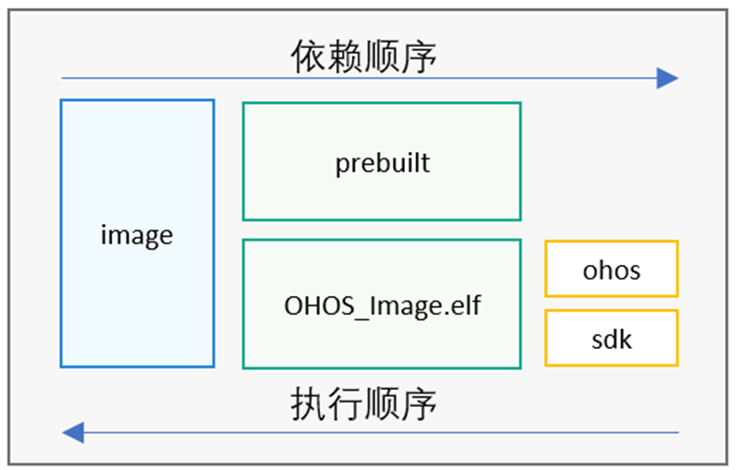

# 移植内核


## 移植芯片架构

芯片架构的移植是内核移植的基础，在OpenHarmony中芯片架构移植是可选过程，如果当前OpenHarmony已经支持对应芯片架构则不需要移植操作，在“liteos_m/arch”目录下可看到当前已经支持的架构，如表1：

  **表1** OpenHarmony已支持的架构

| **系列** | **型号** | 
| -------- | -------- |
| arm | arm9<br/>common<br/>cortex-m3<br/>cortex-m4<br/>cortex-m7<br/>cortex-m33<br/>cortex-m55 | 
| csky | common<br/>v2 | 
| risc-v | common<br/>nuclei<br/>riscv32 | 
| xtensa | common<br/>lx6 | 


如果当前OpenHarmony尚未支持对应芯片架构，则需要芯片厂商自行适配，arch/include目录包含了通用的芯片架构适配所需要实现的函数。部分芯片架构代码由汇编实现，而汇编代码会因编译器的不同而不同，因此在具体的芯片架构下，还包含使用不同编译器（iar、keil、gcc等）编译的架构代码。


  
```text
kernel/liteos_m/arch          # 不同版本路径有差异。
├── arm                       # arm系列。
│   ├── arm9
│   ├── common
│   ├── cortex-m3
│   ├── cortex-m4
│   │   ├── gcc               # 使用gcc编译器编译的架构代码。
│   │   ├── iar               # 使用iar编译器编译的架构代码。
│   │   └── keil              # 使用keil编译器编译的架构代码。
│   ├── cortex-m7
│   │   ├── gcc               # 使用gcc编译器编译的架构代码。
│   │   └── iar               # 使用iar编译器编译的架构代码。
│   ├── cortex-m33
│   │   ├── gcc               # 使用gcc编译器编译的架构代码。
│   │   └── iar               # 使用iar编译器编译的架构代码。
│   ├── cortex-m55
│   │    ├── gcc              # 使用gcc编译器编译的架构代码。
│   │    └── iar              # 使用iar编译器编译的架构代码。
│   └── include
├── csky                      # csky系列。
│   ├── common
│   └── v2
├── include                   # 包含通用的芯片架构所需要实现的函数。
│   ├── los_arch.h            # 定义芯片架构初始化所需要的函数。
│   ├── los_atomic.h          # 定义芯片架构所需要实现的原子操作函数。
│   ├── los_context.h         # 定义芯片架构所需要实现的任务上下文相关函数。
│   ├── los_interrupt.h       # 定义芯片架构所需要实现的中断和异常相关的函数。
│   ├── los_mpu.h             # 定义芯片架构所需要实现的内存保护相关的函数。
│   └── los_timer.h           # 定义芯片架构所需要实现的系统时钟相关的函数。
├── risc-v                    # risc-v系列。
│   ├── common
│   ├── nuclei
│   └── riscv32
└── xtensa                    # xtensa系列。
    ├── common
    └── lx6
```


## 移植芯片厂商SDK

编译框架搭建完成后，需要将芯片厂商的SDK加入OpenHarmony编译框架，从而可以编译出带SDK的烧录文件（此时编译出的是不带系统的裸机工程），以便OpenHarmony可以调用SDK中的接口。通过以下步骤将厂商SDK加入OpenHarmony编译框架中：

1. 将芯片厂商sdk置于device目录下合适的位置，SDK的编译脚本/镜像打包脚本整合进编译框架中。
   
   参考编译脚本：“device/board/MyDeviceCompany/MyBoard/BUILD.gn”

     
   ```gn
   group("MyBoard") {                # MyBoard与当前路径名称一致。
     deps = []
     if (ohos_kernel_type == "linux") {
       deps += [
         ......
       ]
     } else if (ohos_kernel_type == "liteos_a") {
       deps += [ 
         ......
       ]
     } else if (ohos_kernel_type == "liteos_m") {
       deps += [ 
         ......
       ]
     }
   }
   ```

     
   **图1** 目标的依赖执行顺序 

   

2. 自定义芯片厂“target_config.h”文件。

   厂商应在“device/board/MyDeviceCompany/MyBoard”下合适位置创建内核配置文件“target_config.h”，并根据芯片的硬件资源修改参数（具体参数介绍详见表2target_config.h文件主要配置项）。

   参考文件路径：“device/soc/hisilicon/hi3861v100/sdk_liteos/platform/os/Huawei_LiteOS/targets/hi3861v100/include/target_config.h”

   >  <b>说明：</b>
   >
   > 1. 若已有的配置项不能满足需求，可查看“kernel/liteos_m/kernel/include/los_config.h”，其为liteos_m内核的全量配置文件。
   > 2. “target_config.h”文件中出现的配置将会覆盖“los_config.h”中的配置。

     **表2** target_config.h文件主要配置项
   
   | 配置项 | 说明 | 参考值 | 
   | -------- | -------- | -------- |
   | OS_SYS_CLOCK | 系统时钟。 | 40000000UL | 
   | LOSCFG_BASE_CORE_TICK_PER_SECOND | 操作系统节拍的时钟周期。 | 100UL | 
   | LOSCFG_BASE_CORE_TICK_HW_TIME | 定时器裁剪的外部配置项。 | YES | 
   | LOSCFG_PLATFORM_HWI | 是否采用接管中断的方式。 | YES | 
   | LOSCFG_BASE_CORE_TSK_LIMIT | 支持的最大任务个数（除去空闲任务）。 | 32 | 
   | LOSCFG_BASE_CORE_TSK_IDLE_STACK_SIZE | 空闲任务的堆栈大小。 | 0x180UL | 
   | LOSCFG_BASE_CORE_TSK_DEFAULT_STACK_SIZE | 指定默认的任务栈大小，任务栈的大小按&nbsp;8&nbsp;字节大小对齐。 | 0x1000UL | 
   | LOSCFG_BASE_CORE_TSK_MIN_STACK_SIZE | 表示任务最小需要的堆栈大小。 | ALIGN(0x180,&nbsp;4) | 
   | LOSCFG_BASE_CORE_TIMESLICE_TIMEOUT | 具有相同优先级任务的最长执行时间。 | 2 | 
   | LOSCFG_BASE_IPC_SEM_LIMIT | 最大支持信号量的个数。 | 100 | 
   | LOSCFG_BASE_IPC_MUX_LIMIT | 最大支持互斥量的个数。 | 64 | 
   | LOSCFG_BASE_IPC_QUEUE_LIMIT | 最大支持消息队列量的个数。 | 64 | 
   | LOSCFG_BASE_CORE_SWTMR_LIMIT | 支持的最大软件定时器数量，而不是可用的软件定时器数量。 | 80 | 
   | LOSCFG_BASE_MEM_NODE_SIZE_CHECK | 配置内存节点大小检查。 | NO | 
   | LOSCFG_USE_SYSTEM_DEFINED_INTERRUPT | 是否使用OS默认的中断。 | NO | 

3. 修改内核中断。

   内核提供了两种中断修改方式：

   1. 使用厂商默认中断。

      将“target_config.h”中的宏"LOSCFG_USE_SYSTEM_DEFINED_INTERRUPT"置为NO (0)，但需要在xxx.s启动文件中作以下修改：

      - PendSV_Handler：厂商sdk自带中断入口函数，需要替换为OpenHarmony的接口HalPendSV；
      - SysTick_Handler：厂商sdk自带时钟中断入口函数，需要替换为OpenHarmony的接口OsTickHandler。

   2. 系统初始化时重定向中断。

      将“target_config.h”中的宏"LOSCFG_USE_SYSTEM_DEFINED_INTERRUPT"和"LOSCFG_PLATFORM_HWI"置为YES (1)。

      >  <b>说明：</b>
      > 重定向后的中断向量表g_hwiForm需要根据arch手册要求进行字节对齐，通常0x200字节对齐。


## 添加内核子系统

添加完内核子系统后，可以编译出带有系统的工程。通过以下步骤添加内核子系统：

1. 在“config.json”中添加内核子系统。

   路径：“vendor/MyVendorCompany/MyProduct/config.json”

     修改如下：
     
   ```json
   {
     "subsystem": "kernel",          # 添加内核子系统
     "components": [
       { 
         "component": "liteos_m", "features":[] 
       }
     ]
   },
   ```

2. 开启/关闭内核特性。

   轻量级系统的内核提供了一些特性，此步骤将指导如何查看、开启/关闭这些特性。

   内核特性：liteos_m提供了包括文件系统、backtrace在内的一系列内核特性开关。

   liteos_m内核通过Kconfig对内核特性进行统一配置。各组件BUILD.gn通过module_switch和kernel_module模板根据LOSCFG变量是否定义来决定是否参与编译。

   路径："kernel/liteos_m/Kconfig"

     
   ```kconfig
   menu "Kernel"

   config KERNEL_EXTKERNEL
       bool "Enable Extend Kernel"
       default y                            # 扩展内核总开关，以下特性均依赖此项。
       help
         This option will enable extend Kernel of LiteOS.  Extend kernel include
         cppsupport, cpup, etc. You can select one or some
         of them.

   config KERNEL_BACKTRACE
       bool "Enable Backtrace"
       default n                            # 默认关闭。
       depends on KERNEL_EXTKERNEL
       help
         If you wish to build LiteOS with support for backtrace.

   config KERNEL_CPPSUPPORT
       bool "Enable C++ Support"
       default n                            # 默认关闭。
       depends on KERNEL_EXTKERNEL
       help
         If you wish to build LiteOS with support for C++.

   config KERNEL_CPUP
       bool "Enable Cpup"
       default n                            # 默认关闭。
       depends on KERNEL_EXTKERNEL
       select BASE_CORE_CPUP
       help
         If you wish to build LiteOS with support for cpup.

   config PLATFORM_EXC
       bool "Enable Platform Exc Hook"
       default n                            # 默认关闭。
       depends on KERNEL_EXTKERNEL

   endmenu
   ```

   各组件BUILD.gn通过module_switch判断对应的LOSCFG变量是否定义，决定是否编译。以cppsupport为例：

   路径：“kernel/liteos_m/components/cppsupport/BUILD.gn”

     
   ```gn
   import("//kernel/liteos_m/liteos.gni")

   module_switch = defined(LOSCFG_KERNEL_CPPSUPPORT)    # 对应Kconfig中的KERNEL_CPPSUPPORT。
   module_name = get_path_info(rebase_path("."), "name")
   kernel_module(module_name) {
     sources = [ "los_cppsupport.c" ]
     configs += [ "$LITEOSTOPDIR:warn_config" ]
   }
   ```

   特性：可以选择cmsis接口或posix接口支持。

   路径："kernel/liteos_m/kal/cmsis/Kconfig"

     
   ```kconfig
   config KAL_CMSIS
       bool "Enable KAL CMSIS"
       default y                            # cmsis接口，默认开启。
       help
         Answer Y to enable LiteOS Kernel Abstraction Layer support CMSIS API.
   ```

   路径：“kernel/liteos_m/kal/posix/Kconfig”

     
   ```kconfig
   config POSIX_API
       bool "Enable POSIX API"
       default y                            # posix接口，默认开启。
       help
         Answer Y to enable LiteOS support POSIX API.

   if POSIX_API
   config POSIX_THREAD_API
       bool "Enable POSIX Thread API"
       default y                            # posix线程接口，默认开启。
       help
         Answer Y to enable LiteOS support POSIX Thread API.
   ......
   endif
   ```

   路径：“kernel/liteos_m/kal/cmsis/BUILD.gn”

     
   ```gn
   import("//kernel/liteos_m/liteos.gni")
   import("$THIRDPARTY_CMSIS_DIR/cmsis.gni")

   module_switch = defined(LOSCFG_KAL_CMSIS)     # 如果cmsis enable，加入cmsis目录编译。
   module_name = get_path_info(rebase_path("."), "name")
   kernel_module(module_name) {
     sources = [ "cmsis_liteos2.c" ]
     configs += [ "$LITEOSTOPDIR:warn_config" ]
   }

   config("public") {
     include_dirs = CMSIS_INCLUDE_DIRS + [ "." ]
   }
   ```

   路径：“kernel/liteos_m/kal/posix/BUILD.gn”

     
   ```gn
   import("//kernel/liteos_m/liteos.gni")

   module_switch = defined(LOSCFG_POSIX_API)     # 如果posix enable，加入posix目录编译。
   module_name = get_path_info(rebase_path("."), "name")
   kernel_module(module_name) {
     sources = [
       "src/errno.c",
       "src/libc.c",
       "src/map_error.c",
     ]
     configs += [ "$LITEOSTOPDIR:warn_config" ]
   }
   ......
   config("public") {
     include_dirs = [ "include" ]
   }
   ```

   特性：可以选择fatfs支持。

   路径：“kernel/liteos_m/components/fs/fatfs/Kconfig”

     
   ```kconfig
   config FS_FAT
       bool "Enable FAT"
       default n                            # fatfs，默认关闭。
       depends on FS_VFS
       select SUPPORT_FATFS
       help
         Answer Y to enable LiteOS support fat filesystem.
   ```

   组件BUILD.gn通过module_switch控制：

   路径：“kernel/liteos_m/components/fs/fatfs/BUILD.gn”

     
   ```gn
   import("//kernel/liteos_m/liteos.gni")
   import("$THIRDPARTY_FATFS_DIR/FatFs.gni")

   module_switch = defined(LOSCFG_FS_FAT)        # 如果fatfs enable，加入fatfs目录编译。
   module_name = get_path_info(rebase_path("."), "name")
   kernel_module(module_name) {
     configs += [ "$LITEOSTOPDIR:warn_config" ]
     sources = FATFS_SRC_FILES + [ "fatfs.c" ]
   }

   config("public") {
     include_dirs = FATFS_INCLUDE_DIRS + [ "." ]
   }
   ```

   内核特性开关在具体产品的目录下的kernel_configs配置文件实现。

   路径："vendor/MyVendorCompany/MyProduct/kernel_configs/debug.config"

     
   ```conf
   LOSCFG_KERNEL_CPPSUPPORT=y     # 启用C++支持。
   LOSCFG_KERNEL_BACKTRACE=y      # 启用backtrace支持。
   LOSCFG_KERNEL_CPUP=y           # 启用CPU占用率支持。
   LOSCFG_FS_LITTLEFS=y           # 启用littlefs文件系统。
   LOSCFG_NET_LWIP=y              # 启用lwip网络协议栈。
   LOSCFG_SHELL=y                 # 启用shell调试。
   ```

   >  <b>说明：</b>
   > 1. 内核特性开关通过修改"vendor/MyVendorCompany/MyProduct/kernel_configs/"目录下的.config文件配置。
   > 2. 更多Kconfig配置项可查看"kernel/liteos_m/Kconfig"及其子目录中的Kconfig文件。
