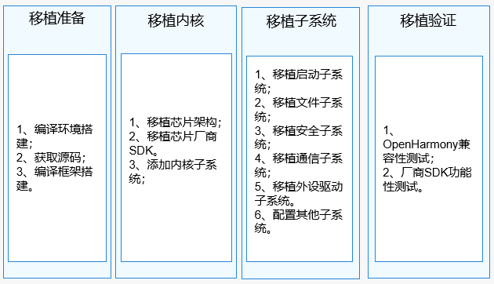

# 概述

本文档从芯片适配的端到端视角，为芯片/模组制造商提供基于OpenHarmony的芯片适配指导。典型的芯片架构，例如cortex-m、risc-v系列都可以按照本文档进行适配移植。

## 约束与限制

本文档适用于OpenHarmony LTS 3.0.1及之前版本的轻量系统的适配。

>  **说明：**
> 本文仅对OpenHarmony移植适配过程中需要关注的文件和配置项进行介绍，其他文件以及配置项开发者无需关注，故不作详细介绍。

## 适配流程

  主要开展基于伙伴硬件平台面向OpenHarmony系统的移植适配工作，具体细分为：移植准备、移植内核、移植子系统和移植验证四个环节，见表1芯片适配步骤。

  **表1** 芯片适配步骤

| 步骤 | 介绍 | 
| -------- | -------- |
| 移植准备 | 从OpenHarmony开源社区下载代码，并完成编译环境搭建，基于此初步熟悉和了解OpenHarmony的编译构建框架。 | 
| 移植内核 | 将伙伴的SDK移植到OpenHarmony平台，同时根据芯片arch支持情况确认是否需要开展arch的适配工作。 | 
| 移植子系统 | 开展包括启动子系统、文件子系统、安全子系统、通信子系统和外设驱动的移植。 | 
| 移植验证 | 在适配完成之后使用OpenHarmony社区提供的兼容性测试套件对适配的工程进行基本接口的测试验证，同时伙伴需要使用自有测试能力对适配工程开展质量验证活动。 | 

  **图1** 业务总体流程 

  

## 基本概念

  **表2** 基本概念

| 名词 | 介绍 | 
| -------- | -------- |
| 子系统 | 是一个逻辑概念，它由一个或多个具体的部件组成。OpenHarmony整体遵从分层设计，从下向上依次为：内核层、系统服务层、框架层和应用层。系统功能按照“系统&nbsp;&gt;&nbsp;子系统&nbsp;&gt;&nbsp;部件”逐级展开，在多设备部署场景下，支持根据实际需求裁剪某些非必要的子系统或部件。 | 
| 部件 | 系统最小的可复用、可配置、可裁剪的功能单元。部件具备目录独立可并行开发、可独立编译、可独立测试的特征。 | 
| hb | OpenHarmony的命令行工具，用来执行编译命令。 | 
| kv | 键值对(key-value)，描述数据存储的格式。 | 
