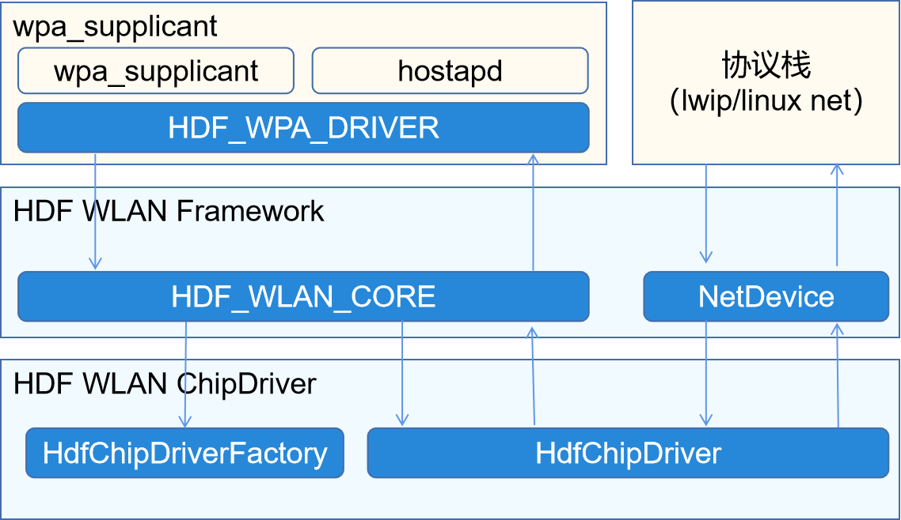

# 器件驱动移植


本章节讲解如何移植各类器件驱动。


## LCD驱动移植

移植LCD驱动的主要工作是编写一个驱动，在驱动中生成模型的实例，并完成注册。

这些LCD的驱动被放置在源码目录`//drivers/hdf_core/framework/model/display/driver/panel`中。

1. 创建Panel驱动

   创建HDF驱动，在驱动初始化中调用RegisterPanel接口注册模型实例。如:

   
   ```
   int32_t LCDxxEntryInit(struct HdfDeviceObject *object)
   {
       struct PanelData *panel = CreateYourPanel();
       // 注册模型实例
       if (RegisterPanel(panel) != HDF_SUCCESS) {
           HDF_LOGE("%s: RegisterPanel failed", __func__);
           return HDF_FAILURE;
       }
       return HDF_SUCCESS;
   }
   
   struct HdfDriverEntry g_xxxxDevEntry = {
       .moduleVersion = 1,
       .moduleName = "LCD_XXXX",
       .Init = LCDxxEntryInit,
   };
   
   HDF_INIT(g_xxxxDevEntry);
   ```

2. 配置加载panel驱动

   产品的所有设备信息被定义在源码文件`//vendor/vendor_name/product_name/config/device_info/device_info.hcs`中。修改该文件，在display的host中，名为device_lcd的device中增加配置。

   >  **注意：**
   > moduleName 要与panel驱动中的moduleName相同。

   
   ```
   root {
       ...
       display :: host {
           device_lcd :: device {
                   deviceN :: deviceNode {
                       policy = 0;
                       priority = 100;
                       preload = 2;
                       moduleName = "LCD_XXXX";
                   }
           }
       }
   }
   ```


## TP驱动移植

本节描述如何移植触摸屏驱动。触摸屏的器件驱动被放置在源码目录`//drivers/hdf_core/framework/model/input/driver/touchscreen`中。 移植触摸屏驱动主要工作是向系统注册ChipDevice模型实例。

详细的驱动开发指导，请参考 [TOUCHSCREEN开发指导](../driver/driver-peripherals-touch-des.md)。

1. 创建触摸屏器件驱动

   在上述touchscreen目录中创建名为`touch_ic_name.c`的文件。编写如下内容

   
   ```
   #include "hdf_touch.h"
   
   static int32_t HdfXXXXChipInit(struct HdfDeviceObject *device)
   {
       ChipDevice *tpImpl = CreateXXXXTpImpl();
       if(RegisterChipDevice(tpImpl) != HDF_SUCCESS) { // 注册ChipDevice模型
           ReleaseXXXXTpImpl(tpImpl);
           return HDF_FAILURE;
       }
       return HDF_SUCCESS;
   }
   
   struct HdfDriverEntry g_touchXXXXChipEntry = {
       .moduleVersion = 1,
       .moduleName = "HDF_TOUCH_XXXX", // 注意这里的moduleName要与后续的配置完全一致
       .Init = HdfXXXXChipInit,
   };
   
   HDF_INIT(g_touchXXXXChipEntry);
   ```

   其中ChipDevice中要实现如下方法：

     | 方法 | 实现说明 | 
   | -------- | -------- |
   | int32_t&nbsp;(\*Init)(ChipDevice&nbsp;\*device) | 实现器件初始化 | 
   | int32_t&nbsp;(\*Detect)(ChipDevice&nbsp;\*device) | 实现器件探测 | 
   | int32_t&nbsp;(\*Suspend)(ChipDevice&nbsp;\*device) | 实现器件休眠 | 
   | int32_t&nbsp;(\*Resume)(ChipDevice&nbsp;\*device) | 实现器件唤醒 | 
   | int32_t&nbsp;(\*DataHandle)(ChipDevice&nbsp;\*device) | 需要实现从器件读取数据，将触摸点数据填写入device-&gt;driver-&gt;frameData中 | 
   | int32_t&nbsp;(\*UpdateFirmware)(ChipDevice&nbsp;\*device) | 实现固件升级 | 

2. 配置产品，加载器件驱动

   产品的所有设备信息被定义在源码文件`//vendor/vendor_name/product_name/config/device_info/device_info.hcs`中。修改该文件，在名为input的host中，名为device_touch_chip的device中增加配置。

   >  **说明：**
   > moduleName 要与触摸屏驱动中的moduleName相同。

   
   ```
   deviceN :: deviceNode {
       policy = 0;
       priority = 130;
       preload = 0;
       permission = 0660;
       moduleName = "HDF_TOUCH_XXXX";
       deviceMatchAttr = "touch_XXXX_configs";
   }
   ```


## WLAN驱动移植

WLAN驱动分为两部分，一部分负责管理WLAN设备，另一个部分负责处理WLAN流量。

  **图1** OpenHarmony WLAN结构示意图

  

如图1，左半部分负责管理WLAN设备，右半部分负责WLAN流量。HDF WLAN分别为这两部分做了抽象，驱动的移植过程可以看做分别实现这两部分所需接口。这些接口有：

| 接口 | 定义头文件 | 接口说明 |
| -------- | -------- | -------- |
| HdfChipDriverFactory | drivers\hdf_core\framework\include\wifi\hdf_wlan_chipdriver_manager.h | ChipDriver的Factory，用于支持一个芯片多个WLAN端口 |
| HdfChipDriver | drivers\hdf_core\framework\include\wifi\wifi_module.h | 每个WLAN端口对应一个HdfChipDriver，用来管理一个特定端口 |
| NetDeviceInterFace | drivers\hdf_core\framework\include\wifi\net_device.h | 与协议栈之间的接口，如发送数据、设置网络接口状态等 |

>  **说明：**
> 详细的接口开发指导，请参考[WLAN开发](../driver/driver-peripherals-external-des.md)。

具体的移植步骤如下：

1. 创建HDF WLAN芯片驱动

   在目录`/device/vendor_name/peripheral/wifi/chip_name/`创建文件`hdf_wlan_chip_name.c`。内容模板如下：

   
   ```
   static int32_t HdfWlanXXXChipDriverInit(struct HdfDeviceObject *device) {
       static struct HdfChipDriverFactory factory = CreateChipDriverFactory(); // 需要移植者实现的方法
       struct HdfChipDriverManager *driverMgr = HdfWlanGetChipDriverMgr();
       if (driverMgr->RegChipDriver(&factory) != HDF_SUCCESS) { // 注册驱动工厂
           HDF_LOGE("%s fail: driverMgr is NULL!", __func__);
           return HDF_FAILURE;
       }
       return HDF_SUCCESS;
   }
   
   struct HdfDriverEntry g_hdfXXXChipEntry = {
       .moduleVersion = 1,
       .Init = HdfWlanXXXChipDriverInit,
       .Release = HdfWlanXXXChipRelease,
       .moduleName = "HDF_WIFI_CHIP_XXX" // 注意：这个名字要与配置一致
   };
   
   HDF_INIT(g_hdfXXXChipEntry);
   ```

   在上述代码的CreateChipDriverFactory方法中，需要创建一个HdfChipDriverFactory类型的对象。该对象提供如下方法：

     | 接口 | 说明 | 
   | -------- | -------- |
   | const&nbsp;char&nbsp;\*driverName | 当前driverName | 
   | int32_t&nbsp;(\*InitChip)(struct&nbsp;HdfWlanDevice&nbsp;\*device) | 初始化芯片 | 
   | int32_t&nbsp;(\*DeinitChip)(struct&nbsp;HdfWlanDevice&nbsp;\*device) | 去初始化芯片 | 
   | void&nbsp;(\*ReleaseFactory)(struct&nbsp;HdfChipDriverFactory&nbsp;\*factory) | 释放HdfChipDriverFactory对象 | 
   | struct&nbsp;HdfChipDriver&nbsp;\*(\*Build)(struct&nbsp;HdfWlanDevice&nbsp;\*device,&nbsp;uint8_t&nbsp;ifIndex) | 创建一个HdfChipDriver；输入参数中，device是设备信息，ifIndex是当前创建的接口在这个芯片中的序号 | 
   | void&nbsp;(\*Release)(struct&nbsp;HdfChipDriver&nbsp;\*chipDriver) | 释放chipDriver | 
   | uint8_t&nbsp;(\*GetMaxIFCount)(struct&nbsp;HdfChipDriverFactory&nbsp;\*factory) | 获取当前芯片支持的最大接口数 | 

   其中Build方法负责创建一个管理指定网络接口的对象HdfChipDriver。该对象需要提供方法：

     | 接口 | 说明 | 
   | -------- | -------- |
   | int32_t&nbsp;(\*init)(struct&nbsp;HdfChipDriver&nbsp;\*chipDriver,&nbsp;NetDevice&nbsp;\*netDev) | 初始化当前网络接口，这里需要向netDev提供接口NetDeviceInterFace | 
   | int32_t&nbsp;(\*deinit)(struct&nbsp;HdfChipDriver&nbsp;\*chipDriver,&nbsp;NetDevice&nbsp;\*netDev) | 去初始化当前网络接口 | 
   | struct&nbsp;HdfMac80211BaseOps&nbsp;\*ops | WLAN基础能力接口集 | 
   | struct&nbsp;HdfMac80211STAOps&nbsp;\*staOps | 支持STA模式所需的接口集 | 
   | struct&nbsp;HdfMac80211APOps&nbsp;\*apOps | 支持AP模式所需要的接口集 | 

2. 编写配置文件描述驱动支持的芯片

   在产品配置目录下创建芯片的配置文件，保存至源码路径`//vendor/vendor_name/product_name/config/wifi/wlan_chip_chip_name.hcs`

   该文件模板如下：

   
   ```
   root {
       wlan_config {
           chip_name :& chipList {
               chip_name :: chipInst {
                   match_attr = "hdf_wlan_chips_chip_name"; /* 这是配置匹配属性，用于提供驱动的配置根 */
                   driverName = "driverName"; /* 需要与HdfChipDriverFactory中的driverName相同*/
                   sdio {
                       vendorId = 0xXXXX; /* your vendor id */
                       deviceId = [0xXXXX]; /*your supported devices */
                   }
               }
           }
       }
   }
   ```

   >  **说明：**
   >
   > 路径和文件中的vendor_name、product_name、chip_name请替换成实际名称。
   > 
   > vendorId 和 deviceId需要根据实际芯片的识别码进行填写。

3. 编写配置文件，加载驱动

   产品的所有设备信息被定义在源码文件`//vendor/vendor_name/product_name/config/device_info/device_info.hcs`中。修改该文件，在名为network的host中，名为device_wlan_chips的device中增加配置。模板如下：

   
   ```
   deviceN :: deviceNode {
       policy = 0;
       preload = 2;
       moduleName = "HDF_WLAN_CHIPS";
       deviceMatchAttr = "hdf_wlan_chips_chip_name";
       serviceName = "driverName";
   }
   ```

   >  **说明：**
   > moduleName 要与HDF WLAN 芯片驱动中的moduleName相同。

4. 修改Kconfig文件，让移植的WLAN模组出现再内核配置中

   在`device/vendor_name/drivers/Kconfig`中增加配置菜单，模板如下

   
   ```
   config DRIVERS_HDF_WIFI_chip_name
       bool "Enable chip_name Host driver"
       default n
       depends on DRIVERS_HDF_WLAN   help
         Answer Y to enable chip_name Host driver.
   ```

   >  **说明：**
   > 请替换模板中的chip_name为实际的芯片名称。

5. 修改构建脚本，让驱动参与内核构建

   在源码文件`//device/vendor_name/drivers/lite.mk`末尾追加如下内容。

   
   ```
   ifeq ($(LOSCFG_DRIVERS_HDF_WIFI_chip_name), y)
       # 构建完成要链接一个叫hdf_wlan_chipdriver_chip_name的对象，建议按这个命名，防止冲突
       LITEOS_BASELIB += -lhdf_wlan_chipdriver_chip_name
       # 增加构建目录gpio
       LIB_SUBDIRS    += ../peripheral/wifi/chip_name
   endif
   ```

   >  **说明：**
   > 请替换模板中的chip_name为实际的芯片名称。
