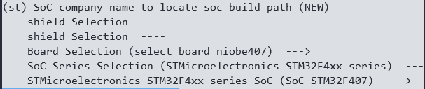

# 轻量系统STM32F407芯片移植案例

介绍基于`STM32F407IGT6`芯片在拓维信息[Niobe407](https://gitee.com/openharmony-sig/device_board_talkweb)开发板上移植OpenHarmony LiteOS-M轻量系统，提供交通、工业领域开发板解决方案。移植架构采用`Board`与`SoC`分离方案，使用`arm gcc`工具链`Newlib C`库，实现了`lwip`、`littlefs`、`hdf`等子系统及组件的适配，开发了配套应用示例代码，支持通过Kconfig图形化配置编译选项。

## 适配准备

- 下载[stm32cubemx](https://www.st.com/en/development-tools/stm32cubemx.html)图形工具。
- 准备ubuntu20.04系统环境，安装[arm-none-eabi-gcc](https://gitee.com/openharmony/device_board_talkweb/blob/master/niobe407/docs/software/%E5%BC%80%E5%8F%91%E7%8E%AF%E5%A2%83%E6%90%AD%E5%BB%BA%E4%B8%8E%E5%9B%BA%E4%BB%B6%E7%BC%96%E8%AF%91.md#6%E5%AE%89%E8%A3%85%E4%BA%A4%E5%8F%89%E7%BC%96%E8%AF%91%E5%B7%A5%E5%85%B7%E9%93%BE)交叉编译工具链。
### 生成可用工程

通过stm32cubemx工具生成`STM32F407IGT6`芯片的Makefile工程，在此给出如下配置建议：

- 系统相关配置采用默认配置。
- 时钟配置时将SYSCLK选项配置为168MHz，发挥芯片最强性能。
- 配置USART1用作调试串口，用来打印适配过程中的调试信息。
- 配置stm32cubemx工程选项时，将Toolchain/IDE选项选为Makefile。

生成的工程目录如下：

```
├── Core
│   ├── Inc
│   │    ├── main.h
│   │    ├── stm32f4xx_hal_conf.h
│   │    └── stm32f4xx_it.h
│   └── Src
│        ├── main.c                --- 主函数
│        ├── stm32f4xx_hal_msp.c   --- HAL库弱函数配置文件
│        ├── stm32f4xx_it.c        --- 中断回调函数文件
│        └── system_stm32f4xx.c    --- 系统
├── Drivers
│   ├── CMSIS                      --- CMSIS接口
│   └── STM32F4xx_HAL_Driver       --- HAL库驱动
├── Makefile                       --- Makefile编译
├── STM32F407IGTx_FLASH.ld         --- 链接文件
├── startup_stm32f407xx.s          --- 启动文件
└── stm32f407_output.ioc           --- stm32cubemx工程文件
```

### 验证生成的工程

将生成的工程拷贝至Ubuntu，进入工程目录下执行make命令编译，确定能够编译成功。

```
arm-none-eabi-gcc build/main.o build/stm32f4xx_it.o build/stm32f4xx_hal_msp.o build/stm32f4xx_hal_tim.o build/stm32f4xx_hal_tim_ex.o build/stm32f4xx_hal_uart.o build/stm32f4xx_hal_rcc.o build/stm32f4xx_hal_rcc_ex.o build/stm32f4xx_hal_flash.o build/stm32f4xx_hal_flash_ex.o build/stm32f4xx_hal_flash_ramfunc.o build/stm32f4xx_hal_gpio.o build/stm32f4xx_hal_dma_ex.o build/stm32f4xx_hal_dma.o build/stm32f4xx_hal_pwr.o build/stm32f4xx_hal_pwr_ex.o build/stm32f4xx_hal_cortex.o build/stm32f4xx_hal.o build/stm32f4xx_hal_exti.o build/system_stm32f4xx.o build/startup_stm32f407xx.o -mcpu=cortex-m4 -mthumb -mfpu=fpv4-sp-d16 -mfloat-abi=hard -specs=nano.specs -TSTM32F407IGTx_FLASH.ld  -lc -lm -lnosys  -Wl,-Map=build/stm32f407_output.map,--cref -Wl,--gc-sections -o build/stm32f407_output.elf
arm-none-eabi-size build/stm32f407_output.elf
   text    data     bss     dec     hex filename
   5000      20    1636    6656    1a00 build/stm32f407_output.elf
arm-none-eabi-objcopy -O ihex build/stm32f407_output.elf build/stm32f407_output.hex
arm-none-eabi-objcopy -O binary -S build/stm32f407_output.elf build/stm32f407_output.bin
```

编译完成会生成一个.bin文件，为了确认该程序能在开发板中成功运行，需要main函数中的串口初始化之后，通过串口输出一段字符串，运行时若收到打印信息，则开发板启动成功。
```
printf("hello world!!\r\n");
```

适配printf输出到串口，只需要重写_write函数即可，参考如下：

```c
#include <stdio.h>

int _write(int fd, char *ptr, int len)
{ 
      return HAL_UART_Transmit(&huart1, (uint8_t *)ptr, len, 0xFFFF); 
}
```
重新编译代码，将其烧录至开发板中验证。

## 编译构建
### 目录规划

芯片适配目录规划为：

```
device
├── board                                --- 单板厂商目录
│   └── talkweb                          --- 单板厂商名字：拓维信息
│       └── niobe407                     --- 单板名：与产品名一致
└── soc									 --- SoC厂商目录
    └── st                               --- SoC厂商名称
        └── stm32f4xx					 --- SoC Series名：stm32f4xx是一个系列，包含该系列soc相关代码
```

产品样例目录规划为：

```
vendor
└── talkweb							     --- 开发产品样例厂商目录
    └── niobe407         			     --- 产品名字：niobe407
```

获取[OpenHarmony源码](../get-code/sourcecode-acquire.md)，根据上述目录规划，创建相应文件夹。

### 预编译适配

预编译适配内容就是围绕`hb set`命令的适配，使工程能够通过该命令设置根目录、单板目录、产品目录、单板公司名等环境变量，为后续适配编译做准备。

具体的预编译适配步骤如下：

1. 在`vendor/talkweb/niobe407`目录下新增`config.json`文件，用于描述这个产品样例所使用的单板、内核等信息，描述信息可参考如下内容：

```
{
  "product_name": "niobe407",           --- 用于hb set进行选择时，显示的产品名称
  "type": "mini",                       --- 构建系统的类型，mini/small/standard
  "version": "3.0",                     --- 构建系统的版本，1.0/2.0/3.0
  "device_company": "talkweb",          --- 单板厂商名，用于编译时找到/device/board/talkweb目录
  "board": "niobe407",                  --- 单板名，用于编译时找到/device/board/talkweb/niobe407目录
  "kernel_type": "liteos_m",            --- 内核类型，因为OpenHarmony支持多内核，一块单板可能适配了多个内核，所以需要指定某个内核进行编译
  "kernel_version": "3.0.0",            --- 内核版本，一块单板可能适配了多个linux内核版本，所以需要指定某个具体的内核版本进行编译
  "subsystems": [ ]                     --- 选择所需要编译构建的子系统
}
```

2. 在`//device/board/talkweb/niobe407`目录下创建`board`目录，在创建的目录下新增一个`config.gni`文件，用于描述该产品的编译配置信息：

```
# Kernel type, e.g. "linux", "liteos_a", "liteos_m".
kernel_type = "liteos_m"                --- 内核类型，跟config.json中kernel_type对应

# Kernel version.
kernel_version = "3.0.0"                --- 内核版本，跟config.json中kernel_version对应
```

3. 验证`hb set`配置是否正确，输入`hb set`能够显示如下信息：

 

4. 通过`hb env`可以查看选择出来的预编译环境变量：

 

5. hb介绍

   `hb`是OpenHarmony为了方便开发者进行代码构建编译，提供的python脚本工具，其源码就在`//build/lite`仓库目录下。在执行`hb set`命令时，脚本会遍历`//vendor/<product_company>/<product_name>`目录下的`config.json`，给出可选产品编译选项。在config.json文件中，`product_name`表示产品名，`device_company`和`board`用于关联出`//device/board/<device_company>/<board>`目录，匹配该目录下的`<any_dir_name>/config.gni`文件，其中`<any_dir_name>`目录名可以是任意名称，但建议将其命名为适配内核名称（如：liteos_m、liteos_a、linux）。hb命令如果匹配到了多个`config.gni`，会将其中的`kernel_type`和`kernel_version`字段与`vendor/<device_company>`下`config.json`文件中的字段进行匹配，从而确定参与编译的`config.gni`文件。

至此，预编译适配完成，但工程还不能执行`hb build`进行编译，还需要准备好后续的`LiteOS-M`内核移植。

## 内核移植

内核移植需要完成`LiteOS-M Kconfig`适配、`gn`的编译构建和内核启动最小适配。

### Kconfig文件适配

1. 在`//vendor/talkweb/niobe407`目录下创建kernel_configs目录，并创建空文件，命名为debug.config。

2. 打开`//kernel/liteos_m/Kconfig`文件，可以看到在该文件通过orsource命令导入了`//device/board`和`//device/soc`下多个Kconfig文件，后续需要创建并修改这些文件：

```
orsource "../../device/board/*/Kconfig.liteos_m.shields"
orsource "../../device/board/$(BOARD_COMPANY)/Kconfig.liteos_m.defconfig.boards"
orsource "../../device/board/$(BOARD_COMPANY)/Kconfig.liteos_m.boards"
orsource "../../device/soc/*/Kconfig.liteos_m.defconfig"
orsource "../../device/soc/*/Kconfig.liteos_m.series"
orsource "../../device/soc/*/Kconfig.liteos_m.soc"
```

3. 在`//device/board/talkweb`下参考如下目录结构创建相应的Kconfig文件：

```
.
├── Kconfig.liteos_m.boards
├── Kconfig.liteos_m.defconfig.boards
├── Kconfig.liteos_m.shields
└── niobe407
    ├── Kconfig.liteos_m.board                --- 开发板配置选项
    ├── Kconfig.liteos_m.defconfig.board      --- 开发板默认配置选项
    └── liteos_m
        └── config.gni
```

4. 修改`Kconfig`文件内容：

   - 在`//device/board/talkweb/Kconfig.liteos_m.boards`文件中添加：

     ```
     if SOC_STM32F407
            orsource "niobe407/Kconfig.liteos_m.board"    --- 可根据SOC定义，加载指定board目录定义
     endif
     ```

   - 在`//device/board/talkweb/Kconfig.liteos_m.defconfig.boards`文件中添加：

     ```
     orsource "*/Kconfig.liteos_m.defconfig.board"
     ```

   - 在`//device/board/talkweb/Kconfig.liteos_m.defconfig.boards`文件中添加：

     ```
     orsource "shields/Kconfig.liteos_m.shields"
     ```

   - 在`//device/board/talkweb/niobe407/Kconfig.liteos_m.board`文件中添加：

     ```
     menuconfig BOARD_NIOBE407
         bool "select board niobe407"
         depends on SOC_STM32F407	 --- niobe407使用的是stm32f407的SoC，只有SoC被选择后，niobe407的配置选项才可见、可以被选择。
     ```

   - 在`//device/board/talkweb/niobe407/Kconfig.liteos_m.defconfig.board`中添加：

     ```
     if BOARD_NIOBE407
         							 --- 用于添加BOARD_NIOBE407默认配置
     endif #BOARD_NIOBE407
     ```

5. 在`//device/soc/st`下参考如下目录结构创建相应的Kconfig文件，并将`stm32cubemx`自动生成工程中的Drivers目录拷贝至`stm32f4xx/sdk`目录下：

   ```
   .
   ├── Kconfig.liteos_m.defconfig
   ├── Kconfig.liteos_m.series
   ├── Kconfig.liteos_m.soc
   └── stm32f4xx
       ├── Kconfig.liteos_m.defconfig.series
       ├── Kconfig.liteos_m.defconfig.stm32f4xx
       ├── Kconfig.liteos_m.series
       ├── Kconfig.liteos_m.soc
       └── sdk
           └── Drivers
               ├── CMSIS
               └── STM32F4xx_HAL_Driver
   ```

6. 修改Kconfig文件内容：

   - 在`//device/soc/st/Kconfig.liteos_m.defconfig`中添加：

     ```
     rsource "*/Kconfig.liteos_m.defconfig.series"
     ```

   - 在`//device/soc/st/Kconfig.liteos_m.series`中添加：

     ```
     rsource "*/Kconfig.liteos_m.series"
     ```

   - 在`//device/soc/st/Kconfig.liteos_m.soc`中添加：

     ```
     config SOC_COMPANY_STMICROELECTRONICS
         bool
     if SOC_COMPANY_STMICROELECTRONICS
     config SOC_COMPANY
         default "st"
     rsource "*/Kconfig.liteos_m.soc"
     endif # SOC_COMPANY_STMICROELECTRONICS
     ```

   - 在`//device/soc/st/stm32f4xx/Kconfig.liteos_m.defconfig.series`中添加：

     ```
     if SOC_SERIES_STM32F4xx
     rsource "Kconfig.liteos_m.defconfig.stm32f4xx"
     config SOC_SERIES
         string
         default "stm32f4xx"
     endif
     ```

   - 在`//device/soc/st/stm32f4xx/Kconfig.liteos_m.defconfig.stm32f4xx`中添加：

     ```
     config SOC
         string
         default "stm32f4xx"
         depends on SOC_STM32F4xx
     ```

   - 在`//device/soc/st/stm32f4xx/Kconfig.liteos_m.series`中添加：

     ```
     config SOC_SERIES_STM32F4xx
         bool "STMicroelectronics STM32F4xx series"
         select ARCH_ARM
         select SOC_COMPANY_STMICROELECTRONICS
         select CPU_CORTEX_M4
         help
             Enable support for STMicroelectronics STM32F4xx series
     ```

   - 在`//device/soc/st/stm32f4xx/Kconfig.liteos_m.soc`中添加：

     ```
     choice
         prompt "STMicroelectronics STM32F4xx series SoC"
         depends on SOC_SERIES_STM32F4xx
     config SOC_STM32F407
         bool "SoC STM32F407"
     endchoice
     ```

7. 在`kernel/liteos_m`目录下执行`make menuconfig`，使得能够对`SoC Series`进行选择：

    

   结果将自动保存在`$(PRODUCT_PATH)/kernel_configs/debug.config`，下次执行`make menuconfig`时会导出保存的结果。

### BUILD.gn文件适配

为了快速熟悉gn的编译和适配，建议先阅读 [LiteOS-M内核BUILD.gn编写指南](https://gitee.com/caoruihong/kernel_liteos_m/wikis/LiteOS-M%E5%86%85%E6%A0%B8BUILD.gn%E7%BC%96%E5%86%99%E6%8C%87%E5%8D%97)。

**(注意，BUILD.gn文件中不要出现tab字符，所有tab用空格代替)**

1. 在 `kernel/liteos_m/BUILD.gn` 中，可以看到，通过`deps`指定了`Board`和`SoC`的编译入口：

   ```
   deps += [ "//device/board/$device_company" ]            --- 对应//device/board/talkweb目录
   deps += [ "//device/soc/$LOSCFG_SOC_COMPANY" ]          --- 对应//device/soc/st目录
   ```

2. 在`//device/board/talkweb/BUILD.gn`中，新增内容如下：

   ```
   if (ohos_kernel_type == "liteos_m") {
       import("//kernel/liteos_m/liteos.gni")
       module_name = get_path_info(rebase_path("."), "name")
       module_group(module_name) {
          modules = [ "niobe407" ]
       }
   }
   ```

3. 在niobe407目录下创建BUILD.gn，为了方便管理，将目录名作为模块名：

   ```
   import("//kernel/liteos_m/liteos.gni")
   module_name = get_path_info(rebase_path("."), "name")
   module_group(module_name) {
       modules = [ 
       	"liteos_m",
       ]
   }
   ```

4. 将stm32cubemx生成的示例工程Core目录下的文件、`startup_stm32f407xx.s`启动文件和`STM32F407IGTx_FLASH.ld`链接文件拷贝至`//device/board/talkweb/niobe407/liteos_m/`目录下，并在该目录下创建`BUILD.gn`，添加如下内容：

   ```
   import("//kernel/liteos_m/liteos.gni")
   module_name = get_path_info(rebase_path("."), "name")
   kernel_module(module_name) {
       sources = [
           "startup_stm32f407xx.s",
           "Src/main.c",
           "Src/stm32f4xx_hal_msp.c",
           "Src/stm32f4xx_it.c",
           "Src/system_stm32f4xx.c",
       ]
       include_dirs = [ 
           "Inc",
       ]
   }
   
   config("public") {
       ldflags = [
           "-Wl,-T" + rebase_path("STM32F407IGTx_FLASH.ld"),
           "-Wl,-u_printf_float",
       ]
       libs = [
           "c",
           "m",
           "nosys",
       ]
   }
   ```

5. 在make menuconfig中配置`(Top) → Compat → Choose libc implementation`，选择`newlibc`。

6. 由于\_write函数会与kernel的文件操作函数重名，会导致编译失败。后续会换一种方法来适配printf函数，此处我们先将main.c文件中对_write函数的重写删除，将printf函数改用如下方式进行串口打印测试。

   ```
   uint8_t test[]={"hello niobe407!!\r\n"};
   int len = strlen(test);
   HAL_UART_Transmit(&huart1, (uint8_t *)test, len, 0xFFFF);
   ```

7. 同理`//device/soc/st/BUILD.gn`也是一样，按照目录结构层层依赖包含，最终在`//device/soc/st/stm32f4xx/sdk/BUILD.gn`中通过`kernel_module`模板中指定需要参与编译的文件及编译参数，参考如下：

   ```
   import("//kernel/liteos_m/liteos.gni")
   module_name = "stm32f4xx_sdk"
   kernel_module(module_name) {
     asmflags = board_asmflags
     sources = [
       "Drivers/STM32F4xx_HAL_Driver/Src/stm32f4xx_hal_rcc.c",
       "Drivers/STM32F4xx_HAL_Driver/Src/stm32f4xx_hal_rcc_ex.c",
       "Drivers/STM32F4xx_HAL_Driver/Src/stm32f4xx_hal_gpio.c",
       "Drivers/STM32F4xx_HAL_Driver/Src/stm32f4xx_hal_dma_ex.c",
       "Drivers/STM32F4xx_HAL_Driver/Src/stm32f4xx_hal_dma.c",
       "Drivers/STM32F4xx_HAL_Driver/Src/stm32f4xx_hal_cortex.c",
       "Drivers/STM32F4xx_HAL_Driver/Src/stm32f4xx_hal.c",
       "Drivers/STM32F4xx_HAL_Driver/Src/stm32f4xx_hal_exti.c",
       "Drivers/STM32F4xx_HAL_Driver/Src/stm32f4xx_hal_uart.c",
     ]
   }
   #指定全局头文件搜索路径
   config("public") {
       include_dirs = [
           "Drivers/STM32F4xx_HAL_Driver/Inc",
           "Drivers/CMSIS/Device/ST/STM32F4xx/Include",
       ]
   }
   ```

### config.gni文件适配

在预编译阶段，在`//device/board/talkweb/niobe407/liteos_m`目录下创建了一个config.gni文件，它其实就是gn脚本的头文件，可以理解为工程构建的全局配置文件。主要配置了CPU型号、交叉编译工具链及全局编译、链接参数等重要信息：

```
# Kernel type, e.g. "linux", "liteos_a", "liteos_m".
kernel_type = "liteos_m"

# Kernel version.
kernel_version = "3.0.0"

# Board CPU type, e.g. "cortex-a7", "riscv32".
board_cpu = "cortex-m4"

# Board arch, e.g.  "armv7-a", "rv32imac".
board_arch = ""

# Toolchain name used for system compiling.
# E.g. gcc-arm-none-eabi, arm-linux-harmonyeabi-gcc, ohos-clang,  riscv32-unknown-elf.
# Note: The default toolchain is "ohos-clang". It's not mandatory if you use the default toolchain.
board_toolchain = "arm-none-eabi-gcc"

use_board_toolchain = true

# The toolchain path installed, it's not mandatory if you have added toolchain path to your ~/.bashrc.
board_toolchain_path = ""

# Compiler prefix.
board_toolchain_prefix = "arm-none-eabi-"

# Compiler type, "gcc" or "clang".
board_toolchain_type = "gcc"

#Debug compiler optimization level options
board_opt_flags = [
    "-mcpu=cortex-m4",
    "-mthumb",
    "-mfpu=fpv4-sp-d16",
    "-mfloat-abi=hard",
]

# Board related common compile flags.
board_cflags = [
    "-Og",
    "-Wall",
    "-fdata-sections",
    "-ffunction-sections",
    "-DSTM32F407xx",
]
board_cflags += board_opt_flags

board_asmflags = [
    "-Og",
    "-Wall",
    "-fdata-sections",
    "-ffunction-sections",
]
board_asmflags += board_opt_flags

board_cxx_flags = board_cflags

board_ld_flags = board_opt_flags

# Board related headfiles search path.
board_include_dirs = [ "//utils/native/lite/include" ]

# Board adapter dir for OHOS components.
board_adapter_dir = ""
```

如上所示，比较难理解的就是board_opt_flags、board_cflags、board_asmflags等几个参数配置。可以参考如下描述，从stm32cubemx生成的工程中的`Makefile`文件中提取出来：
```
board_opt_flags : 编译器相关选项，一般为芯片架构、浮点类型、编译调试优化等级等选项。
board_asmflags  ：汇编编译选项，与Makefile中的ASFLAGS变量对应。
board_cflags    ：C代码编译选项，与Makefile中的CFLAGS变量对应。
board_cxx_flags ：C++代码编译选项，与Makefile中的CXXFLAGS变量对应。
board_ld_flags  ：链接选项，与Makefile中的LDFLAGS变量对应。
```

### 内核子系统适配

在`//vendor/talkweb/niobe407/config.json`文件中添加内核子系统及相关配置,如下所示：

```
{
    "product_name": "niobe407",
    "type": "mini",
    "version": "3.0",
    "device_company": "talkweb",
    "board": "niobe407",
    "kernel_type": "liteos_m",
    "kernel_version": "3.0.0",
    "subsystems": [ 
        {
            "subsystem": "kernel",
            "components": [
                {
                    "component": "liteos_m"
                }
            ]
        }
    ],
    "product_adapter_dir": "",
    "third_party_dir": "//third_party"
}
```

### target_config.h文件适配

在`//kernel/liteos_m/kernel/include/los_config.h`文件中，有包含一个名为target_config.h的头文件，如果没有这个头文件，则会编译出错。

该头文件的作用主要是定义一些与soc芯片相关的宏定义，可以创建一个空头文件，再配合编译报错提示信息来确定需要定义哪些宏。经验证，Cortex-M4的核适配只需定义`LOSCFG_BASE_CORE_TICK_RESPONSE_MAX`宏并包含`stm32f4xx.h`头文件即可将kernel编译通过。

若前期不知如何配置，可以参考虚拟机qemu示例中`//device/qemu/arm_mps2_an386/liteos_m/board/target_config.h`的配置。

```
#ifndef _TARGET_CONFIG_H
#define _TARGET_CONFIG_H

#define LOSCFG_BASE_CORE_TICK_RESPONSE_MAX                  0xFFFFFFUL
#include "stm32f4xx.h"			//包含了stm32f4平台大量的宏定义

#endif
```

其中宏定义`LOSCFG_BASE_CORE_TICK_RESPONSE_MAX`是直接参考的`//device/qemu/arm_mps2_an386/liteos_m/board/target_config.h`文件中的配置，`//device/qemu/arm_mps2_an386`是`cortex-m4`的虚拟机工程，后续适配可以直接参考，在此不做深入讲解。

### 内核启动适配

至此，已经可以成功将kernel子系统编译通过，并且在out目录下生成OHOS_Image.bin文件。将生成的OHOS_Image.bin文件烧录至开发板，验证板子能否正常启动运行，如果能成功打印出main函数中串口输出的正确的打印信息，则可以开始进行内核启动适配。

1. 为liteos_m分配内存，适配内存分配函数

   在文件`//kernel/liteos_m/kernel/src/mm/los_memory.c`中，`OsMemSystemInit`函数通过LOS_MemInit进行了内存初始化。可以看到几个比较关键的宏需要我们指定，我们将其添加到`target_config.h`中：

   ```
   extern unsigned int __los_heap_addr_start__;
   extern unsigned int __los_heap_addr_end__;
   #define LOSCFG_SYS_EXTERNAL_HEAP 1
   #define LOSCFG_SYS_HEAP_ADDR ((void *)&__los_heap_addr_start__)
   #define LOSCFG_SYS_HEAP_SIZE (((unsigned long)&__los_heap_addr_end__) - ((unsigned long)&__los_heap_addr_start__))
   ```

   其中，`__los_heap_addr_start__`与`__los_heap_addr_end__`变量在`STM32F407IGTx_FLASH.ld`链接文件中被定义, 将_user_heap_stack花括号内内容修改为:

   ```
   ._user_heap_stack :
   {
       . = ALIGN(0x40);
       __los_heap_addr_start__ = .;
       __los_heap_addr_end__ = ORIGIN(RAM) + LENGTH(RAM);
   } >RAM
   ```

   除此之外，我们还需要适配内存分配函数，由于内核中已经对_malloc_r等内存分配函数进行了实现，在此我们采用包装函数的方式来适配，用内核中的内存分配函数替换标准库中的内存分配函数即可，在`//device/board/talkweb/niobe407/liteos_m/config.gni`中board_ld_flags链接参数变量修改为：

   ```
   board_ld_flags = [
       "-Wl,--wrap=_calloc_r",
       "-Wl,--wrap=_malloc_r",
       "-Wl,--wrap=_realloc_r",
       "-Wl,--wrap=_reallocf_r",
       "-Wl,--wrap=_free_r",
       "-Wl,--wrap=_memalign_r",
       "-Wl,--wrap=_malloc_usable_size_r",
   ]
   board_ld_flags += board_opt_flags
   ```

2. 适配printf打印

   为了方便后续调试，第一步需要先适配printf函数。而printf的函数适配可大可小，在此只做简单适配，具体实现可以参考其它各开发板源码。

   在main.c同级目录下创建dprintf.c文件，文件内容如下：

   ```
   #include <stdarg.h>
   #include "los_interrupt.h"
   #include <stdio.h>
   
   extern UART_HandleTypeDef huart1;
   
   INT32 UartPutc(INT32 ch, VOID *file)
   {
       char RL = '\r';
       if (ch =='\n') {
           HAL_UART_Transmit(&huart1, &RL, 1, 0xFFFF);
       }
       return HAL_UART_Transmit(&huart1, (uint8_t *)&ch, 1, 0xFFFF);
   }
   
   static void dputs(char const *s, int (*pFputc)(int n, FILE *cookie), void *cookie)
   {
       unsigned int intSave;
   
       intSave = LOS_IntLock();
       while (*s) {
           pFputc(*s++, cookie);
       }
       LOS_IntRestore(intSave);
   }
   
   int printf(char const  *fmt, ...)
   {
       char buf[1024] = { 0 };
       va_list ap;
       va_start(ap, fmt);
       int len = vsnprintf_s(buf, sizeof(buf), 1024 - 1, fmt, ap);
       va_end(ap);
       if (len > 0) {
           dputs(buf, UartPutc, 0);
       } else {
           dputs("printf error!\n", UartPutc, 0);
       }
       return len;
   }
   ```

   将dprintf.c文件加入BUILD.gn编译脚本，参与编译。

   ```
   kernel_module(module_name) {
       sources = [
           "startup_stm32f407xx.s",
       ]
   
       sources += [
           "Src/main.c",
           "Src/dprintf.c",
           "Src/stm32f4xx_hal_msp.c",
           "Src/stm32f4xx_it.c",
           "Src/system_stm32f4xx.c",
       ]
   }
   ```

   在串口初始化之后使用printf函数打印，测试是否适配成功。

3. 调用LOS_KernelInit初始化内核，进入任务调度。

   在main函数中串口初始化之后，调用`LOS_KernelInit`进行初始化，创建任务示例，进入任务调度。

   ```
   #include "los_task.h"
   
   UINT32 ret;
   ret = LOS_KernelInit();  //初始化内核
   if (ret == LOS_OK) {
       TaskSample();  //示例任务函数，在此函数中创建线程任务
       LOS_Start();   //开始任务调度，程序执行将阻塞在此，由内核接管调度
   }
   ```

   其中`TaskSample()`函数内容如下：  

   ```
   VOID TaskSampleEntry2(VOID)
   {
       while (1) {
           printf("TaskSampleEntry2 running...\n");
           (VOID)LOS_TaskDelay(2000); /* 2000 millisecond */
       }
   }
   
   VOID TaskSampleEntry1(VOID)
   {
       while (1) {
           printf("TaskSampleEntry1 running...\n");
           (VOID)LOS_TaskDelay(2000); /* 2000 millisecond */
       }
   }
   VOID TaskSample(VOID)
   {
       UINT32 uwRet;
       UINT32 taskID1;
       UINT32 taskID2;
       TSK_INIT_PARAM_S stTask = {0};
   
       stTask.pfnTaskEntry = (TSK_ENTRY_FUNC)TaskSampleEntry1;
       stTask.uwStackSize = 0x1000;
       stTask.pcName = "TaskSampleEntry1";
       stTask.usTaskPrio = 6; /* Os task priority is 6 */
       uwRet = LOS_TaskCreate(&taskID1, &stTask);
       if (uwRet != LOS_OK) {
           printf("Task1 create failed\n");
       }
   
       stTask.pfnTaskEntry = (TSK_ENTRY_FUNC)TaskSampleEntry2;
       stTask.uwStackSize = 0x1000;
       stTask.pcName = "TaskSampleEntry2";
       stTask.usTaskPrio = 7; /* Os task priority is 7 */
       uwRet = LOS_TaskCreate(&taskID2, &stTask);
       if (uwRet != LOS_OK) {
           printf("Task2 create failed\n");
       }
   }
   ```

适配完内核启动后，可以通过调试串口看到如下打印信息：

 

后续还需要对整个基础内核进行详细适配验证。

### 内核基础功能适配

内核基础功能适配项包括：**[中断管理](../kernel/kernel-mini-basic-interrupt.md)**、**[任务管理](../kernel/kernel-mini-basic-task.md)**、**[内存管理](../kernel/kernel-mini-basic-memory.md)**、**[内核通信机制](../kernel/kernel-mini-basic-ipc-event.md)**、**[时间管理](../kernel/kernel-mini-basic-time.md)**、**[软件定时器](../kernel/kernel-mini-basic-soft.md)**，可以参考对应链接中的编程实例进行内核基础功能验证。在验证的过程中发现问题，针对相应问题进行具体的适配。

从上一节中打印信息输出时间间隔可以看出，`LOS_TaskDelay`函数的延时时间不准确，我们可以在`target_config.h`中定义如下宏进行内核时钟适配：

  ```
  #define OS_SYS_CLOCK                                        168000000
  #define LOSCFG_BASE_CORE_TICK_PER_SECOND                    (1000UL)
  ```
其它内核基础功能的适配方法大多也是围绕于`target_config.h`中的宏定义，需要大家配合`//kernel/liteos_m`下源码，自行尝试摸索，在此不做进一步讲解。

## littlefs文件系统移植适配

 `Niobe407`开发板外挂了16MB的SPI-FLASH，Niobe407基于该Flash进行了littlefs适配。

内核已经对littlefs进行了适配，我们只需要开启Kconfig中的配置，然后适配Littlefs如下接口：

```
  int32_t LittlefsRead(const struct lfs_config *cfg, lfs_block_t block,
                          lfs_off_t off, void *buffer, lfs_size_t size)
  {
      W25x_BufferRead(buffer, cfg->context + cfg->block_size * block + off, size);
      return LFS_ERR_OK;
  }
  
  int32_t LittlefsProg(const struct lfs_config *cfg, lfs_block_t block,
                          lfs_off_t off, const void *buffer, lfs_size_t size)
  {
      W25x_BufferWrite((uint8_t *)buffer,cfg->context + cfg->block_size * block + off,size);
      return LFS_ERR_OK;
  }
  
  int32_t LittlefsErase(const struct lfs_config *cfg, lfs_block_t block)
  {
     W25x_SectorErase(cfg->context + cfg->block_size * block);
     return LFS_ERR_OK;
  }
  
  int32_t LittlefsSync(const struct lfs_config *cfg)
  {
      return LFS_ERR_OK;
  }
```

`W25x_BufferRead`等函数是spi-flash读写操作的接口，不同型号的spi-flash其实现也不同，Niobe407的SPI-Flash操作具体实现可参考`//device/board/talkweb/niobe407/liteos_m/drivers/spi_flash/src/w25qxx.c`

由于SPI已经hdf化了，而littlefs依赖于spi驱动，为了方便对文件系统进行配置，可以将littlefs的配置加入至.hcs文件中，具体参考：`//device/board/talkweb/niobe407/liteos_m/hdf_config/hdf_littlefs.hcs`文件

```
misc {
        littlefs_config {
            match_attr = "littlefs_config";
            mount_points = ["/talkweb"];
            partitions = [0x800000];
            block_size = [4096];
            block_count = [256];
        }
}
```

## 板级驱动移植

驱动适配相关文件放置在`//drivers/adapter/platform`中，对应有`gpio`，`i2c`，`pwm`，`spi`，`uart`，`watchdog`，都是通过`HDF`机制加载，本章节以`pwm`为例进行说明。

### PWM驱动适配
在HDF框架中，PWM的接口适配模式采用独立服务模式，在这种模式下，每一个设备对象会独立发布一个设备服务来处理外部访问，设备管理器收到API的访问请求之后，通过提取该请求的参数，达到调用实际设备对象的相应内部方法的目的。独立服务模式可以直接借助HDF DeviceManager的服务管理能力，但需要为每个设备单独配置设备节点。

- 接口说明

  ```
  1. pwm open初始化函数:DevHandle PwmOpen(uint32_t num);
      参数说明: 
          num:     PWM设备编号。
          return:  获取成功返回PWM设备句柄,失败返回NULL。
  2. pwm close去初始化函数：void PwmClose(DevHandle handle);
      参数说明：
          handle：   pwm设备句柄。
          return:    无。
  3. 设置PWM设备参数：int32_t PwmSetConfig(DevHandle handle, struct PwmConfig *config);
      参数说明：
          handle：   pwm设备句柄。
          *config    参数指针。
          return:    返回0表示设置成功，返回负数表示失败。
  ```

- PWM HDF HCS配置文件解析

  `device_info.hcs`文件位于`//device/board/talkweb/niobe407/liteos_m/hdf_config/device_info.hcs`，以下示例为使用TIM2、TIM3和TIM7定时器输出PWM信号：

    ```
    device_pwm1 :: device {
        pwm1 :: deviceNode {
            policy = 2;
            priority = 100;
            moduleName = "ST_HDF_PLATFORM_PWM";
            serviceName = "HDF_PLATFORM_PWM_1";
            deviceMatchAttr = "config_pwm1";
        }
    }
    device_pwm2 :: device {
        pwm2 :: deviceNode {
            policy = 2;
            priority = 100;
            moduleName = "ST_HDF_PLATFORM_PWM";
            serviceName = "HDF_PLATFORM_PWM_2";
            deviceMatchAttr = "config_pwm2";
        }
    }
    device_pwm7 :: device {
        pwm7 :: deviceNode {
            policy = 2;
            priority = 100;
            moduleName = "ST_HDF_PLATFORM_PWM";
            serviceName = "HDF_PLATFORM_PWM_7";
            deviceMatchAttr = "config_pwm7";
        }
    }
    ```

  `hdf.hcs`文件位于`//device/board/talkweb/niobe407/liteos_m/hdf_config/hdf.hcs`，在此文件中配置TIM定时器具体信息：

    ```
    --- 注意：tim2-tim7、tim12-tim14时钟频率为84M，TIM1、TIM8~TIM11为168M，tim6和tim7不能输出pwm。
    --- tim1~tim5、tim8有4个channel，tim9、tim12有2个channel，tim10、tim11、tim13、tim14只有1个channel。
    
    pwm_config {
        pwm1_config {
            match_attr = "config_pwm1";
            pwmTim = 1; 		--- 定时器ID tim2（0:tim1，1:tim2，...，tim6和tim7不可用）
            pwmCh = 3; 			--- 对应channel数（0:ch1、1:ch2、2:ch3、3:ch4）
            prescaler = 4199; 	--- 预分频数，例如tim2时钟为84M,(84M/(4199+1))=20khz，则以20khz为基准。
        }       
        pwm2_config {
            match_attr = "config_pwm2";
            pwmTim = 2;
            pwmCh = 0;
            prescaler = 8399;
        } 
        pwm3_config {
            match_attr = "config_pwm7";
            pwmTim = 7;
            pwmCh = 0;
            prescaler = 8399;
        }
    }
    ```

`hdf pwm`适配代码请参考：`//drivers/adapter/platform/pwm/pwm_stm32f4xx.c`

`hdf pwm`使用示例可请参考：`//device/board/talkweb/niobe407/applications/206_hdf_pwm`

## 子系统适配

`OpenHarmony`子系统适配一般包含两部分：

- 在`config.json`中增加对应子系统和部件，这样编译系统会将该部件纳入编译目标中。
- 针对该部件的`HAL`层接口进行硬件适配，或者可选的软件功能适配。

### LWIP部件适配

`LiteOS-M kernel`通过Kconfig配置可以使lwip参与编译，并可以在`kernel`组件中指定`lwip`编译适配的目录。如下：

```
{
	"subsystem": "kernel",
	"components": [
		{
            "component": "liteos_m",
            "features": [
                "ohos_kernel_liteos_m_lwip_path = \"//device/board/talkweb/niobe407/liteos_m/lwip_adapter\"" --- 指定适配路径
			]
		}
	]
}
```

在指定的编译适配目录中，通过`#include_next "lwip/lwipopts.h"`的方式入侵修改lwip三方库中头文件配置，关于有线以太网LWIP适配部分，后续会补充详细适配步骤，在此先不做深入讲解。

### 启动恢复子系统适配

启动恢复子系统适配`bootstrap_lite`和`syspara_lite`两个组件。请在`//vendor/talkweb/niobe407/config.json`中新增对应的配置选项。

```
{
      "subsystem": "startup",
      "components": [
        {
          "component": "bootstrap_lite",
          "features": []
        },
        {
          "component": "syspara_lite",
          "features": []
        }
      ]
}
```

适配`bootstrap_lite`部件时，需要在链接文件`//device/board/talkweb/niobe407/liteos_m/STM32F407IGTx_FLASH.ld`中手动新增如下段：

```
__zinitcall_bsp_start = .;
KEEP (*(.zinitcall.bsp0.init))
KEEP (*(.zinitcall.bsp1.init))
KEEP (*(.zinitcall.bsp2.init))
KEEP (*(.zinitcall.bsp3.init))
KEEP (*(.zinitcall.bsp4.init))
__zinitcall_bsp_end = .;
__zinitcall_device_start = .;
KEEP (*(.zinitcall.device0.init))
KEEP (*(.zinitcall.device1.init))
KEEP (*(.zinitcall.device2.init))
KEEP (*(.zinitcall.device3.init))
KEEP (*(.zinitcall.device4.init))
__zinitcall_device_end = .;
__zinitcall_core_start = .;
KEEP (*(.zinitcall.core0.init))
KEEP (*(.zinitcall.core1.init))
KEEP (*(.zinitcall.core2.init))
KEEP (*(.zinitcall.core3.init))
KEEP (*(.zinitcall.core4.init))
__zinitcall_core_end = .;
__zinitcall_sys_service_start = .;
KEEP (*(.zinitcall.sys.service0.init))
KEEP (*(.zinitcall.sys.service1.init))
KEEP (*(.zinitcall.sys.service2.init))
KEEP (*(.zinitcall.sys.service3.init))
KEEP (*(.zinitcall.sys.service4.init))
__zinitcall_sys_service_end = .;
__zinitcall_sys_feature_start = .;
KEEP (*(.zinitcall.sys.feature0.init))
KEEP (*(.zinitcall.sys.feature1.init))
KEEP (*(.zinitcall.sys.feature2.init))
KEEP (*(.zinitcall.sys.feature3.init))
KEEP (*(.zinitcall.sys.feature4.init))
__zinitcall_sys_feature_end = .;
__zinitcall_run_start = .;
KEEP (*(.zinitcall.run0.init))
KEEP (*(.zinitcall.run1.init))
KEEP (*(.zinitcall.run2.init))
KEEP (*(.zinitcall.run3.init))
KEEP (*(.zinitcall.run4.init))
__zinitcall_run_end = .;
__zinitcall_app_service_start = .;
KEEP (*(.zinitcall.app.service0.init))
KEEP (*(.zinitcall.app.service1.init))
KEEP (*(.zinitcall.app.service2.init))
KEEP (*(.zinitcall.app.service3.init))
KEEP (*(.zinitcall.app.service4.init))
__zinitcall_app_service_end = .;
__zinitcall_app_feature_start = .;
KEEP (*(.zinitcall.app.feature0.init))
KEEP (*(.zinitcall.app.feature1.init))
KEEP (*(.zinitcall.app.feature2.init))
KEEP (*(.zinitcall.app.feature3.init))
KEEP (*(.zinitcall.app.feature4.init))
__zinitcall_app_feature_end = .;
__zinitcall_test_start = .;
KEEP (*(.zinitcall.test0.init))
KEEP (*(.zinitcall.test1.init))
KEEP (*(.zinitcall.test2.init))
KEEP (*(.zinitcall.test3.init))
KEEP (*(.zinitcall.test4.init))
__zinitcall_test_end = .;
__zinitcall_exit_start = .;
KEEP (*(.zinitcall.exit0.init))
KEEP (*(.zinitcall.exit1.init))
KEEP (*(.zinitcall.exit2.init))
KEEP (*(.zinitcall.exit3.init))
KEEP (*(.zinitcall.exit4.init))
__zinitcall_exit_end = .;
```

需要新增上述段是因为`bootstrap_init`提供的对外接口，见`//utils/native/lite/include/ohos_init.h`文件，采用的是灌段的形式，最终会保存到上述链接段中。主要的服务自动初始化宏如下表格所示：

| 接口名                 | 描述                             |
| ---------------------- | -------------------------------- |
| SYS_SERVICE_INIT(func) | 标识核心系统服务的初始化启动入口 |
| SYS_FEATURE_INIT(func) | 标识核心系统功能的初始化启动入口 |
| APP_SERVICE_INIT(func) | 标识应用层服务的初始化启动入口   |
| APP_FEATURE_INIT(func) | 标识应用层功能的初始化启动入口   |


通过上面加载的组件编译出来的lib文件需要手动加入强制链接。

如在 `//vendor/talkweb/niobe407/config.json` 中配置了`bootstrap_lite` 部件

```
    {
      "subsystem": "startup",
      "components": [
        {
          "component": "bootstrap_lite"
        },
        ...
      ]
    },
```

​	`bootstrap_lite`部件会编译`//base/startup/bootstrap_lite/services/source/bootstrap_service.c`，该文件中，通过`SYS_SERVICE_INIT`将`Init`函数符号灌段到`__zinitcall_sys_service_start`和`__zinitcall_sys_service_end`中，由于`Init`函数是没有显式调用它，所以需要将它强制链接到最终的镜像。如下：

```
static void Init(void)
{
    static Bootstrap bootstrap;
    bootstrap.GetName = GetName;
    bootstrap.Initialize = Initialize;
    bootstrap.MessageHandle = MessageHandle;
    bootstrap.GetTaskConfig = GetTaskConfig;
    bootstrap.flag = FALSE;
    SAMGR_GetInstance()->RegisterService((Service *)&bootstrap);
}
SYS_SERVICE_INIT(Init);   --- 通过SYS启动即SYS_INIT启动就需要强制链接生成的lib
```

​	在`//base/startup/bootstrap_lite/services/source/BUILD.gn`文件中，描述了在`//out/niobe407/niobe407/libs` 生成 `libbootstrap.a`，如下：

```
static_library("bootstrap") {
  sources = [
    "bootstrap_service.c",
    "system_init.c",
  ]
  ...
```

适配`syspara_lite`部件时，系统参数会最终写到文件中进行持久化保存。在轻量系统中，文件操作相关接口有`POSIX`接口与`HalFiles`接口这两套实现。

因为对接内核的文件系统，采用`POSIX`相关的接口，所以`features`字段中需要增加`enable_ohos_startup_syspara_lite_use_posix_file_api = true`。

如果对接`HalFiles`相关的接口实现的，则无须修改。
### DFX子系统适配

进行`DFX`子系统适配需要添加`hilog_lite`和`hievent_lite`部件，直接在`config.json`文件配置即可。

```
{
    "subsystem": "hiviewdfx",
    "components": [
        {
            "component": "hilog_lite",
            "features": []
        },
        {
            "component": "hievent_lite",
            "features": []
        }
    ]
}
```

配置完成之后，需要注册日志输出实现函数，并加入编译。

```
bool HilogProc_Impl(const HiLogContent *hilogContent, uint32_t len)
{
    char tempOutStr[LOG_FMT_MAX_LEN];
    tempOutStr[0] = 0,tempOutStr[1] = 0;
    if (LogContentFmt(tempOutStr, sizeof(tempOutStr), hilogContent) > 0) {
        printf(tempOutStr);
    }
    return true;
}

HiviewRegisterHilogProc(HilogProc_Impl);
```

### 系统服务管理子系统适配

进行系统服务管理子系统适配需要添加`samgr_lite`部件，直接在`config.json`配置即可。

```
{
      "subsystem": "systemabilitymgr",
      "components": [
        {
          "component": "samgr_lite",
          "features": []
        }
      ]
}
```

在轻量系统中，`samgr_lite`配置的共享任务栈大小默认为`2048`。在适配时可以在features中，通过`config_ohos_systemabilitymgr_samgr_lite_shared_task_size`重新设置共享任务栈大小。

```
"config_ohos_systemabilitymgr_samgr_lite_shared_task_size = 4096"
```

### 安全子系统适配

进行安全子系统适配需要添加`huks`组件，直接在`config.json`配置即可。

```
{
      "subsystem": "security",
      "components": [
        {
          "component": "huks",
          "features": [
            "huks_use_lite_storage = true",
            "huks_use_hardware_root_key = true",
            "huks_config_file = \"hks_config_lite.h\"",
            "huks_key_store_path = \"storage\""
          ]
        }
      ]
}
```

`huks`部件适配时，`huks_key_store_path`配置选项用于指定存放秘钥路径,`huks_config_file`为配置头文件名称。

### 公共基础库子系统适配

公共基础库子系统适配添加了`kv_store`、`file`、`os_dump`组件，直接在`config.json`配置即可。

```
{
      "subsystem": "utils",
      "components": [
        {
          "component": "file",
          "features": []
        },
        {
          "component": "kv_store",
          "features": [
            "enable_ohos_utils_native_lite_kv_store_use_posix_kv_api = false"
          ]
        },
        {
          "component": "os_dump",
          "features": []
        }
      ]
},
```

与适配`syspara_lite`部件类似，适配`kv_store`部件时，键值对会写到文件中。在轻量系统中，文件操作相关接口有`POSIX`接口与`HalFiles`接口这两套实现。因为对接内核的文件系统，采用`POSIX`相关的接口，所以`features`需要增加`enable_ohos_utils_native_lite_kv_store_use_posix_kv_api = true`。如果对接`HalFiles`相关的接口实现的，则无须修改。

### HDF子系统适配

与启动恢复子系统适配类似，我们需要在链接文件`//device/board/talkweb/niobe407/liteos_m/STM32F407IGTx_FLASH.ld`中手动新增如下段:

```
_hdf_drivers_start = .;
KEEP(*(.hdf.driver))
_hdf_drivers_end = .;
```

然后，在kernel初始化完成后调用DeviceManagerStart函数，执行完成后，才能调用hdf接口控制外设。

```
#include "devmgr_service_start.h"   --- 注意需要包含该头文件

#ifdef LOSCFG_DRIVERS_HDF
    DeviceManagerStart();
#endif
```

`devmgr_service_start.h`头文件所在路径为: `//drivers/framework/core/common/include/manager`,为保证编译时能找到该头文件，需要将其加入到include_dirs中：

### XTS兼容性测评子系统适配

#### 产品兼容性规范

产品兼容性规范文档请参考[产品兼容性SIG介绍](https://gitee.com/openharmony-sig/compatibility/tree/master)。

#### 添加XTS子系统

`XTS`测试参考资料见[xts参考资料](../device-test/xts.md)，进行`XTS`子系统适配需要添加`xts_acts`与`xts_tools`组件，直接在`config.json`配置即可，配置如下：

    {
          "subsystem": "xts",
          "components": [
            {
              "component": "xts_acts",
              "features": []
            },
            {
              "component": "xts_tools",
              "features": []
            }
          ]
    }

我们可以在xts_acts组件的features数组中指定如下属性:

- `config_ohos_xts_acts_utils_lite_kv_store_data_path` 配置挂载文件系统根目录的名字。
- `enable_ohos_test_xts_acts_use_thirdparty_lwip` 表示如果使用`thirdparty/lwip`目录下的源码编译，则设置为`true`，否则设置为`false`。

#### 编译XTS

在配置config.json后，使用`hb build`是不会去编译xts的，只有在debug版本编译时才会参与编译，并且需要我们强制链接需要进行测试的套件静态库。

在我们`//device/board/talkweb/liteos_m`下包含`kernel_module`的BUILD.gn 脚本中添加如下内容：

```
config("public") {
	if (build_xts) {
        lib_dirs = [ "$root_out_dir/libs" ]
        ldflags += [
        "-Wl,--whole-archive",     --- 开启whole-archive特性，可以把在其后面出现的静态库包含的函数和变量输出到动态库
        "-lbootstrap",
        "-lbroadcast",
        "-lhctest",

        #公共基础库
        # "-lmodule_ActsUtilsFileTest",
        # "-lmodule_ActsKvStoreTest",

        #DFX
        "-lmodule_ActsDfxFuncTest",
        "-lmodule_ActsHieventLiteTest",

        #启动恢复
        # "-lmodule_ActsBootstrapTest",
        # "-lmodule_ActsParameterTest",

        #分布式任务调度
        # "-lmodule_ActsSamgrTest",

        "-Wl,--no-whole-archive",  --- 关掉whole-archive这个特性
        ]
	}
}
```

由于Niobe407开发板内存有限，xts测试时需要分套件测试。执行如下编译命令，即可生成包含xts测试的固件。

```
hb build -f -b debug --gn-args build_xts=true
```

此外，我们还需要修改`//vendor/talkweb/niobe407/hals/utils/sys_param/hal_sys_param.c`文件，将这些字符串定义正确。

```
static const char OHOS_DEVICE_TYPE[] = {"Evaluation Board"};
static const char OHOS_DISPLAY_VERSION[] = {"OpenHarmony 3.1"};
static const char OHOS_MANUFACTURE[] = {"Talkweb"};
static const char OHOS_BRAND[] = {"Talkweb"};
static const char OHOS_MARKET_NAME[] = {"Niobe"};
static const char OHOS_PRODUCT_SERIES[] = {"Niobe"};
static const char OHOS_PRODUCT_MODEL[] = {"Niobe407"};
static const char OHOS_SOFTWARE_MODEL[] = {"1.0.0"};
static const char OHOS_HARDWARE_MODEL[] = {"2.0.0"};
static const char OHOS_HARDWARE_PROFILE[] = {"RAM:192K,ROM:1M,ETH:true"};
static const char OHOS_BOOTLOADER_VERSION[] = {"twboot-v2022.03"};
static const char OHOS_ABI_LIST[] = {"armm4_hard_fpv4-sp-d16-liteos"};
static const char OHOS_SERIAL[] = {"1234567890"};  // provided by OEM.
```

#### 验证XTS

编译完成后，将固件烧录至开发板，xts全部跑完会有显示`xx Tests xx Failures xx Ignored`等信息，以下以公共基础库测试为例：

```
../../../test/xts/acts/utils_lite/kv_store_hal/src/kvstore_func_test.c:590:testKvStoreClearCache002:PASS
../../../test/xts/acts/utils_lite/kv_store_hal/src/kvstore_func_test.c:625:testKvStoreCacheSize001:PASS
../../../test/xts/acts/utils_lite/kv_store_hal/src/kvstore_func_test.c:653:testKvStoreCacheSize002:PASS
../../../test/xts/acts/utils_lite/kv_store_hal/src/kvstore_func_test.c:681:testKvStoreCacheSize003:PASS
../../../test/xts/acts/utils_lite/kv_store_hal/src/kvstore_func_test.c:709:testKvStoreMaxSize001:PASS
../../../test/xts/acts/utils_lite/kv_store_hal/src/kvstore_func_test.c:737:testKvStoreMaxSize002:PASS
../../../test/xts/acts/utils_lite/kv_store_hal/src/kvstore_func_test.c:765:testKvStoreMaxSize003:PASS
../../../test/xts/acts/utils_lite/kv_store_hal/src/kvstore_func_test.c:793:testKvStoreMaxSize004:PASS
+-------------------------------------------+

-----------------------
32 Tests 0 Failures 0 Ignored 
OK
All the test suites finished!
```
