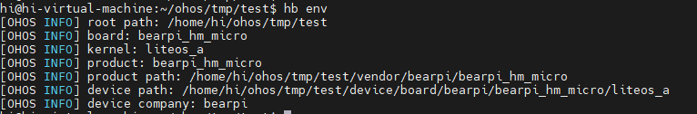

# 小型系统STM32MP1芯片移植案例

本文章基于意法半导体`STM32MP157`芯片的小熊派[BearPi-HM Micro开发板](https://gitee.com/openharmony/device_board_bearpi)，进行小型带屏开发板的移植，实现了`ace_engine_lite`、`arkui_ui_lite`、`aafwk_lite`、`appexecfwk_lite`、`HDF`等部件基于`OpenHarmony LiteOS-A`内核的适配。移植架构上采用`Board`与`SoC`分离的方案。

## 编译构建

### 目录规划

本方案的目录结构使用[Board和SoC解耦的设计思路](https://gitee.com/openharmony-sig/sig-content/blob/master/devboard/docs/board-soc-arch-design.md)，并把芯片适配目录规划为：

```
device
├── board                               --- 单板厂商目录
│   └── bearpi                          --- 单板厂商名字：小熊派
│       └── bearpi_hm_micro             --- 单板名：bearpi_hm_micro
└── soc                                 --- SoC厂商目录
    └── common                          --- 存放公共HDF驱动 
    └── st                              --- SoC厂商名字：ST意法半导体
        └── stm32mp1xx                  --- SoC Series名：stm32mp1xx系列芯片
```

产品样例目录规划为：

```
vendor
└── bearpi                              --- 开发产品样例厂商目录，小熊派的产品样例
    └── bearpi_hm_micro                 --- 产品名字：bearpi_hm_micro开发板
```

### 预编译适配

在进行移植之前，需要进行预编译适配。

预编译适配主要使用`hb set`命令，设置整个项目的根目录、单板目录、产品目录、单板公司名等环境变量，为编译做准备。

具体的预编译适配步骤如下：

1. 在`vendor/bearpi/bearpi_hm_micro`目录下新增`config.json`文件，用于描述这个产品样例所使用的单板、内核等信息，描述信息可参考如下内容：

    ```
    {
      "product_name": "bearpi_hm_micro",    --- 用于hb set进行选择时，显示的产品名称
      "version": "3.0",                     --- 构建系统的版本，1.0/2.0/3.0
      "type": "small",                      --- 构建系统的类型，mini/small/standard
      "ohos_version": "OpenHarmony 3.0",    --- OpenHarmony系统版本
      "device_company": "bearpi",           --- 单板厂商名，用于编译时找到/device/board/bearpi目录
      "board": "bearpi_hm_micro",           --- 单板名，用于编译时找到/device/board/bearpi/bearpi_hm_micro目录
      "kernel_type": "liteos_a",            --- 内核类型，因为OpenHarmony支持多内核，一块单板可能适配了多个内核，所以需要指定某个内核进行编译
      "kernel_version": "",                 --- 内核版本，一块单板可能适配了多个linux内核版本，所以需要指定某个具体的内核版本进行编译
      "subsystems": [ ]                     --- 选择所需要编译构建的子系统
    }
    ```

2. 在`device/board/bearpi/bearpi_hm_micro/liteos_a`目录下新增`config.gni`文件，用于描述这个产品样例所使用的单板、内核等信息，描述信息可参考如下内容：

    ```
    # Kernel type, e.g. "linux", "liteos_a", "liteos_m".
    kernel_type = "liteos_a"

    # Kernel version.
    kernel_version = ""

    # Board CPU type, e.g. "cortex-a7", "riscv32".
    board_cpu = "cortex-a7"

    # Board arch, e.g.  "armv7-a", "rv32imac".
    board_arch = ""

    # Toolchain name used for system compiling.
    # E.g. gcc-arm-none-eabi, arm-linux-harmonyeabi-gcc, ohos-clang,  riscv32-unknown-elf.
    # Note: The default toolchain is "ohos-clang". It's not mandatory if you use the default toolchain.
    board_toolchain = ""

    # The toolchain path installed, it's not mandatory if you have added toolchain path to your ~/.bashrc.
    board_toolchain_path = ""

    # Compiler prefix.
    board_toolchain_prefix = ""

    # Compiler type, "gcc" or "clang".
    board_toolchain_type = "clang"

    # Board related common compile flags.
    board_cflags = [
    "-mfloat-abi=softfp",
    "-mfpu=neon-vfpv4",
    ]
    board_cxx_flags = [
    "-mfloat-abi=softfp",
    "-mfpu=neon-vfpv4",
    ]
    board_ld_flags = []

    # Board related headfiles search path.
    board_include_dirs = []

    # Board adapter dir for OHOS components.
    board_adapter_dir = "//device/board/bearpi/bearpi_hm_micro/hal"

    # Sysroot path.
    board_configed_sysroot = ""

    # Board storage type, it used for file system generation.
    storage_type = "emmc"
    ```

3. 验证`hb set`配置是否正确，输入`hb set`能够显示如下图片表示配置正确。

   执行`hb set`输入项目根目录，并且回车，`hb`命令会遍历所有`//vendor/<product_company>/<product_name>`目录下的`config.json`，给出可选产品编译选项，`config.json`的`product_name`用于显示产品名，`device_company`和`board`用于关联出`//device/board/<device_company>/<board>`目录，并且匹配`<any_dir_name>/config.gni`文件，如果能够匹配多个文件，表示该单板适配了多个内核，那么可以根据`config.json`的`kernel_type`和`kernel_version`来唯一匹配`config.gni`的`kernel_type`和`kernel_version`，即可确定了需要编译适配了哪个内核的单板。

    

    选择好产品后，输入回车就会在根目录下自动生成ohos_config.json文件，这里会将要编译的产品信息列出。通过`hb env`也可以查看选择出来的预编译环境变量。

    


## 内核移植

内核移植需要完成`LiteOS-A Kconfig`适配、`gn`的编译构建和内核启动最小适配。

详细移植步骤参考：[LiteOS-A内核移植](porting-smallchip-kernel-a.md)
### Kconfig适配
1. 在//device/board/bearpi/bearpi_hm_micro/liteos_a/drivers/Kconfig中添加芯片、产品名称、厂商名称相关配置。
    ```
    source "../../device/soc/st/common/platform/Kconfig"

    config PLATFORM
        string
        default "stm32mp157"      if PLATFORM_STM32MP157

    config PRODUCT_NAME
        string "product name"
        default "bearpi_hm_micro" if PRODUCT_BEARPI_HM_MICRO

    config DEVICE_COMPANY
        string "vendor name"
        default "st" if PLATFORM_STM32MP157
        
    config TEE_ENABLE
        bool "Enable TEE"
        default n
        depends on  PLATFORM_STM32MP157
        help
            Enable teeos in platform
    ```
2. 在//device/soc/st/common/platform/Kconfig中添加驱动相关配置。
    ```
    config DRIVERS_MMC
        depends on DRIVERS
        bool "Enable MMC"
        default y
        depends on DRIVERS && FS_VFS
        help
        Answer Y to enable LiteOS support MMC driver.

    config DRIVERS_EMMC
        depends on DRIVERS_MMC && PLATFORM_STM32MP157 
        bool "Enable MMC0 support eMMC type"

    config DRIVERS_HI3881
        bool "Enable Hi3881 Host driver"
        default n
        depends on DRIVERS_HDF_WIFI
        help
            Answer Y to enable Hi3881 Host driver.
    config HW_RANDOM_ENABLE
            depends on DRIVERS_RANDOM 
            bool "Select hw random"
            default y
            help
            Answer Y to select hw random.
    ```
3. 在//vendor/bearpi/bearpi_hm_micro/kernel_configs/debug_tee.config中使能相关配置。
    ```
    ...
    LOSCFG_PLATFORM="stm32mp157"
    LOSCFG_PRODUCT_NAME="bearpi_hm_micro"
    LOSCFG_DEVICE_COMPANY="st"
    # LOSCFG_PLATFORM_HI3516DV300 is not set
    # LOSCFG_PLATFORM_HI3518EV300 is not set
    # LOSCFG_PLATFORM_QEMU_ARM_VIRT_CA7 is not set
    LOSCFG_PLATFORM_STM32MP157=y
    LOSCFG_PRODUCT_BEARPI_HM_MICRO=y
    LOSCFG_BOARD_CONFIG_PATH="device/board/bearpi/bearpi_hm_micro/liteos_a/board"
    LOSCFG_TEE_ENABLE=y
    ...
    ```
### gn编译适配
1. 在//device/board/bearpi/bearpi_hm_micro/liteos_a中新建BUILD.gn，添加代码如下，此模块依赖board、drivers、hdf_config。
    ```
    cmd = "if [ -f $product_path/hdf_config/BUILD.gn ]; then echo true; else echo false; fi"
    HAVE_PRODUCT_CONFIG =
        exec_script("//build/lite/run_shell_cmd.py", [ cmd ], "value")
    
    group("liteos_a") {
      deps = [
        "board",
        "drivers",
      ]
      if (HAVE_PRODUCT_CONFIG) {
        deps += [ "$product_path/hdf_config" ]
      } else {
        deps += [ "hdf_config" ]
      }
    }
    
    config("public") {
      configs = [
        "board:public",
        "drivers:public",
      ]
    }
    ```
2. 在//device/board/bearpi/bearpi_hm_micro/liteos_a/board中新建BUILD.gn，添加代码如下。将os_adapt.c内核启动相关代码编译进系统。
    ```
    import("//kernel/liteos_a/liteos.gni")
    
    module_name = "bsp_config"
    
    kernel_module(module_name) {
      sources = []
      if (defined(LOSCFG_PLATFORM_ADAPT)) {
        sources += [ "os_adapt/os_adapt.c" ]
      }
    }
    
    config("public") {
      include_dirs = [ "." ]
      include_dirs += [ "include" ]
      include_dirs += [ "$LITEOSTOPDIR/drivers/block/disk/include" ]
      include_dirs +=
          [ "$LITEOSTOPDIR/../../drivers/adapter/khdf/liteos/osal/include" ]
    }
    ```
3. 在//device/board/bearpi/bearpi_hm_micro/liteos_a/drivers中新建BUILD.gn，添加代码如下，将device/soc/st/common/platform路径下的HDF驱动编译进系统。
    ```
    import("//drivers/adapter/khdf/liteos/hdf.gni")
    
    group("drivers") {
      public_deps = [ "//device/soc/st/common/platform:drivers" ]
    }
    
    config("public") {
      configs = [ "//device/soc/st/common/platform:public" ]
    }
    
    ```
4. 在//vendor/bearpi/bearpi_hm_micro/hdf_config中新建BUILD.gn，添加代码如下，将HCS配置文件编译进系统。
    ```
    module_switch = defined(LOSCFG_DRIVERS_HDF) && !defined(LOSCFG_DRIVERS_HDF_TEST)
    module_name = "libhdf_config"
    hdf_driver(module_name) {
      hcs_sources = [ "hdf.hcs" ]
    }
    
    group("hdf_config") {
      public_deps = [ ":$module_name" ]
      deps = [
        "hdf_test",
        "hdf_test/hcs_macro_test",
      ]
    }
    ```
### 内核启动适配
1. 在//device/board/bearpi/bearpi_hm_micro/liteos_a/board/os_adapt.c中添加以下内核启动相关代码，详细解释参考[LiteOS-A内核移植](porting-smallchip-kernel-a.md)。
    ```
    ...
    void SystemInit(void)
    {
    #ifdef LOSCFG_DRIVERS_RANDOM
        dprintf("dev random init ...\n");
        Mp1xxRngInit();
    #endif
    #ifdef LOSCFG_DRIVERS_MEM
        dprintf("mem dev init ...\n");
        extern int mem_dev_register(void);
        mem_dev_register();
    #endif

        dprintf("Date:%s.\n", __DATE__);
        dprintf("Time:%s.\n", __TIME__);

    #ifdef LOSCFG_DRIVERS_HDF
        dprintf("DeviceManagerStart start ...\n");
        if (DeviceManagerStart()) {
            PRINT_ERR("No drivers need load by hdf manager!");
        }
        dprintf("DeviceManagerStart end ...\n");
    #endif
        net_init();

    #ifdef LOSCFG_PLATFORM_ROOTFS
        dprintf("OsMountRootfs start ...\n");
        if (LOS_GetCmdLine()) {
            dprintf("get cmdline error!\n");
        }
        if (LOS_ParseBootargs()) {
            dprintf("parse bootargs error!\n");
        }
        if (OsMountRootfs()) {
            dprintf("mount rootfs error!\n");
        }
        dprintf("OsMountRootfs end ...\n");
    #endif

        dprintf("Before PLATFORM_UART ...\n");

    #ifdef LOSCFG_DRIVERS_HDF_PLATFORM_UART
        if (virtual_serial_init(TTY_DEVICE) != 0) {
            PRINT_ERR("virtual_serial_init failed");
        }
        if (system_console_init(SERIAL) != 0) {
            PRINT_ERR("system_console_init failed\n");
        }
    #endif

        dprintf("After PLATFORM_UART ...\n");

        if (OsUserInitProcess()) {
            PRINT_ERR("Create user init process failed!\n");
            return;
        }
        dprintf("cat log shell end\n");
        return;
    }
    ...
    ```


## 板级系统移植

### SoC芯片平台HDF驱动移植

驱动适配相关文件放置在`device/soc/st/common/platform`中，所有的驱动都是通过`HDF`机制加载，本章节以GPIO驱动适配为例进行详细说明。

1. 在`//device/soc/st/common/platform/gpio/BUILD.gn`文件中，描述了stm32mp1xx `gpio`驱动的编译适配。如下：

    ```
    module_switch = defined(LOSCFG_DRIVERS_HDF_PLATFORM_GPIO)	 --- 如果打开HDF的GPIO配置开关，才进行如下编译。
    module_name = get_path_info(rebase_path("."), "name")

    hdf_driver("hdf_gpio") {
        sources = [ "stm32mp1_gpio.c" ]        ---gpio驱动源文件。
        include_dirs = [                       ---依赖的.h路径。
          "." ,
          "../stm32mp1xx_hal/STM32MP1xx_HAL_Driver/Inc",
        ]
    }
    ```

2. 在`//device/soc/st/common/platform/gpio/stm32mp1_gpio.c`文件中，描述了stm32mp1xx `gpio`驱动的源码适配。
首先，按照`OpenHarmony`的`HDF`驱动框架加载驱动基本适配框架，如下：

    ```
    struct HdfDriverEntry g_GpioDriverEntry = {
        .moduleVersion = 1,
        .moduleName = "HDF_PLATFORM_GPIO",
        .Bind = GpioDriverBind,
        .Init = GpioDriverInit,
        .Release = GpioDriverRelease,
    };
    HDF_INIT(g_GpioDriverEntry); 	 --- 通过HDF_INIT 加载GPIO驱动。
    ```
3. 在//device/soc/st/stm32mp1xx/sdk_liteos/hdf_config/gpio中添加gpio硬件描述信息文件gpio_config.hcs,在该文件中添加驱动私有配置信息。
    ```
    root {
        platform {
            gpio_config {
                controller_0x50002000 {
                    match_attr = "st_stm32mp1_gpio";
                    groupNum = 11;
                    bitNum = 16;
                    gpioRegBase = 0x50002000;
                    gpioRegStep = 0x1000;
                    irqRegBase = 0x5000D000;
                    irqRegStep = 0x400;
                }
            }
        }
    }
    ```
4. 配置产品加载驱动，产品的所有设备信息被定义在源码文件//vendor/bearpi/bearpi_hm_micro/hdf_config/device_info/device_info.hcs中。

   平台驱动请添加到platform的host中。

   >  **说明：**
   > moduleName要与驱动文件中定义的相同，deviceMatchAttr要与驱动私有配置信息文件gpio_config.hcs中定义match_attr的相同。

     
   ```
   root {
       ...
       platform :: host {
            device_gpio :: device {
                device0 :: deviceNode {
                    policy = 2;
                    priority = 10;
                    permission = 0644;
                    moduleName = "HDF_PLATFORM_GPIO_MANAGER";
                    serviceName = "HDF_PLATFORM_GPIO_MANAGER";
                }
                device1 :: deviceNode {
                    policy = 0;
                    priority = 10;
                    permission = 0644;
                    moduleName = "HDF_PLATFORM_GPIO";
                    serviceName = "HDF_PLATFORM_GPIO";
                    deviceMatchAttr = "st_stm32mp1_gpio";
                }
            }
       }
   }
   ```
5. 完善驱动代码，gpio_config.hcs的配置信息会在GpioDriverInit中加载。
    ```
    static int32_t GpioDriverInit(struct HdfDeviceObject *device)
    {
    
        int32_t ret;
        struct Mp1xxGpioCntlr *stm32gpio = &g_Mp1xxGpioCntlr;

        dprintf("%s: Enter", __func__);
        if (device == NULL || device->property == NULL) {
            HDF_LOGE("%s: device or property NULL!", __func__);
            return HDF_ERR_INVALID_OBJECT;
        }
        //获取属性数据。
        ret = Mp1xxGpioReadDrs(stm32gpio, device->property);
        if (ret != HDF_SUCCESS) {
            HDF_LOGE("%s: get gpio device resource fail:%d", __func__, ret);
            return ret;
        }
        ...
    }
    ```

### OpenHarmony子系统适配

`OpenHarmony`子系统适配只需要在`config.json`中增加对应子系统和部件，这样编译系统会将该部件纳入编译目标中。

#### 启动恢复子系统适配

启动恢复子系统需要适配`bootstrap_lite`、`syspara_lite`、`appspawn_lite`、`init`四个部件。请在`vendor/bearpi/bearpi_hm_micro/config.json`中新增对应的配置选项。

```
    {
    "subsystem": "startup",
    "components": [
        { "component": "syspara_lite", "features":[] },
        { "component": "bootstrap_lite", "features":[] },
        { "component": "appspawn_lite", "features":[] },
        { "component": "init", "features":[] }
     ]
    },
```
系统启动时会根据//vendor/bearpi/bearpi_hm_micro/init_configs中的启动配置来启动系统。


#### DFX子系统适配

进行`DFX`子系统适配需要添加`hilog_featured_lite`、`hidumper_lite`部件，直接在`config.json`文件配置即可。

```
    {
        "subsystem": "hiviewdfx",
        "components": [
            { "component": "hilog_featured_lite", "features":[] },
            { "component": "hidumper_lite", "features":[] }
        ]
    },
```

#### 系统服务管理子系统适配

进行系统服务管理子系统适配需要添加`samgr_lite`、`safwk_lite`、`dmsfwk_lite`三个部件，直接在`config.json`配置即可。

```
    {
    "subsystem": "distributed_schedule",
    "components": [
        { "component": "samgr_lite", "features":[] },
        { "component": "safwk_lite", "features":[] },
        { "component": "dmsfwk_lite", "features":[] }
    ]
    },
```

#### 安全子系统适配

进行安全子系统适配需要添加`permission_lite`、`appverify`、`device_auth`、`huks`四个部件，直接在`config.json`配置即可。

```
    {
    "subsystem": "security",
    "components": [
        { "component": "permission_lite", "features":[] },
        { "component": "appverify", "features":[] },
        { "component": "device_auth", "features":[] },
        { "component": "huks", "features":
        [
            "huks_config_file = \"hks_config_small.h\""
        ]
        }
    ]
    },
```


#### 公共基础库子系统适配

进行公共基础库子系统适配需要添加`kv_store`、`os_dump`两个部件，直接在`config.json`配置即可。

```
      {
        "subsystem": "utils",
        "components": [
          { "component": "kv_store", "features":[] },
          { "component": "os_dump", "features":[] }
        ]
      },
```

#### 图形子系统适配

进行图形子系统适配需要添加`graphic_utils`部件，直接在`config.json`配置即可。

```
      {
        "subsystem": "graphic",
        "components": [
          { "component": "graphic_utils",           
            "features": [ "enable_ohos_graphic_utils_product_config = true"
             ]
          },
          { "component": "graphic_hals", "features":[] },
          { "component": "ui", "features":[ "enable_graphic_font = true","enable_video_component=false"] },
          { "component": "surface", "features":[] },
          { "component": "wms", "features":[] }
        ]
      },
```

`graphic`配置文件见 `//vendor/bearpi/bearpi_hm_micro/graphic_config/product_graphic_lite_config.h`。


#### ArkUI开发框架子系统适配

进行ArkUI开发框架子系统适配需要添加`ace_engine_lite`部件，直接在`config.json`配置即可。

```
    {
        "subsystem": "arkui",
        "components": [
        {
            "component": "ace_engine_lite",
            "features": [
            "ace_engine_lite_feature_product_config = true"
            ]
        }
        ]
    },
```
`ace_engine_lite`部件配置文件见 `//vendor/bearpi/bearpi_hm_micro/ace_lite_config/product_acelite_config.h`。

#### 元能力子系统适配

进行元能力子系统适配需要添加`aafwk_lite`部件，直接在`config.json`配置即可。

```
    {
    "subsystem": "aafwk",
    "components": [
        {
        "component": "aafwk_lite",
        "features": [
            "ability_lite_enable_ohos_appexecfwk_feature_ability = true"	 --- 支持FA特性，即包含图形能力。
        ]
        }
    ]
    },
```


#### 包管理子系统适配

进行包管理子系统适配需要添加`appexecfwk_lite`部件，直接在`config.json`配置即可。

```
    {
    "subsystem": "appexecfwk",
    "components": [
        {
        "component": "appexecfwk_lite"
        }
    ]
    },
```