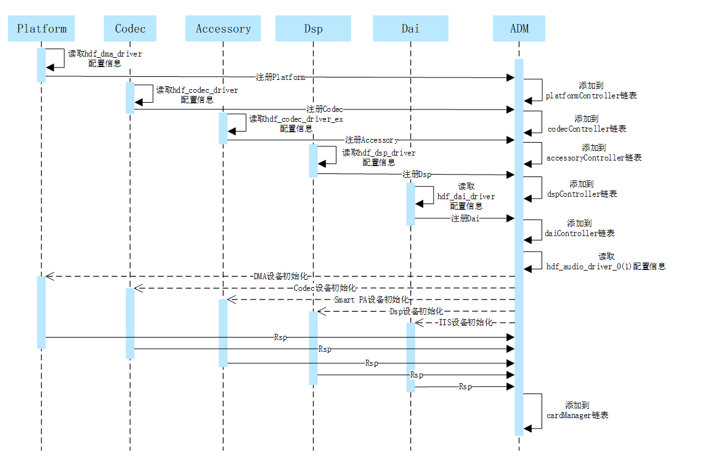
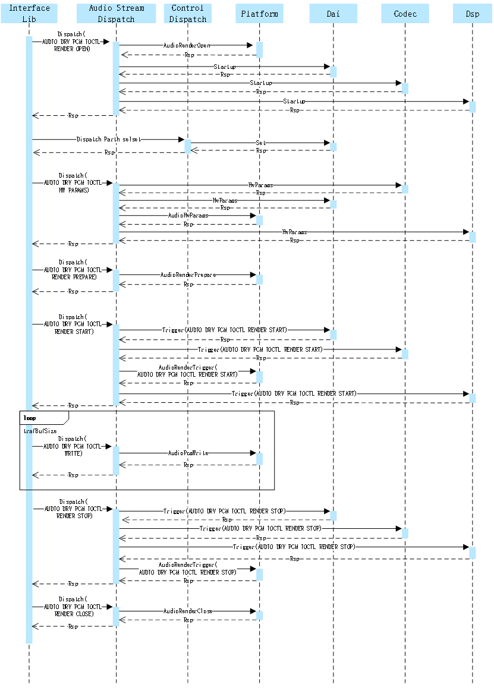
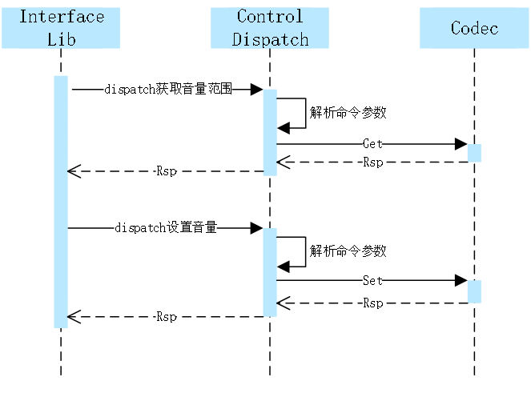
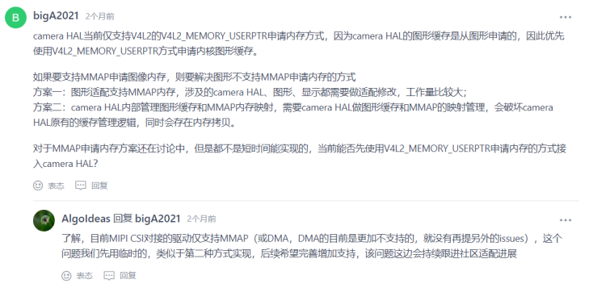
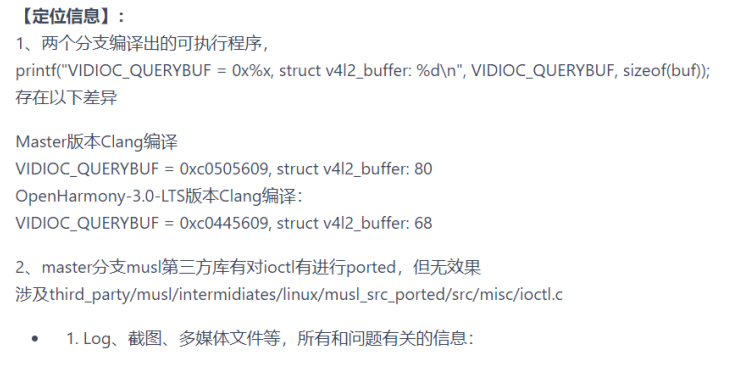
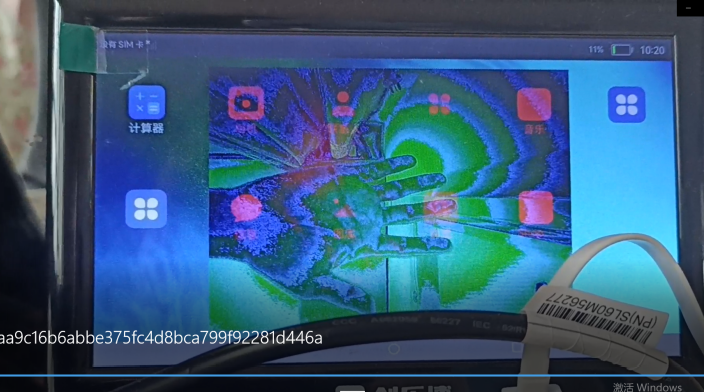
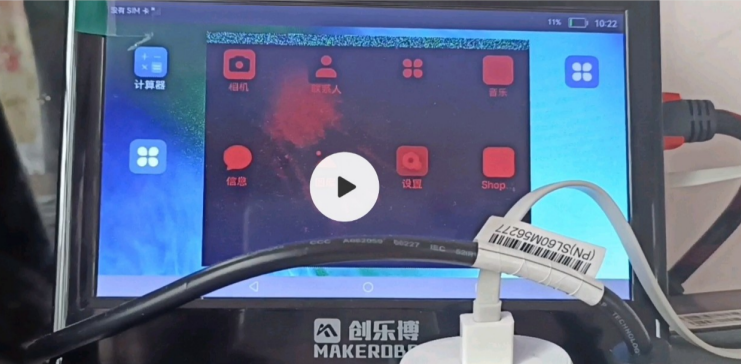
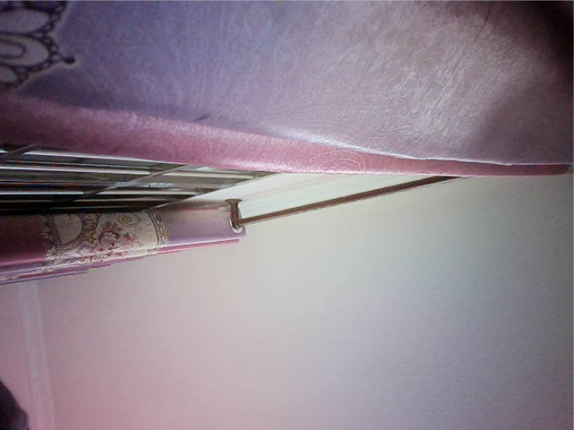

# **标准系统方案之扬帆移植案例**

​        本文章是基于瑞芯微RK3399芯片的yangfan开发板，进行标准系统相关功能的移植，主要包括产品配置添加，内核启动、升级，音频ADM化，Camera，TP，LCD，WIFI，BT，vibrator、sensor、图形显示模块的适配案例总结，以及相关功能的适配。
开发板系统移植采用Board仓和SoC代码分离方案，Board仓保存板载驱动的模块，例如音频，Camera，TP，WIFI等驱动模块的适配代码。在SoC仓保存与SoC驱动相关模块，例如I2C，ISP，RGA等驱动模块的适配代码。

## 产品配置和目录规划

### 产品配置

在产品`//vendor/yangfan`目录下创建config.json文件，并指定CPU的架构。`//vendor/yangfan/rk3399.json`配置如下：

```
{
    "product_name": "yangfan",---产品名：yangfan
    "device_company": "rockchip",---单板厂商：rockchip
    "device_build_path": "device/board/isoftstone/yangfan",---设备构建路径：device/board/isoftstone/yangfan
    "target_cpu": "arm",---目标cpu：arm
    "type": "standard",---配置系统的级别：standard
    "version": "3.0",---版本：3.0
    "board": "yangfan",---单板名：yangfan
    "enable_ramdisk": true,---启用内存虚拟盘：true
    "build_selinux": true,---构建selinux：true
    "inherit": [ "productdefine/common/inherit/rich.json", "productdefine/common/inherit/chipset_common.json" ],
    "subsystems": [
    {
      "subsystem": "security",
      "components": [
        {
          "component": "selinux",
          "features": []
        }
      ]
    },
    {
      "subsystem": "communication",
      "components": [
        {
          "component": "netmanager_ext",
          "features": []
        }
      ]
    },
    ...
}
```


主要的配置内容包括：

1. "product_name": "yangfan",---产品名：yangfan
2. "device_company": "rockchip",---单板厂商：rockchip
3. "device_build_path": "device/board/isoftstone/yangfan",---设备构建路径：device/board/isoftstone/yangfan
4. "target_cpu": "arm",---目标cpu：arm
5. "type": "standard",---配置系统的级别：standard
6. "version": "3.0",---版本：3.0
7. "board": "yangfan",---单板名：yangfan
8. "enable_ramdisk": true,---启用内存虚拟盘：true

已定义的子系统可以在`//build/subsystem_config.json`中找到。当然也可以定制子系统。

建议先拷贝Hi3516DV300开发板的配置文件，删除掉hisilicon_products子系统。该子系统为Hi3516DV300 SOC编译内核，不适合RK3568。

### 目录规划

参考[Board和SoC解耦的设计思路](https://gitee.com/openharmony-sig/sig-content/blob/master/devboard/docs/board-soc-arch-design.md)，并把芯片适配目录规划为：

```
device
├── board                                --- 单板厂商目录
│   └── isoftstone                       --- 单板厂商名字：
│       └── yangfan                      --- 单板名：扬帆,主要放置开发板相关的驱动业务代码
└── soc									 --- SoC厂商目录
    └── rockchip                         --- SoC厂商名字：rockchip
        └── rk3399						 --- SoC Series名：rk3399,主要为芯片原厂提供的一些方案，以及闭源库等
        
        
```
产品样例目录规划为：
```
vendor
└── isoftstone					
    └── yangfan         			         --- 产品名字：产品、hcs以及demo相关
```

## **内核启动**

### 二级启动

二级启动简单来说就是将之前直接挂载system，从system下的init启动，改成先挂载ramdsik，从ramdsik中的init 启动，做些必要的初始化动作，如挂载system，vendor等分区，然后切到system下的init 。

RK3399适配主要是将主线编译出来的ramdisk 打包到boot_linux.img中，主要有以下工作：

1. 使能二级启动

在//vendor/yangfan/rk3399.json中使能enable_ramdisk。

  ```
  {
      "product_name": "yangfan",
      "device_company": "rockchip",
      "device_build_path": "device/board/isoftstone/yangfan",
      "target_cpu": "arm",
      "type": "standard",
      "version": "3.0",
      "board": "yangfan",
      "enable_ramdisk": true,
      "build_selinux": true,
      ...
  }
  ```

2. 将主线编译出来的ramdsik.img 打包到boot_linux.img

配置：

由于rk 启动uboot 支持从ramdisk 启动，只需要在打包boot_linux.img 的配置文件中增加ramdisk.img ，因此没有使用主线的its格式，具体配置就是在内核编译脚本make-ohos.sh 中增加:

```
function make_extlinux_conf()
{
	dtb_path=$1
	uart=$2
	image=$3
	
	echo "label rockchip-kernel-5.10" > ${EXTLINUX_CONF}
	echo "	kernel /extlinux/${image}" >> ${EXTLINUX_CONF}
	echo "	fdt /extlinux/${TOYBRICK_DTB}" >> ${EXTLINUX_CONF}
	if [ "enable_ramdisk" == "${ramdisk_flag}" ]; then
		echo "	initrd /extlinux/ramdisk.img" >> ${EXTLINUX_CONF}
	fi
	cmdline="append earlycon=uart8250,mmio32,${uart} root=PARTUUID=614e0000-0000-4b53-8000-1d28000054a9 rw rootwait rootfstype=ext4"
	echo "  ${cmdline}" >> ${EXTLINUX_CONF}
}
```

### 打包 

增加了打包boot镜像的脚本make-boot.sh，供编译完ramdisk，打包boot 镜像时调用，主要内容:

```
genext2fs -B ${blocks} -b ${block_size} -d boot_linux -i 8192 -U boot_linux.img
```

调用make-boot.sh的修改请参考[RK3568 适配二级启动]( https://gitee.com/openharmony/build/pulls/569/files )。

### INIT配置

init相关配置请参考[启动恢复子系统]( https://gitee.com/openharmony/docs/blob/master/zh-cn/readme/%E5%90%AF%E5%8A%A8%E6%81%A2%E5%A4%8D%E5%AD%90%E7%B3%BB%E7%BB%9F.md )即可

## **音频**

### 简介

本文以OpenHarmony 3.0为基础，讲解基于HDF(Hardware Driver Foundation)驱动框架开发的Audio驱动框架，包括Audio驱动的架构组成、功能部件的实现和服务节点详细介绍。


1. ADM（Audio Driver Model)

   音频驱动框架模型，向上服务于多媒体音频子系统，便于系统开发者能够更便捷的根据场景来开发应用。向下服务于具体的设备厂商，对于Codec和DSP设备厂商来说，可根据ADM模块提供的向下统一接口适配各自的驱动代码，就可以实现快速开发和适配HOS系统。

2. Audio Control Dispatch

   接收lib层的控制指令并将控制指令分发到驱动层。

3. Audio Stream Dispatch

   向上通过lib层完成数据流的接收，向下完成数据流对驱动层的分发。

4. Card Manager

   多声卡管理模块。每个声卡含有Dai、Platform、Codec、Accessory、Dsp、Sapm模块。

5. Platform Driver

   驱动适配层。

6. SAPM（Smart Audio Power Manager）

   电源管理模块，对整个ADM电源进行功耗策略优化。

### Audio驱动介绍

#### 代码目录

```
drivers
	├── framework
	│	└── model
	│	│	└── audio					#框架代码
	│	│		├─── common				#公共实现
	│	│		├─── core				#核心
	│	│		├─── dispatch			#控制流和数据流实现
	│	│		└── sapm				#电源管理
	│	└── include
	│		└── audio					#对外接口
	├── adapter
    │	└──khdf
	│		└── linux
	│			└── model
	│				└── audio			#编译文件
	└── peripheral
		└── audio
			└── chipsets		
				└── rk3399				#驱动实现
					├── accessory		#SmartPA驱动
					├── dai				#I2S驱动
					└── soc				#Dma驱动
```

#### Audio流程说明

##### 启动流程



1. 系统启动时audio模块的Platform、Codec、Accessory、Dsp、Dai各个驱动首先被加载，各驱动从各自私有配置文件中获取配置信息，并将获取的配置信息保存到各驱动的Data数据结构中。
2. 各驱动模块调用ADM注册接口将自己添加到各驱动模块的链表中。
3. ADM模块读取hdf_audio_driver_0（音频card_0）和hdf_audio_driver_1（音频card_1）配置信息，加载各模块的具体设备。
4. ADM模块调用各模块的初始化函数对各模块设备进行初始化。
5. 将初始化成功的音频设备添加到cardManager链表。

##### 播放流程



1. 播放音频，首先Interface Lib层通过播放流服务下发Render Open指令，Render Stream Dispatch服务收到指令后分别调用各模块的函数接口对指令进行下发。
2. Interface Lib层通过控制服务下发通路选择指令，Control Dispatch控制服务收到指令后调用Dai模块接口设置通路。
3. Interface Lib层通过播放流服务下发硬件参数，Render Stream Dispatch服务收到参数后分别调用各模块参数设置接口，对硬件参数进行设置。
4. Interface Lib层通过播放流服务下发播放启动指令，Render Stream Dispatch服务收到指令后分别调用各模块启动接口，对各模块进行启动设置。
5. Interface Lib层通过播放流服务下发音频数据，Render Stream Dispatch服务收到数据后调用Platform AudioPcmWrite接口将音频数据传给Dma。
6. Interface Lib层通过播放流服务下发播放停止指令，Render Stream Dispatch服务收到指令后分别调用各模块停止接口，对各模块进行停止设置。
7. Interface Lib层通过播放流服务下发Render Close指令，Render Stream Dispatch服务收到指令后调用Platform AudioRenderClose接口对已申请资源进行释放。

##### 控制流程



1. 设置音量，首先Interface Lib层通过控制服务下发获取音量范围指令，Control Dispatch控制服务收到指令后进行解析并调用Codec模块Get函数接口获取可设置音量范围。
2. Interface Lib层通过控制服务下发设置音量指令，Control Dispatch控制服务收到指令后进行解析并调用Codec模块Set函数接口设置音量。

#### 实现说明

1. 驱动注册

   以codec的注册函数为例，当codec驱动初始化时调用如下codec注册函数，将codec注册到codecController链表中。

   ```c
   int32_t AudioRegisterCodec(struct HdfDeviceObject *device, struct CodecData *codecData, struct DaiData *daiData)
   {
   ...
   
       codec = (struct CodecDevice *)OsalMemCalloc(sizeof(*codec));
   ...
   
       OsalMutexInit(&codec->mutex);
       codec->devCodecName = codecData->drvCodecName;
       codec->devData = codecData;
       codec->device = device;
   
       ret = AudioSocRegisterDai(device, daiData);
   ...
       DListInsertHead(&codec->list, &codecController); 
   ...
   }
   ```

2. 数据流数据分发

   当录音或者播放时，上层lib层通过dispatch将数据下发或读取数据，此接口接收到lib层的请求后，将数据进行分发或将数据返回。

   ```c
   static int32_t StreamDispatch(struct HdfDeviceIoClient *client, int cmdId,
       struct HdfSBuf *data, struct HdfSBuf *reply)
   {
       unsigned int count = sizeof(g_streamDispCmdHandle) / sizeof(g_streamDispCmdHandle[0]);
       for (unsigned int i = 0; i < count; ++i) {
           if ((cmdId == (int)(g_streamDispCmdHandle[i].cmd)) && (g_streamDispCmdHandle[i].func != NULL)) {
               return g_streamDispCmdHandle[i].func(client, data, reply);
           }
       }
       ADM_LOG_ERR("invalid [cmdId=%d]", cmdId);
       return HDF_FAILURE;
   }
   ```

3. 控制功能注册接口

   音量控制、增益控制、通路控制等控制功能都是通过此接口添加到声卡控制列表。

   ```c
   int32_t AudioAddControls(struct AudioCard *audioCard, const struct AudioKcontrol *controls, int32_t controlMaxNum)
   {
   ...
   
       for (i = 0; i < controlMaxNum; i++) {
           control = AudioAddControl(audioCard, &controls[i]);
           if (control == NULL) {
               ADM_LOG_ERR("Add control fail!");
               return HDF_FAILURE;
           }
           DListInsertHead(&control->list, &audioCard->controls);
       }
       ADM_LOG_DEBUG("Success.");
       return HDF_SUCCESS;
   }
   ```

4. 电源管理接口

   添加组件实现：

   ```c
   int32_t AudioSapmNewComponents(struct AudioCard *audioCard,
       const struct AudioSapmComponent *component, int32_t cptMaxNum)
   {
   ...
   
       for (i = 0; i < cptMaxNum; i++) {
           ret = AudioSapmNewComponent(audioCard, component);
           if (ret != HDF_SUCCESS) {
               ADM_LOG_ERR("AudioSapmNewComponent fail!");
               return HDF_FAILURE;
           }
           component++;
       }
   
       return HDF_SUCCESS;
   }
   
   ```

   添加通路实现：

   ```c
   
   int32_t AudioSapmAddRoutes(struct AudioCard *audioCard, const struct AudioSapmRoute *route, int32_t routeMaxNum)
   {
   ...
   
       for (i = 0; i < routeMaxNum; i++) {
           ret = AudioSapmAddRoute(audioCard, route);
           if (ret != HDF_SUCCESS) {
               ADM_LOG_ERR("AudioSapmAddRoute failed!");
               return HDF_FAILURE;
           }
           route++;
       }
       return HDF_SUCCESS;
   }
   
   ```

   添加控制功能实现：

   ```c
   
   int32_t AudioSapmNewControls(struct AudioCard *audioCard)
   {
   ...
   
       DLIST_FOR_EACH_ENTRY(sapmComponent, &audioCard->components, struct AudioSapmComponent, list) {
           if (sapmComponent->newCpt) {
               continue;
           }
           if (sapmComponent->kcontrolsNum > 0) {
               sapmComponent->kcontrols = OsalMemCalloc(sizeof(struct AudioKcontrol*) * sapmComponent->kcontrolsNum);
               if (sapmComponent->kcontrols == NULL) {
                   ADM_LOG_ERR("malloc kcontrols fail!");
                   return HDF_FAILURE;
               }
           }
   
           switch (sapmComponent->sapmType) {
               case AUDIO_SAPM_ANALOG_SWITCH:
               case AUDIO_SAPM_MIXER:
               case AUDIO_SAPM_MIXER_NAMED_CTRL:
               case AUDIO_SAPM_SPK:
               case AUDIO_SAPM_PGA:
                   ret = AudioSapmNewMixerControls(sapmComponent, audioCard);
                   break;
               case AUDIO_SAPM_MUX:
               case AUDIO_SAPM_VIRT_MUX:
               case AUDIO_SAPM_VALUE_MUX:
                   ret = AudioSapmNewMuxControls(sapmComponent, audioCard);
                   break;
               default:
                   ret = HDF_SUCCESS;
                   break;
           }
   ...
   
           ReadInitComponentPowerStatus(sapmComponent);
           sapmComponent->newCpt = 1;
           DListInsertTail(&sapmComponent->dirty, &audioCard->sapmDirty);
       }
   
       ret = AudioSapmPowerComponents(audioCard);
   ...
   
       return HDF_SUCCESS;
   }
   
   ```

5. 控制流数据分发

   当录音或者播放时，上层lib层通过dispatch将控制指令下发，此接口接收到lib层的控制指令后，将控制指令分发到各驱动模块。

   ```c
   static int32_t ControlDispatch(struct HdfDeviceIoClient *client, int cmdId,
       struct HdfSBuf *data, struct HdfSBuf *reply)
   {
   ...
   
       if (cmdId >= AUDIODRV_CTRL_IOCTRL_ELEM_BUTT || cmdId < 0) {
           ADM_LOG_ERR("Invalid [cmdId=%d].", cmdId);
           return HDF_FAILURE;
       }
   
       for (i = 0; i < HDF_ARRAY_SIZE(g_controlDispCmdHandle); ++i) {
           if ((cmdId == (int)(g_controlDispCmdHandle[i].cmd)) && (g_controlDispCmdHandle[i].func != NULL)) {
               return g_controlDispCmdHandle[i].func(client, data, reply);
           }
       }
       return HDF_FAILURE;
   }
   ```

### Audio服务介绍

#### 服务节点

基于ADM框架的audio驱动对HDI层提供三个服务hdf_audio_render、hdf_audio_capture、hdf_audio_control。
开发板audio驱动服务节点如下：

```
console:/dev # ls -al hdf_audio_*                                              
crw------- 1 system system 249,   5 1970-01-01 00:21 hdf_audio_capture  //录音数据流服务。
crw------- 1 system system 249,   3 1970-01-01 00:21 hdf_audio_codec_dev0  //音频设备名称。
crw------- 1 system system 249,   4 1970-01-01 00:21 hdf_audio_control  //音频控制流服务。
crw------- 1 system system 249,   6 1970-01-01 00:21 hdf_audio_render  //播放数据流务。
```

1. 音频控制流服务

   用来接收上层lib层下发的控制指令，包括音量控制、增益控制、通路控制，这些控制指令都是通过控制流服务下发到驱动。

2. 音频数据播放流服务

   用来接收上层lib层下发的音频数据和播放相关的参数，还有播放的启动、暂停、恢复、停止指令，这些指令都是由播放数据流下发到驱动。

3. 音频数据录音流服务

   用来向上层lib层传输音频数据和接收上层lib层下发的录音相关的参数，还有录音的启动、暂停、恢复、停止指令，这些指令都是由录音数据流下发到驱动。

#### 驱动服务

每个audio设备包括如下服务：

| **hdf_audio_codec_dev0** | **音频设备名称**       |
| ------------------------ | ---------------------- |
| dma_service_0            | dma 驱动服务           |
| dai_service              | cpu dai 驱动服务       |
| codec_service_0          | codec 驱动服务         |
| dsp_service_0            | dsp 驱动服务（可选项） |

| **hdf_audio_codec_dev1** | **音频设备名称**                  |
| ------------------------ | --------------------------------- |
| dma_service_0            | dma 驱动服务                      |
| dai_service              | cpu dai 驱动服务                  |
| codec_service_1          | accessory 驱动服务（特指smartPA） |
| dsp_service_0            | dsp 驱动服务（可选项）            |

#### 代码路径

```
vendor/rockchip/rk3399/hdf_config/khdf
├── audio 							#audio私有配置文件
├── device_info
|	└── device_info.hcs				#设备配置文件
└── hdf.hcs							#引用hcs配置文件			
```

#### 配置节点说明

以codec驱动为例，在device_info.hcs文件中的audio host节点下添加codec节点信息。

```
        audio :: host {
            hostName = "audio_host";
            priority = 60;
...
            device_codec :: device {
                device0 :: deviceNode {
                    policy = 1;
                    priority = 50;
                    preload = 0;
                    permission = 0666;
                    moduleName = "CODEC_ES8316";
                    serviceName = "codec_service_0";
                    deviceMatchAttr = "hdf_codec_driver";
                }
            }
...
        }
```

#### 实现驱动

在驱动文件中实现与device_info.hcs配置节点moduleName相同的驱动逻辑。

```
/* HdfDriverEntry implementations */
static int32_t Es8316DriverBind(struct HdfDeviceObject *device)
{
...
    return HDF_SUCCESS;
}

static int32_t Es8316DriverInit(struct HdfDeviceObject *device)
{
...
    return HDF_SUCCESS;
}

/* HdfDriverEntry definitions */
struct HdfDriverEntry g_es8316DriverEntry = {
    .moduleVersion = 1,
    .moduleName = "CODEC_ES8316",
    .Bind = Es8316DriverBind,
    .Init = Es8316DriverInit,
    .Release = NULL,
};
HDF_INIT(g_es8316DriverEntry);
```

### 总结

​		基于HDF框架的ADM音频框架，为Open Harmony的音频开发提供了统一的架构基础，为各平台音频驱动适配提供了统一的接口。音频驱动可以一平台开发多平台适用，提高了开发效率。此文档对ADM框架进行了简单的介绍，希望有助于开发者开发和应用。

## **Camera**

### 简介

本文以OpenHarmony 3.0为基础，讲解基于HDF(Hardware Driver Foundation)驱动框架开发的Camera驱动框架，包括Camera驱动的架构组成、功能部件的实现和服务节点详细介绍。

### Camera驱动框架图

​                                                                  OpenHarmony HDF Camera驱动模块架构图


以Camera Host 部分做如下说明：

1. HDI实现层(HDI Implementation)：对上实现Open Harmony OS相机标准南向接口。
2. 框架层(PipelineCore)：对接HDI实现层的控制、流的转发，实现数据通路的搭建、管理相机各个硬件设备等功能。
3. 适配层(Platform Adaption)：屏蔽底层芯片和OS差异，支持多平台适配。

对于rk3399E/T的Usb Camera来分析，内核使用linux-4.19。Usb Camera依赖linux下的V4L2的uvc，从上面的框架图分析HDF Camera已经实现了兼容linux 的 V4L2 uvc，所以调试过程首先要保证uvc所涉及的USB和Camera的驱动正常。


### Camera驱动介绍

#### 配置信息

arch/arm64/configs/rockchip_linux_defconfig

```c
CONFIG_VIDEO_V4L2_SUBDEV_API=y
CONFIG_MEDIA_USB_SUPPORT=y
CONFIG_USB_VIDEO_CLASS=y
```

#### 节点信息

插入Usb Camera 前

```
# ls -l dev/video*
crw-rw---- 1 root root 81,   0 2013-01-18 10:59 dev/video0
crw-rw---- 1 root root 81,   1 2013-01-18 10:59 dev/video1
crw-rw---- 1 root root 81,   2 2013-01-18 10:59 dev/video2
crw-rw---- 1 root root 81,   3 2013-01-18 10:59 dev/video3
crw-rw---- 1 root root 81,   4 2013-01-18 10:59 dev/video4
crw-rw---- 1 root root 81,   5 2013-01-18 10:59 dev/video5
crw-rw---- 1 root root 81,   6 2013-01-18 10:59 dev/video6
crw-rw---- 1 root root 81,   7 2013-01-18 10:59 dev/video7
crw-rw---- 1 root root 81,   8 2013-01-18 10:59 dev/video8
crw-rw---- 1 root root 81,   9 2013-01-18 10:59 dev/video9
#
```

插入Usb Camera后新增节点dev/video10和dev/video11

```
# ls -l dev/video*
crw-rw---- 1 root root 81,   0 2013-01-18 10:59 dev/video0
crw-rw---- 1 root root 81,   1 2013-01-18 10:59 dev/video1
crw------- 1 root root 81,  10 2013-01-18 11:01 dev/video10
crw------- 1 root root 81,  11 2013-01-18 11:01 dev/video11
crw-rw---- 1 root root 81,   2 2013-01-18 10:59 dev/video2
crw-rw---- 1 root root 81,   3 2013-01-18 10:59 dev/video3
crw-rw---- 1 root root 81,   4 2013-01-18 10:59 dev/video4
crw-rw---- 1 root root 81,   5 2013-01-18 10:59 dev/video5
crw-rw---- 1 root root 81,   6 2013-01-18 10:59 dev/video6
crw-rw---- 1 root root 81,   7 2013-01-18 10:59 dev/video7
crw-rw---- 1 root root 81,   8 2013-01-18 10:59 dev/video8
crw-rw---- 1 root root 81,   9 2013-01-18 10:59 dev/video9
#
```

#### 打开设备节点

在Open Harmony OS的代码环境中，编译如下代码为可执行程序，在开发板测执行，无报错说明该节点open success。

```c
#include <stdio.h>
#include <sys/types.h>
#include <sys/stat.h>
#include <fcntl.h>
#include <stdlib.h>
#include <unistd.h>
#include <sys/ioctl.h>
#include <linux/videodev2.h>
#include <string.h>
#include <sys/mman.h>

int main(void)
{
	// 1. 打开设备
	int fd = open("/dev/video10", O_RDWR);
	if (fd < 0) {
		printf("open device fail\n");
		return -1;
	}

    close(fd);
    return 0;
}
```

#### 获取参数

```c
#include <stdio.h>
#include <sys/types.h>
#include <sys/stat.h>
#include <fcntl.h>
#include <stdlib.h>
#include <unistd.h>
#include <sys/ioctl.h>
#include <linux/videodev2.h>
#include <string.h>
#include <sys/mman.h>

int main(void)
{
	// 1. 打开设备
	int fd = open("/dev/video10", O_RDWR);
	if (fd < 0) {
		printf("open device fail\n");
		return -1;
	}

	// 2. 获取摄像头支持的格式 ioctl(文件描述符, 命令, 与命令对应的结构体)
    struct v4l2_fmtdesc v4fmt;
	v4fmt.type = V4L2_BUF_TYPE_VIDEO_CAPTURE;
    int i = 0;
    while(1) {
		v4fmt.index = i++;
		int ret = ioctl(fd, VIDIOC_ENUM_FMT, &v4fmt);
		if (ret < 0) {
			printf("get fmt fail\n");
		}
		unsigned char *p = (unsigned char*)&v4fmt.pixelformat;
		printf("index=%d\n", v4fmt.index);
		printf("flags=%d\n", v4fmt.flags);
		printf("description=%s\n", v4fmt.description);
		printf("pixelformat=%c%c%c%c\n", p[0], p[1], p[2], p[3]);
		printf("reserved=%d\n", v4fmt.reserved[0]);
	}

    close(fd);
    return 0;
}
```

在Open Harmony OS的代码环境中，编译如上代码为可执行程序，在开发板测执行。结果显示支持YUYV和MJPEG 2种输出格式。

		index=0
		flags=0
		description=YUYV 4:2:2
		pixelformat=YUYV
		reserved=0
	
		index=1
		flags=1
		description=Motion-JPEG
		pixelformat=MJPG
		reserved=0
#### 设置缓冲区队列

```c
#include <stdio.h>
#include <sys/types.h>
#include <sys/stat.h>
#include <fcntl.h>
#include <stdlib.h>
#include <unistd.h>
#include <sys/ioctl.h>
#include <linux/videodev2.h>
#include <string.h>
#include <sys/mman.h>

int main(void)
{
	// 1. 打开设备
	int fd = open("/dev/video10", O_RDWR);
	if (fd < 0) {
		printf("open device fail\n");
		return -1;
	}

	// 2. 设置采集格式
	struct v4l2_format vfmt;
	vfmt.type = V4L2_BUF_TYPE_VIDEO_CAPTURE;
	vfmt.fmt.pix.width = 640;
	vfmt.fmt.pix.height = 480;
	vfmt.fmt.pix.pixelformat = V4L2_PIX_FMT_YUYV; // 设置的视频采集格式（与上面获取的格式一致）
	int ret = ioctl(fd, VIDIOC_S_FMT, &vfmt); // 设置格式
	if (ret < 0) {
		printf("set fmt fail\n");
        return -1;
	}
	memset(&vfmt, 0, sizeof(vfmt));
	vfmt.type = V4L2_BUF_TYPE_VIDEO_CAPTURE;
	ret = ioctl(fd, VIDIOC_G_FMT, &vfmt); // 获取格式
	if (ret < 0) {
		printf("set->get fmt fail\n");
        return -1;
	}

    // 3. 申请内核缓冲区队列
    struct v4l2_requestbuffers reqbuffer;
    reqbuffer.type = V4L2_BUF_TYPE_VIDEO_CAPTURE;
    reqbuffer.count = 4; // 申请4个缓冲区
    reqbuffer.memory = V4L2_MEMORY_MMAP; // 内存映射方式 MMAP/USERPTR
    ret = ioctl(fd, VIDIOC_REQBUFS, &reqbuffer); // 分配内存
    if (ret < 0) {
        printf("req buffer fail\n");
        return -1;
    }

    // 4. 关闭设备
    close(fd);
    return 0;
}
```

在Open Harmony OS的代码环境中，编译如上代码为可执行程序，在开发板测执行。

执行结果：req buffer fail

原因分析：ioctl(fd, VIDIOC_REQBUFS, &reqbuffer); 失败

定位方法1：在内核中加LOG定位VIDIOC_REQBUFS失败的地方。发现所有的ioctl命令下发后都会使用drivers/media/v4l2-core/v4l2-ioctl.c中的video_usercopy接口，但还是没有定位到具体的失败原因。

定位方法2：求助视美泰验证linux-4.19内核debian版本的Usb Camera是否OK。结果：debian版本使用gst-launch-1.0 v4l2src device=/dev/video10 ! image/jpeg, width= 1280, height=720, framerate=30/1 ! jpegparse ! mppjpegdec ! kmssink sync=false命令后HDMI屏幕可以出来正常的预览画面。

通过如上的操作后，基本可以确认linux的V4L2 uvc驱动和外设Usb Camera驱动都是正常的。接下来就该调试Open Harmony OS的HDF Camera了。

#### 接口介绍

查看现有Open Harmony OS上的关于camera的可执行程序：ohos_camera_demo、v4l2_main

##### ohos_camera_demo

执行结果：输入o后无预览画面，也无LOG报错信息。

```
# ohos_camera_demo
GetUintParameter debug.bytrace.tags.enableflags error.
Options:
-h | --help          Print this message
-o | --offline       stream offline test
-c | --capture       capture one picture
-w | --set WB        Set white balance Cloudy
-v | --video         capture Viedeo of 10s
-a | --Set AE        Set Auto exposure
-f | --Set Flashlight        Set flashlight ON 5s OFF
-q | --quit          stop preview and quit this app
o
Options:
-h | --help          Print this message
-o | --offline       stream offline test
-c | --capture       capture one picture
-w | --set WB        Set white balance Cloudy
-v | --video         capture Viedeo of 10s
-a | --Set AE        Set Auto exposure
-f | --Set Flashlight        Set flashlight ON 5s OFF
-q | --quit          stop preview and quit this app

```

原因分析：ohos_camera_demo目前仅支持MPP，不支持V4L2，故先放弃该demo调试。

##### v4l2_main

执行结果：输入u 报错：ERROR:main test:cannot open framebuffer /dev/fb0 file node

```
Options:
-h | --help          Print this message
-p | --preview       start preview on platform sensor
-c | --capture       capture one picture
-w | --set WB        Set white balance Cloudy
-e | --Set AE        Set exposure time
-v | --video         capture Viedeo of 10s
-u | --uvc           start preview on uvc preview
-a | --Set ATE       Set Auto exposure
-q | --quit          stop preview and quit this app
INFO:please input command(input -q exit this app)

u
ERROR:main test:cannot open framebuffer /dev/fb0 file node

INFO:V4L2OpenDevice /dev/video10
```

原因分析：查看dev/fb0节点是否存在：不存在fb0节点。继续查找根目录下有无其他fb0节点，出现了dev/graphics/fb0节点。

```
# ls -l dev/fb0
ls: dev/fb0: No such file or directory

# find -name fb0
./dev/graphics/fb0
./sys/class/graphics/fb0
./sys/devices/platform/display-subsystem/graphics/fb0
```

需把v4l2_main可执行程序中的dev/fb0改为dev/graphics/fb0。此处fb0为framebuffer，作用是在屏幕上显示预览画面。

修改点：drivers/peripheral

```diff
diff --git a/camera/hal/adapter/platform/v4l2/src/driver_adapter/main_test/v4l2_main.cpp b/camera/hal/adapter/platform/v4l2/src/driver_adapter/main_test/v4l2_main.cpp
index b351f49..d9c4cb3 100755
--- a/camera/hal/adapter/platform/v4l2/src/driver_adapter/main_test/v4l2_main.cpp
+++ b/camera/hal/adapter/platform/v4l2/src/driver_adapter/main_test/v4l2_main.cpp
@@ -186,9 +186,9 @@ RetCode FBInit()
     if (g_fbFd)
         return RC_OK;

-    g_fbFd = open("/dev/fb0", O_RDWR);
+    g_fbFd = open("/dev/graphics/fb0", O_RDWR);
     if (g_fbFd < 0) {
-        CAMERA_LOGE("main test:cannot open framebuffer %s file node\n", "/dev/fb0");
+        CAMERA_LOGE("main test:cannot open framebuffer %s file node\n", "/dev/graphics/fb0");
         return RC_ERROR;
     }

diff --git a/camera/hal/test/v4l2/src/test_display.cpp b/camera/hal/test/v4l2/src/test_display.cpp
index db908e7..7025deb 100644
--- a/camera/hal/test/v4l2/src/test_display.cpp
+++ b/camera/hal/test/v4l2/src/test_display.cpp
@@ -114,9 +114,9 @@ void TestDisplay::FBLog()

 RetCode TestDisplay::FBInit()
 {
-    fbFd_ = open("/dev/fb0", O_RDWR);
+    fbFd_ = open("/dev/graphics/fb0", O_RDWR);
     if (fbFd_ < 0) {
-        CAMERA_LOGE("main test:cannot open framebuffer %s file node\n", "/dev/fb0");
+        CAMERA_LOGE("main test:cannot open framebuffer %s file node\n", "/dev/graphics/fb0");
         return RC_ERROR;
     }

@@ -439,4 +439,4 @@ void TestDisplay::StopStream(std::vector<int>& captureIds, std::vector<int>& str
             std::cout << "==========[test log]check Capture: ReleaseStreams fail, rc = " << rc << std::endl;
         }
     }
-}
\ No newline at end of file
+}
diff --git a/display/hal/default/display_layer.c b/display/hal/default/display_layer.c
index ee7a825..e12a653 100644
--- a/display/hal/default/display_layer.c
+++ b/display/hal/default/display_layer.c
@@ -24,7 +24,7 @@

 #define DEV_ID             0
 #define LAYER_ID           0
-#define FB_PATH            "/dev/fb0"
+#define FB_PATH            "/dev/graphics/fb0"
 #define DISP_WIDTH         800
 #define DISP_HEIGHT        480
 #define BITS_PER_PIXEL     32
```

修改后重新编译v4l2_main，编译命令：./build.sh --product-name rk3399 --ccache --build-target v4l2_main

编译成功后可执行程序路径：./out/rk3399/hdf/hdf/v4l2_main

将新编译的v4l2_main推送到开发板测的system/bin路径下：

```
hdc shell "mount -o rw,remount /"
hdc file send D:\cyyanl\work\RockChip\bin\v4l2_main /system/bin
```

继续执行v4l2_main结果后无framebuffer报错，说明该问题已解决。（另一种思路：分析fb0为何在/dev/graphics/fb0而不是常规的/dev/fb0，然后修改为/dev/fb0。后面有时间再调试该思路）

新报错：ERROR:error: ioctl VIDIOC_QUERYBUF failed.

```
Options:
-h | --help          Print this message
-p | --preview       start preview on platform sensor
-c | --capture       capture one picture
-w | --set WB        Set white balance Cloudy
-e | --Set AE        Set exposure time
-v | --video         capture Viedeo of 10s
-u | --uvc           start preview on uvc preview
-a | --Set ATE       Set Auto exposure
-q | --quit          stop preview and quit this app
INFO:please input command(input -q exit this app)
u
INFO:the fixed information is as follow:
INFO:id=
INFO:sem_start=0
INFO:smem_len=2457600
...
INFO:V4L2AllocBuffer
INFO:V4L2AllocBuffer:memoryType_ = 2
INFO:V4L2AllocBuffer:V4L2_MEMORY_USERPTR = 2
INFO:V4L2AllocBuffer:VIDIOC_QUERYBUF = 3226490377
ERROR:error: ioctl VIDIOC_QUERYBUF failed.
ERROR:error: Creatbuffer: V4L2AllocBuffer error
ERROR:main test:V4L2PreviewThread CreatBuffer fail i = 0
```

原因分析：ioctl(fd, VIDIOC_QUERYBUF, &buf)失败。回过头再看"调试linux L4V2 uvc驱动章节->设置格式申请缓冲区队列"中的报错也是

ioctl(fd, VIDIOC_REQBUFS, &reqbuffer)。由此分析出Open Harmony OS上的ioctl VIDIOC_REQBUFS都会报错。再看两次失败的差异点：

内存映射方式不同： V4L2_MEMORY_MMAP和V4L2_MEMORY_USERPTR

从OpenHarmony的issuse得知暂不支持V4L2_MEMORY_MMAP内存映射，映射方式就分析到这里，接下来还是用v4l2_main的V4L2_MEMORY_USERPTR进行调试分析。

参考：[V4L2设备增加MMAP申请内存的方式](https://gitee.com/openharmony/drivers_peripheral/issues/I4EFWP)和下图



接着再分析ioctl(fd, VIDIOC_QUERYBUF, &buf)失败，查看VIDIOC_QUERYBUF的定义：videodev2.h

```c
#define VIDIOC_QUERYBUF_IOWR('V',  9, struct v4l2_buffer)
```

此处插入ioctl的定义：int ioctl(int fd, int cmd, …); VIDIOC_QUERYBUF作为cmd的入参，是int类型。也就是一个数字命令码，该命令码通过ioctl发送给内核后，会有与之对应的函数操作，故用户态下发的命令码应和内核接受的命令码一致。下面验证命令码一致性。

videodev2.h中一共有77个和内核交互的命令码，把内核态和用户态的都打印出来做对比：

用户态加打印：drivers/peripheral

```diff
diff --git a/camera/hal/adapter/platform/v4l2/src/driver_adapter/src/v4l2_buffer.cpp b/camera/hal/adapter/platform/v4l2/src/driver_adapter/src/v4l2_buffer.cpp
index d7dd15f..f7254b4 100644
--- a/camera/hal/adapter/platform/v4l2/src/driver_adapter/src/v4l2_buffer.cpp
+++ b/camera/hal/adapter/platform/v4l2/src/driver_adapter/src/v4l2_buffer.cpp
@@ -162,37 +162,119 @@ RetCode HosV4L2Buffers::V4L2DequeueBuffer(int fd)
     return RC_OK;
 }
 
+static void cyyanl_printf_cmd(void)
+{
+#if 1
+    CAMERA_LOGD("*************************************************************************************");
+    CAMERA_LOGD("cyyanl v4l2 ioctl cmd(VIDIOC_QUERYCAP           ) = 0x%x\n", VIDIOC_QUERYCAP           );
+    CAMERA_LOGD("cyyanl v4l2 ioctl cmd(VIDIOC_ENUM_FMT           ) = 0x%x\n", VIDIOC_ENUM_FMT           );
+    CAMERA_LOGD("cyyanl v4l2 ioctl cmd(VIDIOC_G_FMT              ) = 0x%x\n", VIDIOC_G_FMT              );
+    CAMERA_LOGD("cyyanl v4l2 ioctl cmd(VIDIOC_S_FMT              ) = 0x%x\n", VIDIOC_S_FMT              );
+    CAMERA_LOGD("cyyanl v4l2 ioctl cmd(VIDIOC_REQBUFS            ) = 0x%x\n", VIDIOC_REQBUFS            );
+    CAMERA_LOGD("cyyanl v4l2 ioctl cmd(VIDIOC_QUERYBUF           ) = 0x%x\n", VIDIOC_QUERYBUF           );
+    CAMERA_LOGD("cyyanl v4l2 ioctl cmd(VIDIOC_G_FBUF             ) = 0x%x\n", VIDIOC_G_FBUF             );
+    CAMERA_LOGD("cyyanl v4l2 ioctl cmd(VIDIOC_S_FBUF             ) = 0x%x\n", VIDIOC_S_FBUF             );
+    CAMERA_LOGD("cyyanl v4l2 ioctl cmd(VIDIOC_OVERLAY            ) = 0x%x\n", VIDIOC_OVERLAY            );
+    CAMERA_LOGD("cyyanl v4l2 ioctl cmd(VIDIOC_QBUF               ) = 0x%x\n", VIDIOC_QBUF               );
+    CAMERA_LOGD("cyyanl v4l2 ioctl cmd(VIDIOC_EXPBUF             ) = 0x%x\n", VIDIOC_EXPBUF             );
+    CAMERA_LOGD("cyyanl v4l2 ioctl cmd(VIDIOC_DQBUF              ) = 0x%x\n", VIDIOC_DQBUF              );
+    CAMERA_LOGD("cyyanl v4l2 ioctl cmd(VIDIOC_STREAMON           ) = 0x%x\n", VIDIOC_STREAMON           );
+    CAMERA_LOGD("cyyanl v4l2 ioctl cmd(VIDIOC_STREAMOFF          ) = 0x%x\n", VIDIOC_STREAMOFF          );
+    CAMERA_LOGD("cyyanl v4l2 ioctl cmd(VIDIOC_G_PARM             ) = 0x%x\n", VIDIOC_G_PARM             );
+    CAMERA_LOGD("cyyanl v4l2 ioctl cmd(VIDIOC_S_PARM             ) = 0x%x\n", VIDIOC_S_PARM             );
+    CAMERA_LOGD("cyyanl v4l2 ioctl cmd(VIDIOC_G_STD              ) = 0x%x\n", VIDIOC_G_STD              );
+    CAMERA_LOGD("cyyanl v4l2 ioctl cmd(VIDIOC_S_STD              ) = 0x%x\n", VIDIOC_S_STD              );
+    CAMERA_LOGD("cyyanl v4l2 ioctl cmd(VIDIOC_ENUMSTD            ) = 0x%x\n", VIDIOC_ENUMSTD            );
+    CAMERA_LOGD("cyyanl v4l2 ioctl cmd(VIDIOC_ENUMINPUT          ) = 0x%x\n", VIDIOC_ENUMINPUT          );
+    CAMERA_LOGD("cyyanl v4l2 ioctl cmd(VIDIOC_G_CTRL             ) = 0x%x\n", VIDIOC_G_CTRL             );
+    CAMERA_LOGD("cyyanl v4l2 ioctl cmd(VIDIOC_S_CTRL             ) = 0x%x\n", VIDIOC_S_CTRL             );
+    CAMERA_LOGD("cyyanl v4l2 ioctl cmd(VIDIOC_G_TUNER            ) = 0x%x\n", VIDIOC_G_TUNER            );
+    CAMERA_LOGD("cyyanl v4l2 ioctl cmd(VIDIOC_S_TUNER            ) = 0x%x\n", VIDIOC_S_TUNER            );
+    CAMERA_LOGD("cyyanl v4l2 ioctl cmd(VIDIOC_G_AUDIO            ) = 0x%x\n", VIDIOC_G_AUDIO            );
+    CAMERA_LOGD("cyyanl v4l2 ioctl cmd(VIDIOC_S_AUDIO            ) = 0x%x\n", VIDIOC_S_AUDIO            );
+    CAMERA_LOGD("cyyanl v4l2 ioctl cmd(VIDIOC_QUERYCTRL          ) = 0x%x\n", VIDIOC_QUERYCTRL          );
+    CAMERA_LOGD("cyyanl v4l2 ioctl cmd(VIDIOC_QUERYMENU          ) = 0x%x\n", VIDIOC_QUERYMENU          );
+    CAMERA_LOGD("cyyanl v4l2 ioctl cmd(VIDIOC_G_INPUT            ) = 0x%x\n", VIDIOC_G_INPUT            );
+    CAMERA_LOGD("cyyanl v4l2 ioctl cmd(VIDIOC_S_INPUT            ) = 0x%x\n", VIDIOC_S_INPUT            );
+    CAMERA_LOGD("cyyanl v4l2 ioctl cmd(VIDIOC_G_EDID             ) = 0x%x\n", VIDIOC_G_EDID             );
+    CAMERA_LOGD("cyyanl v4l2 ioctl cmd(VIDIOC_S_EDID             ) = 0x%x\n", VIDIOC_S_EDID             );
+    CAMERA_LOGD("cyyanl v4l2 ioctl cmd(VIDIOC_G_OUTPUT           ) = 0x%x\n", VIDIOC_G_OUTPUT           );
+    CAMERA_LOGD("cyyanl v4l2 ioctl cmd(VIDIOC_S_OUTPUT           ) = 0x%x\n", VIDIOC_S_OUTPUT           );
+    CAMERA_LOGD("cyyanl v4l2 ioctl cmd(VIDIOC_ENUMOUTPUT         ) = 0x%x\n", VIDIOC_ENUMOUTPUT         );
+    CAMERA_LOGD("cyyanl v4l2 ioctl cmd(VIDIOC_G_AUDOUT           ) = 0x%x\n", VIDIOC_G_AUDOUT           );
+    CAMERA_LOGD("cyyanl v4l2 ioctl cmd(VIDIOC_S_AUDOUT           ) = 0x%x\n", VIDIOC_S_AUDOUT           );
+    CAMERA_LOGD("cyyanl v4l2 ioctl cmd(VIDIOC_G_MODULATOR        ) = 0x%x\n", VIDIOC_G_MODULATOR        );
+    CAMERA_LOGD("cyyanl v4l2 ioctl cmd(VIDIOC_S_MODULATOR        ) = 0x%x\n", VIDIOC_S_MODULATOR        );
+    CAMERA_LOGD("cyyanl v4l2 ioctl cmd(VIDIOC_G_FREQUENCY        ) = 0x%x\n", VIDIOC_G_FREQUENCY        );
+    CAMERA_LOGD("cyyanl v4l2 ioctl cmd(VIDIOC_S_FREQUENCY        ) = 0x%x\n", VIDIOC_S_FREQUENCY        );
+    CAMERA_LOGD("cyyanl v4l2 ioctl cmd(VIDIOC_CROPCAP            ) = 0x%x\n", VIDIOC_CROPCAP            );
+    CAMERA_LOGD("cyyanl v4l2 ioctl cmd(VIDIOC_G_CROP             ) = 0x%x\n", VIDIOC_G_CROP             );
+    CAMERA_LOGD("cyyanl v4l2 ioctl cmd(VIDIOC_S_CROP             ) = 0x%x\n", VIDIOC_S_CROP             );
+    CAMERA_LOGD("cyyanl v4l2 ioctl cmd(VIDIOC_G_JPEGCOMP         ) = 0x%x\n", VIDIOC_G_JPEGCOMP         );
+    CAMERA_LOGD("cyyanl v4l2 ioctl cmd(VIDIOC_S_JPEGCOMP         ) = 0x%x\n", VIDIOC_S_JPEGCOMP         );
+    CAMERA_LOGD("cyyanl v4l2 ioctl cmd(VIDIOC_QUERYSTD           ) = 0x%x\n", VIDIOC_QUERYSTD           );
+    CAMERA_LOGD("cyyanl v4l2 ioctl cmd(VIDIOC_TRY_FMT            ) = 0x%x\n", VIDIOC_TRY_FMT            );
+    CAMERA_LOGD("cyyanl v4l2 ioctl cmd(VIDIOC_ENUMAUDIO          ) = 0x%x\n", VIDIOC_ENUMAUDIO          );
+    CAMERA_LOGD("cyyanl v4l2 ioctl cmd(VIDIOC_ENUMAUDOUT         ) = 0x%x\n", VIDIOC_ENUMAUDOUT         );
+    CAMERA_LOGD("cyyanl v4l2 ioctl cmd(VIDIOC_G_PRIORITY         ) = 0x%x\n", VIDIOC_G_PRIORITY         );
+    CAMERA_LOGD("cyyanl v4l2 ioctl cmd(VIDIOC_S_PRIORITY         ) = 0x%x\n", VIDIOC_S_PRIORITY         );
+    CAMERA_LOGD("cyyanl v4l2 ioctl cmd(VIDIOC_G_SLICED_VBI_CAP   ) = 0x%x\n", VIDIOC_G_SLICED_VBI_CAP   );
+    CAMERA_LOGD("cyyanl v4l2 ioctl cmd(VIDIOC_LOG_STATUS         ) = 0x%x\n", VIDIOC_LOG_STATUS         );
+    CAMERA_LOGD("cyyanl v4l2 ioctl cmd(VIDIOC_G_EXT_CTRLS        ) = 0x%x\n", VIDIOC_G_EXT_CTRLS        );
+    CAMERA_LOGD("cyyanl v4l2 ioctl cmd(VIDIOC_S_EXT_CTRLS        ) = 0x%x\n", VIDIOC_S_EXT_CTRLS        );
+    CAMERA_LOGD("cyyanl v4l2 ioctl cmd(VIDIOC_TRY_EXT_CTRLS      ) = 0x%x\n", VIDIOC_TRY_EXT_CTRLS      );
+    CAMERA_LOGD("cyyanl v4l2 ioctl cmd(VIDIOC_ENUM_FRAMESIZES    ) = 0x%x\n", VIDIOC_ENUM_FRAMESIZES    );
+    CAMERA_LOGD("cyyanl v4l2 ioctl cmd(VIDIOC_ENUM_FRAMEINTERVALS) = 0x%x\n", VIDIOC_ENUM_FRAMEINTERVALS);
+    CAMERA_LOGD("cyyanl v4l2 ioctl cmd(VIDIOC_G_ENC_INDEX        ) = 0x%x\n", VIDIOC_G_ENC_INDEX        );
+    CAMERA_LOGD("cyyanl v4l2 ioctl cmd(VIDIOC_ENCODER_CMD        ) = 0x%x\n", VIDIOC_ENCODER_CMD        );
+    CAMERA_LOGD("cyyanl v4l2 ioctl cmd(VIDIOC_TRY_ENCODER_CMD    ) = 0x%x\n", VIDIOC_TRY_ENCODER_CMD    );
+    CAMERA_LOGD("cyyanl v4l2 ioctl cmd(VIDIOC_S_HW_FREQ_SEEK     ) = 0x%x\n", VIDIOC_S_HW_FREQ_SEEK     );
+    CAMERA_LOGD("cyyanl v4l2 ioctl cmd(VIDIOC_CREATE_BUFS        ) = 0x%x\n", VIDIOC_CREATE_BUFS        );
+    CAMERA_LOGD("cyyanl v4l2 ioctl cmd(VIDIOC_PREPARE_BUF        ) = 0x%x\n", VIDIOC_PREPARE_BUF        );
+    CAMERA_LOGD("cyyanl v4l2 ioctl cmd(VIDIOC_G_SELECTION        ) = 0x%x\n", VIDIOC_G_SELECTION        );
+    CAMERA_LOGD("cyyanl v4l2 ioctl cmd(VIDIOC_S_SELECTION        ) = 0x%x\n", VIDIOC_S_SELECTION        );
+    CAMERA_LOGD("cyyanl v4l2 ioctl cmd(VIDIOC_DECODER_CMD        ) = 0x%x\n", VIDIOC_DECODER_CMD        );
+    CAMERA_LOGD("cyyanl v4l2 ioctl cmd(VIDIOC_TRY_DECODER_CMD    ) = 0x%x\n", VIDIOC_TRY_DECODER_CMD    );
+    CAMERA_LOGD("cyyanl v4l2 ioctl cmd(VIDIOC_ENUM_DV_TIMINGS    ) = 0x%x\n", VIDIOC_ENUM_DV_TIMINGS    );
+    CAMERA_LOGD("cyyanl v4l2 ioctl cmd(VIDIOC_QUERY_DV_TIMINGS   ) = 0x%x\n", VIDIOC_QUERY_DV_TIMINGS   );
+    CAMERA_LOGD("cyyanl v4l2 ioctl cmd(VIDIOC_DV_TIMINGS_CAP     ) = 0x%x\n", VIDIOC_DV_TIMINGS_CAP     );
+    CAMERA_LOGD("cyyanl v4l2 ioctl cmd(VIDIOC_ENUM_FREQ_BANDS    ) = 0x%x\n", VIDIOC_ENUM_FREQ_BANDS    );
+    CAMERA_LOGD("cyyanl v4l2 ioctl cmd(VIDIOC_DBG_G_CHIP_INFO    ) = 0x%x\n", VIDIOC_DBG_G_CHIP_INFO    );
+    CAMERA_LOGD("cyyanl v4l2 ioctl cmd(VIDIOC_QUERY_EXT_CTRL     ) = 0x%x\n", VIDIOC_QUERY_EXT_CTRL     );
+    CAMERA_LOGD("cyyanl v4l2 ioctl cmd(BASE_VIDIOC_PRIVATE       ) = 0x%x\n", BASE_VIDIOC_PRIVATE       );
+    CAMERA_LOGD("*************************************************************************************");
+#endif
+}
+
 RetCode HosV4L2Buffers::V4L2AllocBuffer(int fd, const std::shared_ptr<FrameSpec>& frameSpec)
 {
     struct v4l2_buffer buf = {};
     struct v4l2_plane planes[1] = {};
-    CAMERA_LOGD("V4L2AllocBuffer\n");
+    CAMERA_LOGD("V4L2AllocBuffer enter\n");
 
+    cyyanl_printf_cmd();
     if (frameSpec == nullptr) {
         CAMERA_LOGE("V4L2AllocBuffer frameSpec is NULL\n");
         return RC_ERROR;
     }
-
     switch (memoryType_) {
         case V4L2_MEMORY_MMAP:
             // to do something
             break;
         case V4L2_MEMORY_USERPTR:
+            CAMERA_LOGD("V4L2AllocBuffer:V4L2_MEMORY_USERPTR = %d\n", V4L2_MEMORY_USERPTR);
             buf.type = bufferType_;
             buf.memory = memoryType_;
             buf.index = (uint32_t)frameSpec->buffer_->GetIndex();
-
             if (bufferType_ == V4L2_BUF_TYPE_VIDEO_CAPTURE_MPLANE) {
+                CAMERA_LOGD("V4L2AllocBuffer:V4L2_BUF_TYPE_VIDEO_CAPTURE_MPLANE = %d\n", V4L2_BUF_TYPE_VIDEO_CAPTURE_MPLANE);
                 buf.m.planes = planes;
                 buf.length = 1;
             }
```

内核态打印：kernel/linux/linux-4.19/

```diff
diff --git a/drivers/media/usb/uvc/uvc_driver.c b/drivers/media/usb/uvc/uvc_driver.c
index 0842a47c6..8aa60407f 100644
--- a/drivers/media/usb/uvc/uvc_driver.c
+++ b/drivers/media/usb/uvc/uvc_driver.c
@@ -2902,10 +2902,93 @@ struct uvc_driver uvc_driver = {
 	},
 };
 
+static void cyyanl_printk_cmd(void)
+{
+    printk("*************************************************************************************");
+    printk("cyyanl v4l2 ioctl cmd(VIDIOC_QUERYCAP           ) = %ld\n", VIDIOC_QUERYCAP           );
+    printk("cyyanl v4l2 ioctl cmd(VIDIOC_ENUM_FMT           ) = %ld\n", VIDIOC_ENUM_FMT           );
+    printk("cyyanl v4l2 ioctl cmd(VIDIOC_G_FMT              ) = %ld\n", VIDIOC_G_FMT              );
+    printk("cyyanl v4l2 ioctl cmd(VIDIOC_S_FMT              ) = %ld\n", VIDIOC_S_FMT              );
+    printk("cyyanl v4l2 ioctl cmd(VIDIOC_REQBUFS            ) = %ld\n", VIDIOC_REQBUFS            );
+    printk("cyyanl v4l2 ioctl cmd(VIDIOC_QUERYBUF           ) = %ld\n", VIDIOC_QUERYBUF           );
+    printk("cyyanl v4l2 ioctl cmd(VIDIOC_G_FBUF             ) = %ld\n", VIDIOC_G_FBUF             );
+    printk("cyyanl v4l2 ioctl cmd(VIDIOC_S_FBUF             ) = %ld\n", VIDIOC_S_FBUF             );
+    printk("cyyanl v4l2 ioctl cmd(VIDIOC_OVERLAY            ) = %ld\n", VIDIOC_OVERLAY            );
+    printk("cyyanl v4l2 ioctl cmd(VIDIOC_QBUF               ) = %ld\n", VIDIOC_QBUF               );
+    printk("cyyanl v4l2 ioctl cmd(VIDIOC_EXPBUF             ) = %ld\n", VIDIOC_EXPBUF             );
+    printk("cyyanl v4l2 ioctl cmd(VIDIOC_DQBUF              ) = %ld\n", VIDIOC_DQBUF              );
+    printk("cyyanl v4l2 ioctl cmd(VIDIOC_STREAMON           ) = %ld\n", VIDIOC_STREAMON           );
+    printk("cyyanl v4l2 ioctl cmd(VIDIOC_STREAMOFF          ) = %ld\n", VIDIOC_STREAMOFF          );
+    printk("cyyanl v4l2 ioctl cmd(VIDIOC_G_PARM             ) = %ld\n", VIDIOC_G_PARM             );
+    printk("cyyanl v4l2 ioctl cmd(VIDIOC_S_PARM             ) = %ld\n", VIDIOC_S_PARM             );
+    printk("cyyanl v4l2 ioctl cmd(VIDIOC_G_STD              ) = %ld\n", VIDIOC_G_STD              );
+    printk("cyyanl v4l2 ioctl cmd(VIDIOC_S_STD              ) = %ld\n", VIDIOC_S_STD              );
+    printk("cyyanl v4l2 ioctl cmd(VIDIOC_ENUMSTD            ) = %ld\n", VIDIOC_ENUMSTD            );
+    printk("cyyanl v4l2 ioctl cmd(VIDIOC_ENUMINPUT          ) = %ld\n", VIDIOC_ENUMINPUT          );
+    printk("cyyanl v4l2 ioctl cmd(VIDIOC_G_CTRL             ) = %ld\n", VIDIOC_G_CTRL             );
+    printk("cyyanl v4l2 ioctl cmd(VIDIOC_S_CTRL             ) = %ld\n", VIDIOC_S_CTRL             );
+    printk("cyyanl v4l2 ioctl cmd(VIDIOC_G_TUNER            ) = %ld\n", VIDIOC_G_TUNER            );
+    printk("cyyanl v4l2 ioctl cmd(VIDIOC_S_TUNER            ) = %ld\n", VIDIOC_S_TUNER            );
+    printk("cyyanl v4l2 ioctl cmd(VIDIOC_G_AUDIO            ) = %ld\n", VIDIOC_G_AUDIO            );
+    printk("cyyanl v4l2 ioctl cmd(VIDIOC_S_AUDIO            ) = %ld\n", VIDIOC_S_AUDIO            );
+    printk("cyyanl v4l2 ioctl cmd(VIDIOC_QUERYCTRL          ) = %ld\n", VIDIOC_QUERYCTRL          );
+    printk("cyyanl v4l2 ioctl cmd(VIDIOC_QUERYMENU          ) = %ld\n", VIDIOC_QUERYMENU          );
+    printk("cyyanl v4l2 ioctl cmd(VIDIOC_G_INPUT            ) = %ld\n", VIDIOC_G_INPUT            );
+    printk("cyyanl v4l2 ioctl cmd(VIDIOC_S_INPUT            ) = %ld\n", VIDIOC_S_INPUT            );
+    printk("cyyanl v4l2 ioctl cmd(VIDIOC_G_EDID             ) = %ld\n", VIDIOC_G_EDID             );
+    printk("cyyanl v4l2 ioctl cmd(VIDIOC_S_EDID             ) = %ld\n", VIDIOC_S_EDID             );
+    printk("cyyanl v4l2 ioctl cmd(VIDIOC_G_OUTPUT           ) = %ld\n", VIDIOC_G_OUTPUT           );
+    printk("cyyanl v4l2 ioctl cmd(VIDIOC_S_OUTPUT           ) = %ld\n", VIDIOC_S_OUTPUT           );
+    printk("cyyanl v4l2 ioctl cmd(VIDIOC_ENUMOUTPUT         ) = %ld\n", VIDIOC_ENUMOUTPUT         );
+    printk("cyyanl v4l2 ioctl cmd(VIDIOC_G_AUDOUT           ) = %ld\n", VIDIOC_G_AUDOUT           );
+    printk("cyyanl v4l2 ioctl cmd(VIDIOC_S_AUDOUT           ) = %ld\n", VIDIOC_S_AUDOUT           );
+    printk("cyyanl v4l2 ioctl cmd(VIDIOC_G_MODULATOR        ) = %ld\n", VIDIOC_G_MODULATOR        );
+    printk("cyyanl v4l2 ioctl cmd(VIDIOC_S_MODULATOR        ) = %ld\n", VIDIOC_S_MODULATOR        );
+    printk("cyyanl v4l2 ioctl cmd(VIDIOC_G_FREQUENCY        ) = %ld\n", VIDIOC_G_FREQUENCY        );
+    printk("cyyanl v4l2 ioctl cmd(VIDIOC_S_FREQUENCY        ) = %ld\n", VIDIOC_S_FREQUENCY        );
+    printk("cyyanl v4l2 ioctl cmd(VIDIOC_CROPCAP            ) = %ld\n", VIDIOC_CROPCAP            );
+    printk("cyyanl v4l2 ioctl cmd(VIDIOC_G_CROP             ) = %ld\n", VIDIOC_G_CROP             );
+    printk("cyyanl v4l2 ioctl cmd(VIDIOC_S_CROP             ) = %ld\n", VIDIOC_S_CROP             );
+    printk("cyyanl v4l2 ioctl cmd(VIDIOC_G_JPEGCOMP         ) = %ld\n", VIDIOC_G_JPEGCOMP         );
+    printk("cyyanl v4l2 ioctl cmd(VIDIOC_S_JPEGCOMP         ) = %ld\n", VIDIOC_S_JPEGCOMP         );
+    printk("cyyanl v4l2 ioctl cmd(VIDIOC_QUERYSTD           ) = %ld\n", VIDIOC_QUERYSTD           );
+    printk("cyyanl v4l2 ioctl cmd(VIDIOC_TRY_FMT            ) = %ld\n", VIDIOC_TRY_FMT            );
+    printk("cyyanl v4l2 ioctl cmd(VIDIOC_ENUMAUDIO          ) = %ld\n", VIDIOC_ENUMAUDIO          );
+    printk("cyyanl v4l2 ioctl cmd(VIDIOC_ENUMAUDOUT         ) = %ld\n", VIDIOC_ENUMAUDOUT         );
+    printk("cyyanl v4l2 ioctl cmd(VIDIOC_G_PRIORITY         ) = %ld\n", VIDIOC_G_PRIORITY         );
+    printk("cyyanl v4l2 ioctl cmd(VIDIOC_S_PRIORITY         ) = %ld\n", VIDIOC_S_PRIORITY         );
+    printk("cyyanl v4l2 ioctl cmd(VIDIOC_G_SLICED_VBI_CAP   ) = %ld\n", VIDIOC_G_SLICED_VBI_CAP   );
+    printk("cyyanl v4l2 ioctl cmd(VIDIOC_LOG_STATUS         ) = %ld\n", VIDIOC_LOG_STATUS         );
+    printk("cyyanl v4l2 ioctl cmd(VIDIOC_G_EXT_CTRLS        ) = %ld\n", VIDIOC_G_EXT_CTRLS        );
+    printk("cyyanl v4l2 ioctl cmd(VIDIOC_S_EXT_CTRLS        ) = %ld\n", VIDIOC_S_EXT_CTRLS        );
+    printk("cyyanl v4l2 ioctl cmd(VIDIOC_TRY_EXT_CTRLS      ) = %ld\n", VIDIOC_TRY_EXT_CTRLS      );
+    printk("cyyanl v4l2 ioctl cmd(VIDIOC_ENUM_FRAMESIZES    ) = %ld\n", VIDIOC_ENUM_FRAMESIZES    );
+    printk("cyyanl v4l2 ioctl cmd(VIDIOC_ENUM_FRAMEINTERVALS) = %ld\n", VIDIOC_ENUM_FRAMEINTERVALS);
+    printk("cyyanl v4l2 ioctl cmd(VIDIOC_G_ENC_INDEX        ) = %ld\n", VIDIOC_G_ENC_INDEX        );
+    printk("cyyanl v4l2 ioctl cmd(VIDIOC_ENCODER_CMD        ) = %ld\n", VIDIOC_ENCODER_CMD        );
+    printk("cyyanl v4l2 ioctl cmd(VIDIOC_TRY_ENCODER_CMD    ) = %ld\n", VIDIOC_TRY_ENCODER_CMD    );
+    printk("cyyanl v4l2 ioctl cmd(VIDIOC_S_HW_FREQ_SEEK     ) = %ld\n", VIDIOC_S_HW_FREQ_SEEK     );
+    printk("cyyanl v4l2 ioctl cmd(VIDIOC_CREATE_BUFS        ) = %ld\n", VIDIOC_CREATE_BUFS        );
+    printk("cyyanl v4l2 ioctl cmd(VIDIOC_PREPARE_BUF        ) = %ld\n", VIDIOC_PREPARE_BUF        );
+    printk("cyyanl v4l2 ioctl cmd(VIDIOC_G_SELECTION        ) = %ld\n", VIDIOC_G_SELECTION        );
+    printk("cyyanl v4l2 ioctl cmd(VIDIOC_S_SELECTION        ) = %ld\n", VIDIOC_S_SELECTION        );
+    printk("cyyanl v4l2 ioctl cmd(VIDIOC_DECODER_CMD        ) = %ld\n", VIDIOC_DECODER_CMD        );
+    printk("cyyanl v4l2 ioctl cmd(VIDIOC_TRY_DECODER_CMD    ) = %ld\n", VIDIOC_TRY_DECODER_CMD    );
+    printk("cyyanl v4l2 ioctl cmd(VIDIOC_ENUM_DV_TIMINGS    ) = %ld\n", VIDIOC_ENUM_DV_TIMINGS    );
+    printk("cyyanl v4l2 ioctl cmd(VIDIOC_QUERY_DV_TIMINGS   ) = %ld\n", VIDIOC_QUERY_DV_TIMINGS   );
+    printk("cyyanl v4l2 ioctl cmd(VIDIOC_DV_TIMINGS_CAP     ) = %ld\n", VIDIOC_DV_TIMINGS_CAP     );
+    printk("cyyanl v4l2 ioctl cmd(VIDIOC_ENUM_FREQ_BANDS    ) = %ld\n", VIDIOC_ENUM_FREQ_BANDS    );
+    printk("cyyanl v4l2 ioctl cmd(VIDIOC_DBG_G_CHIP_INFO    ) = %ld\n", VIDIOC_DBG_G_CHIP_INFO    );
+    printk("cyyanl v4l2 ioctl cmd(VIDIOC_QUERY_EXT_CTRL     ) = %ld\n", VIDIOC_QUERY_EXT_CTRL     );
+    printk("cyyanl v4l2 ioctl cmd(BASE_VIDIOC_PRIVATE       ) = %ld\n", BASE_VIDIOC_PRIVATE       );
+    printk("*************************************************************************************");
+}
+
 static int __init uvc_init(void)
 {
 	int ret;
-
+    printk("cyyanl enter uvc_init\n");
+    cyyanl_printk_cmd();
 	uvc_debugfs_init();
 
 	ret = usb_register(&uvc_driver.driver);
```

打印结果对比：VIDIOC_QUERYBUF用户态为0xc0505609，内核态为0xc0585609  还有其他几处命令码也不同。


分析命令码不一致问题，先找出VIDIOC_QUERYBUF用户态和内核态实际编译时所定义的地方差异：

用户态：kernel/linux/patches/linux-5.10/prebuilts/usr/include/linux/videodev2.h +1358 

内核态：kernel/linux/linux-4.19/include/uapi/linux/videodev2.h +2361

此时怀疑VIDIOC_QUERYBUF不一致是头文件不同所导致（目前没做修改验证同改为linux-4.19是否可行）。对现有问题求助客户，并在OpenHarmony上寻找有无相似问题。

找到了相似的issuse：https://gitee.com/openharmony/drivers_peripheral/issues/I4NI4M?from=project-issue



接下来，调试思路分为2路：

1. 同意用户态和内核态的VIDIOC_QUERYBUF

   方案：把用户态的0xc0505609改为内核态的0xc0585609

   修改点：drivers/peripheral

   ```diff
   diff --git a/camera/hal/adapter/platform/v4l2/src/driver_adapter/src/v4l2_buffer.cpp b/camera/hal/adapter/platform/v4l2/src/driver_adapter/src/v4l2_buffer.cpp
   index d7dd15f..f7254b4 100644
   --- a/camera/hal/adapter/platform/v4l2/src/driver_adapter/src/v4l2_buffer.cpp
   +++ b/camera/hal/adapter/platform/v4l2/src/driver_adapter/src/v4l2_buffer.cpp
                    buf.m.planes = planes;
                    buf.length = 1;
                }
   -            CAMERA_LOGD("V4L2_MEMORY_USERPTR Print the cnt: %{public}d\n", buf.index);
   -
   -            if (ioctl(fd, VIDIOC_QUERYBUF, &buf) < 0) {
   -                CAMERA_LOGE("error: ioctl VIDIOC_QUERYBUF failed: %{public}s\n", strerror(errno));
   +            if (ioctl(fd, /*VIDIOC_QUERYBUF*/0xc0585609, &buf) < 0) {
   +                CAMERA_LOGE("error: ioctl VIDIOC_QUERYBUF failed.\n");
                    return RC_ERROR;
                }
   ```

   再次运行v4l2_main结果：Signal 4报错

   原因分析：此时ioctl(fd, /*VIDIOC_QUERYBUF*/0xc0585609, &buf) 已经成功了。Signal 4分析可能又是cmd命令码的问题。

   此路虽然解决了当前问题，但会有新问题Signal 4，故先暂停。

   ```
   INFO:main test:allocating display buffer memory
   INFO:main test:do_mmap: pmem mmap fd 5 ptr 0xf7508000 len 2457600
   INFO:V4L2OpenDevice /dev/video10
   INFO:V4L2ReqBuffers buffCont 4
   INFO:Creatbuffer frameSpec->buffer index == 0
   INFO:V4L2AllocBuffer
   Signal 4
   ```

2. 分析命令码不一致的根因，并做修改

   根因分析：结构体的大小根据32位与64位编译会产生差异，从而影响VIDIOC_QUERYBUF的值。

   修改点：修改用户态编译v4l2_buffer结构体的timestamp定义，并将用户态编译的头文件#include <linux/videodev2.h>替换成

   修改过的videodev2.h，即#include ”videodev2.h“。（实际操作为把修改后的videodev2.h拷贝到v4l2_main编译目录中）

   kernel/linux/linux-4.19/

   ```diff
   diff --git a/include/uapi/linux/videodev2.h b/include/uapi/linux/videodev2.h
   index ba548d7f0..b0fb48f65 100644
   --- a/include/uapi/linux/videodev2.h
   +++ b/include/uapi/linux/videodev2.h
   @@ -958,13 +958,20 @@ struct v4l2_plane {
     * Contains data exchanged by application and driver using one of the Streaming
     * I/O methods.
     */
   +
   +struct timeval_user {
   +    long tv_sec;
   +    long tv_usec;
   +};
   +
    struct v4l2_buffer {
           __u32                   index;
           __u32                   type;
           __u32                   bytesused;
           __u32                   flags;
           __u32                   field;
   -       struct timeval          timestamp;
   +       //struct timeval                timestamp;
   +       struct timeval_user             timestamp;
           struct v4l2_timecode    timecode;
           __u32                   sequence;
   
   ```

   drivers/peripheral

   ```diff
   diff --git a/camera/hal/adapter/chipset/rpi/rpi3/device/camera/src/driver_adapter/main_test/project_v4l2_main.h b/camera/hal/adapter/chipset/rpi/rpi3/device/camera/src/driver_adapter/main_test/project_v4l2_main.h
   index 00ddea7..962ebc3 100755
   --- a/camera/hal/adapter/chipset/rpi/rpi3/device/camera/src/driver_adapter/main_test/project_v4l2_main.h
   +++ b/camera/hal/adapter/chipset/rpi/rpi3/device/camera/src/driver_adapter/main_test/project_v4l2_main.h
   @@ -15,7 +15,8 @@
    
    #ifndef HOS_CAMERA_PROJET_HARDWARE_H
    #define HOS_CAMERA_PROJET_HARDWARE_H
   -#include <linux/videodev2.h>
   +//#include <linux/videodev2.h>
   +#include "videodev2.h"
    
    namespace OHOS::Camera {
    #define PREVIEW_PIXEL_FORMAT V4L2_PIX_FMT_YUV420
   diff --git a/camera/hal/adapter/platform/v4l2/src/driver_adapter/include/v4l2_buffer.h b/camera/hal/adapter/platform/v4l2/src/driver_adapter/include/v4l2_buffer.h
   index 6f45882..a8d6819 100644
   --- a/camera/hal/adapter/platform/v4l2/src/driver_adapter/include/v4l2_buffer.h
   +++ b/camera/hal/adapter/platform/v4l2/src/driver_adapter/include/v4l2_buffer.h
   @@ -19,7 +19,8 @@
    #include <mutex>
    #include <map>
    #include <cstring>
   -#include <linux/videodev2.h>
   +//#include <linux/videodev2.h>
   +#include "videodev2.h"
    #include <sys/ioctl.h>
    #include "v4l2_common.h"
    #if defined(V4L2_UTEST) || defined (V4L2_MAIN_TEST)
   diff --git a/camera/hal/adapter/platform/v4l2/src/driver_adapter/include/v4l2_control.h b/camera/hal/adapter/platform/v4l2/src/driver_adapter/include/v4l2_control.h
   index 5b93f36..05191a7 100644
   --- a/camera/hal/adapter/platform/v4l2/src/driver_adapter/include/v4l2_control.h
   +++ b/camera/hal/adapter/platform/v4l2/src/driver_adapter/include/v4l2_control.h
   @@ -16,7 +16,8 @@
    #ifndef HOS_CAMERA_V4L2_CONTROL_H
    #define HOS_CAMERA_V4L2_CONTROL_H
    
   -#include <linux/videodev2.h>
   +//#include <linux/videodev2.h>
   +#include "videodev2.h"
    #include <errno.h>
    #include <sys/ioctl.h>
    #include "v4l2_common.h"
   diff --git a/camera/hal/adapter/platform/v4l2/src/driver_adapter/include/v4l2_dev.h b/camera/hal/adapter/platform/v4l2/src/driver_adapter/include/v4l2_dev.h
   index 10dc9b4..e3b3056 100644
   --- a/camera/hal/adapter/platform/v4l2/src/driver_adapter/include/v4l2_dev.h
   +++ b/camera/hal/adapter/platform/v4l2/src/driver_adapter/include/v4l2_dev.h
   @@ -19,7 +19,8 @@
    #include <mutex>
    #include <thread>
    #include <vector>
   -#include <linux/videodev2.h>
   +//#include <linux/videodev2.h>
   +#include "videodev2.h"
    #include <sys/epoll.h>
    #include <sys/ioctl.h>
    #include <sys/types.h>
   diff --git a/camera/hal/adapter/platform/v4l2/src/driver_adapter/include/v4l2_fileformat.h b/camera/hal/adapter/platform/v4l2/src/driver_adapter/include/v4l2_fileformat.h
   index de892e9..44bb1b4 100644
   --- a/camera/hal/adapter/platform/v4l2/src/driver_adapter/include/v4l2_fileformat.h
   +++ b/camera/hal/adapter/platform/v4l2/src/driver_adapter/include/v4l2_fileformat.h
   @@ -19,7 +19,8 @@
    #include <vector>
    #include <cstring>
    #include <fcntl.h>
   -#include <linux/videodev2.h>
   +//#include <linux/videodev2.h>
   +#include "videodev2.h"
    #include <sys/ioctl.h>
    #include <sys/stat.h>
    #include <unistd.h>
   diff --git a/camera/hal/adapter/platform/v4l2/src/driver_adapter/include/v4l2_uvc.h b/camera/hal/adapter/platform/v4l2/src/driver_adapter/include/v4l2_uvc.h
   index 1a62f37..96c70aa 100644
   --- a/camera/hal/adapter/platform/v4l2/src/driver_adapter/include/v4l2_uvc.h
   +++ b/camera/hal/adapter/platform/v4l2/src/driver_adapter/include/v4l2_uvc.h
   @@ -18,7 +18,8 @@
    #include <thread>
    #include <fcntl.h>
    #include <linux/netlink.h>
   -#include <linux/videodev2.h>
   +//#include <linux/videodev2.h>
   +#include "videodev2.h"
    #include <sys/ioctl.h>
    #include <sys/select.h>
    #include <linux/netlink.h>zz
   diff --git a/camera/hal/adapter/platform/v4l2/src/driver_adapter/main_test/v4l2_main.cpp b/camera/hal/adapter/platform/v4l2/src/driver_adapter/main_test/v4l2_main.cpp
   index b351f49..5483b85 100755
   --- a/camera/hal/adapter/platform/v4l2/src/driver_adapter/main_test/v4l2_main.cpp
   +++ b/camera/hal/adapter/platform/v4l2/src/driver_adapter/main_test/v4l2_main.cpp
   @@ -22,7 +22,8 @@
    #include <sys/mman.h>
    #include <sys/time.h>
    #include <linux/fb.h>
   -#include <linux/videodev2.h>
   +//#include <linux/videodev2.h>
   +#include "videodev2.h"
    #include "securec.h"
    #include "v4l2_uvc.h"
    #include "v4l2_dev.h"
   diff --git a/camera/hal/adapter/platform/v4l2/src/driver_adapter/src/v4l2_stream.cpp b/camera/hal/adapter/platform/v4l2/src/driver_adapter/src/v4l2_stream.cpp
   index 778cf05..96618be 100644
   --- a/camera/hal/adapter/platform/v4l2/src/driver_adapter/src/v4l2_stream.cpp
   +++ b/camera/hal/adapter/platform/v4l2/src/driver_adapter/src/v4l2_stream.cpp
   @@ -14,7 +14,8 @@
     */
    
    #include <cstring>
   -#include <linux/videodev2.h>
   +//#include <linux/videodev2.h>
   +#include "videodev2.h"
    #include <sys/ioctl.h>
    
    #include "v4l2_stream.h"
   diff --git a/camera/hal/test/v4l2/include/test_display.h b/camera/hal/test/v4l2/include/test_display.h
   index d437e26..8e5205e 100644
   --- a/camera/hal/test/v4l2/include/test_display.h
   +++ b/camera/hal/test/v4l2/include/test_display.h
   @@ -44,7 +44,8 @@
    #include <errno.h>
    #include <getopt.h>
    #include <linux/fb.h>
   -#include <linux/videodev2.h>
   +//#include <linux/videodev2.h>
   +#include "videodev2.h"
    #include <mutex>
    #include <pthread.h>
    #include <stdlib.h>
   @@ -138,4 +139,4 @@ public:
        void StartCapture(int streamId, int captureId, bool shutterCallback, bool isStreaming);
        float calTime(struct timeval start, struct timeval end);
    };
   -#endif
   \ No newline at end of file
   +#endif
   ```

   再次编译v4l2_main后执行，log无报错。HDMI屏上就显示预览画面。

   

回过头来再看整个调试流程，发现该摄像头支持YUYV格式和MJPEG格式，查看v4l2_main中默认预览用的是YUYV，改为MJPEG再次调试。

修改点：

```diff
diff --git a/camera/hal/adapter/platform/v4l2/src/driver_adapter/main_test/v4l2_main.cpp b/camera/hal/adapter/platform/v4l2/src/driver_adapter/main_test/v4l2_main.cpp
index b351f49..5483b85 100755
--- a/camera/hal/adapter/platform/v4l2/src/driver_adapter/main_test/v4l2_main.cpp
+++ b/camera/hal/adapter/platform/v4l2/src/driver_adapter/main_test/v4l2_main.cpp
@@ -394,7 +395,9 @@ void V4L2SetDeviceFormat(DeviceFormat& format, const std::string devname)
 
     if (devname == "uvcvideo" || devname == "uvcvideo1") {
         if (g_isPreviewOnUvc) {
-            format.fmtdesc.pixelformat = V4L2_PIX_FMT_YUYV;
+            CAMERA_LOGD("cyyanl enter V4L2SetDeviceFormat : g_isPreviewOnUvc\n");
+            //format.fmtdesc.pixelformat = V4L2_PIX_FMT_YUYV;
+            format.fmtdesc.pixelformat = V4L2_PIX_FMT_MJPEG;
             format.fmtdesc.width = width;
             format.fmtdesc.height = height;
         }
```

v4l2_main执行结果：该显示异常，目前先不分析MJPEG格式。




到此为止，v4l2_main运行正常，可以预览（预览画面色彩异常与屏幕显示格式有关，暂不做修改）。接下来调试拍照和录像。

执行v4l2_main后，先输入u进行uvc预览，再运行c进行拍照，再运行v进行录像，照片和录像文件生成到当前执行的路径下：

```
# ls -l *.jpeg
-rwxrw-rw- 1 root 29034400 614400 2013-01-18 15:20 UVC0.jpeg
-rwxrw-rw- 1 root 29034400 614400 2013-01-18 15:20 UVC1.jpeg
-rwxrw-rw- 1 root 29034400 614400 2013-01-18 15:20 UVC2.jpeg
-rwxrw-rw- 1 root 29034400 614400 2013-01-18 15:20 UVC3.jpeg
#
# ls -l *.h264
-rwxrw-rw- 1 root 29034400 85401600 2013-01-18 15:20 uvc.h264
```

将如上文件导出到电脑端查看：

照片uvc0.jpeg



录像uvc.h264在手机端可查看，播放正常。

### 附录

```c
/**
 * struct v4l2_buffer - video buffer info
 * @index:  id number of the buffer
 * @type:   enum v4l2_buf_type; buffer type (type == *_MPLANE for
 *      multiplanar buffers);
 * @bytesused:  number of bytes occupied by data in the buffer (payload);
 *      unused (set to 0) for multiplanar buffers
 * @flags:  buffer informational flags
 * @field:  enum v4l2_field; field order of the image in the buffer
 * @timestamp:  frame timestamp
 * @timecode:   frame timecode
 * @sequence:   sequence count of this frame
 * @memory: enum v4l2_memory; the method, in which the actual video data is
 *      passed
 * @offset: for non-multiplanar buffers with memory == V4L2_MEMORY_MMAP;
 *      offset from the start of the device memory for this plane,
 *      (or a "cookie" that should be passed to mmap() as offset)
 * @userptr:    for non-multiplanar buffers with memory == V4L2_MEMORY_USERPTR;
 *      a userspace pointer pointing to this buffer
 * @fd:     for non-multiplanar buffers with memory == V4L2_MEMORY_DMABUF;
 *      a userspace file descriptor associated with this buffer
 * @planes: for multiplanar buffers; userspace pointer to the array of plane
 *      info structs for this buffer
 * @length: size in bytes of the buffer (NOT its payload) for single-plane
 *      buffers (when type != *_MPLANE); number of elements in the
 *      planes array for multi-plane buffers
 *
 * Contains data exchanged by application and driver using one of the Streaming
 * I/O methods.
 */

struct v4l2_buffer {
    __u32           index;
    __u32           type;
    __u32           bytesused;
    __u32           flags;
    __u32           field;
    struct timeval    timestamp;
    struct v4l2_timecode    timecode;
    __u32           sequence;

    /* memory location */
    __u32           memory;
    union {
        __u32           offset;
        unsigned long   userptr;
        struct v4l2_plane *planes;
        __s32       fd;
    } m;
    __u32           length;
    __u32           reserved2;
    __u32           reserved;
}
```

##     TP 

### TP驱动模型

主要包含Input模块HDI（Hardware Driver Interface）接口定义及其实现，对上层输入服务提供操作input设备的驱动能力接口，HDI接口主要包括如下三大类：

- InputManager：管理输入设备，包括输入设备的打开、关闭、设备列表信息获取等；
- InputReporter：负责输入事件的上报，包括注册、注销数据上报回调函数等；
- InputController：提供input设备的业务控制接口，包括获取器件信息及设备类型、设置电源状态等。

**图 1** INPUT模块HDI接口层框架图


相关目录下源代码目录结构如下所示

```
/drivers/peripheral/input
├── hal                # input模块的hal层代码
│   └── include       # input模块hal层内部的头文件
│   └── src           # input模块hal层代码的具体实现
├── interfaces         # input模块对上层服务提供的驱动能力接口
│   └── include       # input模块对外提供的接口定义
├── test               # input模块的测试代码
│   └── unittest      # input模块的单元测试代码
```

详细请参考input子系统[README](https://gitee.com/openharmony/drivers_peripheral/blob/master/input/README_zh.md)

### TP HDF驱动适配

#### 配置适配

关闭linux tp驱动开关，在<rockchip_linux_defconfig>文件中关闭TOUCHSCREEN_GT9XX，具体操作如下，将**CONFIG_TOUCHSCREEN_GT9XX=y**修改为
```makefile
# CONFIG_TOUCHSCREEN_GT9XX is not set
```
#### 驱动适配

1. 在**vendor/rockchip/rk3399/hdf_config/khdf/device_info/device_info.hcs**修改或增加如下内容

   ```json
   	device_touch_chip :: device {
               device0 :: deviceNode {
                   policy = 0;
                   priority = 130;
                   preload = 0;
                   permission = 0660;
                   moduleName = "HDF_TOUCH_GT911";
                   serviceName = "hdf_touch_gt911_service";
                   deviceMatchAttr = "zsj_gt911_5p5";
               }
           }
   ```

   

2. 在**vendor/rockchip/rk3399/hdf_config/khdf/input/input_config.hcs**修改或增加如下内容

   ```json
    busConfig {
        // 0:i2c 1:spi
        busType = 0;                            // I2C通信方式
        busNum = 7;							 // cpu对应touch芯片的I2C编号
        clkGpio = 72;							 // I2C clk对应的IO引脚编号
        dataGpio = 71;							 // I2C data对应的IO引脚标号
        i2cClkIomux = [0xFF77E004, 0x2];		 // I2C [clk引脚对应的复用寄存器，配置为I2C7_clk功能]
        i2cDataIomux = [0xFF77E000, 0x8000];	 // I2C [data引脚对应的复用寄存器，配置为I2C7_DATA功能]
    }
    
    pinConfig {
        rstGpio = 150;							// touch芯片rst对应的IO引脚编号
        intGpio = 52;							// touch芯片int对应的IO引脚编号
        rstRegCfg = [0xFF77E028, 0x00000000];	// rst引脚对应的复用功能寄存器，配置为普通io口
        intRegCfg = [0xFF770018, 0x00000000];	// int引脚对应的复用功能寄存器，配置为普通io口
    }
   ```
#### FAQ问题

##### 解决触屏横竖反转问题

修改**drivers/framework/model/input/driver/touchscreen/touch_gt911.c**中的**ParsePointData**函数，x和y对调即可

##### InputPinMuxCfg函数修改

```c
static int32_t InputPinMuxCfg(uint32_t regAddr, int32_t regSize, uint32_t regValue)
{
    uint8_t *base = NULL;
    uint32_t data = 0;
    if (regAddr == 0) {
        HDF_LOGE("%s: regAddr invalid", __func__);
        return HDF_FAILURE;
    }

    HDF_LOGE("regAddr = 0x%x, regSize = 0x%x", regAddr, regSize);
    base = OsalIoRemap(regAddr, regSize);
    if (base == NULL) {
        HDF_LOGE("%s: ioremap failed", __func__);
        return HDF_FAILURE;
    }
    // 写入寄存器前先读出数据，保存原有的配置，方式修改原有的其他引脚功能配置。
    data = OSAL_READL(base);
    data |= regValue;
    OSAL_WRITEL(data, base);
    OsalIoUnmap((void *)base);
    return HDF_SUCCESS;
}
```

##### RK3399引脚GPIOn_KX 编号号确认方法

```shell
num = 32n+(K-A)8+X
# GPIO1_B2 = 1 * 32 + (B-A)*8 + 2 = 32 + 8 + 1 = 42
```

| 功能   | IO名称   | IO编号 |
| ------ | -------- | ------ |
| TP_INT | GPIO1_C4 | 52     |
| TP_RST | GPIO4_C6 | 150    |
| TP_SDA | GPIO2_A7 | 71     |
| TP_SCL | GPIO2_B0 | 72     |


##### RK3399引脚GPIOn_KX复用功能配置

1. GPIO复用功能寄存器基地址**FF77_0000**
2. 找到GPIOn_K复用功能寄存器偏移量
3. 确定GPIOn_K复用功能寄存器，**基地址+偏移量**
4. 根据复用功能寄存器介绍，写入对应引脚的复用功能

| 功能   | IO名称   | 复用寄存器地址 | 控制位 | 对应数值            |
| ------ | -------- | -------------- | ------ | ------------------- |
| TP_INT | GPIO1_C4 | 0xFF770018     | 9:8    | 2'b00：GPIO         |
| TP_RST | GPIO4_C6 | 0xFF77E028     | 13:12  | 2'b00：GPIO         |
| TP_SDA | GPIO2_A7 | 0xFF77E000     | 15:14  | 2'b10： i2c7nfc_sda |
| TP_SCL | GPIO2_B0 | 0xFF77E004     | 1:0    | 2'b10： i2c7nfc_scl |


