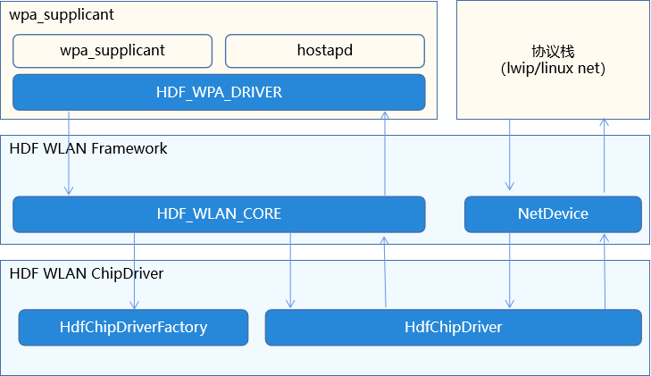

# 器件驱动移植<a name="ZH-CN_TOPIC_0000001124154504"></a>

-   [LCD驱动移植](#section1574513454119)
-   [TP驱动移植](#section20284142116422)
-   [WLAN驱动移植](#section0969448164217)

本章节讲解如何移植各类器件驱动。

## LCD驱动移植<a name="section1574513454119"></a>

移植LCD驱动的主要工作是编写一个驱动，在驱动中生成模型的实例，并完成注册。

这些LCD的驱动被放置在源码目录//drivers/framework/model/display/driver/panel中。

1.  创建Panel驱动

    创建HDF驱动，在驱动初始化中调用RegisterPanel接口注册模型实例。如:

    ```
    int32_t LCDxxEntryInit(struct HdfDeviceObject *object)
    {
        struct PanelData *panel = CreateYourPanel();
        // 注册模型实例
        if (RegisterPanel(panel) != HDF_SUCCESS) {
            HDF_LOGE("%s: RegisterPanel failed", __func__);
            return HDF_FAILURE;
        }
        return HDF_SUCCESS;
    }
    
    struct HdfDriverEntry g_xxxxDevEntry = {
        .moduleVersion = 1,
        .moduleName = "LCD_XXXX",
        .Init = LCDxxEntryInit,
    };
    
    HDF_INIT(g_xxxxDevEntry);
    ```

2.  配置加载panel驱动

    产品的所有设备信息被定义在源码文件//vendor/vendor\_name/product\_name/config/device\_info/device\_info.hcs中。修改该文件，在display的host中，名为device\_lcd的device中增加配置。

    > **注意：** 
    >moduleName 要与panel驱动中的moduleName相同。

    ```
    root {
        ...
        display :: host {
            device_lcd :: device {
                    deviceN :: deviceNode {
                        policy = 0;
                        priority = 100;
                        preload = 2;
                        moduleName = "LCD_XXXX";
                    }
            }
        }
    }
    ```


## TP驱动移植<a name="section20284142116422"></a>

本节描述如何移植触摸屏驱动。触摸屏的器件驱动被放置在源码目录//drivers/framework/model/input/driver/touchscreen中。 移植触摸屏驱动主要工作是向系统注册ChipDevice模型实例。

详细的驱动开发指导，请参考  [TOUCHSCREEN开发指导](https://gitee.com/openharmony/docs/blob/master/zh-cn/device-dev/driver/TOUCHSCREEN.md)。

1.  创建触摸屏器件驱动

    在上述touchscreen目录中创建名为touch\_ic\_name.c的文件。编写如下内容

    ```
    #include "hdf_touch.h"
    
    static int32_t HdfXXXXChipInit(struct HdfDeviceObject *device)
    {
        ChipDevice *tpImpl = CreateXXXXTpImpl();
        if(RegisterChipDevice(tpImpl) != HDF_SUCCESS) { // 注册ChipDevice模型
            ReleaseXXXXTpImpl(tpImpl);
            return HDF_FAILURE;
        }
        return HDF_SUCCESS;
    }
    
    struct HdfDriverEntry g_touchXXXXChipEntry = {
        .moduleVersion = 1,
        .moduleName = "HDF_TOUCH_XXXX", // 注意这里的moduleName要与后续的配置完全一致
        .Init = HdfXXXXChipInit,
    };
    
    HDF_INIT(g_touchXXXXChipEntry);
    ```

    其中ChipDevice中要实现如下方法：

    <a name="table63781245516"></a>
    <table><thead align="left"><tr id="row1639713218557"><th class="cellrowborder" valign="top" width="50%" id="mcps1.1.3.1.1"><p id="p53981829557"><a name="p53981829557"></a><a name="p53981829557"></a>方法</p>
    </th>
    <th class="cellrowborder" valign="top" width="50%" id="mcps1.1.3.1.2"><p id="p739811218557"><a name="p739811218557"></a><a name="p739811218557"></a>实现说明</p>
    </th>
    </tr>
    </thead>
    <tbody><tr id="row113981214559"><td class="cellrowborder" valign="top" width="50%" headers="mcps1.1.3.1.1 "><p id="p339813214552"><a name="p339813214552"></a><a name="p339813214552"></a>int32_t (*Init)(ChipDevice *device)</p>
    </td>
    <td class="cellrowborder" valign="top" width="50%" headers="mcps1.1.3.1.2 "><p id="p1139810214552"><a name="p1139810214552"></a><a name="p1139810214552"></a>实现器件初始化</p>
    </td>
    </tr>
    <tr id="row15398122145511"><td class="cellrowborder" valign="top" width="50%" headers="mcps1.1.3.1.1 "><p id="p1139820212557"><a name="p1139820212557"></a><a name="p1139820212557"></a>int32_t (*Detect)(ChipDevice *device)</p>
    </td>
    <td class="cellrowborder" valign="top" width="50%" headers="mcps1.1.3.1.2 "><p id="p939820217555"><a name="p939820217555"></a><a name="p939820217555"></a>实现器件探测</p>
    </td>
    </tr>
    <tr id="row183981216550"><td class="cellrowborder" valign="top" width="50%" headers="mcps1.1.3.1.1 "><p id="p8398142165517"><a name="p8398142165517"></a><a name="p8398142165517"></a>int32_t (*Suspend)(ChipDevice *device)</p>
    </td>
    <td class="cellrowborder" valign="top" width="50%" headers="mcps1.1.3.1.2 "><p id="p539815218558"><a name="p539815218558"></a><a name="p539815218558"></a>实现器件休眠</p>
    </td>
    </tr>
    <tr id="row1239842115519"><td class="cellrowborder" valign="top" width="50%" headers="mcps1.1.3.1.1 "><p id="p43981295511"><a name="p43981295511"></a><a name="p43981295511"></a>int32_t (*Resume)(ChipDevice *device)</p>
    </td>
    <td class="cellrowborder" valign="top" width="50%" headers="mcps1.1.3.1.2 "><p id="p173985245515"><a name="p173985245515"></a><a name="p173985245515"></a>实现器件唤醒</p>
    </td>
    </tr>
    <tr id="row5398326559"><td class="cellrowborder" valign="top" width="50%" headers="mcps1.1.3.1.1 "><p id="p103981324554"><a name="p103981324554"></a><a name="p103981324554"></a>int32_t (*DataHandle)(ChipDevice *device)</p>
    </td>
    <td class="cellrowborder" valign="top" width="50%" headers="mcps1.1.3.1.2 "><p id="p93980212554"><a name="p93980212554"></a><a name="p93980212554"></a>需要实现从器件读取数据，将触摸点数据填写入device-&gt;driver-&gt;frameData中</p>
    </td>
    </tr>
    <tr id="row03987215550"><td class="cellrowborder" valign="top" width="50%" headers="mcps1.1.3.1.1 "><p id="p1039814295515"><a name="p1039814295515"></a><a name="p1039814295515"></a>int32_t (*UpdateFirmware)(ChipDevice *device)</p>
    </td>
    <td class="cellrowborder" valign="top" width="50%" headers="mcps1.1.3.1.2 "><p id="p18398102105520"><a name="p18398102105520"></a><a name="p18398102105520"></a>实现固件升级</p>
    </td>
    </tr>
    </tbody>
    </table>

2.  配置产品，加载器件驱动

    产品的所有设备信息被定义在源码文件//vendor/vendor\_name/product\_name/config/device\_info/device\_info.hcs中。修改该文件，在名为input的host中，名为device\_touch\_chip的device中增加配置。

    > **说明：** 
    >moduleName 要与触摸屏驱动中的moduleName相同。

    ```
                    deviceN :: deviceNode {
                        policy = 0;
                        priority = 130;
                        preload = 0;
                        permission = 0660;
                        moduleName = "HDF_TOUCH_XXXX";
                        deviceMatchAttr = "touch_XXXX_configs";
                    }
    ```


## WLAN驱动移植<a name="section0969448164217"></a>

WLAN驱动分为两部分，一部分负责管理WLAN设备，另一个部分负责处理WLAN流量。

**图 1**  OpenHarmony WLAN结构示意图<a name="fig155920160203"></a>  




如图1，左半部分负责管理WLAN设备，右半部分负责WLAN流量。HDF WLAN分别为这两部分做了抽象，驱动的移植过程可以看做分别实现这两部分所需接口。这些接口有：

<a name="table1349145511213"></a>
<table><thead align="left"><tr id="row867115517211"><th class="cellrowborder" valign="top" width="17.28172817281728%" id="mcps1.1.4.1.1"><p id="p667255120"><a name="p667255120"></a><a name="p667255120"></a>接口</p>
</th>
<th class="cellrowborder" valign="top" width="39.48394839483948%" id="mcps1.1.4.1.2"><p id="p9672551125"><a name="p9672551125"></a><a name="p9672551125"></a>定义头文件</p>
</th>
<th class="cellrowborder" valign="top" width="43.23432343234324%" id="mcps1.1.4.1.3"><p id="p166785515214"><a name="p166785515214"></a><a name="p166785515214"></a>接口说明</p>
</th>
</tr>
</thead>
<tbody><tr id="row16671955128"><td class="cellrowborder" valign="top" width="17.28172817281728%" headers="mcps1.1.4.1.1 "><p id="p86712551023"><a name="p86712551023"></a><a name="p86712551023"></a>HdfChipDriverFactory</p>
</td>
<td class="cellrowborder" valign="top" width="39.48394839483948%" headers="mcps1.1.4.1.2 "><p id="p10671551126"><a name="p10671551126"></a><a name="p10671551126"></a>drivers\framework\include\wifi\hdf_wlan_chipdriver_manager.h</p>
</td>
<td class="cellrowborder" valign="top" width="43.23432343234324%" headers="mcps1.1.4.1.3 "><p id="p26725514220"><a name="p26725514220"></a><a name="p26725514220"></a>ChipDriver的Factory，用于支持一个芯片多个WLAN端口</p>
</td>
</tr>
<tr id="row186810552214"><td class="cellrowborder" valign="top" width="17.28172817281728%" headers="mcps1.1.4.1.1 "><p id="p11686551323"><a name="p11686551323"></a><a name="p11686551323"></a>HdfChipDriver</p>
</td>
<td class="cellrowborder" valign="top" width="39.48394839483948%" headers="mcps1.1.4.1.2 "><p id="p11686551723"><a name="p11686551723"></a><a name="p11686551723"></a>drivers\framework\include\wifi\wifi_module.h</p>
</td>
<td class="cellrowborder" valign="top" width="43.23432343234324%" headers="mcps1.1.4.1.3 "><p id="p26814555217"><a name="p26814555217"></a><a name="p26814555217"></a>每个WLAN端口对应一个HdfChipDriver，用来管理一个特定端口</p>
</td>
</tr>
<tr id="row13686559215"><td class="cellrowborder" valign="top" width="17.28172817281728%" headers="mcps1.1.4.1.1 "><p id="p76810555214"><a name="p76810555214"></a><a name="p76810555214"></a>NetDeviceInterFace</p>
</td>
<td class="cellrowborder" valign="top" width="39.48394839483948%" headers="mcps1.1.4.1.2 "><p id="p166818551825"><a name="p166818551825"></a><a name="p166818551825"></a>drivers\framework\include\wifi\net_device.h</p>
</td>
<td class="cellrowborder" valign="top" width="43.23432343234324%" headers="mcps1.1.4.1.3 "><p id="p368195513213"><a name="p368195513213"></a><a name="p368195513213"></a>与协议栈之间的接口，如发送数据、设置网络接口状态等</p>
</td>
</tr>
</tbody>
</table>

> **说明：** 
>详细的接口开发指导，请参考[WLAN开发](https://gitee.com/openharmony/docs/blob/master/zh-cn/device-dev/driver/WLAN.md)。

具体的移植步骤如下：

1.  创建HDF WLAN 芯片驱动

    在目录/device/vendor\_name/peripheral/wifi/chip\_name/ 创建文件 hdf\_wlan\_chip\_name.c。内容模板如下：

    ```
    static int32_t HdfWlanHisiChipDriverInit(struct HdfDeviceObject *device) {
        static struct HdfChipDriverFactory factory = CreateChipDriverFactory(); // 需要移植者实现的方法
        struct HdfChipDriverManager *driverMgr = HdfWlanGetChipDriverMgr();
        if (driverMgr->RegChipDriver(&factory) != HDF_SUCCESS) { // 注册驱动工厂
            HDF_LOGE("%s fail: driverMgr is NULL!", __func__);
            return HDF_FAILURE;
        }
        return HDF_SUCCESS;
    }
    
    struct HdfDriverEntry g_hdfXXXChipEntry = {
        .moduleVersion = 1,
        .Init = HdfWlanXXXChipDriverInit,
        .Release = HdfWlanXXXChipRelease,
        .moduleName = "HDF_WIFI_CHIP_XXX" // 注意：这个名字要与配置一致
    };
    
    HDF_INIT(g_hdfXXXChipEntry);
    ```

    在上述代码的CreateChipDriverFactory方法中，需要创建一个HdfChipDriverFactory类型的对象。该对象提供如下方法

    <a name="table8351533595"></a>
    <table><thead align="left"><tr id="row25693318916"><th class="cellrowborder" valign="top" width="50%" id="mcps1.1.3.1.1"><p id="p125683311913"><a name="p125683311913"></a><a name="p125683311913"></a>接口</p>
    </th>
    <th class="cellrowborder" valign="top" width="50%" id="mcps1.1.3.1.2"><p id="p1656103318919"><a name="p1656103318919"></a><a name="p1656103318919"></a>说明</p>
    </th>
    </tr>
    </thead>
    <tbody><tr id="row15612331994"><td class="cellrowborder" valign="top" width="50%" headers="mcps1.1.3.1.1 "><p id="p185663314920"><a name="p185663314920"></a><a name="p185663314920"></a>const char *driverName</p>
    </td>
    <td class="cellrowborder" valign="top" width="50%" headers="mcps1.1.3.1.2 "><p id="p7563330917"><a name="p7563330917"></a><a name="p7563330917"></a>当前driverName</p>
    </td>
    </tr>
    <tr id="row20561733993"><td class="cellrowborder" valign="top" width="50%" headers="mcps1.1.3.1.1 "><p id="p13561331297"><a name="p13561331297"></a><a name="p13561331297"></a>int32_t (*InitChip)(struct HdfWlanDevice *device)</p>
    </td>
    <td class="cellrowborder" valign="top" width="50%" headers="mcps1.1.3.1.2 "><p id="p756163312914"><a name="p756163312914"></a><a name="p756163312914"></a>初始化芯片</p>
    </td>
    </tr>
    <tr id="row155612337919"><td class="cellrowborder" valign="top" width="50%" headers="mcps1.1.3.1.1 "><p id="p135633315917"><a name="p135633315917"></a><a name="p135633315917"></a>int32_t (*DeinitChip)(struct HdfWlanDevice *device)</p>
    </td>
    <td class="cellrowborder" valign="top" width="50%" headers="mcps1.1.3.1.2 "><p id="p3566331094"><a name="p3566331094"></a><a name="p3566331094"></a>去初始化芯片</p>
    </td>
    </tr>
    <tr id="row18567337916"><td class="cellrowborder" valign="top" width="50%" headers="mcps1.1.3.1.1 "><p id="p157203315917"><a name="p157203315917"></a><a name="p157203315917"></a>void (*ReleaseFactory)(struct HdfChipDriverFactory *factory)</p>
    </td>
    <td class="cellrowborder" valign="top" width="50%" headers="mcps1.1.3.1.2 "><p id="p165716331596"><a name="p165716331596"></a><a name="p165716331596"></a>释放HdfChipDriverFactory对象</p>
    </td>
    </tr>
    <tr id="row1757143314912"><td class="cellrowborder" valign="top" width="50%" headers="mcps1.1.3.1.1 "><p id="p105710331694"><a name="p105710331694"></a><a name="p105710331694"></a>struct HdfChipDriver *(*Build)(struct HdfWlanDevice *device, uint8_t ifIndex)</p>
    </td>
    <td class="cellrowborder" valign="top" width="50%" headers="mcps1.1.3.1.2 "><p id="p457143320911"><a name="p457143320911"></a><a name="p457143320911"></a>创建一个HdfChipDriver；输入参数中，device是设备信息，ifIndex是当前创建的接口在这个芯片中的序号</p>
    </td>
    </tr>
    <tr id="row1157153310912"><td class="cellrowborder" valign="top" width="50%" headers="mcps1.1.3.1.1 "><p id="p155714334917"><a name="p155714334917"></a><a name="p155714334917"></a>void (*Release)(struct HdfChipDriver *chipDriver)</p>
    </td>
    <td class="cellrowborder" valign="top" width="50%" headers="mcps1.1.3.1.2 "><p id="p95717338919"><a name="p95717338919"></a><a name="p95717338919"></a>释放chipDriver</p>
    </td>
    </tr>
    <tr id="row1157143313914"><td class="cellrowborder" valign="top" width="50%" headers="mcps1.1.3.1.1 "><p id="p19571433993"><a name="p19571433993"></a><a name="p19571433993"></a>uint8_t (*GetMaxIFCount)(struct HdfChipDriverFactory *factory)</p>
    </td>
    <td class="cellrowborder" valign="top" width="50%" headers="mcps1.1.3.1.2 "><p id="p14571334915"><a name="p14571334915"></a><a name="p14571334915"></a>获取当前芯片支持的最大接口数</p>
    </td>
    </tr>
    </tbody>
    </table>

    其中Build方法负责创建一个管理指定网络接口的对象HdfChipDriver 。该对象需要提供方法:

    <a name="table16989183941017"></a>
    <table><thead align="left"><tr id="row61014406100"><th class="cellrowborder" valign="top" width="50%" id="mcps1.1.3.1.1"><p id="p111094011015"><a name="p111094011015"></a><a name="p111094011015"></a>接口</p>
    </th>
    <th class="cellrowborder" valign="top" width="50%" id="mcps1.1.3.1.2"><p id="p11102040201014"><a name="p11102040201014"></a><a name="p11102040201014"></a>说明</p>
    </th>
    </tr>
    </thead>
    <tbody><tr id="row111014409104"><td class="cellrowborder" valign="top" width="50%" headers="mcps1.1.3.1.1 "><p id="p21084017106"><a name="p21084017106"></a><a name="p21084017106"></a>int32_t (*init)(struct HdfChipDriver *chipDriver, NetDevice *netDev)</p>
    </td>
    <td class="cellrowborder" valign="top" width="50%" headers="mcps1.1.3.1.2 "><p id="p1310184012103"><a name="p1310184012103"></a><a name="p1310184012103"></a>初始化当前网络接口，这里需要向netDev提供接口NetDeviceInterFace</p>
    </td>
    </tr>
    <tr id="row210840101012"><td class="cellrowborder" valign="top" width="50%" headers="mcps1.1.3.1.1 "><p id="p71064031013"><a name="p71064031013"></a><a name="p71064031013"></a>int32_t (*deinit)(struct HdfChipDriver *chipDriver, NetDevice *netDev)</p>
    </td>
    <td class="cellrowborder" valign="top" width="50%" headers="mcps1.1.3.1.2 "><p id="p710144015101"><a name="p710144015101"></a><a name="p710144015101"></a>去初始化当前网络接口</p>
    </td>
    </tr>
    <tr id="row151094011100"><td class="cellrowborder" valign="top" width="50%" headers="mcps1.1.3.1.1 "><p id="p1910340171018"><a name="p1910340171018"></a><a name="p1910340171018"></a>struct HdfMac80211BaseOps *ops</p>
    </td>
    <td class="cellrowborder" valign="top" width="50%" headers="mcps1.1.3.1.2 "><p id="p31034071020"><a name="p31034071020"></a><a name="p31034071020"></a>WLAN基础能力接口集</p>
    </td>
    </tr>
    <tr id="row91012407102"><td class="cellrowborder" valign="top" width="50%" headers="mcps1.1.3.1.1 "><p id="p191014051019"><a name="p191014051019"></a><a name="p191014051019"></a>struct HdfMac80211STAOps *staOps</p>
    </td>
    <td class="cellrowborder" valign="top" width="50%" headers="mcps1.1.3.1.2 "><p id="p810104013106"><a name="p810104013106"></a><a name="p810104013106"></a>支持STA模式所需的接口集</p>
    </td>
    </tr>
    <tr id="row17101840111020"><td class="cellrowborder" valign="top" width="50%" headers="mcps1.1.3.1.1 "><p id="p1010204081015"><a name="p1010204081015"></a><a name="p1010204081015"></a>struct HdfMac80211APOps *apOps</p>
    </td>
    <td class="cellrowborder" valign="top" width="50%" headers="mcps1.1.3.1.2 "><p id="p710184013105"><a name="p710184013105"></a><a name="p710184013105"></a>支持AP模式所需要的接口集</p>
    </td>
    </tr>
    </tbody>
    </table>

2.  编写配置文件描述驱动支持的芯片

    在产品配置目录下创建芯片的配置文件，保存至源码路径//vendor/vendor\_name/product\_name/config/wifi/wlan\_chip\_chip\_name.hcs

    该文件模板如下：

    ```
    root {
        wlan_config {
            chip_name :& chipList {
                chip_name :: chipInst {
                    match_attr = "hdf_wlan_chips_chip_name"; /* 这是配置匹配属性，用于提供驱动的配置根 */
                    driverName = "driverName"; /* 需要与HdfChipDriverFactory中的driverName相同*/
                    sdio {
                        vendorId = 0xXXXX; /* your vendor id */
                        deviceId = [0xXXXX]; /*your supported devices */
                    }
                }
            }
        }
    }
    ```

    > **说明：** 
    >路径和文件中的vendor\_name、product\_name、chip\_name请替换成实际名称
    >vendorId 和 deviceId需要根据实际芯片的识别码进行填写。

3.  编写配置文件，加载驱动

    产品的所有设备信息被定义在源码文件//vendor/vendor\_name/product\_name/config/device\_info/device\_info.hcs中。修改该文件，在名为network的host中，名为device\_wlan\_chips的device中增加配置。模板如下：

    ```
                    deviceN :: deviceNode {
                        policy = 0;
                        preload = 2;
                        moduleName = "HDF_WLAN_CHIPS";
                        deviceMatchAttr = "hdf_wlan_chips_chip_name";
                        serviceName = "driverName";
                    }
    ```

    > **说明：** 
    >moduleName 要与HDF WLAN 芯片驱动中的moduleName相同。

4.  修改Kconfig文件，让移植的WLAN模组出现再内核配置中

    在device/vendor\_name/drivers/Kconfig中增加配置菜单，模板如下

    ```
    config DRIVERS_HDF_WIFI_chip_name
        bool "Enable chip_name Host driver"
        default n
        depends on DRIVERS_HDF_WLAN   help
          Answer Y to enable chip_name Host driver.
    ```

    > **说明：** 
    >请替换模板中的chip\_name为实际的芯片名称

5.  修改构建脚本，让驱动参与内核构建

    在源码文件//device/vendor\_name/drivers/lite.mk末尾追加如下内容

    ```
    ifeq ($(LOSCFG_DRIVERS_HDF_WIFI_chip_name), y)
        # 构建完成要链接一个叫hdf_wlan_chipdriver_chip_name的对象，建议按这个命名，防止冲突
        LITEOS_BASELIB += -lhdf_wlan_chipdriver_chip_name
        # 增加构建目录gpio
        LIB_SUBDIRS    += ../peripheral/wifi/chip_name
    endif
    ```

    > **说明：** 
    >请替换模板中的chip\_name为实际的芯片名称


