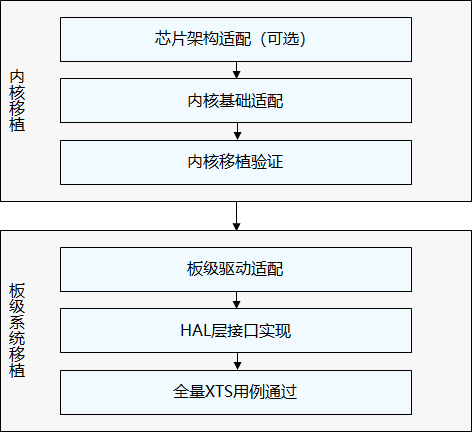

# 移植须知<a name="ZH-CN_TOPIC_0000001064030766"></a>

-   [移植目录](#section284217487490)
-   [移植流程](#section639315306506)
-   [移植规范](#section187870185219)

本文为OpenHarmony平台系统开发人员和芯片（或模组）制造商提供基础的开发移植指导，典型的芯片架构例如cortex-m系列、risc-v系列等都可以按照本文进行移植，暂时不支持蓝牙服务。OpenHarmony是个持续演进的复杂项目，随着版本和API的改变，本文将会不断更新。

本文要求读者具有一定的嵌入式系统开发经验，因此它的重点未放在基本的OS基础介绍，而更多地描述OpenHarmony平台移植过程中主要操作和所需要关注的方面。

## 移植目录<a name="section284217487490"></a>

OpenHarmony整体工程较为复杂，目录及实现为系统本身功能，如果不涉及复杂的特性增强，不需要关注每一层实现，移植过程中重点关注如下目录即可：

**表 1**  移植过程中的重点目录

<a name="table97326295179"></a>
<table><thead align="left"><tr id="row207334298172"><th class="cellrowborder" valign="top" width="27.71%" id="mcps1.2.3.1.1"><p id="p3733192991710"><a name="p3733192991710"></a><a name="p3733192991710"></a>目录名称</p>
</th>
<th class="cellrowborder" valign="top" width="72.28999999999999%" id="mcps1.2.3.1.2"><p id="p37331329101713"><a name="p37331329101713"></a><a name="p37331329101713"></a>描述</p>
</th>
</tr>
</thead>
<tbody><tr id="row17331029181714"><td class="cellrowborder" valign="top" width="27.71%" headers="mcps1.2.3.1.1 "><p id="p873314296175"><a name="p873314296175"></a><a name="p873314296175"></a>/build/lite</p>
</td>
<td class="cellrowborder" valign="top" width="72.28999999999999%" headers="mcps1.2.3.1.2 "><p id="p1573342917172"><a name="p1573342917172"></a><a name="p1573342917172"></a><span id="text8913173395513"><a name="text8913173395513"></a><a name="text8913173395513"></a>OpenHarmony</span>基础编译构建框架</p>
</td>
</tr>
<tr id="row427301117194"><td class="cellrowborder" valign="top" width="27.71%" headers="mcps1.2.3.1.1 "><p id="p11274411181915"><a name="p11274411181915"></a><a name="p11274411181915"></a>/kernel/liteos_m</p>
</td>
<td class="cellrowborder" valign="top" width="72.28999999999999%" headers="mcps1.2.3.1.2 "><p id="p92741311181915"><a name="p92741311181915"></a><a name="p92741311181915"></a>基础内核，其中芯片架构相关实现在arch目录下</p>
</td>
</tr>
<tr id="row44321715131917"><td class="cellrowborder" valign="top" width="27.71%" headers="mcps1.2.3.1.1 "><p id="p20432181501911"><a name="p20432181501911"></a><a name="p20432181501911"></a>/device</p>
</td>
<td class="cellrowborder" valign="top" width="72.28999999999999%" headers="mcps1.2.3.1.2 "><p id="p64331415171913"><a name="p64331415171913"></a><a name="p64331415171913"></a>板级相关实现，各个三方厂商按照<span id="text117091750175520"><a name="text117091750175520"></a><a name="text117091750175520"></a>OpenHarmony</span>规范适配实现，device下具体目录结构及移植过程参见<a href="移植概述-0.md">板级系统移植</a></p>
</td>
</tr>
<tr id="row19497111381917"><td class="cellrowborder" valign="top" width="27.71%" headers="mcps1.2.3.1.1 "><p id="p12498181381916"><a name="p12498181381916"></a><a name="p12498181381916"></a>/vendor</p>
</td>
<td class="cellrowborder" valign="top" width="72.28999999999999%" headers="mcps1.2.3.1.2 "><p id="p1849841341920"><a name="p1849841341920"></a><a name="p1849841341920"></a>产品级相关实现，主要由华为或者产品厂商贡献</p>
</td>
</tr>
</tbody>
</table>

device目录规则：device/\{芯片解决方案厂商\}/\{开发板\}。以hisilicon的hispark\_taurus为例：

```
device
└── hisilicon                      # 芯片解决方案厂商名
    ├── common                     # 芯片解决方案开发板公共部分
    └── hispark_taurus             # 开发板名称
        ├── BUILD.gn               # 开发板编译入口
        ├── hals                   # 芯片解决方案厂商OS硬件适配
        ├── linux                  # linux版本
        │   └── config.gni         # linux版本编译工具链和编译选项配置
        └── liteos_a               # liteos-a版本
            └── config.gni         # liteos_a版本编译工具链和编译选项配置
```

vendor目录规则：vendor/\{产品解决方案厂商\}/\{产品名称\}。以华为的wifiiot产品为例：

```
vendor                       # 产品解决方案厂商
└── huawei                   # 产品解决方案厂商名称
    └── wifiiot              # 产品名称
          ├── hals           # 产品解决方案厂商OS适配
          ├── BUILD.gn       # 产品编译脚本
          └── config.json    # 产品配置文件
```

## 移植流程<a name="section639315306506"></a>

OpenHarmony的device目录是基础芯片的适配目录，如果在三方芯片应用过程中发现此目录下已经有完整的芯片适配，则不需要再额外移植，直接跳过移植过程进行系统应用开发即可，如果该目录下无对应的芯片移植实现，则根据本文完成移植过程。OpenHarmony三方芯片移植主要过程如下：

**图 1**  芯片移植关键步骤<a name="fig24801925498"></a>  


## 移植规范<a name="section187870185219"></a>

-   满足OpenHarmony[开源贡献基本规范和准则](https://gitee.com/openharmony/docs/blob/master/zh-cn/contribute/%E5%8F%82%E4%B8%8E%E8%B4%A1%E7%8C%AE.md)。
-   三方芯片适配所需要贡献的代码主要在device、vendor和arch三个目录，参照[内核目录规范](移植概述.md)和[板级目录规范](移植概述-0.md#section6204129143013)满足基本目录命名和使用规范。

