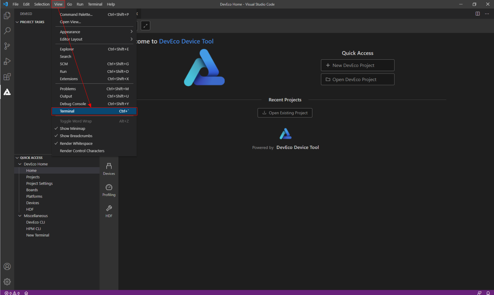
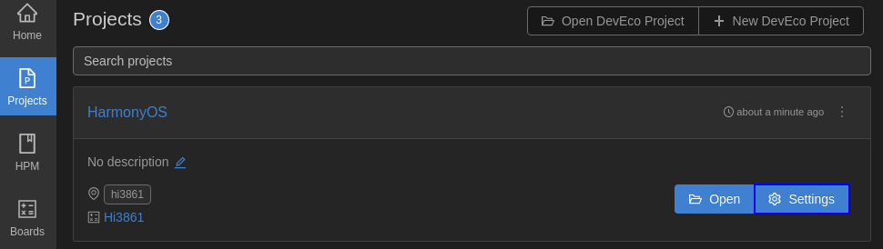

# WLAN联网<a name="ZH-CN_TOPIC_0000001152048651"></a>

-   [源码编译](#section191121332125319)
-   [镜像烧录](#section19458165166)
-   [WLAN模组联网](#section194671619167)

本示例将演示如何通过AT命令完成WLAN模组与网关联网。

## 源码编译<a name="section191121332125319"></a>

本节描述如何在Linux服务器上进行WLAN模组版本的编译。

如果Linux编译环境通过Docker方式安装，具体编译过程请参见[Docker方式获取编译环境](../get-code/获取工具.md)的编译操作。如果Linux编译环境通过软件包方式安装，请参考如下步骤。

1.  打开DevEco Device Tool工具，点击“View \> Terminal”，进入终端界面。

    **图 1**  IDE终端工具打开方法<a name="fig1975813338510"></a>  
    

    

    在终端界面使用ssh命令连接linux服务器，如“ssh  _user_@_ipaddr_”。

    **图 2**  终端界面示意图<a name="fig91165301546"></a>  
    

    

2.  进入代码根路径，并在终端窗口，执行脚本命令“hb set”、“.”，选择需要编译的版本“wifiiot\_hispark\_pegasus”。

    **图 3**  在终端界面选择目标构建版本示意图<a name="fig17727115215612"></a>  
    

    

3.  执行“hb build”启动版本构建。

    **图 4**  在终端界面执行编译命令示意图<a name="fig5493164414573"></a>  
    

    

4.  编译结束后，如果出现“wifiiot\_hispark\_pegasus build success”字样，则证明构建成功，如下图所示。

    **图 5**  编译成功示意图<a name="fig1262101218463"></a>  
    

    

5.  构建成功后，会在./out/wifiiot/路径中生成以下文件，使用如下命令可以查看，至此编译构建流程结束。

    ```
    ls -l out/hispark_pegasus/wifiiot_hispark_pegasus/
    ```

    **图 6**  编译文件存放目录示意图<a name="fig38521346164618"></a>  
    

    


## 镜像烧录<a name="section19458165166"></a>

Hi3861 WLAN模组的镜像烧录可以通过OpenHarmony IDE工具DevEco完成，工具的基本使用请参考[DevEco Device Tool使用指南](https://device.harmonyos.com/cn/docs/ide/user-guides/service_introduction-0000001050166905)，烧录过程包含如下步骤。

1.  请连接好电脑和待烧录开发板，需要连接USB口，具体可参考[Hi3861开发板介绍](https://device.harmonyos.com/cn/docs/start/introduce/oem_wifi_start_des-0000001050168548)。
2.  <a name="zh-cn_topic_0000001056563976_li848662117291"></a>打开电脑的设备管理器，查看并记录对应的串口号。

    > **说明：** 
    >如果对应的串口异常，请根据[Hi3861系列开发板串口驱动安装](https://device.harmonyos.com/cn/docs/ide/user-guides/hi3861-drivers-0000001058153433)安装USB转串口的驱动程序。

    

3.  打开DevEco Device Tool，在Projects中，点击**Settings**打开工程配置界面。

    

4.  在“Partition Configuration”页签，设置待烧录文件信息，默认情况下，DevEco Device Tool已针对Hi3861系列开发板进行适配，无需单独修改。
5.  在“hi3861”页签，设置烧录选项，包括upload\_port、upload\_partitions和upload\_protocol。

    -   upload\_port：选择步骤[2](#zh-cn_topic_0000001056563976_li848662117291)中查询的串口号。
    -   upload\_protocol：选择烧录协议，固定选择“burn-serial”。
    -   upload\_partitions：选择待烧录的文件，默认选择hi3861\_app。

    

6.  所有的配置都修改完成后，在工程配置页签的顶部，点击**Save**进行保存。
7.  打开工程文件，在DevEco Device Tool界面的“PROJECT TASKS”中，点击hi3861下的**Upload**按钮，启动烧录。

    

8.  启动烧录后，显示如下提示信息时，请按开发板上的RST按钮重启开发板。

    

9.  重新上电后，启动烧录，界面提示如下信息时，表示烧录成功。

    


## WLAN模组联网<a name="section194671619167"></a>

完成版本构建及烧录后，下面开始介绍如何在串口终端上执行AT命令，使WLAN模组联网。

1.  保持Windows工作台和WLAN模组的连接状态，在DevEco工具最下方，点击“DevEco:Serial Monitor”按钮。

    **图 7**  打开DevEco串口终端示意图<a name="fig12489182991119"></a>  
    

    

2.  复位WLAN模组，终端界面显示“ready to OS start”，则启动成功。

    **图 8**  WLAN复位成功示意图<a name="fig496084516332"></a>  
    

    

3.  在DevEco的串口终端中，依次执行如下AT命令，启动STA模式，连接指定AP热点，并开启DHCP功能。

    ```
    AT+STARTSTA                             # 启动STA模式
    AT+SCAN                                 # 扫描周边AP
    AT+SCANRESULT                           # 显示扫描结果
    AT+CONN="SSID",,2,"PASSWORD"            # 连接指定AP，其中SSID/PASSWORD为待连接的热点名称和密码
    AT+STASTAT                              # 查看连接结果
    AT+DHCP=wlan0,1                         # 通过DHCP向AP请求wlan0的IP地址
    ```

4.  查看WLAN模组与网关联通是否正常，如下图所示。

    ```
    AT+IFCFG                                # 查看模组接口IP
    AT+PING=X.X.X.X                         # 检查模组与网关的联通性，其中X.X.X.X需替换为实际的网关地址
    ```

    **图 9**  WLAN模组联网成功示意图<a name="fig1166371318339"></a>  
    

    


