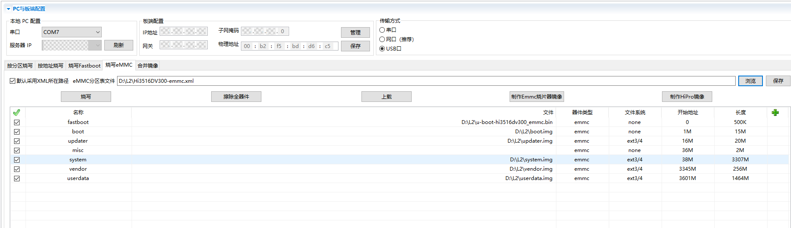

# Hi3516标准系统入门（命令行方式）

>  **注意：**
>
> **从3.2版本起，标准系统不再针对Hi3516DV300进行适配验证，建议您使用RK3568进行标准系统的设备开发。**
>
> **如您仍然需要使用Hi3516DV300进行标准系统相关开发操作，则可能会出现无法适配的现象，此时请联系芯片供应商获取相关适配指导，或自行完成适配。**


除小型系统外，Hi3516DV300开发板还支持标准系统。此章节简要介绍如何使用命令行在Hi3516DV300开发板上进行标准系统的开发。


下方将展示如何在单板上运行第一个应用程序，其中包括新建应用程序、编译、烧写、运行等步骤，最终输出“Hello World！”。


在进行开发之前，请首先完成[搭建开发环境](quickstart-pkg-prepare.md)。


## 编写“Hello World”程序


### 示例目录


```
applications/sample/hello
 │── BUILD.gn
 │── include
 │   └── helloworld.h
 │── src
 │   └── helloworld.c
 ├── bundle.json
 build
 └── subsystem_config.json
 vendor/hisilicon
 └── Hi3516DV300
     └── config.json
```


### 开发步骤

请在源码目录中通过以下步骤创建“Hello World”应用程序：

1. 创建目录，编写业务代码。
   新建applications/sample/hello/src/helloworld.c目录及文件，代码如下所示，用户可以自定义修改打印内容（例如：修改World为OHOS）。其中helloworld.h包含字符串打印函数HelloPrint的声明。当前应用程序可支持标准C及C++的代码开发。

   
   ```
   #include <stdio.h>
   #include "helloworld.h"
   int main(int argc, char **argv)
   {
       HelloPrint();
       return 0;
   }
   void HelloPrint()
   {
       printf("\n\n");
       printf("\n\t\tHello World!\n");
       printf("\n\n");
   }
   ```

   再添加头文件applications/sample/hello/include/helloworld.h，代码如下所示。

   
   ```
   #ifndef HELLOWORLD_H
   #define HELLOWORLD_H
   #ifdef __cplusplus
   #if __cplusplus
   extern "C" {
   #endif
   #endif
   void HelloPrint();
   #ifdef __cplusplus
   #if __cplusplus
   }
   #endif
   #endif
   #endif // HELLOWORLD_H
   ```

2. 新建编译组织文件。
   1. 新建applications/sample/hello/BUILD.gn文件，内容如下所示：
      
       ```
       import("//build/ohos.gni")  # 导入编译模板
       ohos_executable("helloworld") { # 可执行模块
         sources = [       # 模块源码
           "src/helloworld.c"
         ]
         include_dirs = [  # 模块依赖头文件目录
           "include" 
         ]
         cflags = []
         cflags_c = []
         cflags_cc = []
         ldflags = []
         configs = []
         deps =[]    # 部件内部依赖
         part_name = "hello"    # 所属部件名称，必选
         install_enable = true  # 是否默认安装（缺省默认不安装），可选
       }
       ```
   2. 新建applications/sample/hello/bundle.json文件，添加sample部件描述，内容如下所示。
      
       ```
       {
           "name": "@ohos/hello",
           "description": "Hello world example.",
           "version": "3.1",
           "license": "Apache License 2.0",
           "publishAs": "code-segment",
           "segment": {
               "destPath": "applications/sample/hello"
           },
           "dirs": {},
           "scripts": {},
           "component": {
               "name": "hello",
               "subsystem": "sample",
               "syscap": [],
               "features": [],
               "adapted_system_type": [ "mini", "small", "standard" ],
               "rom": "10KB",
               "ram": "10KB",
               "deps": {
                   "components": [],
                   "third_party": []
               },
               "build": {
                   "sub_component": [
                       "//applications/sample/hello:helloworld"
                   ],
                   "inner_kits": [],
                   "test": []
               }
           }
       }
       ```

       bundle.json文件包含两个部分，第一部分描述该部件所属子系统的信息，第二部分component则定义该部件构建相关配置。添加的时候需要指明该部件包含的模块sub_component，假如有提供给其它部件的接口，需要在inner_kits中说明，假如有测试用例，需要在test中说明，inner_kits与test没有也可以不添加。

3. 修改子系统配置文件。
   在build/subsystem_config.json中添加新建的子系统的配置。

   
   ```
   "sample": {
       "path": "applications/sample/hello",
       "name": "sample"
     },
   ```

4. 修改产品配置文件。
   在vendor/hisilicon/Hi3516DV300/config.json中添加对应的hello部件，直接添加到原有部件后即可。

   
   ```
       "usb:usb_manager_native":{},
       "applications:prebuilt_hap":{},
       "sample:hello":{},
       "wpa_supplicant-2.9:wpa_supplicant-2.9":{},
   ```


## 编译

OpenHarmony支持hb和build.sh两种编译方式。此处介绍hb方式，build.sh脚本编译方式请参考[使用build.sh脚本编译源码](quickstart-pkg-common-build.md#使用buildsh脚本编译源码)。

想要详细了解OpenHarmony编译构建模块功能的开发者可参考[编译构建指南](../subsystems/subsys-build-all.md)。


### 前提条件

- 已正确[安装库和工具集](quickstart-pkg-install-package.md)。

- 已正确[安装编译工具](quickstart-pkg-install-tool.md)。

- “Hello World”程序已编写完成。

- 可正常登录Ubuntu环境。


### 操作步骤

请进入源码根目录，执行如下命令进行编译：

1. 设置编译路径。
   
   ```
   hb set
   ```

2. 选择当前路径。
   
   ```
   .
   ```

3. 在hisilicon下选择hispark_taurus_standard并回车。
   >  **说明：**
   >
   > 同样的开发板在适配不同的场景时，要采用的编译形态不同（即此处要选择的product不同），请参考[编译形态整体说明](quickstart-appendix-compiledform.md)。

     **图1** Hi3516编译设置图例  
   
   

4. 执行编译。
   >  **说明：**
   > - 单独编译一个部件（例如hello），可使用“hb build -T _目标名称_”进行编译。
   > 
   > - 增量编译整个产品，可使用“hb build”进行编译。
   > 
   > - 完整编译整个产品，可使用“hb build -f”进行编译。
   > 
   > 此处以完整编译整个产品为例进行说明。

   
   ```
   hb build -f
   ```

5. 编译结束后，出现“build success”字样，则证明构建成功。
   >  **须知：**
   > 编译结果文件及编译日志文件获取路径：out/hi3516dv300。


## 烧录

针对Hi3516DV300开发板，除了DevEco Device Tool（操作方法请参考[烧录](quickstart-appendix-hi3516-ide.md#烧录)）外，还可以使用HiTool进行烧录。


### 前提条件

- 开发板相关源码已编译完成，已形成烧录文件。

- 客户端（操作平台，例如Windows系统）已下载并安装[HiTool工具](http://www.hihope.org/download/download.aspx)。

- 客户端（操作平台，例如Windows系统）已安装USB驱动，可参考[Hi3516DV300开发板USB驱动安装指导](https://gitee.com/link?target=https%3A%2F%2Fdevice.harmonyos.com%2Fcn%2Fdocs%2Fdocumentation%2Fguide%2Fusb_driver-0000001058690393)。

- 客户端已安装串口终端工具（例如IPOP）。

- 使用USB线缆、串口线缆连接客户端与开发板。


### 操作步骤

1. 准备烧录相关文件。
   1. 在客户端新建用于保存烧录文件的文件夹，例如D:\L2。
   2. 将编译完成的源码包下载至客户端并解压，将烧录相关文件拷贝至步骤1中新建的文件夹。
       
      Hi3516DV300开发板烧写所需文件为：boot.img、Hi3516DV300-emmc.xml、system.img、u-boot-hi3516dv300_emmc.bin、uImage、updater.img、userdata.img、vendor.img。

2. 使用HiTool烧录。
   1. 打开HiTool。
   2. 设置HiTool参数。
       
      传输方式选择USB口，烧写方式选择烧写eMMC（单板的存储介质为eMMC）。
   3. 单击浏览在步骤1创建的文件夹中选择烧写配置文件（例如Hi3516DV300-emmc.xml）。
      
       
   4. 单击烧写后，按住开发板上串口旁的按钮（Update键），并拔插USB线（上下电）。
       
      烧录开始后，可以在HiTool工具下方的控制台区域观察到烧录过程中的打印信息。

      烧录完成后，HiTool弹出提示框显示烧写成功。
   5. 单击确定。

3. 导入启动参数。
   1. 使用终端工具打开串口。
   2. 拔插开发板电源使其重启，3s内在串口终端输入回车。
       
      终端界面中出现hisilicon \#表示已连接开发板串口。
   3. 在串口终端拷贝如下启动参数后，按回车完成配置。
      
       ```
       setenv bootargs 'mem=640M console=ttyAMA0,115200 mmz=anonymous,0,0xA8000000,384M clk_ignore_unused rootdelay=10 hardware=Hi3516DV300 init=/init root=/dev/ram0 rw blkdevparts=mmcblk0:1M(boot),15M(kernel),20M(updater),2M(misc),3307M(system),256M(vendor),-(userdata)';setenv bootcmd 'mmc read 0x0 0x82000000 0x800 0x4800; bootm 0x82000000'
       
       saveenv
       
       reset
       ```

       >  **须知：**
       > 输入启动参数时，请勿自行删除其中的空行。


## 运行

系统启动成功后，取源码out目录下的helloworld可执行文件放入系统的bin目录，通过以下步骤运行“Hello World”。


### 操作步骤

1. 在启动界面进入bin目录。
   
   ```
   cd bin
   ```

2. 进入bin目录后可以看到helloworld文件，通过以下命令运行helloworld程序。
   
   ```
   ./helloworld
   ```

   界面打印“Hello World！”，程序运行成功。


### 下一步学习

恭喜！您已经完成了标准系统的快速入门，接下来可[开发一个小示例](../guide/device-clock-guide.md)，进一步熟悉OpenHarmony的开发。
