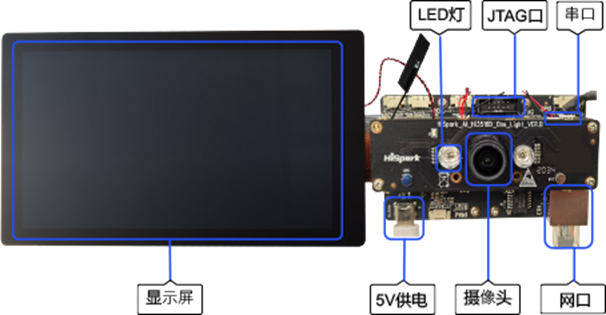

# Hi3516开发板介绍

## 简介

Hi3516DV300作为新一代行业专用Smart HD IP摄像机SOC，集成新一代ISP（Image Signal Processor）、H.265视频压缩编码器以及高性能NNIE引擎，具备低码率、高画质、低功耗等特点，并具备强劲的智能处理和分析能力。

  **图1** Hi3516单板正面外观图  

## 开发板规格

  **表1** Hi3516开发板规格清单

| 规格类型 | 规格清单 | 
| -------- | -------- |
| **处理器及内部存储** | -&nbsp;Hi3516DV300芯片 -&nbsp;DDR3&nbsp;1GB -&nbsp;eMMC4.5，8GB容量 | 
| **外部器件** | -&nbsp;以太网口 -&nbsp;音频视频 &nbsp;&nbsp;-&nbsp;1路语音输入 &nbsp;&nbsp;-&nbsp;1路单声道（AC_L）输出，接3W功放（LM4871） &nbsp;&nbsp;-&nbsp;MicroHDMI（1路HDMI&nbsp;1.4） -&nbsp;摄像头 &nbsp;&nbsp;-&nbsp;传感器IMX335 &nbsp;&nbsp;-&nbsp;镜头M12，焦距4mm，光圈1.8 -&nbsp;显示屏 &nbsp;&nbsp;-&nbsp;LCD连接器（2.35寸） &nbsp;&nbsp;-&nbsp;LCD连接器（5.5寸） -&nbsp;外部器件及接口 &nbsp;&nbsp;-&nbsp;SD卡接口 &nbsp;&nbsp;-&nbsp;JTAG/I2S接口 &nbsp;&nbsp;-&nbsp;ADC接口 &nbsp;&nbsp;-&nbsp;舵机接口 &nbsp;&nbsp;-&nbsp;Grove连接器 &nbsp;&nbsp;-&nbsp;USB2.0（Type&nbsp;C） &nbsp;&nbsp;-&nbsp;功能按键3个，2个用户自定义按键，1个升级按键 &nbsp;&nbsp;-&nbsp;LED指示灯，绿灯，红灯 | 
