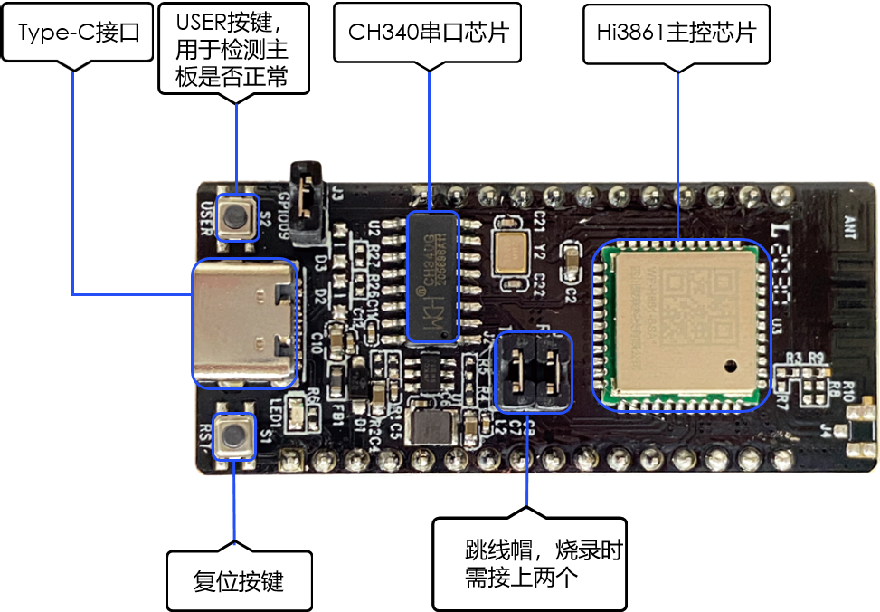
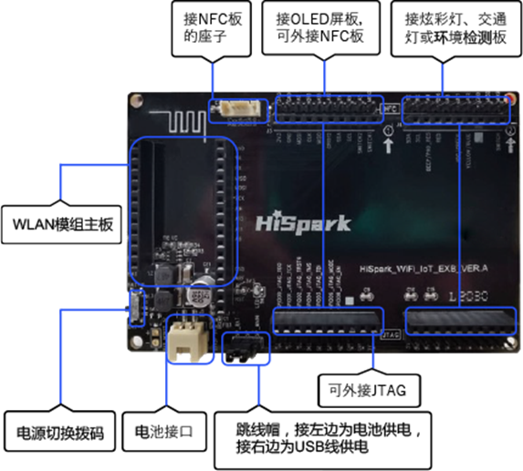

# Hi3861开发板介绍

## 简介

Hi3861开发板是一片大约2cm\*5cm大小的开发板，是一款高度集成的2.4GHz WLAN SoC芯片，集成IEEE 802.11b/g/n基带和RF（Radio Frequency）电路。支持，并配套提供开放、易用的开发和调试运行环境。

  **图1** Hi3861开发板外观图  

另外，Hi3861开发板还可以通过与Hi3861底板连接，扩充自身的外设能力，底板如下图所示。

  **图2** Hi3861底板外观图  

- RF电路包括功率放大器PA（Power Amplifier）、低噪声放大器LNA（Low Noise Amplifier）、RF Balun、天线开关以及电源管理等模块；支持20MHz标准带宽和5MHz/10MHz窄带宽，提供最大72.2Mbit/s物理层速率。

- Hi3861 WLAN基带支持正交频分复用（OFDM）技术，并向下兼容直接序列扩频（DSSS）和补码键控（CCK）技术，支持IEEE 802.11 b/g/n协议的各种数据速率。

- Hi3861芯片集成高性能32bit微处理器、硬件安全引擎以及丰富的外设接口，外设接口包括SPI（Synchronous Peripheral Interface）、UART（Universal Asynchronous Receiver &amp; Transmitter）、I2C（The Inter Integrated Circuit）、PWM（Pulse Width Modulation）、GPIO（General Purpose Input/Output）和多路ADC（Analog to Digital Converter），同时支持高速SDIO2.0（Secure Digital Input/Output）接口，最高时钟可达50MHz；芯片内置SRAM（Static Random Access Memory）和Flash，可独立运行，并支持在Flash上运行程序。

- Hi3861芯片适用于智能家电等物联网智能终端领域。

  **图3** Hi3861功能框图  

## 资源和约束

Hi3861开发板资源十分有限，整板共2MB FLASH，352KB RAM。在编写业务代码时，需注意资源使用效率。

## 开发板规格

  **表1** Hi3861开发板规格清单

| 规格类型 | 规格清单 | 
| -------- | -------- |
| 通用规格 | -&nbsp;1×1&nbsp;2.4GHz频段（ch1～ch14） -&nbsp;PHY支持IEEE&nbsp;802.11b/g/n -&nbsp;MAC支持IEEE802.11&nbsp;d/e/h/i/k/v/w -&nbsp;内置PA和LNA，集成TX/RX&nbsp;Switch、Balun等 -&nbsp;支持STA和AP形态，作为AP时最大支持6&nbsp;个STA接入 -&nbsp;支持WFA&nbsp;WPA/WPA2&nbsp;personal、WPS2.0 -&nbsp;支持与BT/BLE芯片共存的2/3/4&nbsp;线PTA方案 -&nbsp;电源电压输入范围：2.3V～3.6V -&nbsp;IO电源电压支持1.8V和3.3V -&nbsp;支持RF自校准方案 -&nbsp;低功耗： &nbsp;&nbsp;-&nbsp;Ultra&nbsp;Deep&nbsp;Sleep模式：5μA&nbsp;\@3.3V &nbsp;&nbsp;-&nbsp;DTIM1：1.5mA&nbsp;\@3.3V &nbsp;&nbsp;-&nbsp;DTIM3：0.8mA&nbsp;\@3.3V | 
| PHY特性 | -&nbsp;支持IEEE802.11b/g/n单天线所有的数据速率 -&nbsp;支持最大速率：72.2Mbps\@HT20&nbsp;MCS7 -&nbsp;支持标准20MHz带宽和5M/10M窄带宽 -&nbsp;支持STBC -&nbsp;支持Short-GI | 
| MAC特性 | -&nbsp;支持A-MPDU，A-MSDU -&nbsp;支持Blk-ACK -&nbsp;支持QoS，满足不同业务服务质量需求 | 
| CPU子系统 | -&nbsp;高性能&nbsp;32bit微处理器，最大工作频率160MHz -&nbsp;内嵌SRAM&nbsp;352KB、ROM&nbsp;288KB -&nbsp;内嵌&nbsp;2MB&nbsp;Flash | 
| 外围接口 | -&nbsp;1个SDIO接口、2个SPI接口、2个I2C接口、3个UART接口、15个GPIO接口、7路ADC输入、6路PWM、1个I2S接口（注：上述接口通过复用实现） -&nbsp;外部主晶体频率40M或24M | 
| 其他信息 | -&nbsp;封装：QFN-32，5mm×5mm -&nbsp;工作温度：-40℃&nbsp;～&nbsp;+85℃ | 

## 关键特性

基于Hi3861平台提供了多种开放能力，提供的关键组件如下表所示。

  **表2** 关键组件列表

| 组件名 | 能力介绍 | 
| -------- | -------- |
| WLAN服务 | 提供WLAN服务能力。包括：station和hotspot模式的连接、断开、状态查询等。 | 
| 模组外设控制 | 提供操作外设的能力。包括：I2C、I2S、ADC、UART、SPI、SDIO、GPIO、PWM、FLASH等。 | 
| 分布式软总线 | 在分布式网络中，提供设备被发现、数据传输的能力。 | 
| 设备安全绑定 | 提供在设备互联场景中，数据在设备之间的安全流转的能力。 | 
| 基础加解密 | 提供密钥管理、加解密等能力。 | 
| 系统服务管理 | 系统服务管理基于面向服务的架构，提供了统一化的系统服务开发框架。 | 
| 启动引导 | 提供系统服务的启动入口标识。在系统服务管理启动时，调用boostrap标识的入口函数，并启动系统服务。 | 
| 系统属性 | 提供获取与设置系统属性的能力。 | 
| 基础库 | 提供公共基础库能力。包括：文件操作、KV存储管理等。 | 
| DFX | 提供DFX能力。包括：流水日志、时间打点等。 | 
| XTS | 提供生态认证测试套件的集合能力。 | 
