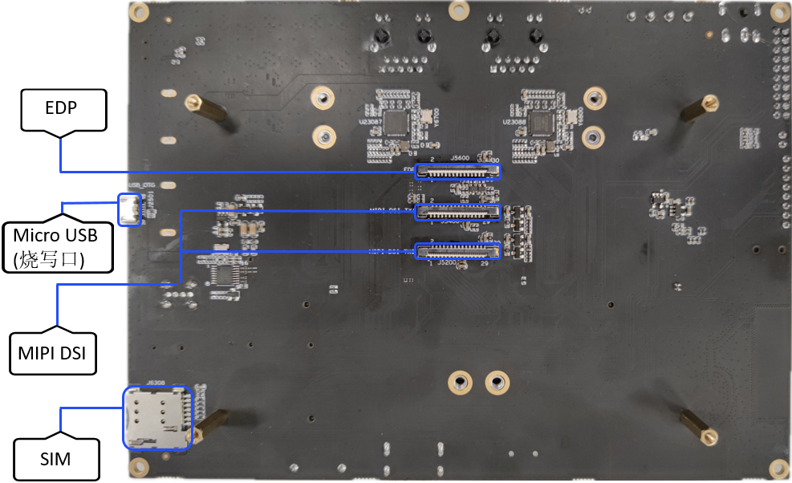

# RK3568开发板介绍

## 开发板简介

RK3568开发板基于Rockchip RK3568芯片，集成双核心架构GPU以及高效能NPU；搭载四核64位Cortex-A55处理器，采用22nm先进工艺，主频高达2.0GHz；支持蓝牙、Wi-Fi、音频、视频和摄像头等功能，拥有丰富的扩展接口，支持多种视频输入输出接口；配置双千兆自适应RJ45以太网口，可满足NVR、工业网关等多网口产品需求。

  **图1** RK3568开发板正面  

  **图2** RK3568开发板背面  

## 开发板规格

  **表1** RK3568开发板规格说明

| 规格类型 | 规格清单 | 
| -------- | -------- |
| 显示接口 | -&nbsp;1×HDMI2.0（Type-A）接口，支持4K/60fps输出 -&nbsp;2×MIPI接口，支1920\*1080\@60fps输出 -&nbsp;1×eDP接口，支持2K\@60fps输出 | 
| 音频接口 | -&nbsp;1×8ch&nbsp;I2S/TDM/PDM -&nbsp;1×HDMI音频输出 -&nbsp;1×喇叭输出 -&nbsp;1×耳机输出 -&nbsp;1×麦克风，板载音频输入 | 
| 以太网 | 2×GMAC（10/100/1000M） | 
| 无线网络 | SDIO接口，支持WIFI6&nbsp;5G/2.5G，BT4.2 | 
| 摄像头接口 | MIPI-CSI2，1x4-lane/2x2-lane\@2.5Gbps/lane | 
| USB | -&nbsp;2×USB2.0&nbsp;Host，Type-A -&nbsp;1×USB3.0&nbsp;Host，Type-A -&nbsp;1×USB3.0&nbsp;OTG | 
| PCIe | 1×2Lanes&nbsp;PCIe3.0&nbsp;Connector&nbsp;（RC&nbsp;Mode） | 
| SATA | 1×SATA3.0&nbsp;Connector | 
| SDMMC | 1×Micro&nbsp;SD&nbsp;Card3.0 | 
| 按键 | -&nbsp;1×Vol+/Recovery -&nbsp;1×Reset -&nbsp;1×Power -&nbsp;1×Vol- -&nbsp;1×Mute | 
| 调试 | 1×调试串口 | 
| RTC | 1×RTC | 
| IR | 1×IR | 
| 三色灯 | 3×LED | 
| G-sensor | 1×G-sensor | 
| FAN | 1×Fan | 
| 扩展接口 | 20Pin扩展接口包括： -&nbsp;2×ADC接口 -&nbsp;2×I2C接口 -&nbsp;7×GPIO口（或者3×gpio&nbsp;+&nbsp;4×uart信号） -&nbsp;3×VCC电源（12V、3.3V、5V） | 
| 底板尺寸 | 180mm×130mm | 
| PCB规格 | 4&nbsp;层板 | 
