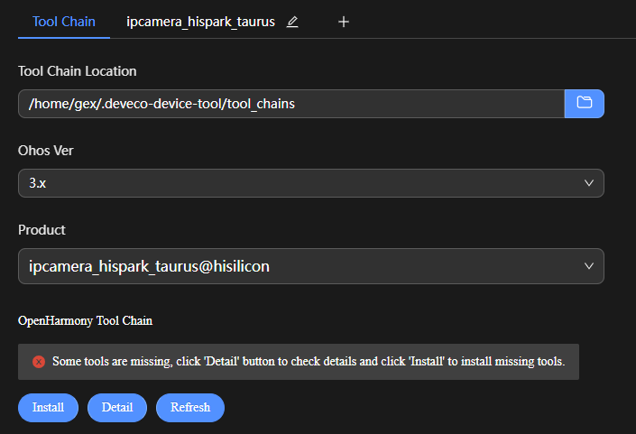
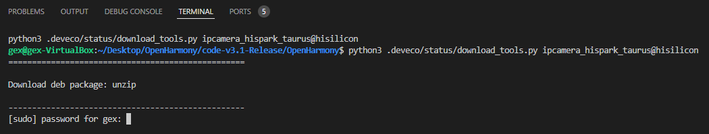
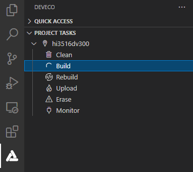

# 编译

DevEco Device Tool支持Hi3516DV300开发板的源码一键编译功能，提供编译工具链和编译环境依赖的检测及一键安装，简化复杂编译环境的同时，提升了编译的效率。

>  **说明：**
> Hi3516DV300编译环境为Ubuntu环境。

1. 在菜单栏中点击**Project Settings**，进入Hi3516DV300工程配置界面。

   

2. 在“Tool Chain”页签中，DevEco Device Tool会自动检测依赖的编译工具链是否完备。

   - 如工具为“uninstalled”状态（），可单击**Download Uninstalled Tools**，自动安装所需工具，或单击工具后方的**Download**安装指定工具。
   - 如当前识别到的工具类型有缺失，需要补充，可单击**Add Utility**添加。
   - 如工具无法通过**Download**方式安装，表示该工具未被DevEco Device Tool收录，需要开发者自行下载到本地后单击**Import**导入。
   - 如“OpenHarmony Environment Dependency”的状态异常（），请单击**Install**安装。

   

   部分工具安装需要使用root权限，请在“TERMINAL”窗口输入用户密码进行安装。

   >  **说明：**
   >
   > - 如果出现安装pip组件失败，可参考[修改Python源的方法](https://device.harmonyos.com/cn/docs/documentation/guide/ide-set-python-source-0000001227639986)进行修改，完成尝试重新安装。
   > - 若出现安装apt组件失败，可参考[修改apt源的方法](https://device.harmonyos.com/cn/docs/documentation/guide/faq-toolchain-install-0000001301623822)进行修改，完成后尝试重新安装。

   

   安装完成后，工具和环境依赖的状态显示为。
   
3. 在**ipcamera_hispark_taurus**配置页签中，设置源码的编译类型**build_type**，默认为“debug”类型，请根据需要进行修改。

   

4. 在“PROJECT TASKS”中，单击对应开发板下的**Build**，执行编译。

   

5. 等待编译完成，在**TERMINAL**窗口输出“SUCCESS”，编译完成。

   

   编译完成后，可以在工程的**out**目录下，查看编译生成的文件，用于后续的[Hi3516DV300开发板烧录](quickstart-ide-3516-burn.md)。
