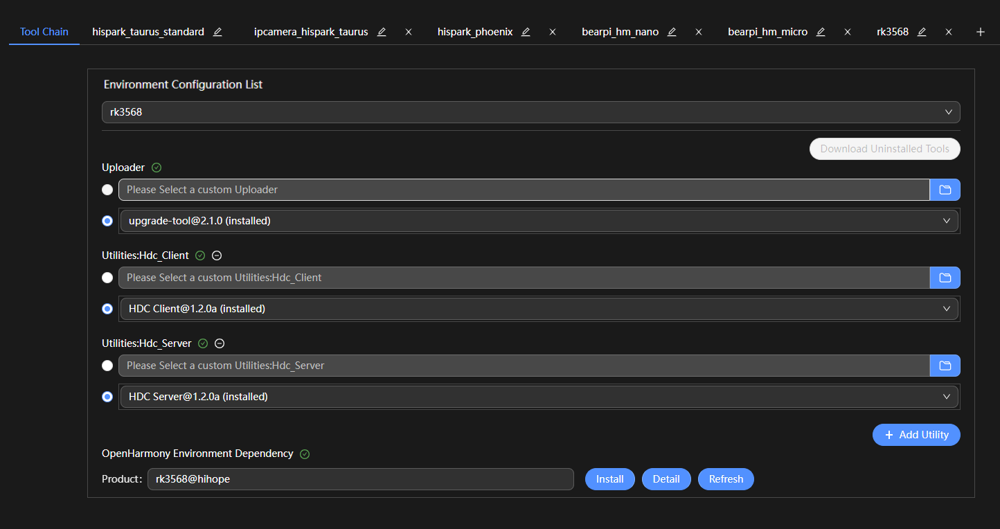
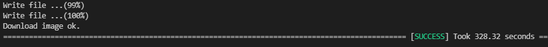

# 烧录

烧录是指将编译后的程序文件下载到芯片开发板上的动作，为后续的程序调试提供基础。DevEco Device Tool提供一键烧录功能，操作简单，能快捷、高效的完成程序烧录，提升烧录的效率。

RK3568的镜像烧录通过Windows环境进行烧录，开发者启动烧录操作后，DevEco Device Tool通过Remote远程模式，将Ubuntu环境下编译生成的待烧录程序文件拷贝至Windows目录下，然后通过Windows的烧录工具将程序文件烧录至开发板中。

## 前提条件

[下载](https://gitee.com/hihope_iot/docs/blob/master/HiHope_DAYU200/%E7%83%A7%E5%86%99%E5%B7%A5%E5%85%B7%E5%8F%8A%E6%8C%87%E5%8D%97/windows/DriverAssitant_v5.1.1.zip)并安装驱动DriverInstall.exe。当安装窗口显示“安装驱动成功”时，即表示驱动已安装完成，可进入后续烧录步骤。

>  **说明：**
> 如果已经安装旧版本的烧写工具，请先点击"驱动卸载"按钮卸载驱动，然后再点击"驱动安装"按钮安装驱动。

## 操作步骤

1. 请连接好电脑和待烧录开发板，连接USB接口，具体可参考[RK3568开发板介绍](quickstart-appendix-rk3568.md)。

2. 在DevEco Device Tool中，选择**REMOTE DEVELOPMENT &gt; Local PC**，查看远程计算机（Ubuntu开发环境）与本地计算机（Windows开发环境）的连接状态。

   - 如果Local PC右边连接按钮为，则远程计算机与本地计算机为已连接状态，不需要执行其他操作。
   - 如果Local PC右边连接按钮为，则点击绿色按钮进行连接。连接时DevEco Device Tool会重启服务，因此请不要在下载源码或源码编译过程中进行连接，否则会中断任务。

   

3. 在菜单栏中点击**Project Settings**按钮，进入RK3568工程配置界面。

   

4. 在**Tool Chain**页签，检查Uploader烧录器工具是否已安装。

   - 如工具为“uninstalled”状态（），可单击**Download Uninstalled Tools**，自动安装所需工具，或单击工具后方的**Download**安装指定工具。
   - 如工具无法通过**Download**方式安装，表示该工具未被DevEco Device Tool收录，需要开发者自行下载到本地后单击**Import**导入。

   

5. 在**rk3568**页签，设置烧录选项，包括upload_partitions和upload_protocol。配置完成后工程将自动保存。

   - **upload_partitions_profile**：选择待烧录程序的配置文件，该配置文件会指定烧录文件名称、起始烧录地址、地址长度等信息；同时请勾选**Enable to use upload_partitions_profile for upload**选项。
      >  **说明：**
      >
      > 如需修改烧录profile文件，在设置烧录分区起始地址和分区长度时，应根据实际待烧录文件的大小进行设置，要求设置的烧录分区大小，要大于待烧录文件的大小；同时，各烧录文件的分区地址设置不能出现重叠。
      > 
      > 首次烧录，请勾选**Enable to use upload_partitions_profile for upload**选项，会自动生成upload_partitions文件。再次烧录时，可根据实际情况选择生成upload_partitions文件进行自定义烧录，也可以再勾选**Enable to use upload_partitions_profile for upload**选项，使用upload_partitions_profile重新生成upload_partitions文件用于烧录。
   - **upload_protocol**：选择烧录协议，固定选择“upgrade”。

   

6. 在**PROJECT TASKS**中，点击rk3568下的**Upload**按钮启动烧录。

   

7. 当屏幕提示“Operation paused，Please press Enter key to continue”，请按**回车键**继续。
   >  **说明：**
   > 如果开发板未处于烧录模式，屏幕会提示“The board is not in Loader mode.Please Hold on the VOL+key...”，此时，请长按音量+键，3秒后点击**RESET**键，然后再过3秒放开音量+键，使开发板进入烧录模式。

   等待开发板烧录完成，当屏幕提示如下信息时，表示烧录成功。

   
