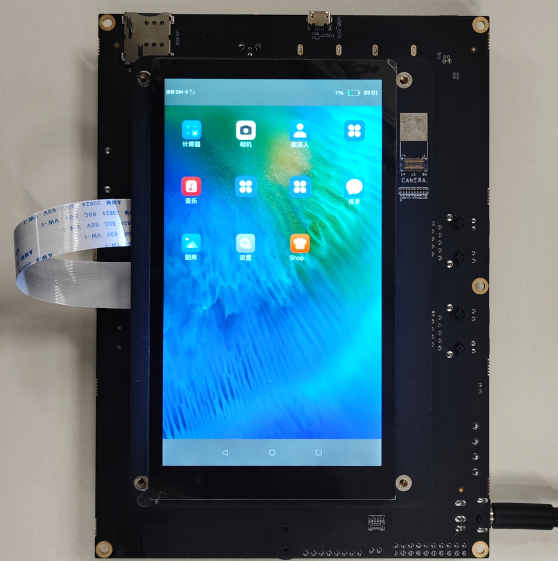

# 运行

## 启动系统

烧录完成重启开发板后，系统将会自动启动。开发板附带的屏幕呈现以下界面，表明系统已运行成功。

  **图1** 系统启动效果图  

 

## 运行“Hello World”

1. 设备启动后打开串口工具（以putty为例），波特率设置为1500000，连接设备。

   

2. 打开串口后，在任意目录（以设备根目录为例）下输入命令helloworld后回车，界面打印“Hello World！”，程序运行成功。

   
