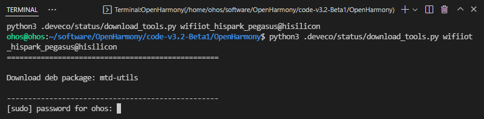
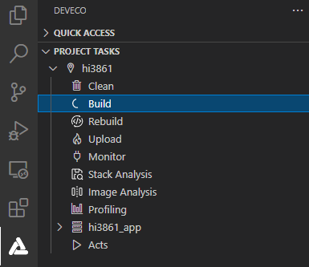
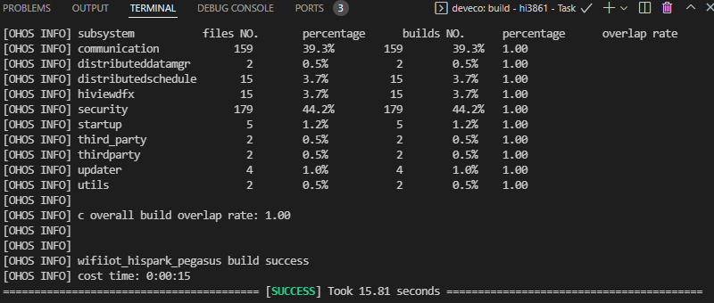

# 编译

DevEco Device Tool支持Hi3861V100开发板的源码一键编译功能，提供编译工具链和编译环境依赖的检测及一键安装，简化复杂编译环境的同时，提升了编译的效率。

>  **说明：**
> Hi3861V100编译环境为Ubuntu环境。

1. 在菜单栏中点击**Project Settings**，进入Hi3861工程配置界面。

   

2. 在**Tool Chain**页签中，DevEco Device Tool会自动检测依赖的编译工具链是否完备，如果提示部分工具缺失，可点击**Install**，自动安装所需工具链。

   

3. 安装Hi3861V100相关工具链，部分工具安装需要使用root权限，请在**TERMINAL**窗口输入用户密码进行安装。
   >  **说明：**
   >
   > - 如果出现安装pip组件失败，可参考[修改Python源的方法](https://device.harmonyos.com/cn/docs/documentation/guide/ide-set-python-source-0000001227639986)进行修改，完成尝试重新安装。
   > - 若出现安装apt组件失败，可参考[修改apt源的方法](https://device.harmonyos.com/cn/docs/documentation/guide/faq-toolchain-install-0000001301623822)进行修改，完成后尝试重新安装。

   

   工具链自动安装完成后如下图所示。

   

4. 在**wifiiot_hispark_pegasus**配置页签中，设置源码的编译类型**build_type**，默认为"debug"类型，请根据需要进行修改。然后点击**Save**进行保存。

   

5. 在DevEco Device Tool界面的**PROJECT TASKS**中，点击对应开发板下的**Build**，执行编译。

   

6. 等待编译完成，在**TERMINAL**窗口输出“SUCCESS”，编译完成。

   

   编译完成后，可以在工程的**out**目录下，查看编译生成的文件，用于后续的[Hi3861V100开发板烧录](quickstart-ide-3861-burn.md)。
