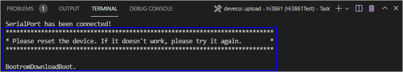
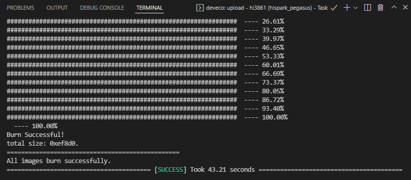

# 烧录

烧录是指将编译后的程序文件下载到开发板上的动作，为后续的程序调试提供基础。DevEco Device Tool提供一键烧录功能，操作简单，能快捷、高效的完成程序烧录，提升烧录的效率。

Hi3861V100的镜像烧录通过Windows环境进行烧录，开发者启动烧录操作后，DevEco Device Tool通过Remote远程模式，将Ubuntu环境下编译生成的待烧录程序文件拷贝至Windows目录下，然后通过Windows的烧录工具将程序文件烧录至开发板中。

## 前提条件

- 代码已[编译](quickstart-ide-3861-build.md)完成。

- 根据[USB转串口驱动安装指南](https://device.harmonyos.com/cn/docs/documentation/guide/hi3861-drivers-0000001058153433)安装USB转串口的驱动程序。

## 操作步骤

1. 请连接好电脑和待烧录开发板，需要连接USB口，具体可参考[Hi3861V100开发板介绍](quickstart-appendix-hi3861.md)。

2. 在DevEco Device Tool中，选择**REMOTE DEVELOPMENT &gt; Local PC**，查看远程计算机（Ubuntu开发环境）与本地计算机（Windows开发环境）的连接状态。
   - 如果Local PC右边连接按钮为，则远程计算机与本地计算机为已连接状态，不需要执行其他操作。
   - 如果Local PC右边连接按钮为，则点击绿色按钮进行连接。连接时DevEco Device Tool会重启服务，因此请不要在下载源码或源码编译过程中进行连接，否则会中断任务。

   

3. 在菜单栏中点击**Project Settings**按钮，进入Hi3861V100工程配置界面。

   

4. 在“Tool Chain”页签，检查Uploader烧录器工具是否已安装。

   - 如工具为“uninstalled”状态（），可单击**Download Uninstalled Tools**，自动安装所需工具，或单击工具后方的**Download**安装指定工具。
   - 如工具无法通过**Download**方式安装，表示该工具未被DevEco Device Tool收录，需要开发者自行下载到本地后单击**Import**导入。

   

5. 在“wifiiot_hispark_pegasus”页签，设置烧录选项，包括upload_port、upload_protocol和upload_partitions。配置完成后工程将自动保存。
   - upload_port：选择已查询的串口号。
   - upload_protocol：选择烧录协议，选择“hiburn-serial”。
   - upload_partitions：选择待烧录的文件名称。DevEco Device Tool已预置默认的烧录文件信息，如果需要修改待烧录文件地址，可点击每个待烧录文件后的按钮进行修改。

   

6. 在“PROJECT TASKS”中，点击hi3861下的**Upload**按钮，启动烧录。

   

7. 启动烧录后，显示如下提示信息时，请在15秒内，按下开发板上的RST按钮重启开发板。

   

   重新上电后，界面提示如下信息时，表示烧录成功。

   
