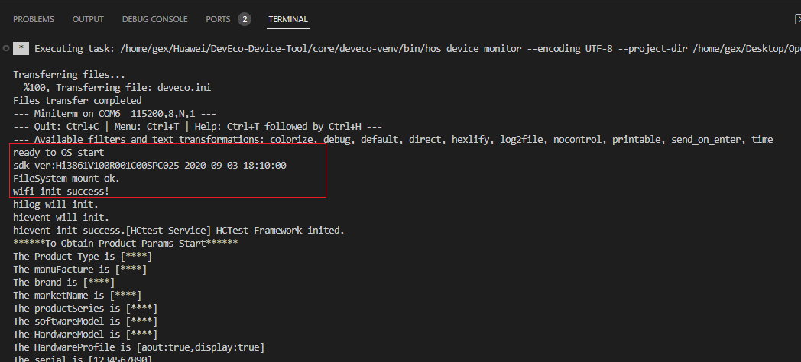
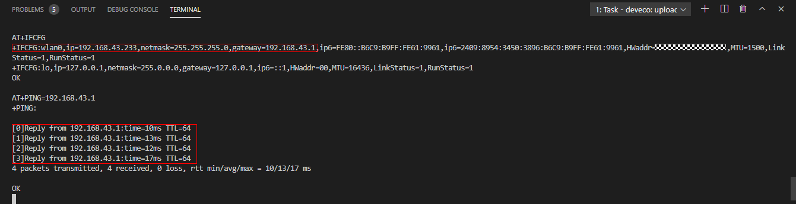

# 运行


## 联网配置

由于Hi3861为WLAN模组，您可以在版本编译及烧录后，通过如下操作，使开发板实现联网功能。

1. 保持Windows工作台和Hi3861 WLAN模组的连接状态，在**PROJECT TASKS**中，单击**Monitor**，打开串口终端。

     **图1** 打开DevEco串口终端  

   

2. 复位Hi3861 WLAN模组，终端界面显示“ready to OS start”，则启动成功。

     **图2** Hi3861 WLAN模组复位成功示意图  

   

3. 在DevEco的串口终端中，依次执行如下AT命令，启动STA模式，连接指定AP热点，并开启DHCP功能。
   
   ```
   AT+STARTSTA                             # 启动STA模式
   AT+SCAN                                 # 扫描周边AP
   AT+SCANRESULT                           # 显示扫描结果
   AT+CONN="SSID",,2,"PASSWORD"            # 连接指定AP，其中SSID/PASSWORD为待连接的热点名称和密码
   AT+STASTAT                              # 查看连接结果
   AT+DHCP=wlan0,1                         # 通过DHCP向AP请求wlan0的IP地址
   ```

4. 查看Hi3861 WLAN模组与网关联通是否正常，如下图所示。
   
   ```
   AT+IFCFG                                # 查看模组接口IP
   AT+PING=X.X.X.X                         # 检查模组与网关的联通性，其中X.X.X.X需替换为实际的网关地址
   ```

     **图3** Hi3861 WLAN模组联网成功示意图  

   


## 调测验证

完成烧录及联网之后，用户可根据需要进行调试验证。目前调试验证的方法有以下两种，开发者可以根据具体业务情况选择。

1. 通过printf打印日志

2. 通过asm文件定位panic问题

由于本示例业务简单，采用printf打印日志的调试方式即可。下方将介绍这两种调试手段的使用方法。


### printf打印

代码中增加printf维测，信息会直接打印到串口上。开发者可在业务关键路径或业务异常位置增加日志打印，如下所示：


```
void HelloWorld(void)
{
    printf("[DEMO] Hello world.\n");
}
```


### 根据asm文件进行问题定位

  系统异常退出时，会在串口上打印异常退出原因调用栈信息，如下文所示。通过解析异常栈信息可以定位异常位置。

```
=======KERNEL PANIC=======
**Call Stack*
Call Stack 0 -- 4860d8 addr:f784c
Call Stack 1 -- 47b2b2 addr:f788c
Call Stack 2 -- 3e562c addr:f789c
Call Stack 3 -- 4101de addr:f78ac
Call Stack 4 -- 3e5f32 addr:f78cc
Call Stack 5 -- 3f78c0 addr:f78ec
Call Stack 6 -- 3f5e24 addr:f78fc
Call Stack end***
```

为解析上述调用栈信息，需要使用到Hi3861_wifiiot_app.asm文件，该文件记录了代码中函数在Flash上的符号地址以及反汇编信息。asm文件会随版本打包一同构建输出，存放在./out/wifiiot/路径下。

1. 将调用栈CallStack信息保存到txt文档中，以便于编辑。（可选）

2. 打开asm文件，并搜索CallStack中的地址，列出对应的函数名信息。通常只需找出前几个栈信息对应的函数，就可明确异常代码方向。
   
   ```
   Call Stack 0 -- 4860d8 addr:f784c -- WadRecvCB
   Call Stack 1 -- 47b2b2 addr:f788c -- wal_sdp_process_rx_data
   Call Stack 2 -- 3e562c addr:f789c
   Call Stack 3 -- 4101de addr:f78ac
   Call Stack 4 -- 3e5f32 addr:f78cc
   Call Stack 5 -- 3f78c0 addr:f78ec
   Call Stack 6 -- 3f5e24 addr:f78fc
   ```

3. 根据以上调用栈信息，可以定位WadRecvCB函数中出现了异常。

   

4. 完成代码排查及修改。


## 运行结果

示例代码编译、烧录、运行、调测后，重启开发板后将自动在界面输出如下结果：


```
ready to OS start
FileSystem mount ok.
wifi init success!
[DEMO] Hello world.
```


## 下一步学习

恭喜，您已完成Hi3861 WLAN模组快速上手！建议您下一步进入的学习 。可参考：

- [LED外设控制](https://gitee.com/openharmony/docs/blob/master/zh-cn/device-dev/guide/device-wlan-led-control.md)

- [集成三方SDK](https://gitee.com/openharmony/docs/blob/master/zh-cn/device-dev/guide/device-wlan-sdk.md)
