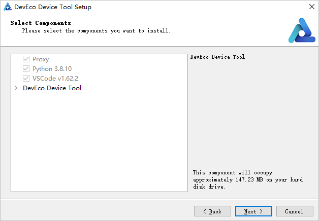

# 搭建Windows环境

在嵌入式开发中，很多开发者习惯于使用Windows进行代码的编辑，比如使用Windows的Visual Studio Code进行OpenHarmony代码的开发。但当前阶段，大部分的开发板源码还不支持在Windows环境下进行编译，如Hi3861、Hi3516系列开发板。因此，建议使用Ubuntu的编译环境对源码进行编译。

在以上的设备开发场景中，可以搭建一套Windows+Ubuntu混合开发的环境，其中使用Windows平台的DevEco Device Tool可视化界面进行相关操作，通过远程连接的方式对接Ubuntu下的DevEco Device Tool（可以不安装Visual Studio Code），然后对Ubuntu下的源码进行开发、编译、烧录等操作。

本章节介绍开发所需Windows环境的搭建方法。

## 系统要求

- Windows 10 64位系统。

- Windows系统上安装的DevEco Device Tool为3.1 Beta1版本。

## 操作步骤

1. 下载[DevEco Device Tool 3.1 Beta1](https://device.harmonyos.com/cn/ide#download) Windows版。

2. 解压DevEco Device Tool压缩包，双击安装包程序，单击**Next**进行安装。

3. 设置DevEco Device Tool的安装路径，请注意安装路径不能包含中文字符，**不建议安装到C盘目录**，单击**Next**。

   

4. 根据安装向导提示，勾选要自动安装的软件。

   1. 在弹出**VSCode installation confirm**页面，勾选“Install VS Code 1.62.2 automatically”，单击**Next**。
       >  **说明：**
       > 如果检测到Visual Studio Code已安装，且版本为1.62及以上，则会跳过该步骤。

       

   2. 选择Visual Studio Code的安装路径，单击**Next**。

       

   2. 在弹出的**Python select page**选择“Download from Huawei mirror”，单击**Next**。
       >  **说明：**
       > 如果系统已安装可兼容的Python版本（Python 3.8~3.9版本），可选择“Use one of compatible on your PC”。

       

5. 在以下界面单击**Next**。

   

6. 请详细阅读以下界面的用户协议和隐私声明，需勾选“I accept the licenses”后，才能继续下一步的安装。

   

7. 继续等待DevEco Device Tool安装向导自动安装DevEco Device Tool插件，直至安装完成，单击**Finish**，关闭DevEco Device Tool安装向导。

   

8. 打开Visual Studio Code，进入DevEco Device Tool工具界面。至此，DevEco Device Tool Windows开发环境安装完成。

   
