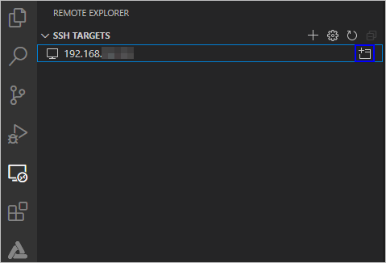
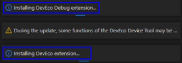

# 配置远程访问环境


在搭建了Windows和Ubuntu开发环境后，需要通过下述设置，使得Windows可以远程访问Ubuntu，为后续烧录文件的传输做好准备。


## 安装SSH服务并获取远程访问的IP地址

1. 在Ubuntu系统中，打开终端工具，执行如下命令安装SSH服务。
   >  **说明：**
   > 如果执行该命令失败，提示openssh-server和openssh-client依赖版本不同，请根据CLI界面提示信息，安装openssh-client相应版本后（例如：sudo apt-get install openssh-client=1:8.2p1-4），再重新执行该命令安装openssh-server。

   
   ```shell
   sudo apt-get install openssh-server
   ```

2. 执行如下命令，启动SSH服务。
   
   ```shell
   sudo systemctl start ssh
   ```

3. 执行如下命令，获取当前用户的IP地址，用于Windows系统远程访问Ubuntu环境。
   
   ```shell
   ifconfig
   ```

   >  **说明：**
   > 如果执行ifconfig命令提示“command-not-found”，请执行**sudo apt-get install net-tools**命令安装网络查询工具，然后重新查询IP地址。

   


## 安装Remote SSH

1. 打开Windows系统下的Visual Studio Code，点击，在插件市场的搜索输入框中输入“remote-ssh”。

   

2. 点击Remote-SSH的**Install**，安装Remote-SSH。安装成功后，在**INSTALLED**下可以看到已安装Remote-SSH。

   


## 远程连接Ubuntu环境

1. 打开Windows系统的Visual Studio Code，点击，在**SSH TARGETS**下，单击+。

   

2. 在弹出的SSH连接命令输入框中输入“ssh _username_\@_ip_address_”，其中ip_address为要连接的远程计算机的IP地址，username为登录远程计算机的帐号。

   

3. 在弹出的输入框中，选择SSH configuration文件，选择默认的第一选项即可。

   

4. 在SSH TARGETS中，找到远程计算机，点击，打开远程计算机。

   

5. 在弹出的输入框中，选择**Linux**，然后在选择**Continue**，然后输入登录远程计算机的密码，连接远程计算机。
   >  **说明：**
   > 在Windows系统远程访问Ubuntu过程中，需要频繁的输入密码进行连接，为解决该问题，您可以使用SSH公钥来进行设置，设置方法请参考[注册远程访问Ubuntu环境的公钥](https://device.harmonyos.com/cn/docs/documentation/guide/ide-registering-public-key-0000001247162706)。

   

   连接成功后，等待在远程计算机用户目录下的.vscode-server文件夹下自动安装插件。安装完成后，根据界面提示在Windows系统下重新加载Visual Studio Code，便可以在Windows的DevEco Device Tool界面进行源码开发、编译、烧录等操作。

   >  **说明：**
   > 如果您之前安装过DevEco Device Tool 3.0 Release及以前的版本，可能出现插件安装失败的情况，Visual Studio Code右下角一直处于如下界面，请参考[DevEco Device Tool插件安装失败处理办法](https://device.harmonyos.com/cn/docs/documentation/guide/faq-device-tool-install-failed-0000001437806813)进行处理。

   
   
   至此，环境搭建完成，如下图所示，左下角显示远程连接计算机的IP地址。

   
