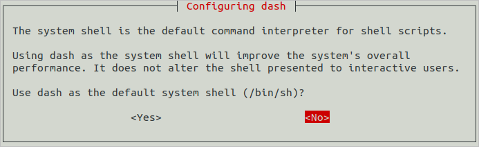

# 搭建Ubuntu环境

在嵌入式开发中，很多开发者习惯于使用Windows进行代码的编辑，比如使用Windows的Visual Studio Code进行OpenHarmony代码的开发。但当前阶段，大部分的开发板源码还不支持在Windows环境下进行编译，如Hi3861、Hi3516系列开发板。因此，建议使用Ubuntu的编译环境对源码进行编译。

在以上的设备开发场景中，可以搭建一套Windows+Ubuntu混合开发的环境，其中使用Windows平台的DevEco Device Tool可视化界面进行相关操作，通过远程连接的方式对接Ubuntu下的DevEco Device Tool（可以不安装Visual Studio Code），然后对Ubuntu下的源码进行开发、编译、烧录等操作。

本章节介绍开发所需Ubuntu环境的搭建方法。

>  **说明：**
> 如果没有Ubuntu系统，可在Windows系统中通过虚拟机方式搭建Ubuntu系统，具体请参考[Ubuntu系统安装指导](https://developer.huawei.com/consumer/cn/training/course/video/C101639987816176315)。Ubuntu系统安装完成后，请根据指导完成[Ubuntu基础环境配置](https://developer.huawei.com/consumer/cn/training/course/video/C101639988048536240)，然后再根据本章节进行DevEco Device Tool工具的安装。


## 系统要求

- Ubuntu系统要求：Ubuntu18.04~22.04版本。推荐使用22.04版本，内存32GB及以上，硬盘250GB及以上。

- Ubuntu系统的用户名不能包含中文字符。

- 建议Ubuntu和Windows系统上安装的DevEco Device Tool为最新版本，且版本号需相同。

  >  **说明：**
  > 下面以3.1 Release版本的IDE进行说明，不同版本的IDE在支持的特性和操作上略有差别，具体情况可参考[该工具的使用指南](https://device.harmonyos.com/cn/docs/documentation/guide/service_introduction-0000001050166905)。

- 镜像下载命令，18.04：docker pull swr.cn-north-4.myhuaweicloud.com/ci-service/harmony-build-env-jnlp:1.0.8
               22.04：docker pull swr.cn-north-4.myhuaweicloud.com/ci-service/openharmony-standard-build-env-22.04:4.0.0

## 操作步骤

1. 将Ubuntu Shell环境修改为bash。
   1. 执行如下命令，确认输出结果为bash。如果输出结果不是bash，请根据子步骤2，将Ubuntu shell修改为bash。
      
       ```shell
       ls -l /bin/sh
       ```

       

   2. 打开终端工具，执行如下命令，输入密码，然后选择**No**，将Ubuntu shell由dash修改为bash。
      
       ```shell
       sudo dpkg-reconfigure dash
       ```

       

2. 下载[DevEco Device Tool](https://device.harmonyos.com/cn/ide#download)最新Linux版本软件包。

3. 解压DevEco Device Tool软件包并对解压后的文件夹进行赋权。
   1. 进入DevEco Device Tool软件包目录，执行如下命令解压软件包，其中devicetool-linux-tool-{Version}.zip为软件包名称，请根据实际进行修改。
      
       ```shell
       unzip devicetool-linux-tool-{Version}.zip
       ```
   2. 进入解压后的文件夹，执行如下命令，赋予安装文件可执行权限，其中devicetool-linux-tool-{Version}.sh请根据实际进行修改。
      
       ```shell
       chmod u+x devicetool-linux-tool-{Version}.sh
       ```

4. 执行如下命令，安装DevEco Device Tool，其中devicetool-linux-tool-{Version}.sh请根据实际进行修改。
   
   ```shell
   sudo ./devicetool-linux-tool-{Version}.sh
   ```

5. 在用户协议和隐私声明签署界面，请详细阅读用户协议和隐私声明，需签署同意用户协议和隐私声明才能进行下一步的安装，可通过键盘的上下按键进行选择。

   

   安装完成后，当界面输出“DevEco Device Tool successfully installed.”时，表示DevEco Device Tool安装成功。

   
