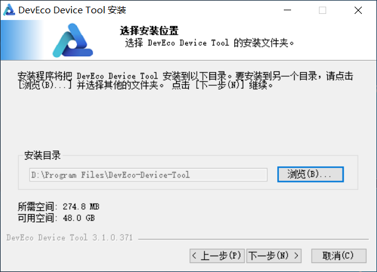
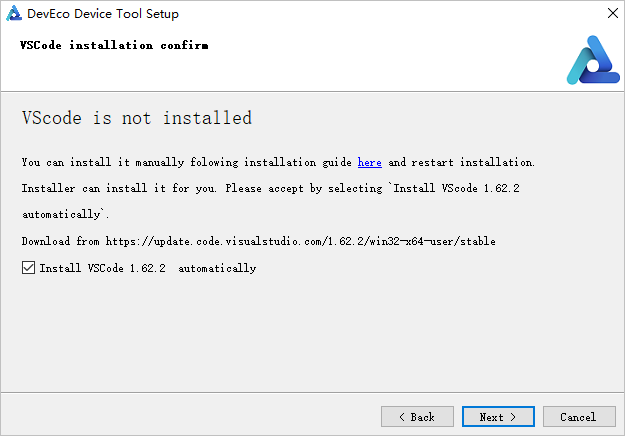
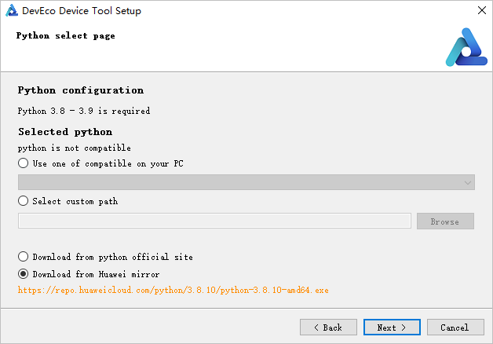
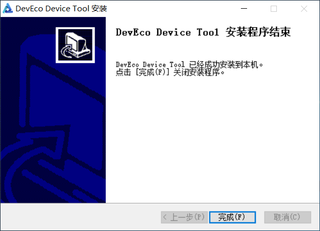

# 搭建Windows环境

在嵌入式开发中，很多开发者习惯于使用Windows进行代码的编辑，比如使用Windows的Visual Studio Code进行OpenHarmony代码的开发。但当前阶段，大部分的开发板源码还不支持在Windows环境下进行编译，如Hi3861、Hi3516系列开发板。因此，建议使用Ubuntu的编译环境对源码进行编译。

在以上的设备开发场景中，可以搭建一套Windows+Ubuntu混合开发的环境，其中使用Windows平台的DevEco Device Tool可视化界面进行相关操作，通过远程连接的方式对接Ubuntu下的DevEco Device Tool（可以不安装Visual Studio Code），然后对Ubuntu下的源码进行开发、编译、烧录等操作。

本章节介绍开发所需Windows环境的搭建方法。

## 系统要求

- Windows 10 64位系统，推荐内存8GB及以上，硬盘100GB及以上。

- 建议Windows和Ubuntu系统上安装的DevEco Device Tool为最新版本，且版本号需相同。

  >  **说明：**
  > 下面以3.1 Release版本的IDE进行说明，不同版本的IDE在支持的特性和操作上略有差别，具体情况可参考[该工具的使用指南](https://device.harmonyos.com/cn/docs/documentation/guide/service_introduction-0000001050166905)。

## 操作步骤

1. 下载[DevEco Device Tool](https://device.harmonyos.com/cn/ide#download)最新Windows版本软件包。

2. 解压DevEco Device Tool压缩包，双击安装包程序，单击**下一步**进行安装。

3. 请详细阅读以下界面的用户协议和隐私声明，需勾选“我接受许可证协议中的条款”后，才能继续下一步的安装。

4. 设置DevEco Device Tool的安装路径，请注意安装路径不能包含中文字符，**不建议安装到C盘目录**，单击**下一步**。

   

5. 根据安装向导提示，安装依赖的工具。

   

   其中，

   - 安装：按照默认路径及参数直接安装。
   
   - 自定义安装：安装前可以自行修改安装路径及其他设置参数。

   安装完成后，各软件状态显示为OK。

   

6. 依赖的工具安装完成后，单击**安装**，开始安装DevEco Device Tool。

7. 继续等待DevEco Device Tool安装向导自动安装DevEco Device Tool插件，直至安装完成，单击**完成**，关闭DevEco Device Tool安装向导。

   

8. 打开Visual Studio Code，进入DevEco Device Tool工具界面。至此，DevEco Device Tool Windows开发环境安装完成。

   
