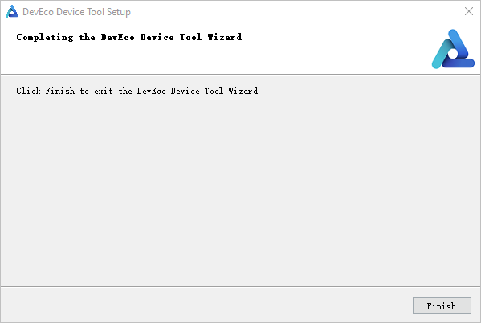
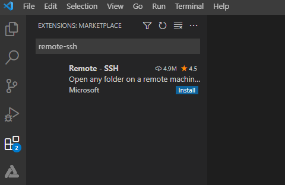
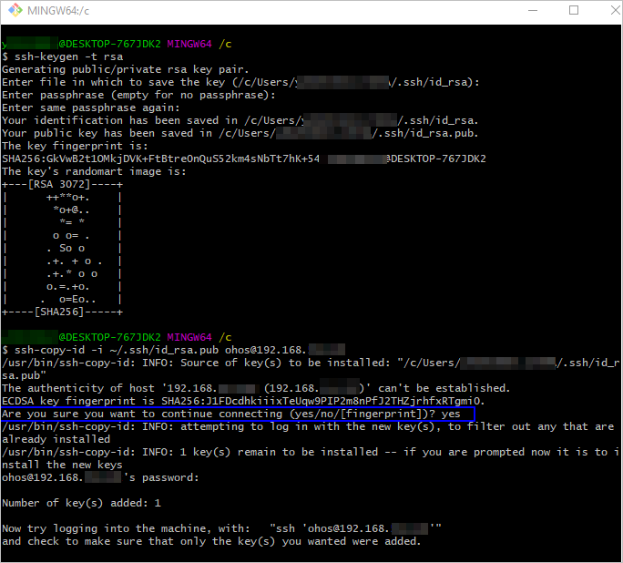
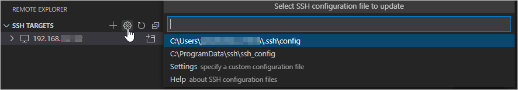
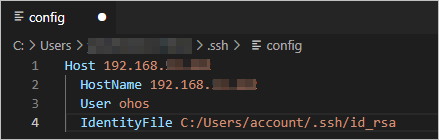

# 搭建Windows+Ubuntu混合开发环境


通常在嵌入式开发中，很多开发者习惯于使用Windows进行代码的编辑，比如使用Windows的Visual Studio Code进行OpenHarmony代码的开发。但当前阶段，大部分的开发板源码还不支持在Windows环境下进行编译，如Hi3861、Hi3516系列开发板。因此，需要使用Ubuntu的编译环境对源码进行编译。


在以上的设备开发场景中，可以搭建一套Windows+Ubuntu混合开发的环境，其中使用Windows平台的DevEco Device Tool可视化界面进行相关操作，通过远程连接的方式对接Ubuntu下的DevEco Device Tool（可以不安装Visual Studio Code），然后对Ubuntu下的源码进行开发、编译、烧录等操作。


## 系统要求

- Windows系统要求：Windows10 64位系统。

- Ubuntu系统要求：Ubuntu20.04及以上版本，内存推荐16 GB及以上。

- Windows系统和Ubuntu系统的用户名不能包含中文字符。

- Windows和Ubuntu系统上安装的DevEco Device Tool为3.0 Release版本。


## 搭建Ubuntu环境

1. 将Ubuntu Shell环境修改为bash。

   1. 执行如下命令，确认输出结果为bash。如果输出结果不是bash，请根据步骤2，将Ubuntu shell修改为bash。
         
       ```
       ls -l /bin/sh
       ```

       

   2. 打开终端工具，执行如下命令，输入密码，然后选择**No**，将Ubuntu shell由dash修改为bash。
         
       ```
       sudo dpkg-reconfigure dash
       ```

       

2. 下载[DevEco Device Tool 3.0 Release](https://device.harmonyos.com/cn/ide#download) Linux版本。

   >  **说明：**
   > 
   > 当前文档中匹配的是DevEco Device Tool 3.0 Release版本。不同版本的界面和使用方法略有差异，若您使用的是最新版本的DevEco Device Tool，可参考[搭建开发环境](https://gitee.com/openharmony/docs/blob/master/zh-cn/device-dev/quick-start/quickstart-ide-env-ubuntu.md)。

3. 解压DevEco Device Tool软件包并对解压后的文件夹进行赋权。

   1. 进入DevEco Device Tool软件包目录，执行如下命令解压软件包，其中devicetool-linux-tool-3.0.0.401.zip为软件包名称，请根据实际进行修改。
         
       ```
       unzip devicetool-linux-tool-3.0.0.401.zip
       ```

   2. 进入解压后的文件夹，执行如下命令，赋予安装文件可执行权限，其中devicetool-linux-tool-3.0.0.401.sh请根据实际进行修改。
         
       ```
       chmod u+x devicetool-linux-tool-3.0.0.401.sh
       ```

4. 执行如下命令，安装DevEco Device Tool，其中devicetool-linux-tool-3.0.0.401.sh请根据实际进行修改。

   >  **说明：**
   > 安装过程中，会自动检查Python是否安装，且要求Python为3.8~3.9版本。如果不满足，则安装过程中会自动安装，提示“Do you want to continue?”，请输入“Y”后继续安装。

     
   ```
   sudo ./devicetool-linux-tool-3.0.0.401.sh
   ```

   安装完成后，当界面输出“Deveco Device Tool successfully installed.”时，表示DevEco Device Tool安装成功。

   


## 搭建Windows开发环境

通过Windows系统远程访问Ubuntu环境，需要先在Windows系统中安装DevEco Device Tool，以便使用Windows平台的DevEco Device Tool可视化界面进行相关操作。

1. 下载[DevEco Device Tool 3.0 Release](https://device.harmonyos.com/cn/ide#download) Windows版。

   >  **说明：**
   > 
   > 当前文档中匹配的是DevEco Device Tool 3.0 Release版本。不同版本的界面和使用方法略有差异，若您使用的是最新版本的DevEco Device Tool，可参考[搭建开发环境](https://gitee.com/openharmony/docs/blob/master/zh-cn/device-dev/quick-start/quickstart-ide-env-win.md)。

2. 解压DevEco Device Tool压缩包，双击安装包程序，点击Next进行安装。

3. 设置DevEco Device Tool的安装路径，建议安装到非系统盘符，点击**Next**。

   >  **说明：**
   > 如果您已安装DevEco Device Tool 3.0 Beta2及以前的版本，则在安装新版本时，会先卸载旧版本，卸载过程中出现如下错误提示时，请点击“Ignore”继续安装，该错误不影响新版本的安装。
   > 
   > 

   

4. 根据安装向导提示，勾选要自动安装的软件。
   1. 在弹出VSCode installation confirm页面，勾选“Install VScode 1.62.2automatically”，点击**Next**。

       >  **说明：**
       > 如果检测到Visual Studio Code已安装，且版本为1.62及以上，则会跳过该步骤。

       

   2. 在弹出的Python select page选择“Download from Huawei mirror”，点击**Next**。

       >  **说明：**
       > 如果系统已安装可兼容的Python版本（Python 3.8~3.9版本），可选择“Use one of compatible on your PC”。

       

5. 在以下界面点击**Next**，进行软件下载和安装。

   

6. 继续等待DevEco Device Tool安装向导自动安装DevEco Device Tool插件，直至安装完成，点击**Finish**，关闭DevEco Device Tool安装向导。

   

7. 打开Visual Studio Code，进入DevEco Device Tool工具界面。至此，DevEco Device Tool Windows开发环境安装完成。

   


## 配置Windows远程访问Ubuntu环境


### 安装SSH服务并获取远程访问的IP地址

1. 在Ubuntu系统中，打开终端工具，执行如下命令安装SSH服务。

   >  **说明：**
   > 如果执行该命令失败，提示openssh-server和openssh-client依赖版本不同，请根据CLI界面提示信息，安装openssh-client相应版本后（例如：sudo apt-get install openssh-client=1:8.2p1-4），再重新执行该命令安装openssh-server。

     
   ```
   sudo apt-get install openssh-server
   ```

2. 执行如下命令，启动SSH服务。
     
   ```
   sudo systemctl start ssh
   ```

3. 执行如下命令，获取当前用户的IP地址，用于Windows系统远程访问Ubuntu环境。
     
   ```
   ifconfig
   ```

   


### 安装Remote SSH

1. 打开Windows系统下的Visual Studio Code，点击，在插件市场的搜索输入框中输入“remote-ssh”。

   

2. 点击Remote-SSH的**Install**按钮，安装Remote-SSH。安装成功后，在**INSTALLED**下可以看到已安装Remote-SSH。

   


### 远程连接Ubuntu环境

1. 打开Windows系统的Visual Studio Code，点击，在REMOTE EXOPLORER页面点击+按钮。

   

2. 在弹出的SSH连接命令输入框中输入“ssh _username_\@_ip_address_”，其中ip_address为要连接的远程计算机的IP地址，username为登录远程计算机的帐号。

   

3. 在弹出的输入框中，选择SSH configuration文件，选择默认的第一选项即可。

   

4. 在SSH TARGETS中，找到远程计算机，点击，打开远程计算机。

   

5. 在弹出的输入框中，选择**Linux**，然后在选择**Continue**，然后输入登录远程计算机的密码，连接远程计算机 。

   

   连接成功后，等待在远程计算机.vscode-server文件夹下自动安装插件，安装完成后，根据界面提示在Windows系统下重新加载Visual Studio Code，便可以在Windows的DevEco Device Tool界面进行源码开发、编译、烧录等操作。


### 注册访问Ubuntu环境的公钥

在完成以上操作后，您就可以通过Windows远程连接Ubuntu环境进行开发了，但在使用过程中，需要您频繁的输入远程连接密码来进行连接。为解决该问题，您可以使用SSH公钥来进行设置。

1. 打开Git bash命令行窗口，执行如下命令，生成SSH公钥，请注意，在执行命令过程中，请根据界面提示进行操作。username和ip请填写连接Ubuntu系统时需要的参数。
     
   ```
   ssh-keygen -t rsa
   ssh-copy-id -i ~/.ssh/id_rsa.pub username@ip
   ```

   

2. 在Visual Studio Code中，点击远程连接的设置按钮，并选择打开config文件。

   

3. 在config配置文件中添加SSK Key文件信息，如下图所示，然后保存即可。

   
