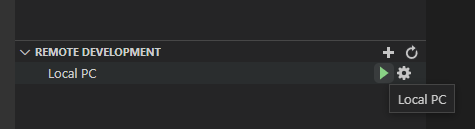
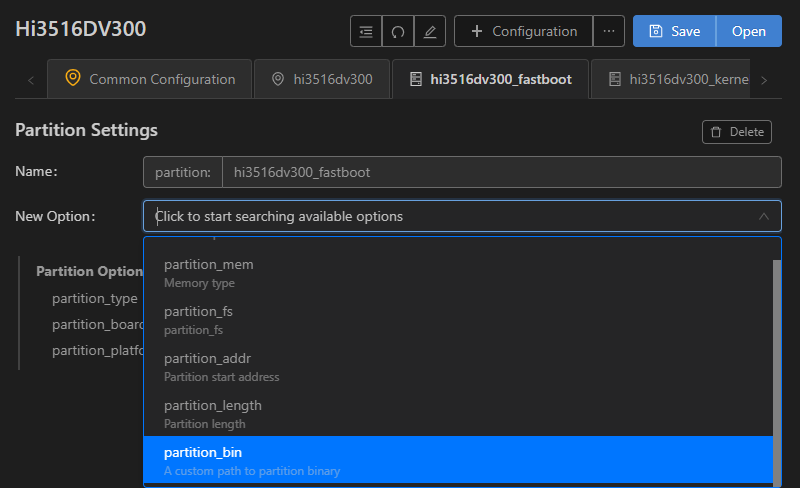
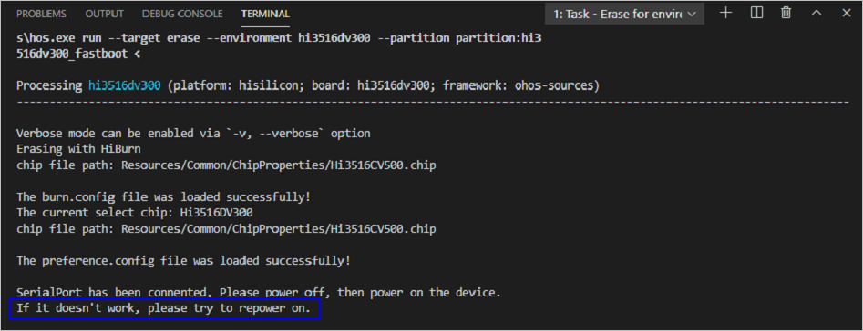
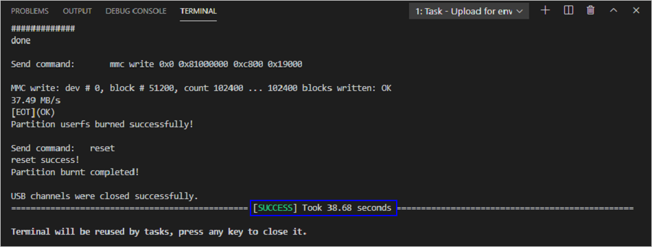

# 烧录

Hi3516DV300支持USB烧录、网口烧录和串口烧录三种方式，本文采用USB方式进行烧录。相关操作在Windows环境下进行。

>  **说明：**
> 
> 当前文档中匹配的是DevEco Device Tool 3.0 Release版本。不同版本的界面和使用方法略有差异，若您使用的是最新版本的DevEco Device Tool，可参考[小型系统（基于Hi3516开发板）烧录](https://gitee.com/openharmony/docs/blob/master/zh-cn/device-dev/quick-start/quickstart-ide-3516-burn.md)。

1. 请连接好电脑和待烧录开发板，需要同时连接串口和USB口，具体可参考[Hi3516DV300开发板介绍](https://gitee.com/openharmony/docs/blob/master/zh-cn/device-dev/quick-start/quickstart-lite-introduction-hi3516.md)。

2. 在DevEco Device Tool中，选择REMOTE DEVELOPMENT &gt; Local PC，查看远程计算机（Ubuntu开发环境）与本地计算机（Windows开发环境）的连接状态。

   - 如果Local PC右边连接按钮为，则远程计算机与本地计算机为已连接状态，不需要执行其他操作。

   - 如果Local PC右边连接按钮为，则点击绿色连接进行按钮。

   

   >  **说明：**
   > 该操作仅在远程模式（Windows+Ubuntu混合开发环境）中需要设置，如果采用本地模式（Windows开发环境或Ubuntu开发环境），则请跳过该步骤。

3. 在DevEco Device Tool中，点击QUICK ACCESS &gt; DevEco Home &gt; Device，查看并记录对应的串口号。

   

   >  **说明：**
   > 如果对应的串口异常，请根据[Hi3516DV300/Hi3518EV300开发板串口驱动安装指导](https://device.harmonyos.com/cn/docs/documentation/guide/hi3516_hi3518-drivers-0000001050743695)安装USB转串口的驱动程序。

4. 在QUICK ACCESS &gt; DevEco Home &gt; Projects中，点击**Settings**打开工程配置界面。

   

5. 在“hi3516dv300”页签，设置烧录选项，包括upload_partitions、upload_port和upload_protocol。

   - upload_partitions：选择待烧录的文件，默认情况下会同时烧录fastboot、kernel、rootfs和userfs。
   - upload_port：选择已查询到的串口号。
   - upload_protocol：选择烧录协议，固定选择“hiburn-usb”。

   

6. 分别检查待烧录文件的烧录信息，DevEco Device Tool已预置默认的烧录文件信息，可根据实际情况进行调整。待烧录文件包括：fastboot、kernel、rootfs和userfs。

   1. 在“hi3516dv300_fastboot”页签，在New Option选项中选择需要修改的项，例如partition_bin（烧录文件路径）、partition_addr（烧录文件起始地址）、partition_length（烧录文件分区长度）等。

       

   2. 然后在Partition Options中，分别修改上述步骤中选择的修改项。

       >  **说明：**
       > 在设置烧录分区起始地址和分区长度时，应根据实际待烧录文件的大小进行设置，要求设置的烧录分区大小，要大于待烧录文件的大小；同时，各烧录文件的分区地址设置不能出现重叠。

       

   3. 按照相同的方法修改kernel、rootfs和userfs的烧录文件信息。

7. 所有的配置都修改完成后，在工程配置页签的顶部，点击**Save**进行保存。

8. 点击hi3516dv300下的**Upload**按钮，启动烧录。

   >  **说明：**
   > 如果您是第一次在工作台烧录Hi3516DV300/Hi3518EV300开发板，可能烧录失败，提示“not find the Devices”，然后根据[Hi3516DV300/Hi3518EV300开发板USB驱动安装](https://device.harmonyos.com/cn/docs/documentation/guide/usb_driver-0000001058690393)进行处理后再重新烧录。

   

9. 在终端窗口显示如下提示信息时，按住复位键，插拔USB线，最后松开复位键启动烧录。

   

   启动烧录后，界面提示如下信息时，表示烧录成功。

   

10. 烧录成功后，请根据镜像运行章节进行操作，启动系统。
