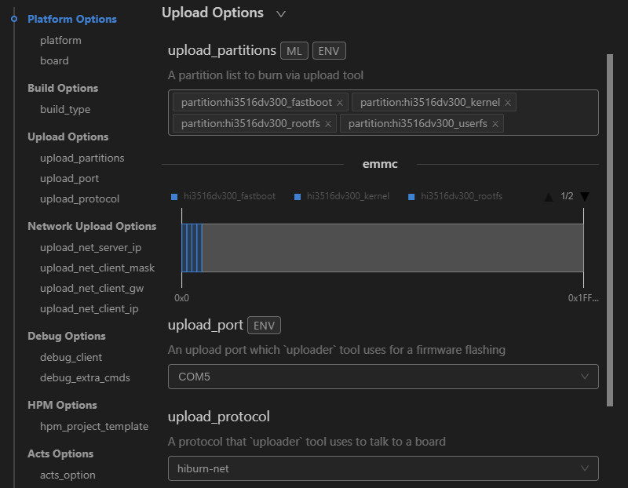

# 烧录

Hi3516DV300支持USB烧录、网口烧录和串口烧录三种方式，本文以Linux下的网口烧录方式为例进行介绍。

1. 请连接好电脑和待烧录开发板，需要同时连接串口、网口和电源，具体可参考[Hi3516DV300开发板介绍](https://device.harmonyos.com/cn/docs/documentation/guide/quickstart-lite-introduction-hi3516-0000001152041033)。

2. 在DevEco Device Tool中，点击QUICK ACCESS &gt; DevEco Home &gt; Device，查看并记录对应的串口号。
   

   >  **说明：**
   > 如果对应的串口异常，请根据[Hi3516DV300/Hi3518EV300开发板串口驱动安装指导](https://device.harmonyos.com/cn/docs/documentation/guide/hi3516_hi3518-drivers-0000001050743695)安装USB转串口的驱动程序。

3. 在QUICK ACCESS &gt; DevEco Home &gt; Projects中，点击**Settings**打开工程配置界面。
   

4. 在“hi3516dv300”页签，设置烧录选项，包括upload_partitions、upload_port和upload_protocol。
   - upload_partitions：选择待烧录的文件，默认情况下会同时烧录fastboot、kernel、rootfs和userfs。
   - upload_port：选择已查询的串口号。
   - upload_protocol：选择烧录协议，固定选择“hiburn-net”。

   

5. 检查和设置连接开发板后的网络适配器的IP地址信息，设置方法请参考[设置Hi3516DV300网口烧录的IP地址信息](https://device.harmonyos.com/cn/docs/documentation/guide/set_ipaddress-0000001141825075)。

6. 设置网口烧录的IP地址信息，设置如下选项：
   - upload_net_server_ip：选择步骤6中设置的IP地址信息。例如192.168.1.2
   - upload_net_client_mask：设置开发板的子网掩码，工具会自动根据选择的upload_net_server_ip进行设置。例如255.255.255.0
   - upload_net_client_gw：设置开发板的网关，工具会自动根据选择的upload_net_server_ip进行设置。例如192.168.1.1
   - upload_net_client_ip：设置开发板的IP地址，工具会自动根据选择的upload_net_server_ip进行设置。例如192.168.1.3

   

7. 分别检查待烧录文件的烧录信息，DevEco Device Tool已预置默认的烧录文件信息，可根据实际情况进行调整。待烧录文件包括：fastboot、kernel、rootfs和userfs。
   1. 在“hi3516dv300_fastboot”页签，在New Option选项中选择需要修改的项，例如partition_bin（烧录文件路径）、partition_addr（烧录文件起始地址）、partition_length（烧录文件分区长度）等。
       
   2. 然后在Partition Options中，分别修改上述步骤中选择的修改项。
       >  **说明：**
       > 在设置烧录分区起始地址和分区长度时，应根据实际待烧录文件的大小进行设置，要求设置的烧录分区大小，要大于待烧录文件的大小；同时，各烧录文件的分区地址设置不能出现重叠。

       
   3. 按照相同的方法修改kernel、rootfs和userfs的烧录文件信息。

8. 所有的配置都修改完成后，在工程配置页签的顶部，点击**Save**进行保存。

9. 点击**Open**打开工程文件，然后在“PROJECT TASKS”中，点击hi3516dv300下的**Upload**按钮，启动烧录。
   

10. 启动烧录后，显示如下提示信息时，请插拔USB线。
   

11. 重新上电后，界面提示如下信息时，表示烧录成功。
   

12. 烧录成功后，请根据镜像运行章节进行操作，启动系统。
