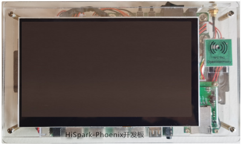

# Hi3751开发板介绍

## 开发板简介

HiSpark-Phoenix是基于海思Hi3751V350智能电视芯片的一块高性能开发板，内置高性能多核 ARM A53 CPU，多核MALI T450 GPU，支持NTSC/PAL/SECAM制式解调，支持DTMB/DVB-C/ATSC/ISDB-T等全球数字Demod,可以扩展DVB-T/T2/S/S2,支持USB播放，支持主流的视频格式包括MPGE2、H.264、H.265、RMVB、AVS+等，支持主流音频解码及音效处理，以及海思自研的SWS音效处理，支持LVDS和miniLVDS接口，支持主流的Tconless屏。

  **图1** HiSpark_Phoenix单板正面外观图

  

## 开发板规格

  **表1** HiSpark_Phoenix开发板规格清单

| 规格类型 | 规格清单 | 
| -------- | -------- |
| **处理器及内部存储** | -&nbsp;Hi3751V350芯片 -&nbsp;DDR3&nbsp;1GB -&nbsp;eMMC4.5，8GB容量 | 
| **外部器件** | -&nbsp;以太网口 -&nbsp;音频视频 &nbsp;&nbsp;-&nbsp;支持2路立体声输入 &nbsp;&nbsp;-&nbsp;支持2路立体声输出 &nbsp;&nbsp;-&nbsp;MicroHDMI（3路HDMI&nbsp;1.4） &nbsp;&nbsp;-&nbsp;3D GPU渲染 -&nbsp;摄像头 -&nbsp;显示屏 &nbsp;&nbsp;&nbsp;-&nbsp;LCD连接器（7寸） -&nbsp;外部器件及接口 &nbsp;&nbsp;-&nbsp;I2C接口 &nbsp;&nbsp;-&nbsp;ADC接口 &nbsp;&nbsp;-&nbsp;PWM 接口 &nbsp;&nbsp;-&nbsp;2个UART 接口 &nbsp;&nbsp;-&nbsp;3个USB2.0（Type&nbsp;C） &nbsp;&nbsp;-&nbsp;功能按键2个，2个用户自定义按键 &nbsp;&nbsp;-&nbsp;LED指示灯，绿灯，红灯 &nbsp; -&nbsp;支持NFC &nbsp; |
