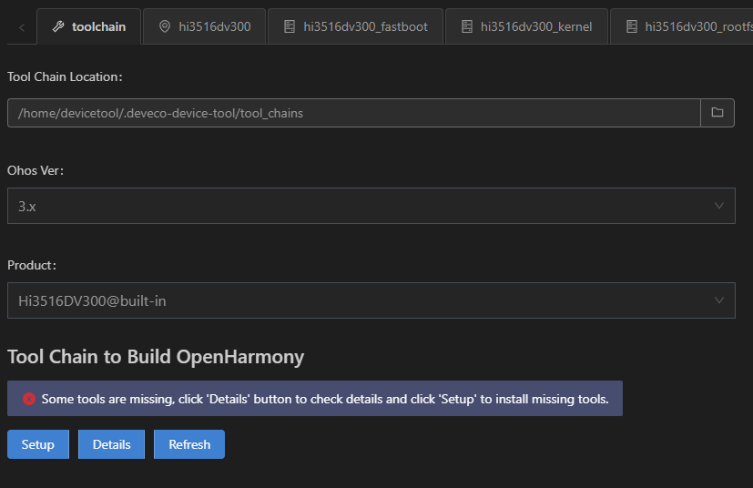

# 编译

1. 在Projects中，点击**Settings**按钮，进入Hi3516DV300配置界面。

   

2. 在Tool Chain页签中，DevEco Device Tool会自动检测依赖的编译工具链是否完备，如果提示部分工具缺失，可点击**Install**按钮，自动安装所需工具链。

   
   
3. 安装Hi3516DV300相关工具链，部分工具安装需要使用root权限，请在“TERMINAL”窗口输入用户密码进行安装。

   >  **说明：**
   > 如果出现安装pip组件失败，可参考[修改Python源的方法](https://device.harmonyos.com/cn/docs/documentation/guide/ide-set-python-source-0000001227639986)进行修改，完成尝试重新安装。

   

   工具链自动安装完成后如下图所示。

   

4. 在“hi3516dv300”配置页签中，设置源码的编译类型**build_type**，默认为“debug“类型，请根据需要进行修改。然后点击**Save**按钮进行保存。

   

5. 在“PROJECT TASKS”中，点击对应开发板下的**Build**按钮，执行编译。

   

6. 等待编译完成，在**TERMINAL**窗口输出“SUCCESS”，编译完成。

   

   编译完成后，可以在工程的**out**目录下，查看编译生成的文件，用于后续的[Hi3516DV300开发板烧录](quickstart-ide-standard-running-hi3516-burning.md)。
