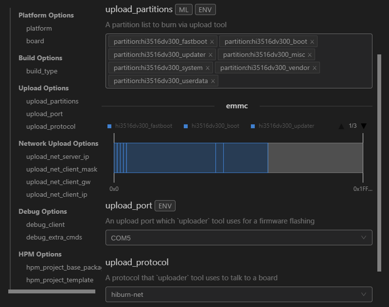
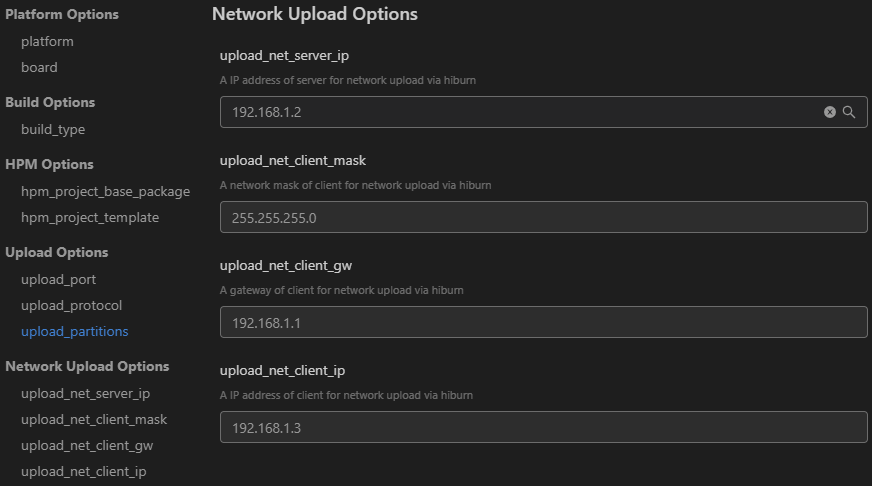
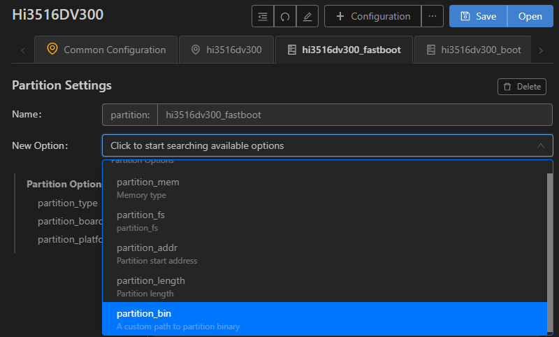

# 烧录

标准系统烧录，在V2.2 Beta1及以上版本支持。

Hi3516DV300支持烧录标准系统，其烧录方式包括USB烧录、网口烧录和串口烧录三种方式。

下方以Linux系统网口烧录方式为例进行标准系统烧录，其他两种烧录方式请参照[Hi3516DV300烧录指导](https://device.harmonyos.com/cn/docs/documentation/guide/ide-hi3516-upload-0000001052148681)。

1. 请连接好电脑和待烧录开发板，需要同时连接串口、网口和电源，具体可参考[Hi3516DV300开发板介绍](https://device.harmonyos.com/cn/docs/documentation/guide/quickstart-lite-introduction-hi3516-0000001152041033)。

2. 在DevEco Device Tool中，选择REMOTE DEVELOPMENT &gt; Local PC，查看远程计算机（Ubuntu开发环境）与本地计算机（Windows开发环境）的连接状态。
   - 如果Local PC右边连接按钮为，则远程计算机与本地计算机为已连接状态，不需要执行其他操作。
   - 如果Local PC右边连接按钮为，则点击绿色连接进行按钮。

   

   >  **说明：**
   > 该操作仅在远程模式（Windows+Ubuntu混合开发环境）中需要设置，如果采用本地模式（Windows开发环境或Ubuntu开发环境），则请跳过该步骤。

3. 在DevEco Device Tool中，点击QUICK ACCESS &gt; DevEco Home &gt; Device，查看并记录对应的串口号。
   

   >  **说明：**
   > 如果对应的串口异常，请根据[Hi3516DV300/Hi3518EV300开发板串口驱动安装指导](https://device.harmonyos.com/cn/docs/documentation/guide/hi3516_hi3518-drivers-0000001050743695)安装USB转串口的驱动程序。

4. 在QUICK ACCESS &gt; DevEco Home &gt; Projects中，点击**Settings**打开工程配置界面。
   

5. 在“hi3516dv300”页签，设置烧录选项，包括upload_partitions、upload_port和upload_protocol。
   - upload_partitions：选择待烧录的文件，默认情况下会同时烧录fastboot、boot、updater、misc、system、vendor和userdata。
   - upload_port：选择已查询的串口号。
   - upload_protocol：选择烧录协议，固定选择“hiburn-net”。

   

6. 检查和设置连接开发板后的网络适配器的IP地址信息，设置方法请参考[设置Hi3516DV300网口烧录的IP地址信息](https://device.harmonyos.com/cn/docs/documentation/guide/set_ipaddress-0000001141825075)。

7. 设置网口烧录的IP地址信息，设置如下选项：
   - upload_net_server_ip：选择步骤5中设置的IP地址信息。例如192.168.1.2
   - upload_net_client_mask：设置开发板的子网掩码，工具会自动根据选择的upload_net_server_ip进行设置。例如255.255.255.0
   - upload_net_client_gw：设置开发板的网关，工具会自动根据选择的upload_net_server_ip进行设置。例如192.168.1.1
   - upload_net_client_ip：设置开发板的IP地址，工具会自动根据选择的upload_net_server_ip进行设置。例如192.168.1.3

   

8. 分别检查待烧录文件的烧录信息，DevEco Device Tool已预置默认的烧录文件信息，可根据实际情况进行调整。待烧录文件包括：fastboot、boot、updater、misc、system、vendor和userdata。
   1. 在“hi3516dv300_fastboot”页签，在New Option选项中选择需要修改的项，例如partition_bin（烧录文件路径）、partition_addr（烧录文件起始地址）、partition_length（烧录文件分区长度）等。
       
   2. 然后在Partition Options中，分别修改上述步骤中选择的修改项。
       >  **说明：**
       > 在设置烧录分区起始地址和分区长度时，应根据实际待烧录文件的大小进行设置，要求设置的烧录分区大小，要大于待烧录文件的大小；同时，各烧录文件的分区地址设置不能出现重叠。

       
   3. 按照相同的方法修改boot、updater和misc的烧录文件信息。

9. 所有的配置都修改完成后，在工程配置页签的顶部，点击**Save**进行保存。

10. 点击**Open**打开工程文件，然后在“PROJECT TASKS”中，点击hi3516dv300下的**Upload**按钮，启动烧录。
   

11. 启动烧录后，显示如下提示信息时，请插拔USB线。
   

12. 重新上电后，界面提示如下信息时，表示烧录成功。
   

13. 烧录完成后，请根据标准系统镜像运行进行下一步操作，完成系统启动。
