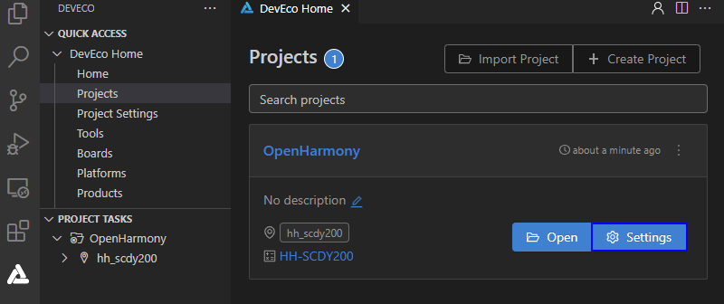
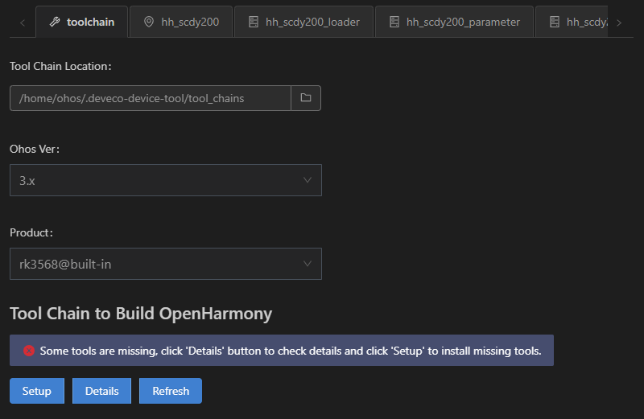
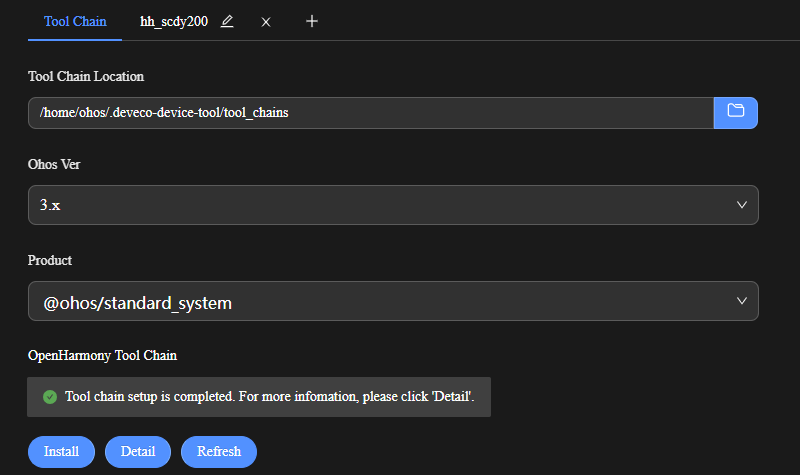

# 编译

>  **说明：**
> 
> 当前文档中匹配的是DevEco Device Tool 3.0 Release版本。不同版本的界面和使用方法略有差异，若您使用的是最新版本的DevEco Device Tool，可参考[标准系统（基于RK3568开发板）编译](https://gitee.com/openharmony/docs/blob/master/zh-cn/device-dev/quick-start/quickstart-ide-3568-build.md)。

1. 在Projects中，点击**Settings**按钮，进入HH-SCDY200配置界面。

   

2. 在toolchain页签中，DevEco Device Tool会自动检测依赖的编译工具链是否完备，如果提示部分工具缺失，可点击**SetUp**按钮，自动安装所需工具链。

   >  **说明：**
   > 如果出现安装pip组件失败，可参考[修改Python源的方法](https://device.harmonyos.com/cn/docs/documentation/guide/ide-set-python-source-0000001227639986)进行修改，完成尝试重新安装。

   

   工具链自动安装完成后如下图所示。

   

3. 在“hh_scdy200”配置页签中，设置源码的编译类型**build_type**，默认为"debug类型，请根据需要进行修改。然后点击**Save**按钮进行保存。

   

4. 在DevEco Device Tool界面的“PROJECT TASKS”中，点击对应开发板下的**Build**按钮，执行编译。

   

5. 等待编译完成，在**TERMINAL**窗口输出“SUCCESS”，编译完成。

   

   编译完成后，可以在工程的**out**目录下，查看编译生成的文件，用于后续的[RK3568开发板烧录](https://device.harmonyos.com/cn/docs/documentation/guide/ide-rk3568-upload-0000001239220669)。
