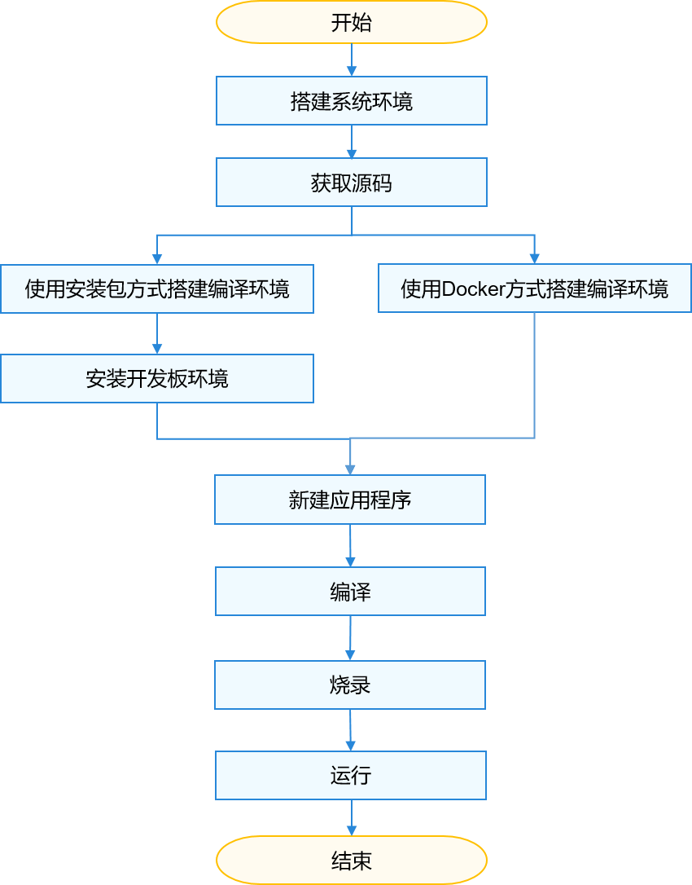

# 轻量与小型系统入门概述

OpenHarmony轻量和小型系统适用于内存较小的IOT设备。通过本文，开发者可以快速熟悉OpenHarmony轻量和小型系统的环境搭建、编译、烧录、调测以及运行“Hello World”等。

轻量和小型系统的开发有以下两种方法：

-   用Windows环境进行开发和烧录，使用Linux环境进行编译。
-   统一使用Linux环境进行开发、编译和烧录。

因目前Windows系统不支持编译，暂时无法全部使用Windows环境进行开发，开发者可根据使用习惯选择合适的开发方法。

本文将介绍第二种方法，下方所有操作均在Linux环境下进行。

本文选取了三款典型开发板：Hi3861 WLAN模组、Hi3516DV300、Hi3518EV300，并基于上述三款开发板进行开发介绍。开发板的具体外观和规格可参见[本文附录](quickstart-lite-introduction-hi3861.md#section19352114194115)，开发者可根据需要自行购买的开发板。

轻量和小型系统快速入门流程如下图所示，其中搭建编译环境环节可根据实际情况选择Docker方式或安装包方式其中一种即可。

> **说明：** 
>Docker环境已经封装了相关编译工具，开发者在使用该Docker环境时可以省去Ubuntu编译环境及开发板环境的的搭建操作。

**图 1**  轻量和小型系统快速入门流程  

