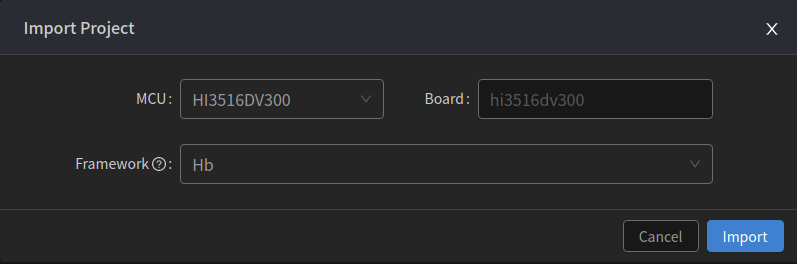
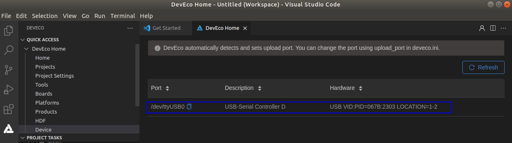
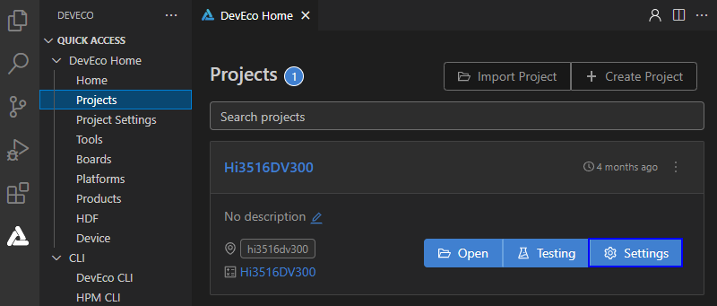
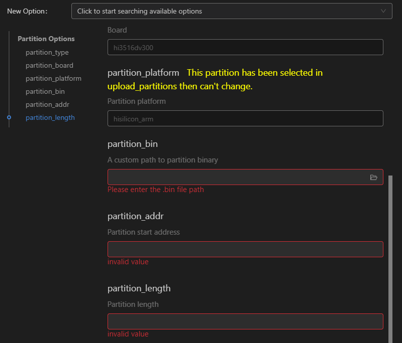

# 烧录

-   [前提条件](#section762111572589)
-   [使用网口烧录](#section12323175612487)

烧录是指将编译后的程序文件下载到芯片开发板上的动作，为后续的程序调试提供基础。DevEco Device Tool提供一键烧录功能，操作简单，能快捷、高效的完成程序烧录，提升烧录的效率。

DevEco Device Tool以插件方式运行，基于Visual Studio Code进行扩展，用户可点击Visual Studio Code左侧栏的图标打开DevEco Device Tool。

Hi3516开发板的代码烧录支持USB烧录、网口烧录和串口烧录三种方式。此处仅以网口烧录为例进行说明，其它方式请参考[Hi3516DV300开发板烧录](../toctopics/ide-hi3516-upload.md)。

## 前提条件

1.  在DevEco Device Tool工具中点击**Import Project**导入新建应用程序章节修改后的源码文件。

    

2.  选择源码导入时，系统会提示该工程不是DevEco Device Tool工程，点击**Import**。

    

3.  MCU选择HiSilicom\_Arm下的Hi3516DV300，Board选择hi3516dv300，Framework选择Hb，然后点击**Import**完成导入。

    

## 使用网口烧录

1.  请连接好电脑和待烧录开发板，需要同时连接串口、网口和电源，具体可参考[Hi3516DV300开发板介绍](https://device.harmonyos.com/cn/docs/documentation/guide/quickstart-lite-introduction-hi3516-0000001152041033)。
2.  查看并记录对应的串口号。

    > **说明：** 
    >如果对应的串口异常，请根据[Hi3516DV300/Hi3518EV300开发板串口驱动安装指导](https://device.harmonyos.com/cn/docs/documentation/guide/hi3516_hi3518-drivers-0000001050743695)安装USB转串口的驱动程序。

    Windows系统，打开设备管理器查看并记录对应的串口号，或在DevEco Device Tool中，点击QUICK ACCESS \> DevEco Home \> Device，查看并记录对应的串口号。

    

    Linux系统，在DevEco Device Tool中，点击QUICK ACCESS \> DevEco Home \> Device，查看并记录对应的串口号。

    

3.  在QUICK ACCESS \> DevEco Home \> Projects中，点击**Settings**打开工程配置界面。

    

4.  在“hi3516dv300”页签，设置烧录选项，包括upload\_partitions、upload\_port和upload\_protocol。

    -   upload\_partitions：选择待烧录的文件，默认情况下会同时烧录fastboot、kernel、rootfs和userfs。
    -   upload\_port：选择已查询的串口号。
    -   upload\_protocol：选择烧录协议，固定选择“hiburn-net”。

    

5.  检查和设置连接开发板后的网络适配器的IP地址信息，设置方法请参考[设置Hi3516DV300网口烧录的IP地址信息](https://device.harmonyos.com/cn/docs/documentation/guide/set_ipaddress-0000001141825075)。
6.  设置网口烧录的IP地址信息，设置如下选项：

    -   upload\_net\_server\_ip：选择步骤6中设置的IP地址信息。例如192.168.1.2
    -   upload\_net\_client\_mask：设置开发板的子网掩码，工具会自动根据选择的upload\_net\_server\_ip进行设置。例如255.255.255.0
    -   upload\_net\_client\_gw：设置开发板的网关，工具会自动根据选择的upload\_net\_server\_ip进行设置。例如192.168.1.1
    -   upload\_net\_client\_ip：设置开发板的IP地址，工具会自动根据选择的upload\_net\_server\_ip进行设置。例如192.168.1.3

    

7.  分别检查待烧录文件的烧录信息，DevEco Device Tool已预置默认的烧录文件信息，可根据实际情况进行调整。待烧录文件包括：fastboot、kernel、rootfs和userfs。
    1.  在“hi3516dv300\_fastboot”页签，在New Option选项中选择需要修改的项，例如partition\_bin（烧录文件路径）、partition\_addr（烧录文件起始地址）、partition\_length（烧录文件分区长度）等。

        

    2.  然后在Partition Options中，分别修改上述步骤中选择的修改项。

        > **说明：** 
        >在设置烧录分区起始地址和分区长度时，应根据实际待烧录文件的大小进行设置，要求设置的烧录分区大小，要大于待烧录文件的大小；同时，各烧录文件的分区地址设置不能出现重叠。

        

    3.  按照相同的方法修改kernel、rootfs和userfs的烧录文件信息。

8.  所有的配置都修改完成后，在工程配置页签的顶部，点击**Save**进行保存。
9.  点击**Open**打开工程文件，然后在“PROJECT TASKS”中，点击hi3516dv300下的**Upload**按钮，启动烧录。

    

10. 启动烧录后，显示如下提示信息时，请重启开发板（下电再上电）。

    

11. 重新上电后，界面提示如下信息时，表示烧录成功。

    

12. 烧录成功后，请根据镜像运行章节进行操作，启动系统。

