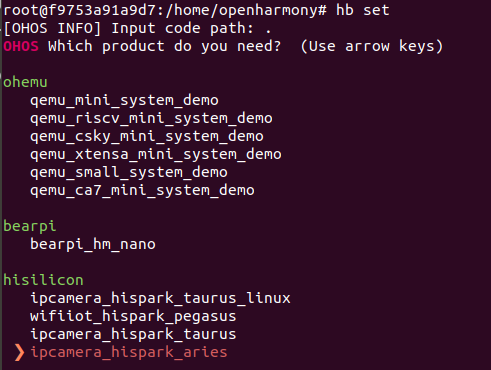

# 编译<a name="ZH-CN_TOPIC_0000001216935341"></a>

下方将介绍如何使用Hi3518开发板进行编译。使用安装包方式与docker方式搭建Ubuntu编译环境，编译命令相同。

1.  请进入源码根目录，执行如下命令进行编译：

    > **说明：** 
    >如果使用Docker方式搭建编译环境，请在[获取Docker环境](quickstart-lite-docker-environment.md#section15666113905015)中进入的Docker构建环境中，执行如下命令进行编译。

    ```
    hb set(设置编译路径)
    .（选择当前路径）
    选择ipcamera_hispark_aries并回车
    hb build -f（执行编译）
    ```

    **图 1**  Hi3518编译设置图例-Docker方式<a name="fig6140152061211"></a>  
    

2.  编译结束后，出现“ipcamera\_hispark\_aries build success”字样，则证明构建成功。

> **须知：** 
>烧录相关文件获取路径：
>结果文件：out/hispark\_aries/ipcamera\_hispark\_aries。
>U-boot文件：device/hisilicon/hispark\_aries/sdk\_liteos/uboot/out/boot/u-boot-hi3518ev300.bin。

