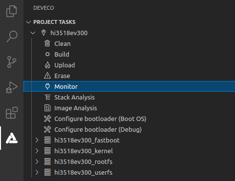

# 运行

-   [镜像运行](#section1081111115589)
-   [下一步学习](#section9712145420182)

## 镜像运行

在完成Hi3518EV300的烧录后，还需要设置BootLoader引导程序，才能运行OpenHarmony系统。

1.  在Hi3518EV300任务中，点击**Configure bootloader（Boot OS）**进行配置即可。

    > **说明：** 
    >DevEco Device Tool针对Hi3518EV300开发板的BootLoader设置进行了适配，无需开发者手动修改。

    

2.  提示如下图中的重启开发板的提示信息时，重启开发板，然后在控制台输出“SUCCESS”表示设置成功。

    

3.  在任务栏点击**Monitor**按钮，启动串口工具。

    

4.  当界面打印回显信息，点击Enter按钮，直到界面显示OHOS \#信息，表示系统启动成功。

    

## 下一步学习

恭喜您，已完成Hi3518的快速上手！建议您下一步进入[无屏摄像头产品开发](../guide/device-iotcamera.md)的学习 。

