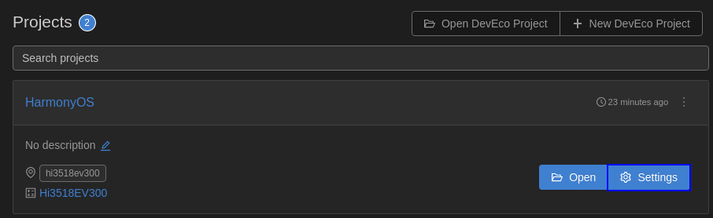
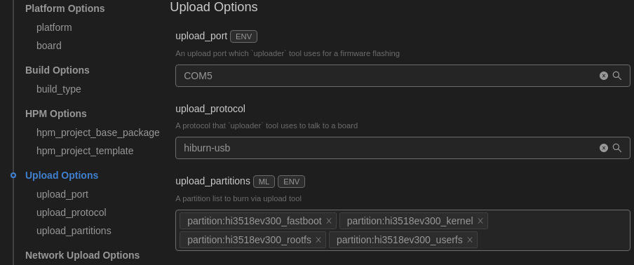

# 运行Hello OHOS（编译、烧录）<a name="ZH-CN_TOPIC_0000001174350607"></a>

-   [新建应用程序](#section1550972416485)
-   [编译](#section234175193114)
-   [烧录](#section7609155824819)
-   [镜像运行](#section17612105814480)
-   [下一步学习](#section9712145420182)

本节指导开发者在单板上运行第一个应用程序，其中包括新建应用程序、编译、烧写、运行等步骤，最终输出“Hello OHOS！”。

## 新建应用程序<a name="section1550972416485"></a>

1.  新建目录及源码

    新建**applications/sample/camera/apps/src/helloworld.c**目录及文件，代码如下所示，用户可以自定义修改打印内容（例如：修改OHOS为World）。当前应用程序可支持标准C及C++的代码开发。

    ```
    #include <stdio.h>
    
    int main(int argc, char **argv)
    {
        printf("\n************************************************\n");
        printf("\n\t\tHello OHOS!\n");
        printf("\n************************************************\n\n");
    
        return 0;
    }
    ```

2.  新建编译组织文件

    新建**applications/sample/camera/apps/BUILD.gn**文件，内容如下所示：

    ```
    import("//build/lite/config/component/lite_component.gni")
    lite_component("hello-OHOS") {
      features = [ ":helloworld" ]
    }
    executable("helloworld") {
      output_name = "helloworld"
      sources = [ "src/helloworld.c" ]
      include_dirs = []
      defines = []
      cflags_c = []
      ldflags = []
    }
    ```

3.  添加新组件

    修改文件**build/lite/components/applications.json**，添加组件hello\_world\_app的配置，如下所示为applications.json文件片段，"\#\#start\#\#"和"\#\#end\#\#"之间为新增配置（"\#\#start\#\#"和"\#\#end\#\#"仅用来标识位置，添加完配置后删除这两行）：

    ```
    {
      "components": [
        {
          "component": "camera_sample_communication",
          "description": "Communication related samples.",
          "optional": "true",
          "dirs": [
            "applications/sample/camera/communication"
          ],
          "targets": [
            "//applications/sample/camera/communication:sample"
          ],
          "rom": "",
          "ram": "",
          "output": [],
          "adapted_kernel": [ "liteos_a" ],
          "features": [],
          "deps": {
            "components": [],
            "third_party": []
          }
        },
    ##start##
        {
          "component": "hello_world_app",
          "description": "Communication related samples.",
          "optional": "true",
          "dirs": [
            "applications/sample/camera/apps"
          ],
          "targets": [
            "//applications/sample/camera/apps:hello-OHOS"
          ],
          "rom": "",
          "ram": "",
          "output": [],
          "adapted_kernel": [ "liteos_a" ],
          "features": [],
          "deps": {
            "components": [],
            "third_party": []
          }
        },
    ##end##
        {
          "component": "camera_sample_app",
          "description": "Camera related samples.",
          "optional": "true",
          "dirs": [
            "applications/sample/camera/launcher",
            "applications/sample/camera/cameraApp",
            "applications/sample/camera/setting",
            "applications/sample/camera/gallery",
            "applications/sample/camera/media"
          ],
    ```

4.  修改单板配置文件

    修改文件**vendor/hisilicon/hispark\_aries/config.json**，新增hello\_world\_app组件的条目，如下所示代码片段为applications子系统配置，"\#\#start\#\#"和"\#\#end\#\#"之间为新增条目（"\#\#start\#\#"和"\#\#end\#\#"仅用来标识位置，添加完配置后删除这两行）：

    ```
          {
            "subsystem": "applications",
            "components": [
    ##start##
              { "component": "hello_world_app", "features":[] },
    ##end##
              { "component": "camera_sample_app", "features":[] }
    
            ]
          },
    ```


## 编译<a name="section234175193114"></a>

如果Linux编译环境通过Docker方式安装，具体编译过程请参见[Docker方式获取编译环境](../get-code/gettools-acquire.md#section107932281315)的编译操作。如果Linux编译环境通过软件包方式安装，进入源码根目录，执行如下命令进行编译：

```
hb set(设置编译路径)
.（选择当前路径）
选择ipcamera_hispark_aries@hisilicon并回车
hb build -f（执行编译）
```

结果文件生成在out/hispark\_aries/ipcamera\_hispark\_aries目录下。

**图 1**  Hi3518编译设置图例<a name="fig12982192583111"></a>  


> **须知：** 
>Hi3518EV300单板的U-boot文件获取路径：device/hisilicon/hispark\_aries/sdk\_liteos/uboot/out/boot/u-boot-hi3518ev300.bin

## 烧录<a name="section7609155824819"></a>

烧录是指将编译后的程序文件下载到芯片开发板上的动作，为后续的程序调试提供基础。DevEco Device Tool提供一键烧录功能，操作简单，能快捷、高效的完成程序烧录，提升烧录的效率。

Hi3518EV300开发板的代码烧录支持USB烧录和串口烧录两种方式，其中：

-   **Windows系统：支持USB烧录和串口烧录。**
-   **Linux系统：支持串口烧录，如果采用的是Linux+Windows双系统，也支持USB烧录。**

同一种烧录方式（如串口烧录），在Windows和Linux环境下的烧录操作完全一致，区别仅在于DevEco Device Tool环境搭建不同。

此处仅以USB烧录为例进行说明。

1.  请连接好电脑和待烧录开发板，需要同时连接串口和USB口，具体可参考[Hi3518EV300开发板介绍](https://device.harmonyos.com/cn/docs/start/introduce/oem_minitinier_des_3518-0000001105201138)。
2.  <a name="zh-cn_topic_0000001057313128_li46411811196"></a>打开电脑的设备管理器，查看并记录对应的串口号。

    > **说明：** 
    >如果对应的串口异常，请根据[Hi3516DV300/Hi3518EV300开发板串口驱动安装指导](https://device.harmonyos.com/cn/docs/ide/user-guides/hi3516_hi3518-drivers-0000001050743695)安装USB转串口的驱动程序。

    

3.  打开DevEco Device Tool，在QUICK ACCESS \> DevEco Home \> Projects中，点击**Settings**打开工程配置界面。

    

4.  在“Partition Configuration”页签，设置待烧录文件信息，默认情况下，DevEco Device Tool已针对Hi3518EV300开发板进行适配，无需单独修改。

    > **说明：** 
    >如果待烧录文件是直接通过拷贝的方式获取，需要手动修改待烧录文件的路径。打开待烧录文件的页签，在Partition Settings的New Opiton的下拉列表中，选择Partition\_bin，然后在Partition Opiton的Partition\_bin设置待烧录文件的路径。

5.  在“hi3518ev300”页签，设置烧录选项，包括upload\_port、upload\_partitions和upload\_protocol。

    -   upload\_port：选择步骤[2](#zh-cn_topic_0000001057313128_li46411811196)中查询的串口号。
    -   upload\_protocol：选择烧录协议，固定选择“hiburn-usb”。
    -   upload\_partitions：选择待烧录的文件，默认情况下会同时烧录fastboot、kernel、rootfs和userfs。

    

6.  所有的配置都修改完成后，在工程配置页签的顶部，点击**Save**进行保存。
7.  打开工程文件，点击图标，打开DevEco Device Tool界面，在“PROJECT TASKS”中，点击hi3518ev300\_fastboot下的**Erase**按钮，擦除U-Boot。

    

8.  执行**Erase**擦除操作后，显示如下提示信息时，请重启开发板（下电再上电）。

    

9.  重新上电后，显示如下信息时，表示擦除U-Boot成功。

    

10. 擦除完成后，点击hi3518ev300下的**Upload**按钮，启动烧录。

    

11. 启动烧录后，界面提示如下信息时，表示烧录成功。

    

12. 烧录成功后，请根据镜像运行章节进行操作，启动系统。

## 镜像运行<a name="section17612105814480"></a>

在完成Hi3518EV300的烧录后，还需要设置BootLoader引导程序，才能运行OpenHarmony系统。

1.  在Hi3518EV300任务中，点击**Configure bootloader（Boot OS）**进行配置即可。

    > **说明：** 
    >DevEco Device Tool针对Hi3518EV300开发板的BootLoader设置进行了适配，无需开发者手动修改。

    

2.  提示如下图中的重启开发板的提示信息时，重启开发板，然后在控制台输出“SUCCESS”表示设置成功。

    

3.  在任务栏点击**Monitor**按钮，启动串口工具。

    

4.  然后根据界面提示进行操作，直到在界面打印OHOS \#信息，表示系统启动成功。

    


## 下一步学习<a name="section9712145420182"></a>

恭喜您，已完成Hi3518的快速上手！建议您下一步进入[无屏摄像头产品开发](../guide/device-iotcamera.md)的学习 。

