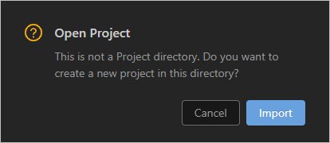
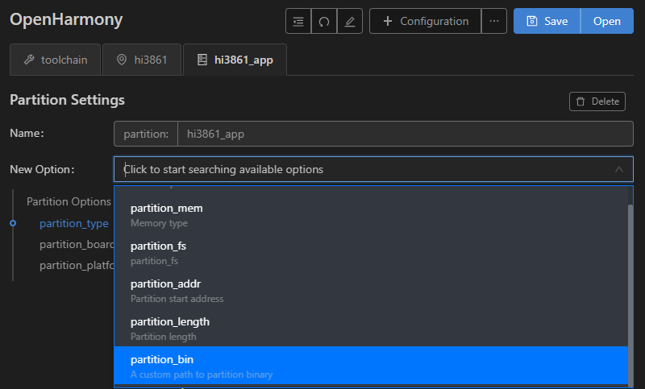

# 烧录

在Windows下通过串口烧录Hi3861 WLAN模组。

### 导入源码

在编译完成后，[保证Windows系统可以远程访问Ubuntu环境](../quick-start/quickstart-lite-env-setup.md)的情况下，您还需要通过以下步骤导入源码后，方可进行烧录。

1. 打开DevEco Device Tool，进入Home页，点击**Import Project**打开工程。

   

2. 选择要导入的源码目录（需要访问Ubuntu下的源码目录），点击**Import**打开。
   >  **说明：**
   > 工程存储路径不能包含中文字符、空格。如果工程存储路径包含中文字符或空格，可能导致编译失败。

   

3. 如果您打开的目录不是DevEco Device Tool工程，则会出现如下提示框，点击**Import**。

   

4. 在Select Project type界面，选择**Import from OpenHarmony Source**。

   

5. 在Import Project界面，选择**Product**后，会自动填充对应的MCU、Board、company和kernel信息，然后**ohosVersion**选择对应的OpenHarmony源码版本。此处选择wifiiot_hispark_pegasus。

   

6. 点击**Open**打开工程或源码。

### 烧录

完成源码导入后，通过以下步骤进行烧录：

1. 请连接好电脑和待烧录开发板，需要连接USB口，具体可参考[Hi3861V100开发板介绍](https://gitee.com/openharmony/docs/blob/master/zh-cn/device-dev/quick-start/quickstart-lite-introduction-hi3861.md)。

2. 在DevEco Device Tool中，选择REMOTE DEVELOPMENT &gt; Local PC，查看远程计算机（Ubuntu开发环境）与本地计算机（Windows开发环境）的连接状态。
   - 如果Local PC右边连接按钮为，则远程计算机与本地计算机为已连接状态，不需要执行其他操作。
   - 如果Local PC右边连接按钮为，则点击绿色连接进行按钮。

   

   >  **说明：**
   > 该操作仅在远程模式（Windows+Ubuntu混合开发环境）中需要设置，如果采用本地模式（Windows开发环境或Ubuntu开发环境），则请跳过该步骤。

3. 在DevEco Device Tool中，点击QUICK ACCESS &gt; DevEco Home &gt; Device，查看并记录对应的串口号。

   

   >  **说明：**
   > 如果对应的串口异常，请根据[Hi3861V100开发板串口驱动安装](https://device.harmonyos.com/cn/docs/documentation/guide/hi3861-drivers-0000001058153433)安装USB转串口的驱动程序。

4. 在QUICK ACCESS &gt; DevEco Home &gt; Projects中，点击**Settings**打开工程配置界面。

   

5. 在“hi3861”页签，设置烧录选项，包括upload_port、upload_protocol和upload_partitions。
   - upload_port：选择已查询的串口号。
   - upload_protocol：选择烧录协议，选择“hiburn-serial”。
   - upload_partitions：选择待烧录的文件，默认选择hi3861_app。

   

6. 检查待烧录文件的烧录信息，DevEco Device Tool已预置默认的烧录文件信息，可根据实际情况进行调整。
   在“hi3861_app”页签，在New Option选项中选择partition_bin（烧录文件路径），然后设置待烧录文件的地址。

   

7. 所有的配置都修改完成后，在工程配置页签的顶部，点击**Save**进行保存。

8. 点击**Open**打开工程文件，然后在“PROJECT TASKS”中，点击hi3861下的**Upload**按钮，启动烧录。

   

9. 启动烧录后，显示如下提示信息时，请按开发板上的RST按钮重启开发板。

   

10. 重新上电后，界面提示如下信息时，表示烧录成功。

   
