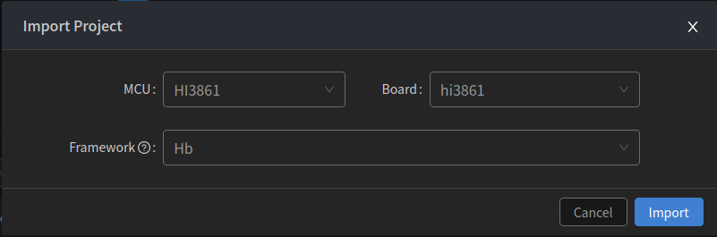
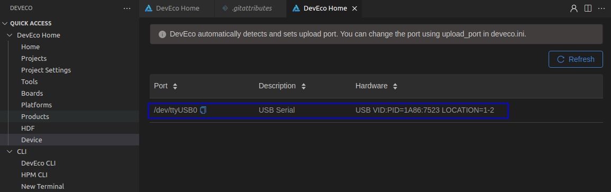
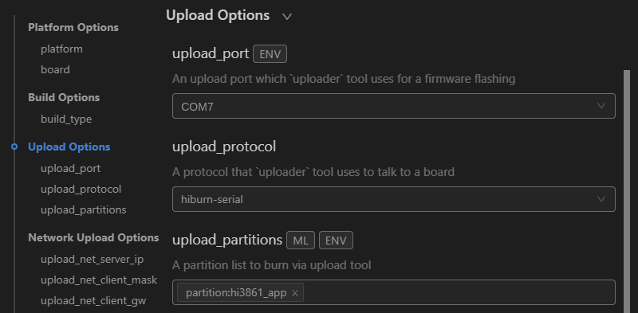
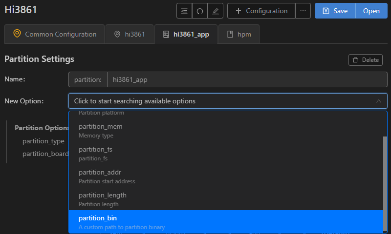
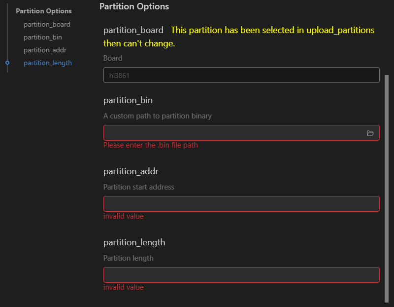

# 烧录

-   [前提条件](#section1535374111495)
-   [使用串口烧录](#section5551201122719)

烧录是指将编译后的程序文件下载到芯片开发板上的动作，为后续的程序调试提供基础。DevEco Device Tool提供一键烧录功能，操作简单，能快捷、高效的完成程序烧录，提升烧录的效率。

DevEco Device Tool以插件方式运行，基于Visual Studio Code进行扩展，用户可点击Visual Studio Code左侧栏的图标打开DevEco Device Tool。

**Hi3861V100开发板支持串口烧录方式，Linux系统串口烧录协议为hiburn-serial。**具体操作步骤如下：

## 前提条件

1.  在DevEco Device Tool工具中点击**Import Project**导入新建应用程序章节修改后的源码文件。

    

2.  选择源码导入时，系统会提示该工程不是DevEco Device Tool工程，点击**Import**。

    

3.  MCU选择Hi3861，Board选择Hi3861，Framework选择Hb，然后点击**Import**完成导入。

    

## 使用串口烧录

1.  请连接好电脑和待烧录开发板，需要连接USB口，具体可参考[Hi3861V100开发板介绍](https://device.harmonyos.com/cn/docs/documentation/guide/quickstart-lite-introduction-hi3861-0000001105041324)[Hi3861V100开发板介绍](https://gitee.com/openharmony/docs/blob/master/zh-cn/device-dev/quick-start/quickstart-lite-introduction-hi3861.md)。
2.  查看并记录对应的串口号。

    > **说明：** 
    >如果对应的串口异常，请根据[Hi3861V100开发板串口驱动安装](https://device.harmonyos.com/cn/docs/documentation/guide/hi3861-drivers-0000001058153433)安装USB转串口的驱动程序。

    Window系统，打开设备管理器查看并记录对应的串口号，或在DevEco Device Tool中，点击QUICK ACCESS \> DevEco Home \> Device，查看并记录对应的串口号。

    

    Linux系统，在DevEco Device Tool中，点击QUICK ACCESS \> DevEco Home \> Device，查看并记录对应的串口号。

    

3.  在QUICK ACCESS \> DevEco Home \> Projects中，点击**Settings**打开工程配置界面。

    

4.  在“hi3861”页签，设置烧录选项，包括upload\_port、upload\_protocol和upload\_partitions。

    -   upload\_port：选择已查询的串口号。
    -   upload\_protocol：选择烧录协议，选择“hiburn-serial”。
    -   upload\_partitions：选择待烧录的文件，默认选择hi3861\_app。

    

5.  检查待烧录文件的烧录信息，DevEco Device Tool已预置默认的烧录文件信息，可根据实际情况进行调整。
    1.  在“hi3861\_app”页签，在New Option选项中选择需要修改的项，例如partition\_bin（烧录文件路径）、partition\_addr（烧录文件起始地址）、partition\_length（烧录文件分区长度）等。

        

    2.  然后在Partition Options中，分别修改上述步骤中选择的修改项。

        > **说明：** 
        >在设置烧录分区起始地址和分区长度时，应根据实际待烧录文件的大小进行设置，要求设置的烧录分区大小，要大于待烧录文件的大小。

        

6.  所有的配置都修改完成后，在工程配置页签的顶部，点击**Save**进行保存。
7.  点击**Open**打开工程文件，然后在“PROJECT TASKS”中，点击hi3861下的**Upload**按钮，启动烧录。

    

8.  启动烧录后，显示如下提示信息时，请按开发板上的RST按钮重启开发板。

    

9.  重新上电后，界面提示如下信息时，表示烧录成功。

    

