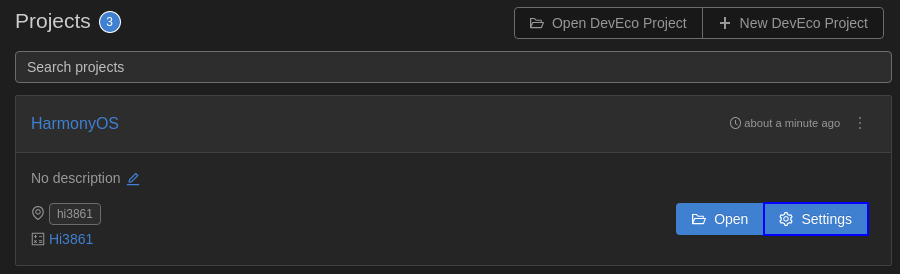
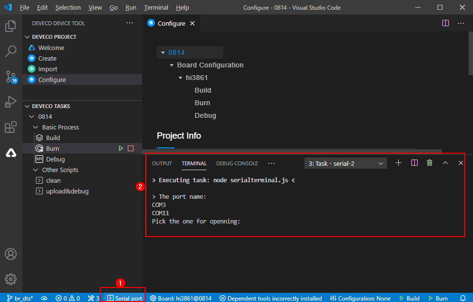

# WLAN联网（编译、烧录）<a name="ZH-CN_TOPIC_0000001174350611"></a>

-   [编译](#section191121332125319)
-   [镜像烧录](#section3288165814218)
-   [WLAN模组联网](#section194671619167)

本示例将演示如何通过AT命令完成WLAN模组与网关联网。

## 编译<a name="section191121332125319"></a>

本节描述如何在Linux服务器上进行WLAN模组版本的编译。

如果Linux编译环境通过Docker方式安装，具体编译过程请参见[Docker方式获取编译环境](../get-code/gettools-acquire.md#section107932281315)的编译操作。如果Linux编译环境通过软件包方式安装，请参考如下步骤。

1.  打开DevEco Device Tool工具，点击“View \> Terminal”，进入终端界面。

    **图 1**  IDE终端工具打开方法<a name="fig755583241511"></a>  
    

    在终端界面使用ssh命令连接linux服务器，如“ssh user@ipaddr”。

    **图 2**  终端界面示意图<a name="fig14407256101510"></a>  
    

2.  进入代码根路径，并在终端窗口，执行脚本命令“hb set”、“.”，选择需要编译的版本“wifiiot\_hispark\_pegasus”。

    **图 3**  在终端界面选择目标构建版本示意图<a name="fig191035701814"></a>  
    

3.  执行“hb build”启动版本构建。

    **图 4**  在终端界面执行编译命令示意图<a name="fig10635942111916"></a>  
    

4.  编译结束后，如果出现“wifiiot\_hispark\_pegasus build success”字样，则证明构建成功，如下图所示。

    **图 5**  编译成功示意图<a name="fig195291328182015"></a>  
    

5.  构建成功后，会在./out/wifiiot/路径中生成以下文件，使用如下命令可以查看，至此编译构建流程结束。

    ```
    ls -l out/hispark_pegasus/wifiiot_hispark_pegasus/
    ```

    **图 6**  编译文件存放目录示意图<a name="fig112257131214"></a>  
    


## 镜像烧录<a name="section3288165814218"></a>

烧录是指将编译后的程序文件下载到芯片开发板上的动作，为后续的程序调试提供基础。DevEco Device Tool提供一键烧录功能，操作简单，能快捷、高效的完成程序烧录，提升烧录的效率。

**Hi3861V100开发板支持串口烧录方式，其中Windows系统串口烧录协议包括burn-serial和hiburn-serial，Linux系统串口烧录协议为hiburn-serial。**

> **说明：** 
>Windows下的两种烧录协议**burn-serial**和**hiburn-serial**，在操作上没有区别，**burn-serial**协议主要是为了兼容历史版本工程。

Hi3861V100在Windows和Linux环境下的烧录操作完全一致，区别仅在于DevEco Device Tool环境搭建不同。

1.  请连接好电脑和待烧录开发板，需要连接USB口，具体可参考[Hi3861V100开发板介绍](https://device.harmonyos.com/cn/docs/start/introduce/oem_minitinier_des_3861-0000001105041324)。
2.  打开电脑的设备管理器，查看并记录对应的串口号。

    > **说明：** 
    >如果对应的串口异常，请根据[Hi3861V100开发板串口驱动安装](https://device.harmonyos.com/cn/docs/ide/user-guides/hi3861-drivers-0000001058153433)安装USB转串口的驱动程序。

    

3.  打开DevEco Device Tool，在QUICK ACCESS \> DevEco Home \> Projects中，点击**Settings**打开工程配置界面。

    

4.  在“Partition Configuration”页签，设置待烧录文件信息，默认情况下，DevEco Device Tool已针对Hi3861V100开发板进行适配，无需单独修改。

    > **说明：** 
    >如果待烧录文件是直接通过拷贝的方式获取，需要手动修改待烧录文件的路径。打开待烧录文件的页签，在Partition Settings的New Opiton的下拉列表中，选择Partition\_bin，然后在Partition Opiton的Partition\_bin设置待烧录文件的路径。

5.  在“hi3861”页签，设置烧录选项，包括upload\_port、upload\_partitions和upload\_protocol。

    -   upload\_port：选择步骤2中查询的串口号。
    -   upload\_protocol：选择烧录协议，Windows系统可以选择“burn-serial”或“hiburn-serial”，Linux系统只能选择“hiburn-serial”。
    -   upload\_partitions：选择待烧录的文件，默认选择hi3861\_app。

    

6.  所有的配置都修改完成后，在工程配置页签的顶部，点击**Save**进行保存。
7.  打开工程文件，在DevEco Device Tool界面的“PROJECT TASKS”中，点击hi3861下的**Upload**按钮，启动烧录。

    

8.  启动烧录后，显示如下提示信息时，请按开发板上的RST按钮重启开发板。

    

9.  重新上电后，界面提示如下信息时，表示烧录成功。

    


## WLAN模组联网<a name="section194671619167"></a>

完成版本构建及烧录后，下面开始介绍如何在串口终端上执行AT命令，使WLAN模组联网。

1.  保持Windows工作台和WLAN模组的连接状态，在DevEco工具最下方，点击“DevEco:Serial Monitor”按钮。

    **图 7**  打开DevEco串口终端示意图<a name="fig464411253297"></a>  
    

2.  复位WLAN模组，终端界面显示“ready to OS start”，则启动成功。

    **图 8**  WLAN复位成功示意图<a name="fig3327108143016"></a>  
    

3.  在DevEco的串口终端中，依次执行如下AT命令，启动STA模式，连接指定AP热点，并开启DHCP功能。

    ```
    AT+STARTSTA                             # 启动STA模式
    AT+SCAN                                 # 扫描周边AP
    AT+SCANRESULT                           # 显示扫描结果
    AT+CONN="SSID",,2,"PASSWORD"            # 连接指定AP，其中SSID/PASSWORD为待连接的热点名称和密码
    AT+STASTAT                              # 查看连接结果
    AT+DHCP=wlan0,1                         # 通过DHCP向AP请求wlan0的IP地址
    ```

4.  查看WLAN模组与网关联通是否正常，如下图所示。

    ```
    AT+IFCFG                                # 查看模组接口IP
    AT+PING=X.X.X.X                         # 检查模组与网关的联通性，其中X.X.X.X需替换为实际的网关地址
    ```

    **图 9**  WLAN模组联网成功示意图<a name="fig7672858203010"></a>  
    


