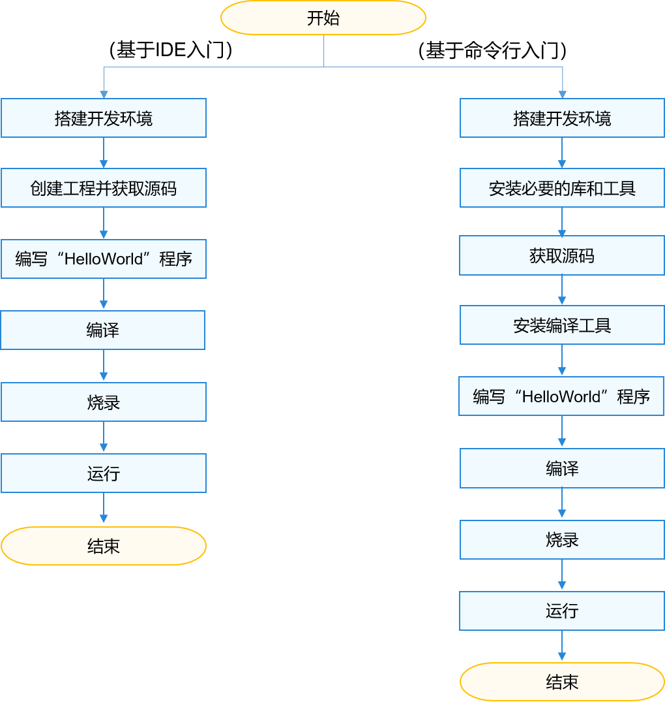

# 快速入门概述

OpenHarmony是一款面向全场景的开源分布式操作系统，采用组件化设计，支持在128KiB到xGiB RAM资源的设备上运行系统组件，设备开发者可基于目标硬件能力自由选择系统组件进行集成。

OpenHarmony当前定义了三种基础系统类型，设备开发者通过选择基础系统类型完成必选组件集配置后，便可实现其最小系统的开发。这三种基础系统类型的参考定义如下：

  **表1** 基础类型系统简介

| 类型 | 处理器 | 最小内存 | 能力 | 
| -------- | -------- | -------- | -------- |
| 轻量系统（mini&nbsp;system） | MCU类处理器（例如Arm&nbsp;Cortex-M、RISC-V&nbsp;32位的设备） | 128KiB | 提供多种轻量级网络协议，轻量级的图形框架，以及丰富的IOT总线读写部件等。可支撑的产品如智能家居领域的连接类模组、传感器设备、穿戴类设备等。 | 
| 小型系统（small&nbsp;system） | 应用处理器（例如Arm&nbsp;Cortex-A的设备） | 1MiB | 提供更高的安全能力、标准的图形框架、视频编解码的多媒体能力。可支撑的产品如智能家居领域的IP&nbsp;Camera、电子猫眼、路由器以及智慧出行域的行车记录仪等。 | 
| 标准系统（standard&nbsp;system） | 应用处理器（例如Arm&nbsp;Cortex-A的设备） | 128MiB | 提供增强的交互能力、3D&nbsp;GPU以及硬件合成能力、更多控件以及动效更丰富的图形能力、完整的应用框架。可支撑的产品如高端的冰箱显示屏。 | 

本文通过介绍OpenHarmony系统的开发环境搭建、编译、烧录、调测以及运行“Hello World”等，引导开发者快速熟悉OpenHarmony设备开发的基本流程和方法。

## 操作方式

考虑到开发者的开发习惯，OpenHarmony为开发者提供了以下两种入门指导：

  **表2** 入门方式

| 方式 | 工具 | 特点 | 适用人群 |
| -------- | -------- | -------- | -------- |
| [基于IDE入门](quickstart-ide-env-win.md) | IDE（DevEco&nbsp;Device&nbsp;Tool） | 完全采用IDE进行一站式开发，编译依赖工具的安装及编译、烧录、运行都通过IDE进行操作。 DevEco&nbsp;Device&nbsp;Tool采用Windows+Ubuntu混合开发环境： -&nbsp;在Windows上主要进行代码开发、代码调试、烧录等操作。 -&nbsp;在Ubuntu环境实现源码编译。 DevEco&nbsp;Device&nbsp;Tool提供界面化的操作接口，可以为您提供更快捷的开发体验。 | -&nbsp;不熟悉命令行操作的开发者 -&nbsp;习惯界面化操作的开发者 |
| [基于命令行入门](quickstart-pkg-prepare.md) | 命令行工具包 | 通过命令行方式下载安装编译依赖工具，在Linux系统中进行编译时，相关操作通过命令实现；在Windows系统中使用开发板厂商提供的工具进行代码烧录。 命令行方式提供了简便统一的工具链安装方式。 | 习惯使用命令行操作的开发者 |

## 开发板

本文选取了如下三款典型开发板，用于介绍不同系统的开发过程，开发者可根据需要自行购买开发板。

  **表3** 开发板-系统对应关系

| 名称 | 适配系统 | 简介 | 
| -------- | -------- | -------- |
| Hi3861&nbsp;WLAN模组 | 轻量 | [Hi3861开发板介绍](quickstart-appendix-hi3861.md) | 
| Hi3516DV300 | 小型 | [Hi3516开发板介绍](quickstart-appendix-hi3516.md) | 
| RK3568 | 标准 | [RK3568开发板介绍](quickstart-appendix-rk3568.md) | 

## 开发流程

设备开发快速入门流程如下图所示。

  **图1** 快速入门开发流程

