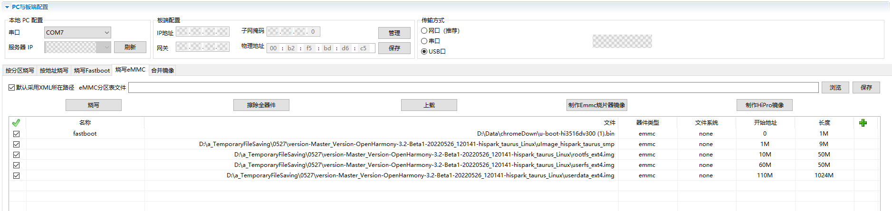

# 烧录


针对Hi3516DV300开发板，除了DevEco Device Tool（操作方法请参考[烧录](quickstart-ide-3516-burn.md)）外，还可以使用HiTool进行烧录。


## 前提条件

- 开发板相关源码已编译完成，已形成烧录文件。

- 客户端（操作平台，例如Windows系统）已下载并安装[HiTool工具](http://www.hihope.org/download/download.aspx)。

- 客户端（操作平台，例如Windows系统）已安装USB驱动，可参考[Hi3516DV300开发板USB驱动安装指导](https://gitee.com/link?target=https%3A%2F%2Fdevice.harmonyos.com%2Fcn%2Fdocs%2Fdocumentation%2Fguide%2Fusb_driver-0000001058690393)。

- 客户端已安装串口终端工具（例如IPOP）。

- 使用USB线缆、串口线缆连接客户端与开发板。


## 操作步骤

1. 准备烧录相关文件。
   1. 在客户端新建用于保存烧录文件的文件夹，例如“D:\liteos”或“D:\linux”。
   2. 将烧录所需烧写配置文件和启动引导文件保存到新建的文件夹中。
      - Hi3516DV300对应的LiteOS内核小型系统的启动引导文件为“[u-boot-hi3516dv300.bin](https://gitee.com/openharmony/device_board_hisilicon/tree/master/hispark_taurus/uboot/out/boot)”，烧写配置文件需要开发者自行准备（可自行命名，例如LS_3516_liteos.xml），模板如下：
          
          ```
          <?xml version="1.0" encoding="GB2312" ?>
          <Partition_Info ProgrammerFile="">
          <Part Sel="1" PartitionName="fastboot" FlashType="emmc" FileSystem="none" Start="0" Length="1M" SelectFile="D:\liteos\u-boot-hi3516dv300.bin"/>
          <Part Sel="1" PartitionName="" FlashType="emmc" FileSystem="none" Start="1M" Length="9M" SelectFile="D:\liteos\OHOS_Image.bin"/>
          <Part Sel="1" PartitionName="" FlashType="emmc" FileSystem="none" Start="10M" Length="50M" SelectFile="D:\liteos\rootfs_vfat.img"/>
          <Part Sel="1" PartitionName="" FlashType="emmc" FileSystem="none" Start="60M" Length="50M" SelectFile="D:\liteos\userfs_vfat.img"/>
          </Partition_Info>
          ```
      - Hi3516DV300对应的Linux内核小型系统的启动引导文件为“[u-boot-hi3516dv300.bin](https://gitee.com/openharmony/device_board_hisilicon/tree/master/hispark_taurus/uboot/out/boot)”，烧写配置文件需要开发者自行准备（可自行命名，例如LS_3516_linux.xml），模板如下：
          
          ```
          <?xml version="1.0" encoding="GB2312" ?>
          <Partition_Info ProgrammerFile="">
          <Part Sel="1" PartitionName="fastboot" FlashType="emmc" FileSystem="none" Start="0" Length="1M" SelectFile="D:\linux\u-boot-hi3516dv300.bin"/>
          <Part Sel="1" PartitionName="ohos_image" FlashType="emmc" FileSystem="none" Start="1M" Length="9M" SelectFile="D:\linux\uImage_hi3516dv300_smp"/>
          <Part Sel="1" PartitionName="rootfs" FlashType="emmc" FileSystem="ext3/4" Start="10M" Length="50M" SelectFile="D:\linux\rootfs_ext4.img"/>
          <Part Sel="1" PartitionName="userfs" FlashType="emmc" FileSystem="ext3/4" Start="60M" Length="50M" SelectFile="D:\linux\userfs_ext4.img"/>
          <Part Sel="1" PartitionName="userdata" FlashType="emmc" FileSystem="ext3/4" Start="110M" Length="1024M" SelectFile="D:\linux\userdata_ext4.img"/>
          </Partition_Info>
          ```
   3. 将编译完成的源码包下载至客户端并解压，将烧录相关文件拷贝至步骤1中新建的文件夹。
      
      针对Hi3516DV300开发板（系统使用LiteOS内核或Linux内核根据业务实际需要选择）：

       - LiteOS内核小型系统对应的烧写所需文件为：OHOS_Image.bin、rootfs_vfat.img、userfs_vfat.img
       - Linux内核小型系统对应的烧写所需文件为：uImage_hi3516dv300_smp、rootfs_ext4.img、userfs_ext4.img、userdata_ext4.img

2. 使用HiTool烧录。
   1. 打开HiTool。
   2. 设置HiTool参数。
      
      传输方式选择USB口，烧写方式选择烧写eMMC（单板的存储介质为eMMC）。
   3. 单击浏览在步骤1创建的文件夹中选择烧写配置文件（例如LS_3516_linux.xml）。
      
       
   4. 单击烧写后，按住开发板上串口旁的按钮（Update键），并拔插USB线（上下电）。
      
      烧录开始后，可以在HiTool工具下方的控制台区域观察到烧录过程中的打印信息。

      烧录完成后，HiTool弹出提示框显示烧写成功。
   5. 单击确定。

3. 导入启动参数。
   1. 使用终端工具打开串口。
   2. 拔插开发板电源使其重启，3s内在串口终端输入回车。
      
      终端界面中出现“hisilicon \#”表示已连接开发板串口。
   3. 在串口终端拷贝如下启动参数后，按回车完成配置。
       - LiteOS内核小型系统对应的启动参数为：
         
          ```
          setenv bootcmd "mmc read 0x0 0x80000000 0x800 0x4800;go 0x80000000";
          setenv bootargs "console=ttyAMA0,115200n8 root=emmc fstype=vfat rootaddr=10M rootsize=50M rw";
          saveenv
          sa;reset
          ```
       - Linux内核小型系统对应的启动参数为：
         
          ```
          setenv bootargs "mem=128M console=ttyAMA0,115200 root=/dev/mmcblk0p3 rw rootfstype=ext4 rootwait blkdevparts=mmcblk0:1M(boot),9M(kernel),50M(rootfs),50M(userfs),1024M(userdata)"
          setenv bootcmd "mmc read 0x0 0x82000000 0x800 0x4800; mw 0x10FF0044 0x0600;mw 0x120D2010 0x00000000;mw 0x120D2400 0x000000ff;mw 0x120D2010 0x00000000; bootm 0x82000000"
          saveenv;
          reset
          ```
