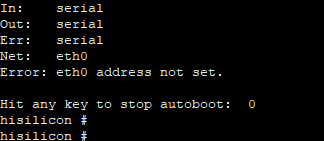

# 烧录异常处理

## 烧写选择串口后提示“Error: Opening COMxx: Access denied”

- **现象描述**
  
  单击烧写并选择串口后，出现Error: Opening COMxx: Access denied。

    **图1** 打开串口失败图  
  
   

- **可能原因**
  
  串口已经被占用。

- **解决办法**

1. 按图依次选择下拉框，查找带有serial-xx的终端。
    
    **图2** 查找是否存在占用串口的终端  
   
   

2. 单击标号中的垃圾桶图标，关闭串口。
    
    **图3** 关闭串口终端  
  
   

3. 重新单击烧写，选择串口并开始烧写程序。
    
    **图4** 重新启动烧写任务  
 
   

## Windows电脑与单板网络连接失败

- **现象描述**
  
  单击烧写并选择串口后，无法获取文件。

    **图5** 网络不通，单板无法获取文件图  
  
   

- **可能原因**
  
  单板网络与Windows电脑不联通。

  Windows电脑防火墙未允许Visual Studio Code联网。

- **解决方法**

1. 检查网线是否连接。

2. 单击Windows防火墙。
    
    **图6** 网络防火墙设置图  
   
   

3. 单击“允许应用通过防火墙”。
    
    **图7** 防火墙和网络保护界面图  
  
   

4. 查找Visual Studio Code应用。
    
    **图8** 查找Visual Studio Code应用图  
  
   

5. 勾选Visual Studio Code的专用和公用网络的访问权限。
   
   **图9** 允许Visual Studio Code应用访问网络  
   
   

## （Hi3516）串口无回显

- **现象描述**
  
  串口显示已连接，重启单板后，回车无任何回显。

- **可能原因1**
  
  串口连接错误。

- **解决办法**
  
  修改串口号。

  请查看设备管理器，确认连接单板的串口与终端中连接串口是否一致。若不一致，请按[串口访问失败的步骤](#烧写选择串口后提示error-opening-comxx-access-denied)修改串口号。

- **可能原因2**
  
  单板U-boot被损坏。

- **解决办法**
 
  烧写U-boot。

  若上述步骤依旧无法连接串口，可能由于单板U-boot损坏，按下述步骤烧写U-boot。

1. 获取引导文件U-boot。
   >  **须知：**
   > 单板的U-boot文件请在开源包中获取：device\hisilicon\hispark_taurus\sdk_liteos\uboot\out\boot\u-boot-hi3516dv300.bin

2. 根据USB烧写步骤烧写U-boot文件。
   
   按照[Hi3516系列USB烧写步骤](https://device.harmonyos.com/cn/docs/documentation/guide/upload_hi3516_small_system-0000001326267405)中描述的烧写方法，选择对应单板的U-boot文件进行烧写。

3. 烧写完成后，登录串口如下图所示。
    
    **图10** U-boot烧写完成串口显示图  
   
   
