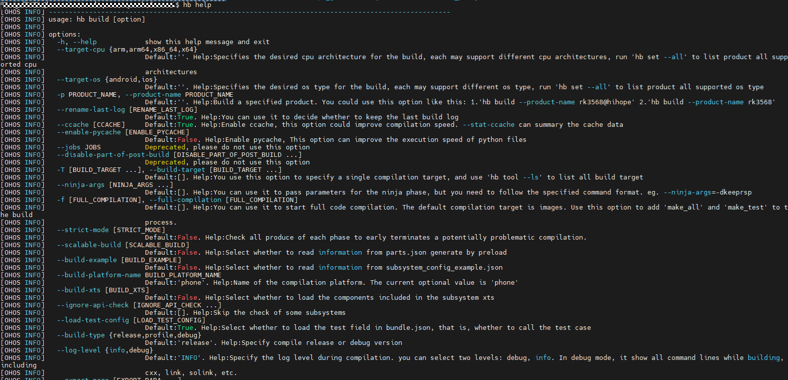

# 安装编译工具


## 安装编译工具

想要详细了解OpenHarmony编译构建模块功能的开发者可参考[编译构建指南](../subsystems/subsys-build-all.md)。

相关操作在Ubuntu环境下进行。


### 安装hb

>  **说明：**
> 如需安装代理，请参考[配置代理](quickstart-pkg-common-proxy.md)。

1. 在源码根目录运行如下命令安装hb并更新至最新版本。
     
   ```shell
   python3 -m pip install --user build/hb
   ```

2. 设置环境变量。
     
   ```shell
   vim ~/.bashrc
   ```

   将以下命令拷贝到.bashrc文件的最后一行，保存并退出。
     
   ```shell
   export PATH=~/.local/bin:$PATH
   ```

   执行如下命令更新环境变量。
     
   ```shell
   source ~/.bashrc
   ```

3. 在源码目录执行"hb help"，界面打印以下信息即表示安装成功。
     
   

>  **须知：**
> - 可采用以下命令卸载hb：
>     
>   ```shell
>   python3 -m pip uninstall ohos-build   
>   ```
> 
> - 若安装hb的过程中遇到问题，请参见下文[常见问题](quickstart-pkg-common-hberr.md)进行解决。


### 安装LLVM(仅OpenHarmony_v1.x分支/标签需要)

>  **须知：**
> 如果下载的源码为OpenHarmony_v1.x分支/标签，请按下面的步骤安装9.0.0版本的llvm。
> 
> 如果下载的源码为Master及非OpenHarmony_v1.x分支/标签，可直接跳过本小节，hb会自动下载最新的llvm。

1. 打开Linux编译服务器终端。

2. [下载LLVM工具](https://repo.huaweicloud.com/harmonyos/compiler/clang/9.0.0-36191/linux/llvm-linux-9.0.0-36191.tar)。

3. 解压LLVM安装包至~/llvm路径下。
     
   ```shell
   tar -zxvf llvm.tar -C ~/
   ```

4. 设置环境变量。
     
   ```shell
   vim ~/.bashrc
   ```

   将以下命令拷贝到.bashrc文件的最后一行，保存并退出。

     
   ```shell
   export PATH=~/llvm/bin:$PATH
   ```

5. 生效环境变量。
     
   ```shell
   source ~/.bashrc
   ```
