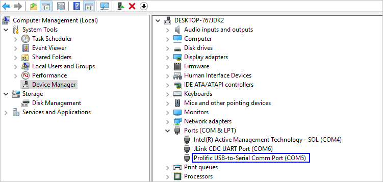
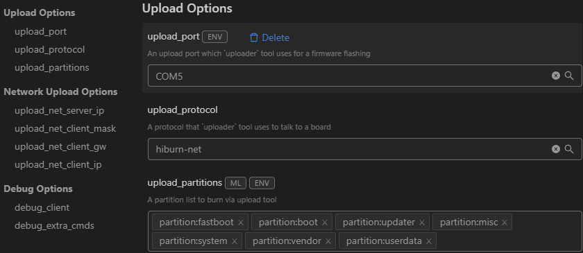

# 镜像烧录

-   [前提条件](#section63941724112115)
-   [使用网口烧录](#section112807166589)

标准系统烧录，在V2.2 Beta1及以上版本支持。

Hi3516DV300支持烧录标准系统，其烧录方式包括USB烧录、网口烧录和串口烧录三种方式，其中：

-   **Windows系统：支持USB烧录、网口烧录和串口烧录**
-   **Linux系统：支持串口烧录和网口烧录。**

同一种烧录方式（如网口烧录），在Windows和Linux环境下的烧录操作完全一致，区别仅在于DevEco Device Tool环境搭建不同。

> **说明：** 
>当前Hi3516DV300开发板支持通过网口、USB、串口三种方式烧录OpenHarmony标准系统。本文以网口方式为例讲解烧录操作，其他两种烧录方式请参照[Hi3516DV300烧录指导](https://device.harmonyos.com/cn/docs/ide/user-guides/hi3516_upload-0000001052148681)。

## 前提条件

在DevEco Device Tool中[打开一个工程](https://device.harmonyos.com/cn/docs/ide/user-guides/open_project-0000001071680043)，该工程文件夹选择待烧录文件所在文件夹即可。其中开发板类型固定选择Hi3516DV300，Framework选择“Hb”。

## 使用网口烧录

Hi3516DV300开发板使用网口录方式，支持Windows和Linux系统。

1.  请连接好电脑和待烧录开发板，需要同时连接串口、网口和电源，具体可参考[Hi3516DV300开发板介绍](https://device.harmonyos.com/cn/docs/start/introduce/oem_minitinier_des_3516-0000001152041033)。
2.  打开电脑的设备管理器，查看并记录对应的串口号。

    > **说明：** 
    >如果对应的串口异常，请根据[Hi3516DV300/Hi3518EV300开发板串口驱动安装指导](https://device.harmonyos.com/cn/docs/ide/user-guides/hi3516_hi3518-drivers-0000001050743695)安装USB转串口的驱动程序。

    

3.  打开DevEco Device Tool，在Projects中，点击**Settings**打开工程配置界面。

    

4.  在**Partition Configuration**页签中，按照下表内容填写烧录文件信息，包括：

    
    <table><thead align="left"><tr id="zh-cn_topic_0000001180633781_row15492132518545"><th class="cellrowborder" valign="top" width="12.5%" id="mcps1.1.9.1.1">
Name

    </th>
    <th class="cellrowborder" valign="top" width="12.5%" id="mcps1.1.9.1.2">
Binary

    </th>
    <th class="cellrowborder" valign="top" width="12.5%" id="mcps1.1.9.1.3">
Memory

    </th>
    <th class="cellrowborder" valign="top" width="12.5%" id="mcps1.1.9.1.4">
System

    </th>
    <th class="cellrowborder" valign="top" width="12.5%" id="mcps1.1.9.1.5">
Address

    </th>
    <th class="cellrowborder" valign="top" width="12.5%" id="mcps1.1.9.1.6">
Length

    </th>
    <th class="cellrowborder" valign="top" width="12.5%" id="mcps1.1.9.1.7">
Board

    </th>
    <th class="cellrowborder" valign="top" width="12.5%" id="mcps1.1.9.1.8">
Type

    </th>
    </tr>
    </thead>
    <tbody><tr id="zh-cn_topic_0000001180633781_row949214259543"><td class="cellrowborder" valign="top" width="12.5%" headers="mcps1.1.9.1.1 ">
fastboot

    </td>
    <td class="cellrowborder" valign="top" width="12.5%" headers="mcps1.1.9.1.2 ">
选择“u-boot-hi3516dv300_emmc.bin”

    </td>
    <td class="cellrowborder" valign="top" width="12.5%" headers="mcps1.1.9.1.3 ">
emmc

    </td>
    <td class="cellrowborder" valign="top" width="12.5%" headers="mcps1.1.9.1.4 ">
none

    </td>
    <td class="cellrowborder" valign="top" width="12.5%" headers="mcps1.1.9.1.5 ">
0x000000

    </td>
    <td class="cellrowborder" valign="top" width="12.5%" headers="mcps1.1.9.1.6 ">
0x100000

    </td>
    <td class="cellrowborder" rowspan="7" valign="top" width="12.5%" headers="mcps1.1.9.1.7 ">
固定选择“hi3516dv300”

    </td>
    <td class="cellrowborder" valign="top" width="12.5%" headers="mcps1.1.9.1.8 ">
NA

    </td>
    </tr>
    <tr id="zh-cn_topic_0000001180633781_row94933253545"><td class="cellrowborder" valign="top" headers="mcps1.1.9.1.1 ">
boot

    </td>
    <td class="cellrowborder" valign="top" headers="mcps1.1.9.1.2 ">
选择“uImage”

    </td>
    <td class="cellrowborder" valign="top" headers="mcps1.1.9.1.3 ">
emmc

    </td>
    <td class="cellrowborder" valign="top" headers="mcps1.1.9.1.4 ">
none

    </td>
    <td class="cellrowborder" valign="top" headers="mcps1.1.9.1.5 ">
0x100000

    </td>
    <td class="cellrowborder" valign="top" headers="mcps1.1.9.1.6 ">
0xf00000

    </td>
    <td class="cellrowborder" valign="top" headers="mcps1.1.9.1.7 ">
NA

    </td>
    </tr>
    <tr id="zh-cn_topic_0000001180633781_row649362515548"><td class="cellrowborder" valign="top" headers="mcps1.1.9.1.1 ">
updater

    </td>
    <td class="cellrowborder" valign="top" headers="mcps1.1.9.1.2 ">
选择“updater.img”

    </td>
    <td class="cellrowborder" valign="top" headers="mcps1.1.9.1.3 ">
emmc

    </td>
    <td class="cellrowborder" valign="top" headers="mcps1.1.9.1.4 ">
ext3/4

    </td>
    <td class="cellrowborder" valign="top" headers="mcps1.1.9.1.5 ">
0x1000000

    </td>
    <td class="cellrowborder" valign="top" headers="mcps1.1.9.1.6 ">
0x1400000

    </td>
    <td class="cellrowborder" valign="top" headers="mcps1.1.9.1.7 ">
NA

    </td>
    </tr>
    <tr id="zh-cn_topic_0000001180633781_row1149316252542"><td class="cellrowborder" valign="top" headers="mcps1.1.9.1.1 ">
misc

    </td>
    <td class="cellrowborder" valign="top" headers="mcps1.1.9.1.2 ">
空白，不用选择

    </td>
    <td class="cellrowborder" valign="top" headers="mcps1.1.9.1.3 ">
emmc

    </td>
    <td class="cellrowborder" valign="top" headers="mcps1.1.9.1.4 ">
none

    </td>
    <td class="cellrowborder" valign="top" headers="mcps1.1.9.1.5 ">
0x2400000

    </td>
    <td class="cellrowborder" valign="top" headers="mcps1.1.9.1.6 ">
0x100000

    </td>
    <td class="cellrowborder" valign="top" headers="mcps1.1.9.1.7 ">
NA

    </td>
    </tr>
    <tr id="zh-cn_topic_0000001180633781_row16494182510545"><td class="cellrowborder" valign="top" headers="mcps1.1.9.1.1 ">
system

    </td>
    <td class="cellrowborder" valign="top" headers="mcps1.1.9.1.2 ">
选择“system.img”

    </td>
    <td class="cellrowborder" valign="top" headers="mcps1.1.9.1.3 ">
emmc

    </td>
    <td class="cellrowborder" valign="top" headers="mcps1.1.9.1.4 ">
ext3/4

    </td>
    <td class="cellrowborder" valign="top" headers="mcps1.1.9.1.5 ">
0x2500000

    </td>
    <td class="cellrowborder" valign="top" headers="mcps1.1.9.1.6 ">
0xceb00000

    </td>
    <td class="cellrowborder" valign="top" headers="mcps1.1.9.1.7 ">
NA

    </td>
    </tr>
    <tr id="zh-cn_topic_0000001180633781_row10494202535417"><td class="cellrowborder" valign="top" headers="mcps1.1.9.1.1 ">
vendor

    </td>
    <td class="cellrowborder" valign="top" headers="mcps1.1.9.1.2 ">
选择“vendor.img”

    </td>
    <td class="cellrowborder" valign="top" headers="mcps1.1.9.1.3 ">
emmc

    </td>
    <td class="cellrowborder" valign="top" headers="mcps1.1.9.1.4 ">
ext3/4

    </td>
    <td class="cellrowborder" valign="top" headers="mcps1.1.9.1.5 ">
0xd1000000

    </td>
    <td class="cellrowborder" valign="top" headers="mcps1.1.9.1.6 ">
0x10000000

    </td>
    <td class="cellrowborder" valign="top" headers="mcps1.1.9.1.7 ">
NA

    </td>
    </tr>
    <tr id="zh-cn_topic_0000001180633781_row349412251547"><td class="cellrowborder" valign="top" headers="mcps1.1.9.1.1 ">
userdata

    </td>
    <td class="cellrowborder" valign="top" headers="mcps1.1.9.1.2 ">
选择“userdata.img”

    </td>
    <td class="cellrowborder" valign="top" headers="mcps1.1.9.1.3 ">
emmc

    </td>
    <td class="cellrowborder" valign="top" headers="mcps1.1.9.1.4 ">
ext3/4

    </td>
    <td class="cellrowborder" valign="top" headers="mcps1.1.9.1.5 ">
0xe1000000

    </td>
    <td class="cellrowborder" valign="top" headers="mcps1.1.9.1.6 ">
0x5b800000

    </td>
    <td class="cellrowborder" valign="top" headers="mcps1.1.9.1.7 ">
NA

    </td>
    </tr>
    </tbody>
    </table>

    

5.  在“hi3516dv300”页签，设置烧录选项，包括upload\_port、upload\_partitions和upload\_protocol。

    -   upload\_port：选择步骤[2](#zh-cn_topic_0000001180633781_li1050616379507)中查询的串口号。
    -   upload\_protocol：选择烧录协议，固定选择“hiburn-net”。
    -   upload\_partitions：选择待烧录的文件，包括fastboot、boot、updater、misc、system、vendor和userdata。

    

6.  检查和设置连接开发板后的网络适配器的IP地址信息，设置方法请参考[设置Hi3516DV300网口烧录的IP地址信息](https://device.harmonyos.com/cn/docs/ide/user-guides/set_ipaddress-0000001141825075)。
7.  设置网口烧录的IP地址信息，设置如下选项：

    -   upload\_net\_server\_ip：选择步骤6中设置的IP地址信息。例如192.168.1.2
    -   upload\_net\_client\_mask：设置开发板的子网掩码，工具会自动根据选择的upload\_net\_server\_ip进行设置。例如255.255.255.0
    -   upload\_net\_client\_gw：设置开发板的网关，工具会自动根据选择的upload\_net\_server\_ip进行设置。例如192.168.1.1
    -   upload\_net\_client\_ip：设置开发板的IP地址，工具会自动根据选择的upload\_net\_server\_ip进行设置。例如192.168.1.3

    

8.  所有的配置都修改完成后，在工程配置页签的顶部，点击**Save**进行保存。
9.  启动烧录后，显示如下提示信息时，请重启开发板（下电再上电）。

    

10. 重新上电后，启动烧录，界面提示如下信息时，表示烧录成功。

    

