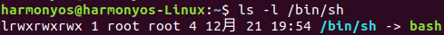
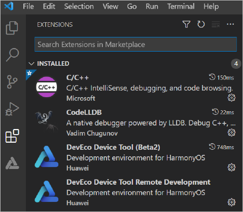
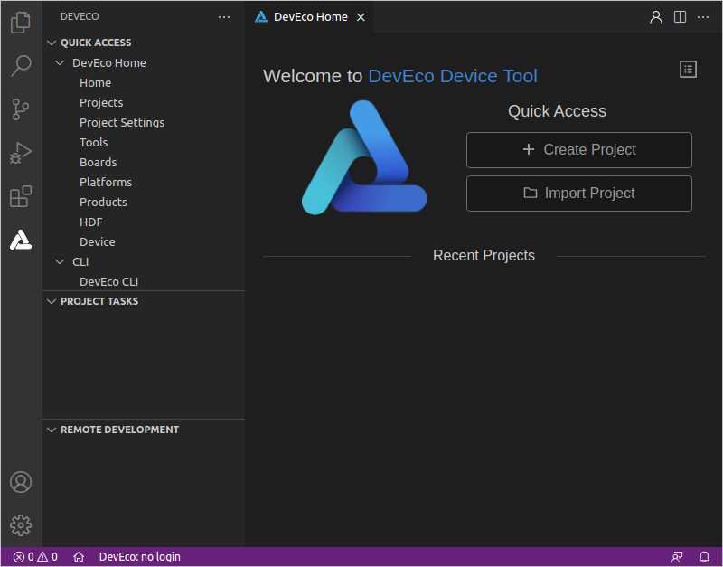

# 开发环境准备<a name="ZH-CN_TOPIC_0000001193328250"></a>

-   [系统要求](#zh-cn_topic_0000001072959308_section1865184385215)
-   [安装DevEco Device Tool](#zh-cn_topic_0000001072959308_section86587531620)

DevEco Device Tool Ubuntu版本支持OpenHarmony源码开发、编译、烧录的一站式开发环境，因此，本章节为您介绍在Ubuntu环境下，如何搭建一套完整的可视化开发环境。

## 系统要求<a name="zh-cn_topic_0000001072959308_section1865184385215"></a>

-   Ubuntu18及以上版本，内存推荐16 GB及以上。
-   系统的用户名不能含有中文字符。
-   只能使用普通用户角色搭建开发环境。

## 安装DevEco Device Tool<a name="zh-cn_topic_0000001072959308_section86587531620"></a>

DevEco Device Tool基于Visual Studio Code进行扩展，在Visual Studio Code上以插件方式运行，Visual Studio Code版本为1.60及以上。同时，DevEco Device Tool还依赖Python工具，并要求Python为3.8\~3.9版本。

在安装过程中，DevEco Device Tool会自动检查Visual Studio Code和Python，如果检测到Visual Studio Code、Python未安装或版本不符合要求，安装程序会自动安装Visual Studio Code和Python。

1.  将Ubuntu Shell环境修改为bash。
    1.  执行如下命令，确认输出结果为bash。如果输出结果不是bash，请根据步骤2，将Ubuntu shell修改为bash。

        ```
        ls -l /bin/sh
        ```

        

    2.  打开终端工具，执行如下命令，输入密码，然后选择**No**，将Ubuntu shell由dash修改为bash。

        ```
        sudo dpkg-reconfigure dash
        ```

        

2.  下载[DevEco Device Tool 3.0 Beta2](https://device.harmonyos.com/cn/ide#download_beta)Linux版本，下载时，请先使用华为开发者帐号进行登录后下载。如未注册华为开发者账号，请先[注册](https://developer.huawei.com/consumer/cn/doc/start/registration-and-verification-0000001053628148)。
3.  解压DevEco Device Tool软件包并对解压后的文件夹进行赋权。
    1.  进入DevEco Device Tool软件包目录，执行如下命令解压软件包，其中devicetool-linux-tool-3.0.0.200.zip为软件包名称，请根据实际进行修改。

        ```
        unzip devicetool-linux-tool-3.0.0.300.zip
        ```

    2.  进入解压后的文件夹，执行如下命令，赋予安装文件可执行权限，其中devicetool-linux-tool-3.0.0.300.sh请根据实际进行修改。

        ```
        chmod u+x devicetool-linux-tool-3.0.0.300.sh
        ```

4.  执行如下命令，安装DevEco Device Tool，其中devicetool-linux-tool-3.0.0.300.sh请根据实际进行修改。

    > **说明：** 
    >安装过程中，会自动检查Visual Studio Code和Python是否安装，且版本符合要求，其中Visual Studio Code为1.60及以上版本，Python为3.8\~3.9版本。如果不满足，则安装过程中会自动安装，提示“Do you want to continue?”，请输入“Y”后继续安装。

    ```
    sudo ./devicetool-linux-tool-3.0.0.300.sh -- --install-plugins
    ```

    安装完成后，当界面输出“Deveco Device Tool successfully installed.”时，表示DevEco Device Tool安装成功。

    

5.  安装完成后，在Ubuntu左下角的中，启动Visual Studio Code。
6.  启动Visual Studio Code，DevEco Device Tool运行依赖C/C++、CodeLLDB插件，请点击Visual Studio Code左侧的按钮，分别搜索和安装C/C++、CodeLLDB插件。

    > **说明：** 
    >如果在插件市场安装C/C++和CodeLLDB插件不成功，可手动下载插件后进行安装，具体请参考：[离线安装C/C++和CodeLLDB插件](https://device.harmonyos.com/cn/docs/documentation/guide/offline_plugin_install-0000001074376846)。

    

7.  重启Visual Studio Code，点击进入DevEco Device Tool工具界面。至此，DevEco Device Tool Ubuntu开发环境安装完成。

