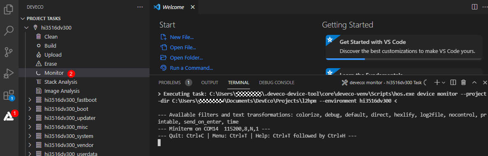
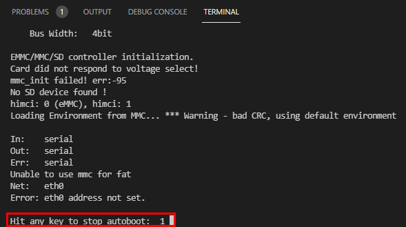
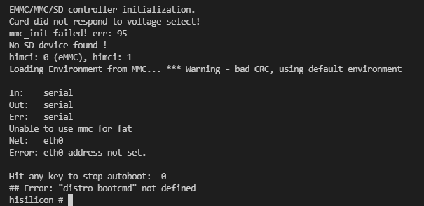
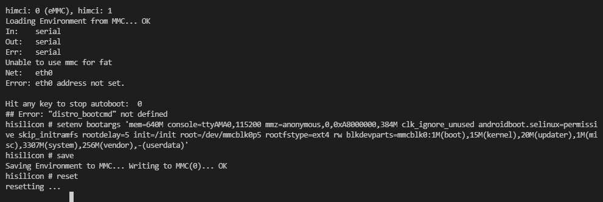

# 镜像运行<a name="ZH-CN_TOPIC_0000001142160948"></a>

烧录完成后通过以下步骤运行系统：

1.  点击Monitor，打开串口工具

    

2.  重启开发板，在倒数及时结束前，按任意键进入到海思系统

    

    

3.  设置启动参数，等待开发板启动

    

    ```
    setenv bootargs 'mem=640M console=ttyAMA0,115200 mmz=anonymous,0,0xA8000000,384M clk_ignore_unused androidboot.selinux=permissive skip_initramfs rootdelay=5 init=/init root=/dev/mmcblk0p5 rootfstype=ext4 rw blkdevparts=mmcblk0:1M(boot),15M(kernel),20M(updater),1M(misc),3307M(system),256M(vendor),-(userdata)'
    save
    reset
    ```


