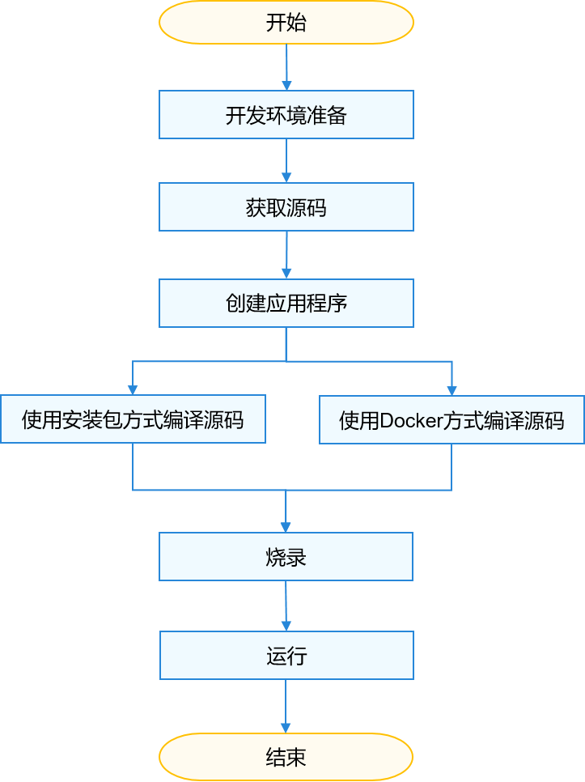

# 标准系统入门简介

-   [快速入门流程](#section7825218111517)

开发者可通过本文快速掌握OpenHarmony标准系统的环境搭建、编译、烧录、运行等操作。标准系统的开发有以下两种方法：

-   使用Windows环境进行开发和烧录，使用Linux环境进行编译。
-   统一使用Linux环境进行开发、编译和烧录。

因目前Windows系统不支持编译，暂时无法全部使用Windows环境进行开发，开发者可根据使用习惯选择合适的开发方法。

本文将介绍第二种方法，**所有操作均在Linux环境下进行**。

## 快速入门流程

标准系统快速入门流程如下图所示，其中编译源码环节可根据实际情况选择docker方式或安装包方式其中一种即可。

> **说明：** 
>Docker环境已经封装了相关编译工具，开发者在使用该Docker环境时可以省去Ubuntu编译环境及开发板环境的的搭建操作。

**图 1**  标准系统快速入门流程  

