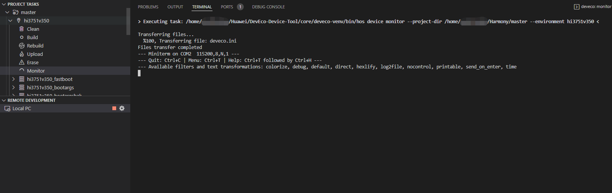
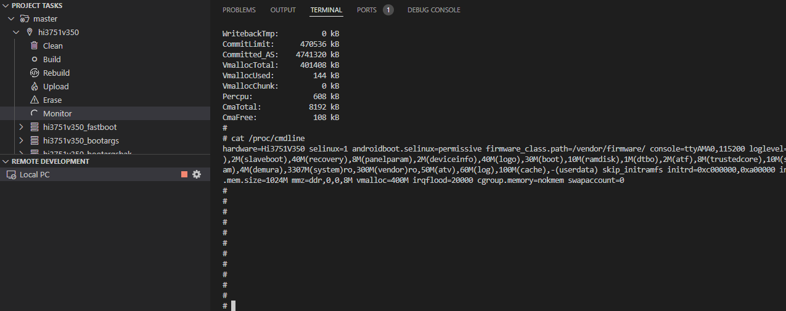
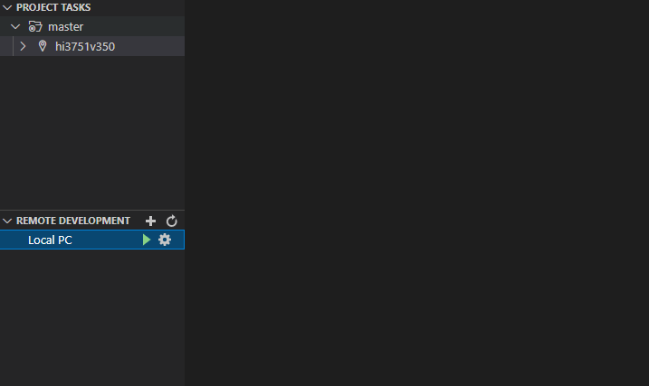

# 运行


## 启动系统

烧录完成后在Windows下通过以下步骤启动系统：

>  **说明：**
> 初次烧写标准系统，需要完成以下配置，后续烧写或者启动，可以跳过以下操作。

1. 在DevEco Device Tool中，点击Monitor，打开串口工具。

   

2. 重启开发板，进入串口检查是否有日志打印，是否能够输入。

   ```
   # 可输入如下内容检查输入是否正常
   ls
   cat /proc/version
   ```
   

## 修改启动参数

默认情况，Hi3751V350不用修改启动参数，特殊需要可参考如下步骤修改。

1. 使用其他串口工具连接串口，在开发板上电时，按“ctrl + c”进入uboot。

   >  **说明：**
   > 在使用其他串口工具时，需要点击“TERMINAL”右侧删除按钮关闭Monitor串口。

   

2. 通过以下命令按需调整修改启动参数、保存配置并重启，然后进入系统。

   ```
   // 设置参数
   set bootargs 'hardware=Hi3751V350 selinux=1 firmware_class.path=/vendor/firmware/ console=ttyAMA0,115200 loglevel=7 no_console_suspend blkdevparts=mmcblk0:1M(fastboot),1M(bootargs),1M(bootargsbak),2M(slaveboot),40M(recovery),8M(panelparam),2M(deviceinfo),40M(logo),30M(boot),10M(ramdisk),1M(dtbo),2M(atf),8M(trustedcore),10M(securestore),1M(versioninfo),1M(misc),10M(bootmusic),10M(bootmusicsec),80M(tconparam),4M(demura),3307M(system)ro,300M(vendor)ro,50M(atv),60M(log),100M(cache),-(userdata) skip_initramfs initrd=0xc000000,0xa00000 init=/init root=/dev/ram0 mtdparts=hi_sfc:-(hi_sfc) pci=nomsi mem=1024M mmz=ddr,0,0,8M vmalloc=400M irqflood=20000 cgroup.memory=nokmem swapaccount=0'

   saveenv  //保存
   reset  //重启单板
   ```

## 运行“Hello World”

通过前述步骤连接的串口，在任意目录下输入命令helloworld后回车，界面打印“Hello World！”，程序运行成功。


## 下一步

恭喜！您已经完成了OpenHarmony标准系统的快速入门，接下来可[开发一个小示例](../guide/device-clock-guide.md)，进一步熟悉OpenHarmony的开发。
